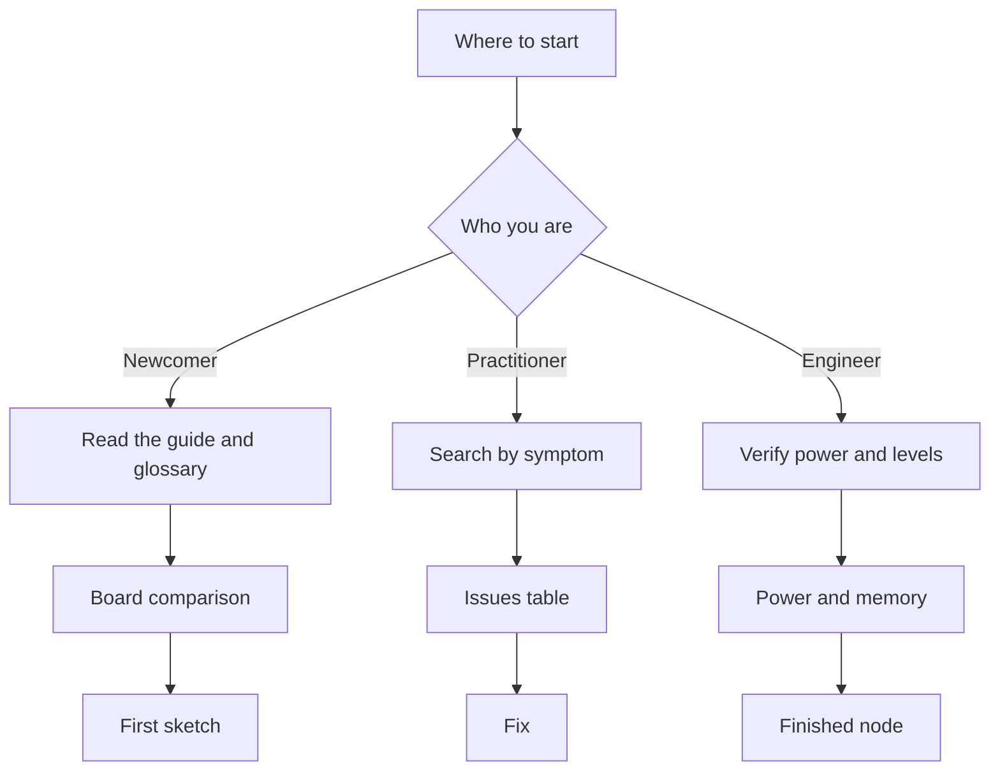

# How to use the Arduino reference

![[assets/img/arduino-howto-map-scheme.png|600]]
*Fig. Reference map: start, power, pins, buses, memory and projects.*

> [!tip] Purpose of this note
> Give a fast entry into the reference: where a newcomer and a practitioner go, how to read notes and sketches in five minutes.

## 1. Purpose

This guide explains the logic of the reference and saves time. The reference is built as a set of short notes: each one covers a single topic from purpose to code and issues. A newcomer follows a linear path from the start to the first sketch. A practitioner jumps point to point through tables and search. An engineer verifies power supply and levels before trusting a board.

The main rule: first read the Purpose section and the specs table, then look at the code, then check your circuit against the issues section. Official sources at the bottom of each note give the primary source for doubtful points. The map at the start shows neighbour topics and quick jumps.

The reference is equally useful for eight-bit boards and for new thirty-two-bit boards. Terms are in English everywhere, code names stay in English in backticks. Power supply and signal levels get a separate focus, because that is where most boards burn out.

## 2. Reference structure

| Section | Topic | Inside |
| --- | --- | --- |
| Start | Entry and navigation | Guide, glossary, board comparison, board overview, environment choice |
| Power supply | Board energy | Sources, regulators, current, protection, sleep |
| Pins | Inputs and outputs | Digital modes, analog, pulse width, interrupts |
| Buses | Data exchange | Serial port, two-wire bus, four-wire bus |
| Radio | Wireless link | Modules, antennas, radio power, range |
| Analog | Measurement | Dividers, resistors, filters, accuracy, noise |
| Timers | Time and sound | Counters, delays without pauses, sound, watchdog timer |
| Memory | Storage | Non-volatile memory, cards, capacity, wear |
| Firmware | Uploading | Environment, bootloader, programmer, write issues |
| Sensors | Sensing the world | Temperature, humidity, pressure, motion, distance |
| Output | Display | LEDs, indicators, screens, sound |
| Projects | Building | Ready nodes from idea to case |

## 3. Note standard

| Block | Purpose | How to read |
| --- | --- | --- |
| Purpose | Why the note exists | One paragraph of essence and scope |
| Specs | Numbers and facts | Comparison and choice table |
| ASCII diagram | Quick aid | Text diagram without pictures |
| Code | Working example | Sketch to copy and verify |
| Choice diagram | Fork | Flow diagram for decisions |
| Issues | Traps | Table of what not to do and the right way |
| Sources | Trust | Two links to primary sources |
| See also | Next step | Only neighbour notes |

Each note keeps the same block order, so eyes get used to it. First essence, then numbers, then practice, then traps. Code is always short and builds without extra libraries, unless stated otherwise. Tables give one-glance comparison. ASCII text duplicates the main diagram for dark rooms and print.

If a note is long, look for numbered subheadings and the word Table. If a note is short, it still has code and issues. No note demands reading the whole reference in a row. Following links from See also is enough.

## 4. Reader paths

| Reader | Goal | Path |
| --- | --- | --- |
| Newcomer | First sketch in an evening | Guide, then glossary, then board comparison, then board overview, then environment choice |
| Practitioner | Fix a node fast | Glossary, then the needed section by symptom, then issues, then sources |
| Engineer | Verify a design | Board comparison, then power, then levels, then buses, then memory |
| Teacher | Give a topic to a group | Guide, then glossary, then lab example, then common issues |
| Radio amateur | Add a link | Board comparison, then buses, then radio, then radio power |

A newcomer should not jump into buses without the glossary, or abbreviations will confuse them. A practitioner should not copy code without the issues section, or they will repeat someone else's trap. An engineer should not trust clones without verifying the power supply and the serial port converter.

Five-minute rule: open a note, read the purpose, glance at the table, copy the code, verify against issues. If there is no answer, follow a link from See also instead of flipping pages at random.

## 5. How to find an answer in five minutes

1. Phrase the question in one sentence: the board has no power or the code does not build.
2. Open the glossary and find the key word: power supply, bootloader, port speed.
3. Open the board comparison and pin down your board: five-volt classic or three-volt newcomer.
4. Open the needed note and read only purpose and specs.
5. Copy the minimal sketch and test on a bare board without shields and wires.
6. If that did not help, read the issues table row by row.
7. If it is still dark, open the official sources at the bottom of the note.
8. Write down what worked, so next time takes three minutes.

Search works better with plain English words: power, pins, bus, memory, sound, sleep. Look up code words in English in backticks: `setup`, `loop`, `baud`, `pullup`. Search board names as Uno, Nano, Mega, Leonardo, R4. Search driver issues by the converter chip name.

## 6. How to read example sketches

```cpp
void setup() {
  Serial.begin(9600);
  pinMode(LED_BUILTIN, OUTPUT);
}

void loop() {
  digitalWrite(LED_BUILTIN, HIGH);
  Serial.println("ON");
  delay(500);
  digitalWrite(LED_BUILTIN, LOW);
  Serial.println("OFF");
  delay(500);
}
```

This sketch shows the canon: the `setup` function runs once for configuration, the `loop` function spins forever. The port speed in code must match the speed in the port monitor. The built-in LED blinks for half a second per pause. Port output helps to see that the code is alive even without instruments.

```cpp
int sensorPin = A0;
int sensorValue = 0;

void setup() {
  Serial.begin(9600);
}

void loop() {
  sensorValue = analogRead(sensorPin);
  Serial.println(sensorValue);
  delay(200);
}
```

The second example reads an analog input and prints a number from zero to one thousand twenty-three. A two-hundred-millisecond pause keeps text from flying too fast. The variable is declared outside functions, so it is visible everywhere. If numbers jump, check the sensor ground and power first.

Code reading rules: first find `setup` and `loop`, then pin lists at the top, then delays and speeds. Never change five places at once, change one and verify. Comments repeat the original text, pin names stay in English, as in the examples.

## 7. ASCII navigation map

```text
Довідник Arduino: вхід і рух
================================
[Старт] --> [Живлення] --> [Ноги] --> [Шини]
  |             |              |           |
  v             v              v           v
 Словник    VIN і струм   Режими ніг   Порт і шини
 Гід        Захист        Підтяжки     Адреси
 Порівняння Сон           Переривання  Швидкості

[Аналог] --> [Таймери] --> [Память] --> [Прошивка]
[Датчики] --> [Вивід] --> [Проекти] --> [Готово]
================================
Порада: йди зліва направо, вниз за деталлю.
```

A text map helps when there is no link or when you read from a terminal. Rows show order, arrows show dependency. Power before pins, pins before buses, buses before sensors. Keep firmware always near, because a board stays silent without it.

## 8. Path selection diagram



The diagram leads with three branches to three finishes. A newcomer finishes with a first blinking sketch. A practitioner finishes with a fix from the issues table. An engineer finishes with a node with verified power. Switching branches is free at any moment.

## 9. Validator rule

| Check | Command | Zero violations means |
| --- | --- | --- |
| Note style | check style | Heading, figure, diagram, issues, sources, size |
| Links | check links | All wiki links point to notes, pictures in place |
| Navigation | check home | Each note mentioned on the home map |

Before handing over a batch, run three checks from the vault root. First style, then links, then home. Fix from the top of the report down, because one broken picture drags several lines. Each note must be at least one hundred fifty lines by the line counter.

```text
Перевірка черги:
  1. python3 scripts/check_style.py
  2. python3 scripts/check_links.py
  3. python3 scripts/check_home.py
  4. wc -l 00-Start/*.md
  Усі нулі і довжина ок — черга здана.
```

## Common issues

| # | Issue | Why it is bad | Correct way |
| --- | --- | --- | --- |
| 1 | Reading the reference page by page from the first one | A lost evening and mush in the head | Follow the path for your goal from the table |
| 2 | Copying code without reading issues | Repeating someone else's power trap | Issues first, then code into the board |
| 3 | Searching terms word for word | Terms diverge and search stays silent | Search by plain words, code in backticks |
| 4 | Changing five places at once | Unclear what helped | One change and one verify |
| 5 | Ignoring official sources | Outdated forum advice | Verify doubtful points with the two links below |
| 6 | Starting with radio before power | The module starves and there is no link | Current and ground first, then the air |

## Official sources

- [Uno board guide (Arduino)](https://www.arduino.cc/en/Guide/ArduinoUno) - boards, news, store and getting started.
- [Arduino learning hub](https://docs.arduino.cc/learn/) - language, libraries, board and cloud guides.

## See also

- [[Home.en]]
- [[00-Start/02-Glosariy| glossary of terms]]
- [[00-Start/03-Porivnyannya-plat| board comparison]]
