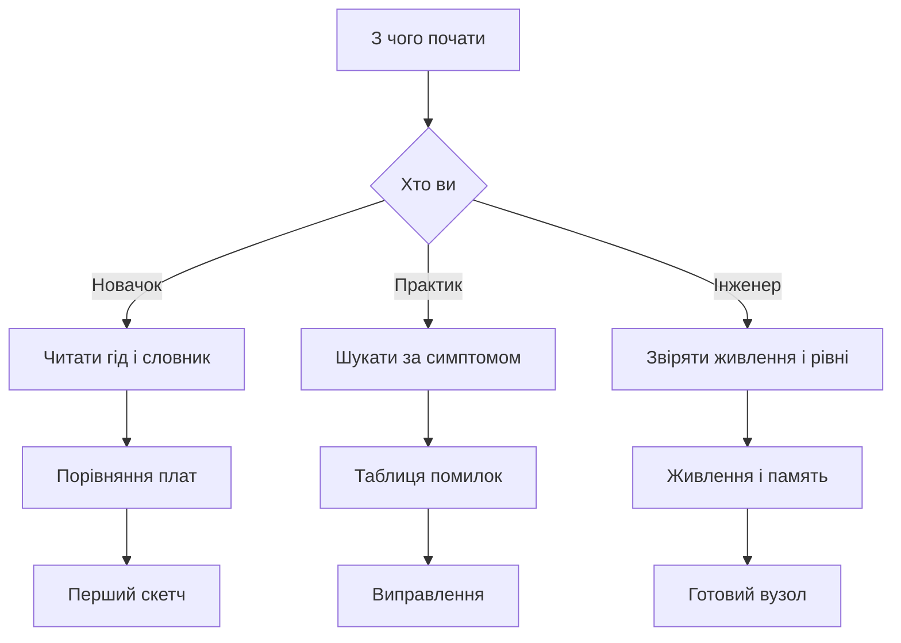

# Як користуватись довідником Arduino

EN version: `00-Start/01-How-to-Use-Guide.en.md`

![[assets/img/arduino-howto-map-scheme.png|600]]
*Рис. Карта довідника: старт, живлення, піни, шини, пам'ять і проекти.*

> [!tip] Призначення ноти
> Дати швидкий вхід у довідник: куди йти новачку і практику, як читати нотатки і скетчі за пять хвилин.

## 1. Призначення

Цей гід пояснює логіку довідника і економить час. Довідник побудовано як набір коротких нот: кожна закриває одну тему від призначення до коду і помилок. Новачок іде лінійним маршрутом від старту до першого скетчу. Практик стрибає точково через таблиці і пошук. Інженер звіряє живлення і рівні перед платою.

Головне правило: спочатку читати розділ Призначення і таблицю характеристик, потім дивитись код, потім перевіряти свою схему за розділом помилок. Офіційні джерела внизу кожної ноти дають першоджерело для сумнівних місць. Карта на початку показує сусідні теми і швидкі переходи.

Довідник однаково корисний для плат на вісім біт і для нових плат на тридцять два біти. Терміни всюди українською, кодові імена лишено англійською у зворотних лапках. Живлення і рівні сигналів виділено окремо, бо там найбільше згорілих плат.

## 2. Структура довідника

| Розділ | Тема | Що всередині |
| --- | --- | --- |
| Старт | Вхід і навігація | Гід, словник, порівняння плат, огляд плат, вибір середовища |
| Живлення | Енергія плати | Джерела, стабілізатори, струм, захист, сон |
| Піни | Входи і виходи | Цифрові режими, аналог, ширина імпульсів, переривання |
| Шини | Обмін даними | Послідовний порт, двопровідна шина, чотирипровідна шина |
| Радіо | Бездротовий звязок | Модулі, антени, живлення радіо, далекобійність |
| Аналог | Вимірювання | Дільники, опори, фільтри, точність, шуми |
| Таймери | Час і звук | Лічильники, затримки без пауз, звук, вартовий таймер |
| Пам'ять | Збереження | Енергонезалежна пам'ять, карти, обсяг, знос |
| Прошивка | Завантаження | Середовище, завантажувач, програматор, помилки запису |
| Датчики | Вимірювання світу | Температура, волога, тиск, рух, відстань |
| Вивід | Показ | Світлодіоди, індикатори, екрани, звук |
| Проекти | Збірка | Готові вузли від ідеї до корпусу |

## 3. Стандарт нотатки

| Блок | Призначення | Як читати |
| --- | --- | --- |
| Призначення | Навіщо нота | Один абзац суті і межі теми |
| Характеристики | Цифри і факти | Таблиця для порівняння і вибору |
| Схема ASCII | Швидка опора | Текстова схема без картинок |
| Код | Робочий приклад | Скетч для копіювання і перевірки |
| Схема вибору | Розвилка | Діаграма потоку для рішення |
| Помилки | Пастки | Таблиця що не робити і як треба |
| Джерела | Довіра | Два посилання на першоджерела |
| Див також | Крок далі | Тільки на сусідні нотатки |

Кожна нота тримає однаковий порядок блоків, щоб очі звикли. Спочатку суть, потім цифри, потім практика, потім пастки. Код завжди короткий і збирається без зайвих бібліотек, якщо не сказано інакше. Таблиці дають порівняння в один погляд. Текст ASCII дублює головну схему для темряви і друку.

Якщо нота довга, шукай підзаголовки з цифрами і слово Таблиця. Якщо нота коротка, все одно буде код і помилки. Жодна нота не вимагає читання всього довідника підряд. Достатньо йти за посиланнями з розділу Див також.

## 4. Маршрути читача

| Читач | Ціль | Маршрут |
| --- | --- | --- |
| Новачок | Перший скетч за вечір | Гід далі словник далі порівняння плат далі огляд плат далі вибір середовища |
| Практик | Швидко полагодити вузол | Словник далі потрібний розділ за симптомом далі помилки далі джерела |
| Інженер | Перевірити рішення | Порівняння плат далі живлення далі рівні далі шини далі пам'ять |
| Викладач | Дати тему групі | Гід далі словник далі лабораторний приклад далі типові помилки |
| Радіоаматор | Додати звязок | Порівняння плат далі шини далі радіо далі живлення радіо |

Новачок не має стрибати у шини без словника, бо заплутається у скороченнях. Практик не має копіювати код без розділу помилок, бо повторить чужу пастку. Інженер не має вірити клонам без перевірки живлення і перетворювача послідовного порту.

Правило пяти хвилин: відкрий ноту, прочитай призначення, глянь таблицю, скопіюй код, звір помилки. Якщо відповіді немає, йди за посиланням з розділу Див також, а не гортай навмання.

## 5. Як знайти відповідь за пять хвилин

1. Сформулюй питання одним реченням: плата не живиться чи код не збирається.
2. Відкрий словник термінів і знайди головне слово: живлення, завантажувач, швидкість порту.
3. Відкрий порівняння плат і уточни свою плату: класика пять вольт чи нова три вольти.
4. Відкрий потрібну ноту і читай тільки призначення і характеристики.
5. Скопіюй мінімальний скетч і перевір на голій платі без шилда і дротів.
6. Якщо не допомогло, читай таблицю помилок рядок за рядком.
7. Якщо і далі темно, відкрий офіційні джерела внизу ноти.
8. Запиши що спрацювало, щоб наступного разу вкластись у три хвилини.

Пошук працює краще за українськими словами: живлення, піни, шина, пам'ять, звук, сон. Кодові слова шукай англійською у зворотних лапках: `setup`, `loop`, `baud`, `pullup`. Назви плат шукай як Uno, Nano, Mega, Leonardo, R4. Помилки з драйверами шукай за іменем мікросхеми перетворювача.

## 6. Як читати скетчі приклади

```cpp
void setup() {
  Serial.begin(9600);
  pinMode(LED_BUILTIN, OUTPUT);
}

void loop() {
  digitalWrite(LED_BUILTIN, HIGH);
  Serial.println("ON");
  delay(500);
  digitalWrite(LED_BUILTIN, LOW);
  Serial.println("OFF");
  delay(500);
}
```

Цей скетч показує канон: функція `setup` виконується один раз для налаштування, функція `loop` крутиться без кінця. Швидкість порту у коді мусить збігатись зі швидкістю у моніторі порту. Вбудований світлодіод блимає пів секунди через паузу. Вивід у порт допомагає бачити що код живий навіть без приладів.

```cpp
int sensorPin = A0;
int sensorValue = 0;

void setup() {
  Serial.begin(9600);
}

void loop() {
  sensorValue = analogRead(sensorPin);
  Serial.println(sensorValue);
  delay(200);
}
```

Другий приклад читає аналоговий вхід і друкує число від нуля до тисячі двадцяти трьох. Пауза двісті мілісекунд щоб текст не летів занадто швидко. Змінна оголошена поза функціями, тому видима всюди. Якщо числа стрибають, спочатку перевір землю і живлення датчика.

Правила читання коду: спочатку знайди `setup` і `loop`, потім списки пінів угорі, потім затримки і швидкості. Не міняй одразу пять місць, міняй одне і перевіряй. Коментарі українською, імена пінів англійською, як у прикладах.

## 7. ASCII карта навігації

```text
Довідник Arduino: вхід і рух
================================
[Старт] --> [Живлення] --> [Ноги] --> [Шини]
  |             |              |           |
  v             v              v           v
 Словник    VIN і струм   Режими ніг   Порт і шини
 Гід        Захист        Підтяжки     Адреси
 Порівняння Сон           Переривання  Швидкості

[Аналог] --> [Таймери] --> [Память] --> [Прошивка]
[Датчики] --> [Вивід] --> [Проекти] --> [Готово]
================================
Порада: йди зліва направо, вниз за деталлю.
```

Текстова карта потрібна коли немає звязку або читаєш з термінала. Рядки показують порядок, стрілки показують залежність. Живлення перед пінами, піни перед шинами, шини перед датчиками. Прошивку тримай поруч завжди, бо без неї плата мовчить.

## 8. Схема вибору маршруту



Діаграма веде трьома гілками до трьох фінішів. Новачок фінішує першим скетчем з блиманням. Практик фінішує виправленням за таблицею помилок. Інженер фінішує готовим вузлом з перевіреним живленням. Перехід між гілками вільний у будь-який момент.

## 9. Правило валідаторів

| Перевірка | Команда | Нуль порушень означає |
| --- | --- | --- |
| Стиль нот | check style | Заголовок, рисунок, схема, помилки, джерела, обсяг |
| Посилання | check links | Всі вікіпосилання ведуть на нотатки, картинки на місці |
| Навігація | check home | Кожна нота згадана на головній карті |

Перед здачею черги запускати три перевірки з кореня сховища. Спочатку стиль, потім посилання, потім головна. Виправляти зверху вниз зі звіту, бо одна бита картинка тягне кілька рядків. Довжина кожної ноти не менше ста пятдесяти рядків за лічильником рядків.

```text
Перевірка черги:
  1. python3 scripts/check_style.py
  2. python3 scripts/check_links.py
  3. python3 scripts/check_home.py
  4. wc -l 00-Start/*.md
  Усі нулі і довжина ок — черга здана.
```

## Типові помилки

| # | Помилка | Чому погано | Як правильно |
| --- | --- | --- | --- |
| 1 | Читати довідник підряд від першої сторінки | Втрата вечора і каша в голові | Йти маршрутом за своєю ціллю з таблиці |
| 2 | Копіювати код без читання помилок | Повтор чужої пастки з живленням | Спочатку помилки, потім код у плату |
| 3 | Шукати англійською дослівно | Терміни розходяться і пошук мовчить | Шукати українською, код англійською у лапках |
| 4 | Міняти пять місць одразу | Незрозуміло що допомогло | Одна зміна і одна перевірка |
| 5 | Ігнорувати офіційні джерела | Застарілі поради з форумів | Звіряти сумнівне з двома посиланнями внизу |
| 6 | Починати з радіо без живлення | Модуль голодує і звязку немає | Спочатку струм і земля, потім ефір |

## Офіційні джерела

- [Гайд по платі Uno (Arduino)](https://www.arduino.cc/en/Guide/ArduinoUno) - плати, новини, магазин і початок роботи.
- [Навчальний хаб Arduino](https://docs.arduino.cc/learn/) - мова, бібліотеки, керівництва з плат і хмари.

## Див. також

- [[Home]]
- [[00-Start/02-Glosariy|словник термінів]]
- [[00-Start/03-Porivnyannya-plat|порівняння плат]]
