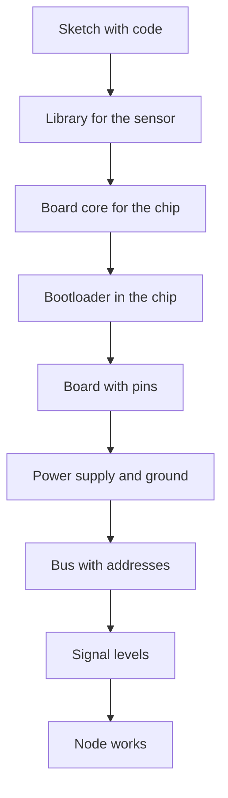

# Arduino glossary - sketch, shield and levels

![[assets/img/arduino-glossary-terms-scheme.png|600]]
*Fig. Glossary as a diagram: program, board, power, buses and signal levels.*

> [!tip] Purpose of this note
> Gather the main words of the reference in one place, so notes read on without stops and confusion.

## 1. Purpose

The glossary removes the language barrier between a newcomer and the board. Each term is short: what it is, where it lives, what it gets mixed with. Nearby sit voltage levels and the gap between old and new chips. After this note, the words sketch, shield and bootloader no longer scare.

The glossary reads two ways. Linearly top to bottom for a first meeting. Or point to point by table when a word pops up in code or on a diagram. Keep one live guide: program on top, board below, power first of all.

Give special care to five volts versus three volts, because the price of a mistake is highest there. Old boards tolerate five volts on pins, new ones want three volts and talk through shifting. The chip section explains when the classic is enough and when to take a modern core.

## 2. Main terms table

| Term | Meaning | Where to find |
| --- | --- | --- |
| Sketch | Board program with setup and loop functions | Environment, examples, firmware |
| Setup | One-time start function | Start of every sketch |
| Loop | Endless repeat function | Basis of blinking and polling |
| Shield | Expansion board on top of the main one | Sensors, motors, network |
| Bootloader | Small write program without a programmer | USB port, reset button |
| Board core | File set for a specific chip | Board manager in the environment |
| Library | Ready code for a sensor or screen | Library manager, examples |
| Programmer | External writer into the chip | Emergency recovery |
| Port monitor | Text window from the board | Debugging and checks |
| Port speed | Characters per second | Must match in code and window |

## 3. Power and pins in words

| Term | Meaning | Trap |
| --- | --- | --- |
| USB power | Five volts from the computer socket | A thin cable sags the voltage |
| External input | Socket for a seven to twelve volt brick | Heats the on-board regulator |
| Five-volt output | Sensor power from the board | Current is limited, motors separately |
| Three-volt output | Power for sensitive modules | Do not mix with five volts |
| Ground | Common zero for all | Without common ground signals lie |
| Analog input | Measures voltage as a number | Divider for higher voltages |
| Digital input | Sees zero or one | A floating pin catches noise |
| Pull-up | Resistor to power or ground | Without it the button bounces |
| Pulse width | Analog imitation with fast pulses | Not all pins can do it |
| Reference voltage | Measurement etalon | Floats without stable power |

## 4. Buses and exchange

| Term | Meaning | When to use |
| --- | --- | --- |
| Serial port | Receive and transmit wires | Link to computer and modules |
| Two-wire bus | Two wires for many devices | Sensors with addresses |
| Four-wire bus | Fast exchange with select | Screens and memory cards |
| Address | Device number on shared wires | An address clash kills the bus |
| Exchange speed | Bit tempo per second | Both sides equal |
| Logic level | Voltage of one | Five volts or three volts |
| Level shifting | Bridge between worlds | Mandatory for new boards |
| Checksum | Packet integrity check | Radio and long lines |
| Packet | Data portion with start and end | Cut the stream into frames |
| Echo | Return of own text | Sign of a live port |

## 5. Flashing tools

| Term | Meaning | Note |
| --- | --- | --- |
| Bootloader | Factory write link | Blinks the LED at start |
| Flash tool | Command-line utility | Sees the chip and pours the file |
| Firmware file | Built code for writing | Hex or binary |
| Fuses | Chip setup bits | Do not touch without need |
| Reset | Short board restart | Double press on new boards |
| Port driver | Bridge between USB and system | Clones ask for a separate driver |
| Converter | USB-to-serial chip | Original and clone differ |
| Environment | Program for code and writing | Classic and new version |
| Board manager | Core installer | Adds support for new boards |
| Example | Ready sketch from the menu | Start of each topic |

## 6. Five volts versus three volts

| Question | Five-volt world | Three-volt world |
| --- | --- | --- |
| Typical boards | Eight-bit classic | New thirty-two-bit ones |
| One on a pin | About five volts | About three volts |
| Sensor power | Many modules for five | Modern sensors for three |
| Direct link | Allowed between peers | Through a shifter to strangers |
| Price of mistake | Overheat and glitches | A burnt input forever |
| How to verify | Multimeter on the output | Board marking and description |

The rule is simple: levels on both sides must match or go through a shifter. Five-volt power does not mean the signal is five too, read the description of the exact pin. New boards often tolerate five volts on power, but not on signal inputs. In doubt, measure and read the board description.

```text
Рівні і живлення: шпаргалка
================================
Класика 5V:  логіка 0..5V,  живлення 7..12V на вхід
Нова 3V3:   логіка 0..3.3V, живлення 5V USB ок
Звязок 5V <-> 3V3: тільки через узгодження
Земля GND: завжди спільна між платами
Мотори і реле: окремий блок, не від плати
================================
```

## 7. Eight bit versus thirty-two bit

| Feature | Eight bit | Thirty-two bit |
| --- | --- | --- |
| Example | Classic controller | Modern R4 family |
| Clock | Sixteen megahertz | Tens of megahertz |
| Program memory | Tens of kilobytes | Hundreds of kilobytes |
| RAM | Two kilobytes | Tens of kilobytes |
| Logic voltage | Five volts | Three volts or selectable |
| USB | Separate chip | Often right in the chip |
| Libraries | Tons of examples | Growing fast |
| When to take | Learning and simple nodes | Speed, memory, network |

Take eight bit for simplicity and a sea of examples: buttons, relays, sensors, small screens. Take thirty-two bit when cramped: network, fast exchange, big texts, signal processing. Code in the Arduino language ports easily, the difference is pins and levels. Start with the classic, move to the new when memory runs out.

## 8. Minimal sketch for the glossary

```cpp
void setup() {
  Serial.begin(9600);
  pinMode(2, INPUT_PULLUP);
  pinMode(LED_BUILTIN, OUTPUT);
}

void loop() {
  int button = digitalRead(2);
  if (button == LOW) {
    digitalWrite(LED_BUILTIN, HIGH);
    Serial.println("BTN:PRESSED");
  } else {
    digitalWrite(LED_BUILTIN, LOW);
  }
  delay(50);
}
```

Words from the tables meet here in one place. An input with pull-up reads a button without an external resistor. A pressed button gives a low level because it pulls the pin to ground. The LED duplicates the state for eyes, the port prints the state for debugging. A fifty-millisecond pause removes contact bounce.

```cpp
int adcPin = A0;

void setup() {
  Serial.begin(9600);
  analogReference(DEFAULT);
}

void loop() {
  int raw = analogRead(adcPin);
  float volts = raw * 5.0 / 1023.0;
  Serial.println(volts);
  delay(300);
}
```

The second sketch pins down analog and the reference voltage. Multiply the raw number by five volts and divide by one thousand twenty-three. Floating-point output to the port shows volts. A three-hundred-millisecond delay keeps text readable.

## 9. Terms connection diagram



The chain reads top to bottom without breaks. Code rests on a library, the library on a core, the core on a bootloader. The board gives pins, power gives stability, the bus gives addresses, levels give compatibility. A missed link breaks the whole chain.

## Common issues

| # | Issue | Why it is bad | Correct way |
| --- | --- | --- | --- |
| 1 | Mixing up sketch and library | Looking for code in the wrong place | Sketch in examples, library in the manager |
| 2 | Thinking a shield fits everywhere | Pins and power differ | Verify the pin map of the exact board |
| 3 | Ignoring port speed | Gibberish instead of text | Equal speed in code and window |
| 4 | Feeding five volts into a three-volt input | The input burns silently | Level shifter or divider |
| 5 | Leaving an input floating without pull-up | Noise and phantom triggers | Internal pull-up or a resistor |
| 6 | Mixing up bootloader and driver | The board stays silent after writing | Driver into the system, bootloader into the chip |

## Official sources

- [Arduino language and reference](https://www.arduino.cc/reference/en/) - functions, sketch structure, examples.
- [Board and shield guide](https://docs.arduino.cc/hardware/) - board descriptions, pins, power, compatibility.

## See also

- [[Home.en]]
- [[00-Start/01-Yak-koristuvatis-dovidnikom.en | reference guide]]
- [[00-Start/03-Porivnyannya-plat.en | board comparison]]
