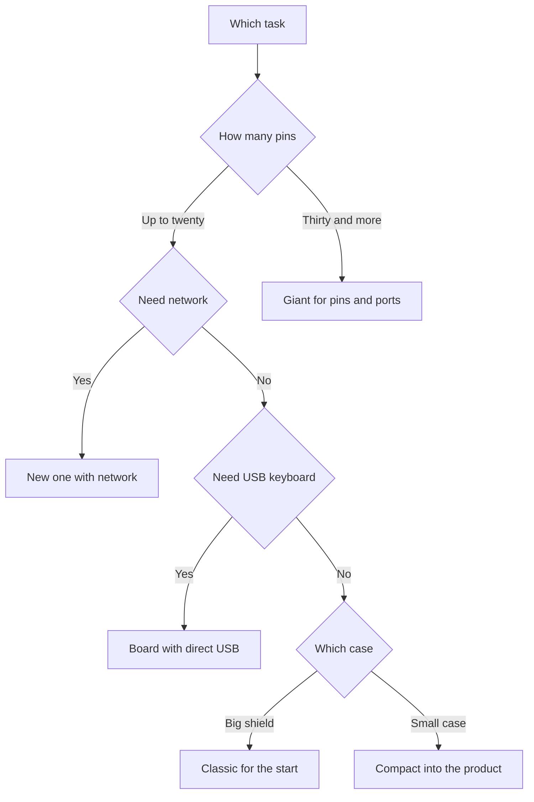

# Arduino board comparison - Uno, Nano, Mega, R4

![[assets/img/arduino-families-compare-scheme.png|600]]
*Fig. Board families: classic, compact, giant and the new networked generation.*

> [!tip] Purpose of this note
> Help pick a board for the task: when the classic is enough, when the giant is needed, when to take the new generation.

## 1. Purpose

This note compares five popular boards in one table: the classic, the compact, the USB board, the giant and the new generation. Each gets chip, memory, pins, port and a price guide. Nearby sit a task-based choice diagram and a clone teardown with a different converter.

The logic is simple: start with the classic for learning, shrink to the compact for a case, take the giant when pins run out, move to the new one when speed and memory matter. Take clones when price matters and hands can install a driver. Take the original when time and peace matter.

Prices in the table are rough and float with the rate, watch the order not the coins. Specs verified against board descriptions, always confirm details on official pages. Power and levels for each board covered separately, so inputs stay alive.

## 2. Big family table

| Board | Chip | Memory | Pins and buses | USB and power | Price guide |
| --- | --- | --- | --- | --- | --- |
| Uno classic | Eight bit sixteen megahertz | Thirty-two kilobytes, two kilobytes | Fourteen digital, six analog | Removable port, seven to twelve volt input | Medium, base |
| Nano compact | Same eight bit | Same sizes | Same signals in a small case | Mini port, five-volt power | Lowest |
| USB board | Eight bit with direct USB | Same sizes plus USB | Twenty digital, twelve analog | Direct USB, keyboard emulation | Medium plus |
| Mega giant | Older eight bit | Two hundred fifty-six kilobytes, eight kilobytes | Fifty-four digital, sixteen analog, four ports | B-type port, seven to twelve volt input | Higher |
| New R4 small | Thirty-two bit forty-eight megahertz | Two hundred fifty-six kilobytes, thirty-two kilobytes | Classic pins plus new features | C-type port, five volts and three volts | Medium plus |
| New R4 network | Same plus radio | Same plus network | Same plus antenna | C-type port plus wireless | Higher |

## 3. Details per board

| Board | Strengths | Weaknesses |
| --- | --- | --- |
| Uno classic | Sea of examples, shields sit on top, tough | Big case, little memory for network |
| Nano compact | Fits breadboard and case, cheap | Tiny contacts, pin headers need soldering |
| USB board | Poses as mouse and keyboard | Code and USB link share one port |
| Mega giant | Heaps of pins and ports for printers and robots | Big and hungry, not pocketable |
| New R4 small | Speed and memory, modern port | Three volts demand level care |
| New R4 network | Wireless out of the box for the cloud | Antenna and power ask for current spare |

The classic teaches and forgives newcomer mistakes: mixed up a pin, overheated the regulator, still alive. The compact repeats the classic in a small body for finished products. The direct-USB board opens computer control without extra programs. The giant holds tens of sensors and motors at once. The new generation gives spare capacity for years ahead.

## 4. When to take the giant

| Task | Why the giant | Alternative |
| --- | --- | --- |
| 3D printer | Many stepper motors and heaters | Dedicated control board |
| Robot arm | Ten servos and sensors together | Two compacts with a link |
| Smart greenhouse | Tens of measure points | Sensor bus with addresses |
| Test bench | Four ports for logs | Port expander on the classic |
| Classroom | One board per desk with spare | Classic plus pin expander |

The giant pays off when more than thirty pins or more than two ports are needed. If pins fit but memory is tight, look at the new generation instead of the giant. If only one place is tight, an expander is cheaper than a board swap.

```text
Гігант чи ні: швидкий тест
================================
Ніг треба до 20 і порт один .... класика
Ніг треба до 20 але корпус малий . компакт
Треба USB клавіатура ............ плата з USB
Ніг треба 30+ або портів 3+ ..... гігант
Треба мережа і память ........... нове R4 мережа
Сумнів між двома ............... бери старшу
================================
```

## 5. When to take the new generation

| Task | Why the new one | What to verify |
| --- | --- | --- |
| Cloud sensor | Network and crypto out of the box | Module power and coverage |
| Fast logger | Memory and write speed | Memory card and power |
| Graphics screen | Fast bus and frame buffer | Screen library compatibility |
| Voice and sound | Signal processing | Amplifier and separate power |
| Learning with spare | Current platform for years | Example coverage for the task |

The new generation speaks three volts, so wire old five-volt sensors through a shifter. Libraries for the new architecture are many already, but verify rare drivers before buying. The C-type port is handy, take a quality data cable not a charge-only one.

## 6. Clones and converter

| Feature | Original | Clone |
| --- | --- | --- |
| Port converter | Branded chip | Often a cheap analog |
| Driver | Installs itself | Manual install needed |
| Regulator | With spare | May heat earlier |
| Shields | Seat tight | Sometimes crooked holes |
| Price | Higher for peace | Lower for risk |
| When to take | Learning and gifts | Batches and skilled hands |

A clone with a cheap converter asks for a separate system driver, then the port appears as usual. A clone shows by a different chip near the port and by board colour. Code work is identical, only driver and power quality differ. Take the original for the first board, a clone for the fifth sensor in a case.

```text
Клон не видно у системі:
  1. Постав драйвер перетворювача з офіційного сайта чипа.
  2. Зміни кабель на короткий з даними.
  3. Перевір інший порт USB без хаба.
  4. Глянь диспетчер пристроїв: невідомий пристрій це він.
  5. Перезавантаж середовище після драйвера.
```

## 7. Basic board check sketch

```cpp
void setup() {
  Serial.begin(9600);
  while (!Serial) {
  }
  Serial.println("BOARD:HELLO");
  pinMode(LED_BUILTIN, OUTPUT);
}

void loop() {
  digitalWrite(LED_BUILTIN, HIGH);
  Serial.println("LED:ON");
  delay(400);
  digitalWrite(LED_BUILTIN, LOW);
  Serial.println("LED:OFF");
  delay(400);
}
```

Port waiting suits direct-USB boards, the classic starts at once. Port print proves the chip is alive and the port is set. Blinking proves pins obey. If text shows but no light, look up the other built-in LED number in the board description.

```cpp
void setup() {
  Serial.begin(9600);
  Serial.println("PINS:SCAN");
  for (int p = 2; p <= 13; p++) {
    pinMode(p, INPUT_PULLUP);
    int v = digitalRead(p);
    Serial.print("P");
    Serial.print(p);
    Serial.print("=");
    Serial.println(v);
  }
}

void loop() {
  delay(1000);
}
```

The second sketch scans digital pins with pull-up and prints states. A free pin shows one through pull-up, a grounded one shows zero. This verifies compact pin headers after soldering. A one-second pause leaves time to read.

## 8. Task-based selection diagram



The pins branch leads to the giant without doubt when signals are many. The network branch leads to the new generation with radio. The USB branch leads to the direct-link board. Case size splits the rest between classic and compact. Arrows never cross, the decision is single.

## Common issues

| # | Issue | Why it is bad | Correct way |
| --- | --- | --- | --- |
| 1 | Taking the giant for blinking | Money and space down the drain | Classic or compact for simple tasks |
| 2 | Powering motors from the board | Sag and reboot | Separate brick, common ground |
| 3 | Feeding five volts into the new one | A burnt input with no smoke | Level shifting between worlds |
| 4 | Skimping on a data cable | Port invisible, writes tear | Short cable with data lines |
| 5 | Forgetting the clone driver | The board stays silent in the system | Install the converter driver |
| 6 | Trusting price as quality | A cheap regulator runs hot | Measure heat and current under load |

## Official sources

- [Arduino board catalogue](https://www.arduino.cc/en/hardware/) - comparison, specs, power.
- [Board descriptions and docs](https://docs.arduino.cc/hardware/) - pins, ports, examples per board.

## See also

- [[Home.en]]
- [[00-Start/01-Yak-koristuvatis-dovidnikom| reference guide]]
- [[00-Start/02-Glosariy| glossary of terms]]
