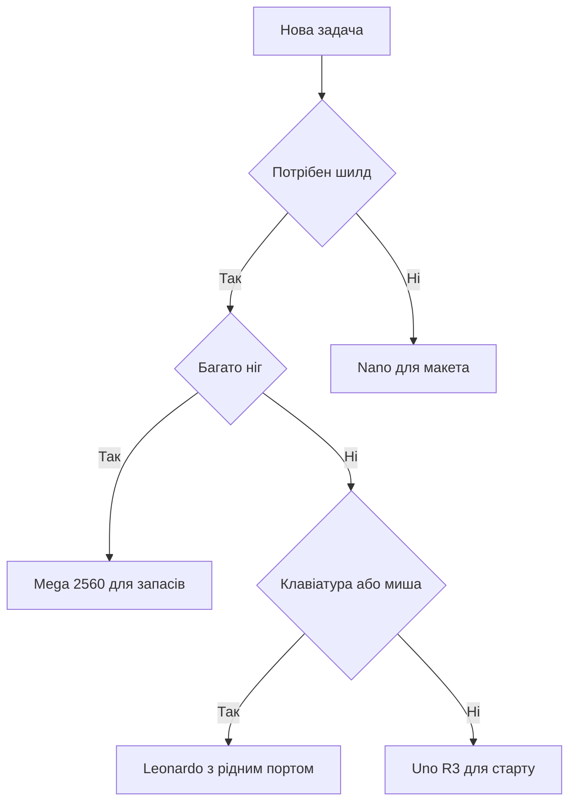

# Плати Arduino - Uno, Nano і Mega на столі

EN version: `00-Start/04-Devkit-plati.en.md`

![[assets/img/arduino-devkit-boards-scheme.png|600]]
*Рис. Плати на столі: живлення гребінки порт вибір перший запуск.*

> [!tip] Призначення ноти
> Дати швидкий старт із платами: яку плату взяти під задачу як подати живлення як впізнати клон і як запустити перший скетч.

## 1. Призначення

Ця нота закриває перші години з платами: чим відрізняються опорні плати між собою куди дивитись на карті пінів і як не спалити плату в перший день. Після прочитання читач впевнено обирає плату під макет під корпус або під багато датчиків.

Головна ідея проста: починати з опорної плати з гребінками далі переходити на компактну плату для макета а велику плату брати лише коли не вистачає пінів або портів. Клони при цьому робочі але вимагають уваги до драйверів і стабілізатора.

## 2. Uno R3 - опорна плата

Uno R3 це базова плата для навчання. Контролер ATmega328P гребінки з кроком для макетних дротів окремий чип перетворювача для порту і стабілізатор для зовнішнього живлення. Саме під цю плату написані майже всі перші приклади.

| Елемент | Де шукати | Нотатка |
| --- | --- | --- |
| Контролер | ATmega328P | Пам'ять програм достатня для перших проектів |
| Гребінки | Два ряди з боків | Сумісні з макетними дротами і шилдами |
| Порт | USB-B | Квадратний рознім на оригіналі |
| ICSP | Окрема колодка | Прошивка через програматор без завантажувача |
| Живлення VIN | Клема і круглий рознім | Діапазон для стабілізатора плати |
| Кнопка | RESET | Перезапуск скетча без вимкення живлення |
| Світлодіод | Плата біля маркування | Вбудований індикатор для першого прикладу |
| Шилди | Гребінки зверху | Плати розширення ставляться поверх |

```text
Uno R3 вигляд зверху спрощено:
  [USB-B] [круглий рознім] [VIN] [GND]
  +----------------------------------+
  |  RESET   ICSP-колодка            |
  |  ATmega328P  кварц               |
  |  гребінка живлення               |
  |  гребінка сигналів               |
  +----------------------------------+
  Шилд ставиться зверху на гребінки.
  Живлення або від порту або від VIN.
```

## 3. Nano - плата для макета

Nano це та сама логіка в малому корпусі для макетної плати. Плата вставляється прямо в макет і поруч лишається місце для дротів. На оригіналі порт mini-USB на клонах часто той же рознім але чип перетворювача замінений на CH340.

| Елемент | Де шукати | Нотатка |
| --- | --- | --- |
| Контролер | ATmega328P | Сумісність прикладів з опорною платою |
| Формат | Планки для макета | Вставляється в центр макетної плати |
| Порт | mini-USB | На клонах потрібен драйвер CH340 |
| Живлення | VIN і вивід живлення | Від порту або від зовнішнього блока |
| Кварц | На платі | Стабільна робота послідовного порту |
| Кнопка | RESET з торця | Зручно тиснути коли плата в макеті |
| Світлодіоди | Живлення і обмін | Видно чи йде прошивка |
| Обмеження | Малий стабілізатор | Мотори і реле живити окремо |

```text
Nano в макетній платі спрощено:
  макет | Nano | макет
  ------+------+------
  ряди для датчиків | VIN GND TX RX | ряди для проводів
  Кроки:
  1. Вставити плату по центру макета.
  2. Залишити по два ряди з боків.
  3. Живлення датчиків вести окремими рядами.
```

## 4. Mega 2560 - багато пінів і портів

Mega 2560 беруть коли потрібно багато цифрових виводів багато аналогових входів або кілька апаратних портів. Контролер ATmega2560 дає запас памяті програм і чотири послідовні порти що зручно для звязки з кількома модулями одночасно.

| Елемент | Де шукати | Нотатка |
| --- | --- | --- |
| Контролер | ATmega2560 | Більше памяті програм і даних |
| Цифрові виводи | Гребінки по боках | Кількість із запасом для індикації |
| Аналогові входи | Окремий ряд | Вистачає для багатьох датчиків |
| Порти | Чотири UART | Звязок з кількома модулями без програмної емуляції |
| Шилди | Формат як в опорної | Більшість шилдів стають без переробки |
| Живлення | VIN і порт | Той же підхід що в опорної плати |
| Коли брати | Великі проекти | Панелі з кнопками дисплеї кілька сенсорів |
| Коли не брати | Перші кроки | Велика плата незручна для маленького макета |

```text
Mega 2560 розподіл спрощено:
  [USB-B] [круглий рознім] [VIN]
  +--------------------------------------+
  | ATmega2560                           |
  | порт нуль для прошивки                |
  | порти один два три для модулів        |
  | ряди цифрових виводів                 |
  | ряд аналогових входів                 |
  +--------------------------------------+
  Модулі розносити по різних портах.
```

## 5. Leonardo - рідний порт

Leonardo побудована на контролері ATmega32U4 де порт реалізований самим контролером без окремого чипа. Завдяки цьому плата вміє прикидатись клавіатурою або мишею що зручно для проектів керування компютером.

| Елемент | Де шукати | Нотатка |
| --- | --- | --- |
| Контролер | ATmega32U4 | Рідний порт без перетворювача |
| Порт | micro-USB | Перепідключення порту під час прошивки норма |
| Клавіатура | Бібліотека Keyboard | Надсилання натискань на компютер |
| Миша | Бібліотека Mouse | Керування курсором зі скетча |
| Гребінки | Як в опорної | Шилди сумісні за габаритами |
| Скидання | RESET | При зависанні порту тиснути кнопку |
| Коли брати | Керування компютером | Макроси пульти тестування інтерфейсів |
| Обмеження | Один порт | Одночасно або прошивка або звязок |

## 6. Порівняння плат

| Параметр | Uno R3 | Nano | Mega 2560 | Leonardo |
| --- | --- | --- | --- | --- |
| Контролер | ATmega328P | ATmega328P | ATmega2560 | ATmega32U4 |
| Формат | Опорна з гребінками | Планки для макета | Велика опорна | Опорна з рідним портом |
| Порт | USB-B | mini-USB | USB-B | micro-USB |
| Цифрові виводи | Базовий набір | Базовий набір | Розширений набір | Базовий набір |
| Аналогові входи | Базовий набір | Базовий набір | Розширений набір | Базовий набір |
| UART | Один апаратний | Один апаратний | Чотири апаратні | Один плюс рідний порт |
| Живлення | Порт або VIN | Порт або VIN | Порт або VIN | Порт або VIN |
| Шилди | Так | Ні | Так | Так |
| Для кого | Перші кроки | Макети | Великі проекти | Керування компютером |

```text
Швидкий вибір плати:
  Перші приклади і шилди ......... Uno R3
  Компактний макет ............... Nano
  Багато датчиків і портів ....... Mega 2560
  Клавіатура і миша .............. Leonardo
```

## 7. Карта пінів і живлення

Карта пінів показує де живлення де земля де широтно модульовані виводи а де шини даних. Перед підключенням модуля звірятись із картою саме своєї плати бо порядок виводів у Nano і Mega відрізняється від опорної.

| Тема | Правило | Пояснення |
| --- | --- | --- |
| Живлення логіки | Логіка птивольтова | Датчики з іншою логікою через узгодження |
| VIN | Зовнішній блок | Напруга вища за робочу йде на стабілізатор |
| Земля | Спільна для всіх | Без спільної землі сигнали плавають |
| Струм виводу | Малі значення | Один вивід не тягне реле і мотори |
| Живлення реле | Окремий блок | Котушки дають кидки і просадки |
| Карта пінів | Друкована поруч | Помилки підключення видно одразу |

```text
Живлення без помилок:
  1. Спільна земля плати і модуля.
  2. Логіка модуля відповідає логіці плати.
  3. Мотори реле стрічки через окремий блок.
  4. Довгі проводи для живлення товстіші.
```

## 8. Перший скетч Blink

Класичний перший приклад миготить вбудованим світлодіодом. Він перевіряє весь ланцюжок: вибір плати вибір порту компіляцію і прошивку. Якщо світлодіод миготить значить драйвери і кабель справні.

```cpp
// Перший скетч: миготіння вбудованим світлодіодом
// Вбудований світлодіод підключений до виводу 13

void setup() {
  // Налаштовуємо вивід 13 як вихід
  pinMode(13, OUTPUT);
}

void loop() {
  digitalWrite(13, HIGH);  // Вмикаємо світлодіод
  delay(1000);             // Чекаємо секунду
  digitalWrite(13, LOW);   // Вимикаємо світлодіод
  delay(1000);             // Чекаємо секунду
}
```

```text
Запуск першого скетча по кроках:
  1. Підключити плату кабелем з лініями даних.
  2. Обрати плату в меню плат.
  3. Обрати порт плати в меню портів.
  4. Натиснути прошивку і дочекатись звіту.
  5. Побачити миготіння раз на секунду.
```

## 9. Клони і драйвери

Клони повторюють схему але ставлять дешевший перетворювач порту. Найчастіше це CH340 рідше CP2102. Без драйвера плата не зявляється в списку портів хоча живлення на неї йде і світлодіоди світяться.

| Чип порту | Де стоїть | Драйвер | Ознака |
| --- | --- | --- | --- |
| Оригінальний перетворювач | Оригінальні плати | Вбудований в систему | Порт видно одразу |
| CH340 | Більшість клонів Nano і Uno | Окремий пакет драйвера | Порт відсутній до встановлення |
| CP2102 | Частина клонів | Окремий пакет драйвера | Потрібен кабель з даними |
| Кабель без даних | Комплекти живлення | Не лікується драйвером | Плата живиться але порту немає |

```text
Діагностика клона по кроках:
  1. Подивитись маркування чипа біля порту.
  2. Встановити драйвер саме під цей чип.
  3. Перепідключити плату іншим кабелем з даними.
  4. Перевірити список портів до і після підключення.
  5. Новий порт і є плата.
```

## 10. Mermaid: вибір плати



## Типові помилки

| # | Помилка | Чому погано | Як правильно |
| --- | --- | --- | --- |
| 1 | Живлення мотора від виводу плати | Перегрів стабілізатора і перезавантаження | Окремий блок живлення плюс спільна земля |
| 2 | Кабель тільки для живлення | Прошивка не стартує порту немає в списку | Взяти кабель з лініями даних |
| 3 | Немає драйвера CH340 на клоні | Плата світиться але порт не зявляється | Встановити драйвер під чип біля порту |
| 4 | Модуль з іншою логікою безпосередньо | Перегрів входів і хибні дані | Узгодження рівнів між платою і модулем |
| 5 | Не той порт у меню | Прошивка летить в нікуди | Звірити список портів до і після підключення |
| 6 | Не та плата у меню | Невірні адреси виводів і швидкість | Обрати саме свою плату перед прошивкою |
| 7 | Реле без окремого живлення | Кидки струму скидають контролер | Живити котушки реле від окремого блока |

## Офіційні джерела

- [Arduino Uno R3 документація](https://docs.arduino.cc/hardware/uno-rev3/) - карта пінів живлення характеристики опорної плати.
- [Arduino Nano документація](https://docs.arduino.cc/hardware/nano/) - формат для макета живлення відмінності від опорної.
- [Каталог плат Arduino](https://docs.arduino.cc/hardware/) - каталог плат середовище розробки бібліотеки і приклади.

## Див. також

- [[Home]]
- [[00-Start/01-Yak-koristuvatis-dovidnikom|гід по довіднику]]
- [[00-Start/02-Glosariy|словник термінів]]
- [[00-Start/03-Porivnyannya-plat|порівняння плат]]
- [[00-Start/05-Vibir-seredovischa|вибір середовища]]
