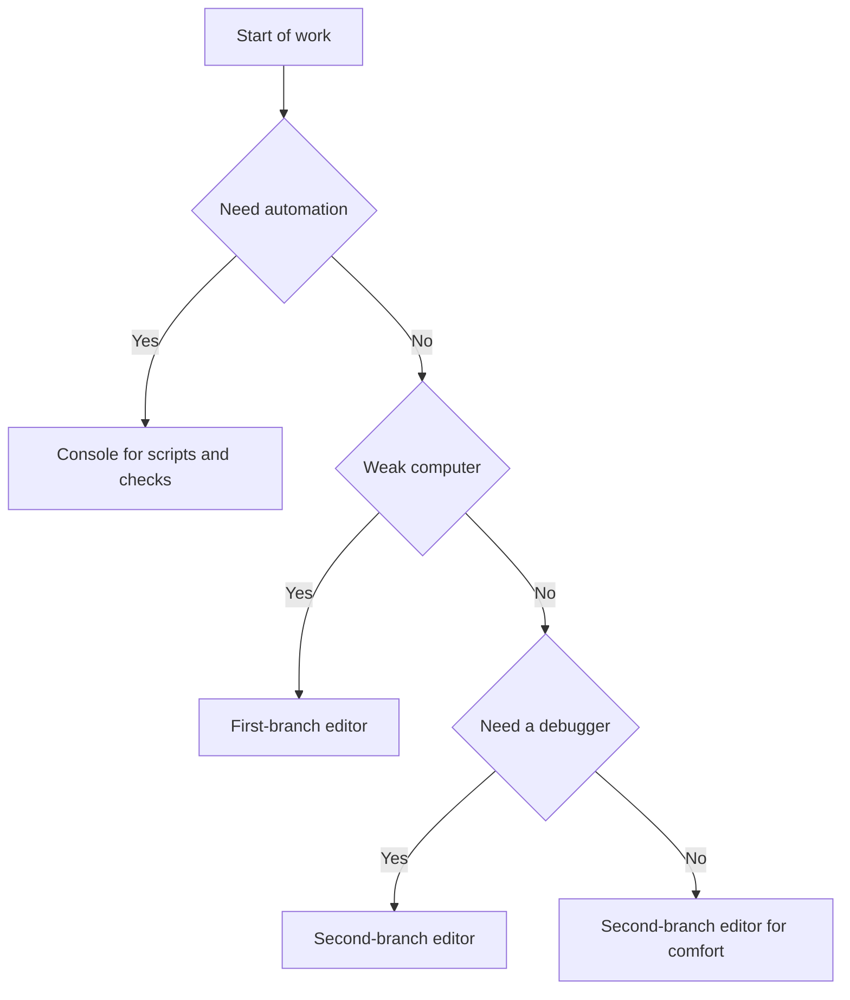

# Arduino environment - IDE, CLI and libraries

![[assets/img/arduino-env-choose-scheme.png|600]]
*Fig. Environment choice: editor, console, boards, libraries, port monitor.*

> [!tip] Purpose of this note
> Show what the environment holds: editor for code, console for automation, managers for boards and libraries, and tools for debugging over the port.

## 1. Purpose

This note explains the full cycle: writing a sketch, installing board support, wiring libraries, flashing, and viewing board data. After reading, the reader chooses between a graphical editor and the console and knows where boards, libraries and examples live.

The main idea: graphics suit starting and debugging, the console suits repeated builds and checks. Install libraries only from the manager, so versions match for everyone on the project.

## 2. IDE 1.x versus 2.x

The classic first-branch editor is light and predictable, the second-branch editor adds autocomplete, code navigation, a built-in debugger and a dark theme. Either fits first steps, but long projects feel better in the second branch.

| Parameter | IDE 1.x | IDE 2.x |
| --- | --- | --- |
| Interface | Plain window | Modern editor with panels |
| Autocomplete | Basic | Smart with signature hints |
| Debugger | External tools | Built-in for supported boards |
| Board manager | Separate window | Side panel with search |
| Library manager | Separate window | Side panel with description and versions |
| Port monitor | Separate window | Tab next to code |
| Plotter | Separate window | Tab for graphs |
| For whom | Old computers | Main work and learning |

```text
Що вибрати новачку:
  Слабкий компютер ................ IDE 1.x
  Навчання і довгі проекти ........ IDE 2.x
  Обидві відкривають ті самі скетчі.
  Скетчі сумісні між гілками повністю.
```

## 3. Console for builds

The arduino-cli console tool repeats all graphics skills: core installs, compile, flash, library work and monitor output. Scripts, checks and build servers with no windows take it.

| Command | Purpose | When to run |
| --- | --- | --- |
| core update-index | Core list refresh | Before installing a new board |
| core install | Board core install | Once per family |
| board list | Attached board list | When the board port hides |
| lib install | Library install | Before the first project build |
| compile | Sketch compile | Code check with no flashing |
| upload | Board flashing | After a good compile |
| monitor | Port viewing | Data exchange debugging |

```text
Типовий цикл через консоль:
  1. arduino-cli core update-index
  2. arduino-cli core install arduino:avr
  3. arduino-cli board list
  4. arduino-cli compile --fqbn arduino:avr:uno Blink
  5. arduino-cli upload -p /dev/ttyUSB0 --fqbn arduino:avr:uno Blink
  6. arduino-cli monitor -p /dev/ttyUSB0
```

## 4. Board manager

The board manager installs cores: controller-family descriptions, compilers and flashing settings. Without the needed core the board never appears in the list even with a visible port. Update cores with care, because new versions sometimes change old example behaviour.

| Step | Action | Explanation |
| --- | --- | --- |
| Search | Type the family name | Find the core for your board |
| Install | Press install | Wait for the download to end |
| Board pick | Board menu | Pick the exact board model |
| Port pick | Port menu | Pick the port that appeared after plugging |
| Verify | Build an example | Compile must pass clean |
| Update | New versions | Read the changelog before updating |

```text
Якщо плати нема в списку:
  1. Перевірити кабель з лініями даних.
  2. Перевірити драйвер перетворювача порту.
  3. Оновити індекс ядер.
  4. Встановити ядро сімейства плати.
  5. Перезапустити редактор і глянути порти.
```

## 5. Library manager

A library is ready code for a sensor, display or comms module with examples. The manager installs libraries from a vetted catalogue, pins the version and shows dependencies. Manual folder copies from the net stay a last resort, because nobody controls versions then.

| Step | Action | Explanation |
| --- | --- | --- |
| Search | Sensor or module name | Read description and download count |
| Version | Latest stable | Pin the version for the whole project |
| Install | One button | Examples appear in the examples menu |
| Example | Open an example | Run unchanged before own code |
| Dependencies | Extra libraries | Install all the manager asks for |
| Update | With care | Verify the build after updating |

| Approach | Pros | Cons |
| --- | --- | --- |
| Library manager | Versions, dependencies, examples | Needs network access |
| Manual copy | Works offline | No version control or updates |
| Version archive | Reproducible build | Archive must sit nearby |

```text
Порядок підключення датчика:
  1. Знайти бібліотеку в менеджері.
  2. Встановити і відкрити приклад.
  3. Запустити приклад без змін.
  4. Перенести потрібне у свій скетч.
```

## 6. Port monitor and plotter

The port monitor shows text the board sends and takes commands back. The plotter draws number graphs from the board, handy for sensors and regulators. Both tools demand equal exchange speed in the sketch and on the computer.

| Tool | Shows | When to use |
| --- | --- | --- |
| Port monitor | Text lines | Event log, control commands |
| Plotter | Number graphs | Sensor signals, regulator tuning |
| Speed | Baud in both places | Values must match |
| Line ending | Command end | Match the sketch parser |
| Port closing | Line release | Close the monitor before flashing |

```text
Налагодження через монітор:
  1. Відкрити приклад з виводом у порт.
  2. Виставити ту саму швидкість.
  3. Подивитись стартове повідомлення.
  4. Надіслати команду і глянути відповідь.
  5. Перенести команди у свій скетч.
```

## 7. Sketch structure: setup and loop

A sketch holds two main functions. The setup function runs once after power-on and prepares outputs, the port and libraries. The loop function spins forever and does the main work: reads sensors, drives outputs and sends data.

```cpp
// Структура скетча з коментарями
// setup виконується один раз
// loop повторюється без кінця

void setup() {
  // Запускаємо порт для журналу
  Serial.begin(9600);
  // Готуємо вивід під світлодіод
  pinMode(13, OUTPUT);
  // Стартове повідомлення в монітор
  Serial.println("Start");
}

void loop() {
  // Основна робота повторюється тут
  digitalWrite(13, HIGH);
  Serial.println("ON");
  delay(500);
  digitalWrite(13, LOW);
  Serial.println("OFF");
  delay(500);
}
```

```text
Каркас скетча словами:
  setup:
    порт виводи датчики бібліотеки
  loop:
    читати рахувати керувати надсилати
    ніяких довгих пауз у відповідальних місцях
```

## 8. Commented Blink example

The extended example adds port output, so each switch shows even without looking at the board. This trick saves time: the monitor proves the loop is alive, the plotter will show the switching rhythm.

```cpp
// Blink з журналом у порт
// Кожне перемикання видно і на платі і в моніторі

const int LED_PIN = 13;  // Вивід вбудованого світлодіода

void setup() {
  pinMode(LED_PIN, OUTPUT);  // Вивід працює як вихід
  Serial.begin(9600);        // Швидкість для монітора
  Serial.println("Blink start");  // Мітка старту
}

void loop() {
  digitalWrite(LED_PIN, HIGH);  // Вмикаємо світлодіод
  Serial.println("LED ON");     // Пишемо в монітор
  delay(1000);                  // Пауза секунда
  digitalWrite(LED_PIN, LOW);   // Вимикаємо світлодіод
  Serial.println("LED OFF");    // Пишемо в монітор
  delay(1000);                  // Пауза секунда
}
```

```text
Перевірка прикладу:
  1. Прошити і відкрити монітор на тій самій швидкості.
  2. Побачити рядки Blink start потім ON OFF.
  3. Світлодіод блимає в такт з рядками.
  4. Нема рядків значить не та швидкість.
```

## 9. Mermaid: environment choice



## Common issues

| # | Issue | Why it is bad | Correct way |
| --- | --- | --- | --- |
| 1 | Hand-copied library | Versions drift between people | Install via manager with a pinned version |
| 2 | Wrong board core | Compile falls or wrong board list | Install the core of your own family |
| 3 | Mismatched port speed | Garbage instead of text in the monitor | Equal speed in sketch and monitor |
| 4 | Monitor left open | Port busy, flashing never starts | Close the monitor before flashing |
| 5 | Example edited before launch | Unclear what broke | Run the example unchanged first |
| 6 | Code only in loop with no setup | Outputs and port never configured | Move configuration into setup |
| 7 | Long pauses in the loop | Missed buttons and sensor data | Short pauses or a time counter |

## Official sources

- [Arduino IDE docs](https://docs.arduino.cc/software/ide/) - editor install, boards, libraries, port monitor.
- [Arduino CLI docs](https://docs.arduino.cc/arduino-cli/) - console commands, builds, flashing, check automation.
- [IDE download (Arduino)](https://www.arduino.cc/en/software) - environment download, library catalogue, examples and help.

## See also

- [[Home.en]]
- [[00-Start/01-Yak-koristuvatis-dovidnikom| reference guide]]
- [[00-Start/02-Glosariy| glossary of terms]]
- [[00-Start/03-Porivnyannya-plat| board comparison]]
- [[00-Start/04-Devkit-plati| board overview]]
