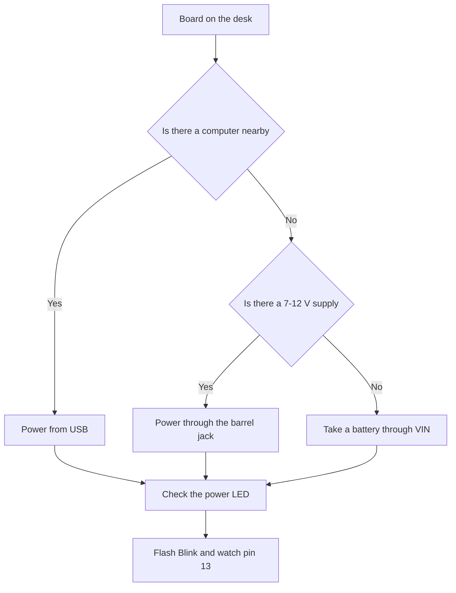

# AVR and Uno R3 - 8-bit classic

![[assets/img/arduino-uno-r3-scheme.png|600]]
*Fig. Uno R3 board: regulator, USB converter, pin headers and reset button.*

> [!tip] Purpose of the note
> To give a complete picture of the classic: what the ATmega328P can do, how to power the Uno R3, where to find the needed pin and how to run the first sketch without smoke.

## 1. Purpose

The Uno R3 is the reference board of the ecosystem: every example, every shield and every textbook starts with it.

The 8-bit AVR core works in a simple and predictable way: one clock cycle for most instructions, direct port registers, no complex clock trees.

The board forgives beginner mistakes: the regulator survives overloads, the polyfuse cuts USB current, and the bootloader lets you flash the chip with an ordinary cable.

The limit of the classic is honest too: two kilobytes of RAM run out fast, so large strings, screen buffers and network stacks do not fit here.

This note covers the basics: memory and clocking, headers, power supply, pin map and the first sketch.

## 2. ATmega328P specifications

| Parameter | Value | Practical meaning |
| --- | --- | --- |
| Core | AVR 8-bit, 16 MHz | Simple timing model, accurate delays |
| Flash | 32 KB | Program and strings in program memory |
| SRAM | 2 KB | Variables, stack, library buffers |
| EEPROM | 1 KB | Settings that survive without power supply |
| Chip supply voltage | 5 V | Logic one equals five volts |
| ADC | 10-bit, 6 channels | Sensors without external chips |
| Timers | Two 8-bit and one 16-bit | PWM, delays, pulse measurement |
| Interfaces | UART, SPI, I2C | Computer, memory card, sensors |
| Package on the board | DIP or TQFP | The DIP version can be removed and replaced |

## 3. What sits on the Uno R3 board

| Element | Where to find | Why it is needed |
| --- | --- | --- |
| ATmega328P | Board center, long chip | Runs the user sketch |
| ATmega16U2 | Near the USB-B socket | Bridge between USB and the serial port |
| USB-B socket | Square socket at the edge | Firmware flashing and power supply from the computer |
| Power jack | Round socket nearby | External 7-12 V supplies |
| 5 V regulator | Near the power jack | Makes clean 5 V for logic |
| Reset button | Small button near the headers | Manual sketch restart |
| Power LED | Green, near the regulator | Shows that power supply is present |
| LED on pin 13 | Yellow, near the label | First indicator for experiments |
| ICSP connector | Six pins 2 by 3 | Direct flashing through a programmer |
| Pin headers | Two long rows on the sides | Connection of shields and wires |

```text
Компонування Uno R3 зверху (спрощено):

  [USB-B] [ATmega16U2] ........ [гніздо 7-12В] [стаб. 5В]
       |                                               |
  [ATmega328P] .... [кварц 16 МГц] .... [кнопка скидання]
       |                                               |
  [гребінка живлення] ................. [гребінка цифра]
  [гребінка аналог] ................... [розʼєм ICSP]
```

## 4. Board power supply

| Source | Voltage | Current | When to take |
| --- | --- | --- | --- |
| USB from the computer | 5 V | Up to 500 mA | Development, flashing, debugging |
| Barrel jack | 7-12 V | Depends on the supply | Standalone work without a computer |
| VIN pin | 7-12 V | Depends on the regulator | Power supply through a shield or terminals |
| 5V pin | Exactly 5 V | Output only | To power sensors, not the board |
| 3V3 pin | 3.3 V | Up to 50 mA | Low-voltage sensors |

Automatic circuitry on the board selects the source: if there is voltage on the jack, the board takes it, otherwise it takes USB.

The regulator heats up more as the input voltage rises and the load consumes more.

Motors, servos and long LED strips get power from a separate supply with a common ground.

```text
Ланцюг живлення Uno R3:

  гніздо 7-12В ---> діод захисту ---> стабілізатор 5В ---> шина 5V
        |                                                        |
  USB 5В ---> полізапобіжник ---> ключ вибору ---> шина 5V ---> пін 3V3
```

## 5. First Blink sketch

The classic Blink checks the whole chain: environment, cable, bootloader and the chip itself.

```cpp
void setup() {
  pinMode(13, OUTPUT);   // вбудований світлодіод як вихід
}

void loop() {
  digitalWrite(13, HIGH); // увімкнути світлодіод
  delay(1000);            // чекати секунду
  digitalWrite(13, LOW);  // вимкнути світлодіод
  delay(1000);            // чекати секунду
}
```

Start-up order: select the Uno board, select the port, press the flash arrow, wait for the success message.

If the port does not appear, check the cable: charge-only cables without data wires cannot flash the board.

If flashing fails with an access error, close the port monitor and the programs that hold the port.

## 6. Mermaid: power supply choice



The diagram reads top to bottom: first the source, then the indicator check, then flashing.

For standalone nodes the jack is more reliable than USB, because the power cable does not break from movement.

For lab experiments USB is more convenient, because one cable gives both power and data.

## 7. Pin map for daily work

| Group | Pins | Purpose |
| --- | --- | --- |
| Basic digital | D2-D7 | Buttons, relays, simple sensors |
| PWM outputs | D3, D5, D6, D9-D11 | Brightness, motor speed, sound |
| Serial port | D0, D1 | Link with the computer, do not touch unless needed |
| External interrupts | D2, D3 | Fast events: encoders, counter pulses |
| Analog inputs | A0-A5 | Voltage sensors, dividers, photoresistors |
| I2C bus | A4, A5 | Displays, sensors, real-time clock |
| SPI bus | D10-D13 | Memory cards, fast displays |
| Reference voltage | AREF | Rarely, for an accurate measurement limit |
| Sensor power supply | 5V, 3V3, GND | Power distribution to small modules |

The board logic is 5-volt: one equals five volts, zero equals zero.

Sensors rated for 3.3 V connect through a divider or a level converter, not directly.

## 8. ICSP connector and direct flashing

| Connector pin | Signal | Where it goes |
| --- | --- | --- |
| First | MISO | Data line from the chip |
| Second | 5 V power supply | Logic power supply |
| Third | SCK | Programming clock |
| Fourth | MOSI | Data line to the chip |
| Fifth | Reset | Holds the chip in flashing mode |
| Sixth | Ground | Common ground of the programmer |

Through ICSP you load the bootloader into a fresh chip or restore a board with damaged firmware.

Everyday work needs no programmer: the USB bridge and the bootloader cover daily tasks.

Before connecting the programmer, check the connector key so power is not applied reversed.

## 9. Memory: where to put what

| Memory | Size | What it holds |
| --- | --- | --- |
| Flash | 32 KB | Sketch code and constant strings |
| SRAM | 2 KB | Variables, call stack, buffers |
| EEPROM | 1 KB | Settings between restarts |

Output strings move to program memory so they do not eat the two kilobytes of RAM.

Large arrays for the display are calculated in advance: a 128 by 64 frame already asks for a kilobyte.

Settings go to EEPROM rarely and in small portions, because the number of write cycles is limited.

## Common issues

| # | Issue | Why it is bad | How to do it right |
| --- | --- | --- | --- |
| 1 | Powering the board through the 5V pin from a 9 V supply | Bypassing the regulator burns the chip | Apply 7-12 V to the jack or VIN |
| 2 | Charge-only cable | Without data wires the port does not appear | Take a cable with data transfer |
| 3 | Pins D0 and D1 occupied by a sensor during flashing | Line contention breaks the upload | Disconnect loads from D0 and D1 for the flashing time |
| 4 | Applying 5 V to the input of a 3.3 V sensor | The sensor overheats and lies | Install a divider or a level converter |
| 5 | Large strings in RAM | SRAM runs out, the board hangs | Keep strings in program memory |
| 6 | Motor directly from a board pin | Pin current is tiny, the chip heats up | Drive through a transistor or a driver with a separate power supply |

## Official sources

- [Uno R3 board on docs.arduino.cc](https://docs.arduino.cc/hardware/uno-rev3/) - specifications, power supply, pinout and quick start.
- [Arduino language and libraries on arduino.cc](https://www.arduino.cc/reference/en/) - function reference, sketch examples and syntax rules.

## See also

- [[Home.en]]
- [[00-Start/03-Porivnyannya-plat.en|board comparison]]
- [[00-Start/04-Devkit-plati.en|board overview]]
- [[00-Start/05-Vibir-seredovischa.en|environment choice]]
- [[01-Hardware/02-Nano-Mega.en|compact and pins]]
- [[01-Hardware/04-Uno-R4.en|modern Uno]]
- [[09-Proshivka/02-Bootloader-AVRDUDE.en|bootloader and avrdude]]
