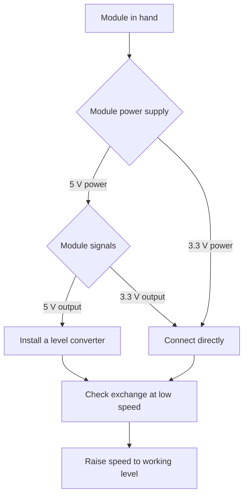

# Due and Zero - Arduino on ARM

![[assets/img/arduino-due-zero-scheme.png|600]]
*Fig. Due for fast computing and Zero for debugging: shared language, different voltage.*

> [!tip] Purpose of the note
> To explain the jump from AVR to ARM: what megahertz and DAC give, why 3.3 V logic breaks old shields and how to match levels without loss.

## 1. Purpose

Due first brought the ecosystem to thirty-two bits: complex filters, sound and graphics became real.

Zero added a debugging culture: the built-in emulator lets you step through code instead of guessing by blinking.

Both boards run on 3.3 V, so direct mating with 5-volt shields is forbidden.

This note teaches three things: to count the speed gain, to respect the 3.3 V limit and to use the DAC and the debugger.

Who masters Due and Zero will easily move to modern 32-bit families.

## 2. Comparison with the AVR classic

| Parameter | Uno on AVR | Due on SAM3X8E | Zero on SAMD21 |
| --- | --- | --- | --- |
| Core | 8-bit, 16 MHz | 32-bit, 84 MHz | 32-bit, 48 MHz |
| Flash / SRAM | 32 KB / 2 KB | 512 KB / 96 KB | 256 KB / 32 KB |
| Logic | 5 V | 3.3 V | 3.3 V |
| DAC | None | Two channels | One channel |
| USB | Bridge to the port | Two sockets, host and client | Native port plus emulator |
| Debugger | Print to port only | No built-in | EDBG on the board |
| Typical task | Buttons and relays | Sound, graphics, fast loops | Sensors with accurate code |

Due speed exceeds AVR dozens of times on integer math.

Zero is slower than Due, but thriftier and handier for battery nodes.

Both boards understand the usual language functions, so sketches port with small edits.

## 3. Due in detail

| Element | Description | Practice note |
| --- | --- | --- |
| SAM3X8E chip | Cortex-M3, 84 MHz | Computes filters and sound in real time |
| Memory | 512 KB flash, 96 KB SRAM | Screen frames and buffers fit |
| DAC | Two channels, DAC0 and DAC1 | True analog voltage at the output |
| USB sockets | Programming and native | Native gives fast exchange and host |
| Headers | Mega format | Shields fit mechanically, not electrically |
| Power supply | 7-12 V jack or USB | Regulator makes 5 V and 3.3 V |
| Buttons | Reset and erase | Erase clears flash before flashing |

Two USB sockets confuse beginners: firmware goes through the programming socket closer to the edge.

After flashing, the native socket can pretend to be a keyboard, a port or a host for peripherals.

The erase button is pressed only when the bootloader hangs; in ordinary work it is not needed.

```text
Due зверху (спрощено):

  [прогр. USB] [рідний USB] [SAM3X8E 84 МГц] [гніздо 7-12В]
        |                                                   |
  [DAC0] [DAC1] [АЦП 12 біт] ............ [кнопка стирання]
        |                                                   |
  [гребінки формату Mega, АЛЕ логіка 3,3В - шилди через узгодження]
```

## 4. Zero in detail

| Element | Description | Practice note |
| --- | --- | --- |
| SAMD21 chip | Cortex-M0+, 48 MHz | Enough for sensors and link |
| Memory | 256 KB flash, 32 KB SRAM | Reserve for link libraries |
| EDBG | Emulator on the board | Code stepping and breakpoints |
| Debug socket | Separate USB to EDBG | Flashing and printing go through it |
| Native USB | Second socket to the chip | Keyboard and mouse emulation |
| DAC | One 10-bit channel | Smooth voltages for control |
| Power supply | 5 V USB or VIN | Pin logic stays 3.3 V |

The computer sees EDBG as a separate port: through it the environment loads code with one click.

The debugger lets you watch variables live, so complex protocols get fixed faster.

After EDBG you no longer want to return to blind printing to the port.

```text
Ланцюг прошивки Zero:

  компʼютер ---> USB EDBG ---> емулятор ---> SWD ---> SAMD21
       |                                                |
  монітор порту <--- віртуальний порт <--- прошивка ---+
```

## 5. Main rule: 3.3 V logic

| Question | Answer | Consequence |
| --- | --- | --- |
| Input limit | 3.3 V | Five volts burns the input |
| Output one | 3.3 V | A 5-volt module may not hear it |
| Shields from Uno | Fit mechanically | Electrical matching needed |
| 5 V sensors | Through a divider or a converter | Direct connection forbidden |
| 5V power supply | Present on the header | Powers modules, not input pins |

The 5-volt sensor output is halved with resistors before feeding it to a Due or Zero input.

Bidirectional bus lines are covered with ready level converters on transistors.

Power shields with their own supply are checked separately: control signals must be 3-volt.

## 6. DAC example on Due

The DAC outputs true voltage, not pulses: sound is clean, control is smooth.

```cpp
void setup() {
  analogWriteResolution(12); // розрядність ЦАП: 12 біт
}

void loop() {
  for (int v = 0; v < 4095; v += 16) {
    analogWrite(DAC0, v); // пилкоподібна напруга на виході
    delayMicroseconds(100);
  }
}
```

Resolution is set explicitly, otherwise the output works in reduced mode.

DAC voltage is watched with a voltmeter or an oscilloscope, not with an LED.

For sound, a fast timer replaces delays in the loop so the tone does not drift.

## 7. Speed versus AVR in plain view

| Task | Uno 16 MHz | Due 84 MHz | Conclusion |
| --- | --- | --- | --- |
| LED blinking | Same | Same | Speed does not matter |
| Smooth PWM fading | Enough | With reserve | Both cope |
| 1 kHz sensor filter | At the limit | Easily | Due computes without delays |
| 44 kHz sound | Cannot pull | Pulls with DAC | Due only |
| 320 by 240 display | Slow | Lively | Memory and bus decide |
| Floating point | Slow in software | Faster, but no FPU | For math look at newer cores |

Due has no floating-point unit, so it still computes real numbers in software.

Integer math and tables give the biggest win on Due.

## 8. Mermaid: can the module be connected



Checking starts with power supply, then signal levels, then exchange.

An unknown module is first looked up in its description: input limits are written first.

## 9. Porting a sketch from Uno

| Step | Action | Trap |
| --- | --- | --- |
| First | Open the sketch for Due or Zero | Do not leave Uno selected |
| Second | Replace pin numbers for the new header | ADC and PWM sit elsewhere |
| Third | Remove direct work with AVR registers | ARM registers differ |
| Fourth | Check libraries for ARM support | Old libraries will not build |
| Fifth | Check levels of all connections | 5 V to an input is forbidden |

Libraries with AVR assembly inserts do not compile on ARM at all.

Microsecond-level time delays are recalibrated because of the different frequency.

## Common issues

| # | Issue | Why it is bad | How to do it right |
| --- | --- | --- | --- |
| 1 | 5 V shield straight on Due | Inputs burn from overvoltage | Install a level converter between the boards |
| 2 | Flashing through the Due native socket | Beginners lose the port after reset | Flash through the programming socket |
| 3 | Expecting 5 V at the DAC output | Output limit is only 3.3 V | Scale from 3.3 V and amplify |
| 4 | Library for AVR only | Code does not build for ARM | Look for a version with SAM support |
| 5 | Direct AVR registers in code | ARM has different addresses and bits | Rewrite through language functions or SAM registers |
| 6 | Motor power from the header | Current sags logic, the board hangs | Separate supply with a common ground |

## Official sources

- [Due board on docs.arduino.cc](https://docs.arduino.cc/hardware/due/) - specifications, DAC, USB sockets and the 3.3 V limit.
- [Zero board on arduino.cc](https://www.arduino.cc/en/Guide/ArduinoZero) - board description, EDBG emulator and getting started.

## See also

- [[Home.en]]
- [[00-Start/04-Devkit-plati.en|board overview]]
- [[00-Start/05-Vibir-seredovischa.en|environment choice]]
- [[01-Hardware/02-Nano-Mega.en|compact and pins]]
- [[01-Hardware/04-Uno-R4.en|modern Uno]]
- [[09-Proshivka/01-IDE-CLI.en|environment and CLI]]
