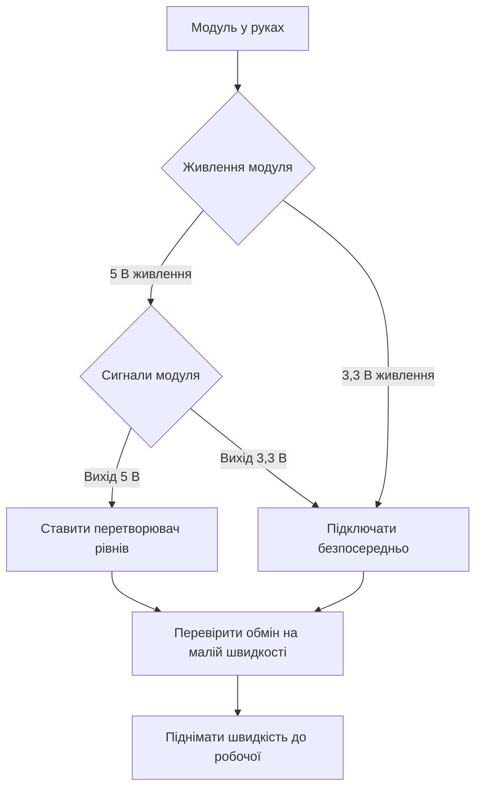

# Due і Zero - Arduino на ARM

![[assets/img/arduino-due-zero-scheme.png|600]]
*Рис. Due для швидких обчислень і Zero для налагодження: спільна мова, інша напруга.*

> [!tip] Призначення ноти
> Пояснити стрибок від AVR до ARM: що дають мегагерци і ЦАП, чому логіка 3,3 В ламає старі шилди і як узгодити рівні без втрат.

## 1. Призначення

Due першою вивела екосистему на тридцять два біти: складні фільтри, звук і графіка стали реальними.

Zero додала культуру налагодження: вбудований емулятор дозволяє крокувати кодом, а не гадати за блиманням.

Обидві плати працюють на 3,3 В, тому пряме сполучення з пʼятивольтовими шилдами заборонене.

Ця нота вчить трьом речам: рахувати вигоду швидкості, поважати межу 3,3 В і користуватись ЦАП і налагоджувачем.

Хто засвоїв Due і Zero, той легко перейде на сучасні 32-бітні родини.

## 2. Порівняння з класикою AVR

| Параметр | Uno на AVR | Due на SAM3X8E | Zero на SAMD21 |
| --- | --- | --- | --- |
| Ядро | 8 біт, 16 МГц | 32 біт, 84 МГц | 32 біт, 48 МГц |
| Flash / SRAM | 32 КБ / 2 КБ | 512 КБ / 96 КБ | 256 КБ / 32 КБ |
| Логіка | 5 В | 3,3 В | 3,3 В |
| ЦАП | Немає | Два канали | Один канал |
| USB | Міст до порту | Два гнізда, хост і клієнт | Рідний порт плюс емулятор |
| Налагоджувач | Тільки друк у порт | Немає вбудованого | EDBG на платі |
| Типова задача | Кнопки і реле | Звук, графіка, швидкі цикли | Датчики з точним кодом |

Швидкість Due перевищує AVR у десятки разів на обчисленнях з цілими числами.

Zero повільніша за Due, але економніша і зручніша для батарейних вузлів.

Обидві плати розуміють звичні функції мови, тому скетчі переносяться з малими правками.

## 3. Due детально

| Елемент | Опис | Нотатка для практики |
| --- | --- | --- |
| Чип SAM3X8E | Cortex-M3, 84 МГц | Рахує фільтри і звук у реальному часі |
| Пам'ять | 512 КБ флеш, 96 КБ SRAM | Кадри екрана і буфери влізають |
| ЦАП | Два канали, DAC0 і DAC1 | Справжня аналогова напруга на виході |
| Гнізда USB | Програмувальне і рідне | Рідне дає швидкий обмін і хост |
| Гребінки | Формат Mega | Механічно шилди стають, електрично ні |
| Живлення | Гніздо 7-12 В або USB | Стабілізатор робить 5 В і 3,3 В |
| Кнопки | Скидання і стирання | Стирання чистить флеш перед прошивкою |

Два USB-гнізда плутають новачків: прошивку заливають через програмувальне гніздо ближче до краю.

Рідне гніздо після прошивки може прикидатися клавіатурою, портом або хостом для периферії.

Кнопку стирання тиснуть лише за зависання завантажувача, у звичайній роботі вона не потрібна.

```text
Due зверху (спрощено):

  [прогр. USB] [рідний USB] [SAM3X8E 84 МГц] [гніздо 7-12В]
        |                                                   |
  [DAC0] [DAC1] [АЦП 12 біт] ............ [кнопка стирання]
        |                                                   |
  [гребінки формату Mega, АЛЕ логіка 3,3В — шилди через узгодження]
```

## 4. Zero детально

| Елемент | Опис | Нотатка для практики |
| --- | --- | --- |
| Чип SAMD21 | Cortex-M0+, 48 МГц | Достатньо для датчиків і звязку |
| Пам'ять | 256 КБ флеш, 32 КБ SRAM | Запас під бібліотеки звязку |
| EDBG | Емулятор на платі | Крокування кодом і точки зупину |
| Гніздо налагодження | Окреме USB до EDBG | Через нього йде прошивка і друк |
| Рідне USB | Друге гніздо до чипа | Емуляція клавіатури і миші |
| ЦАП | Один канал 10 біт | Плавні напруги для керування |
| Живлення | 5 В USB або VIN | Логіка пінів лишається 3,3 В |

EDBG видно компʼютеру як окремий порт: через нього середовище заливає код одним кліком.

Налагоджувач дозволяє дивитись змінні наживо, тому складні протоколи лагодять швидше.

Після EDBG повертатись до сліпого друку в порт уже не хочеться.

```text
Ланцюг прошивки Zero:

  компʼютер ---> USB EDBG ---> емулятор ---> SWD ---> SAMD21
       |                                                |
  монітор порту <--- віртуальний порт <--- прошивка ---+
```

## 5. Головне правило: логіка 3,3 В

| Питання | Відповідь | Наслідок |
| --- | --- | --- |
| Межа входу | 3,3 В | Пять вольт палить вхід |
| Вихід одиниці | 3,3 В | Пʼятивольтовий модуль може не почути |
| Шилди від Uno | Механічно стають | Електрично потрібне узгодження |
| Датчики 5 В | Через подільник або перетворювач | Безпосередньо заборонено |
| Живлення 5V | Є на гребінці | Живить модулі, не піни входу |

Пʼятивольтовий вихід датчика ділять резисторами навпіл перед подачею на вхід Due або Zero.

Двонапрямлені лінії шин закривають готовими перетворювачами рівнів на транзисторах.

Силові шилди з власним живленням перевіряють окремо: керуючі сигнали мають бути тривольтовими.

## 6. Приклад з ЦАП на Due

ЦАП виводить справжню напругу, а не імпульси: звук чистий, керування плавне.

```cpp
void setup() {
  analogWriteResolution(12); // розрядність ЦАП: 12 біт
}

void loop() {
  for (int v = 0; v < 4095; v += 16) {
    analogWrite(DAC0, v); // пилкоподібна напруга на виході
    delayMicroseconds(100);
  }
}
```

Розрядність виставляють явно, інакше вихід працює у скороченому режимі.

Напругу з ЦАП дивляться вольтметром або осцилографом, а не світлодіодом.

Для звуку за циклом ставлять швидкий таймер замість затримок, щоб тон не плавав.

## 7. Швидкість проти AVR наочно

| Задача | Uno 16 МГц | Due 84 МГц | Висновок |
| --- | --- | --- | --- |
| Моргання світлодіодом | Однаково | Однаково | Швидкість не важлива |
| Плавне згасання ШІМ | Достатньо | Із запасом | Обидві справляються |
| Фільтр датчика 1 кГц | На межі | Легко | Due рахує без затримок |
| Звук 44 кГц | Не тягне | Тягне з ЦАП | Тільки Due |
| Екран 320 на 240 | Повільно | Живо | Пам'ять і шина вирішують |
| Плаваюча кома | Повільно програмно | Швидше, але без FPU | Для математики дивляться новіші ядра |

Due не має модуля плаваючої коми, тому дійсні числа все одно рахує програмно.

Цілочисельна математика і таблиці дають на Due найбільший виграш.

## 8. Mermaid: чи можна підключити модуль



Перевірку починають з живлення, потім дивляться рівні сигналів, потім обмін.

Невідомий модуль спершу шукають в описі: межа входів пишеться першою.

## 9. Перенесення скетчу з Uno

| Крок | Дія | Пастка |
| --- | --- | --- |
| Перший | Відкрити скетч під Due або Zero | Не лишати вибраною Uno |
| Другий | Замінити номери пінів під нову гребінку | АЦП і ШІМ на інших місцях |
| Третій | Прибрати пряму роботу з регістрами AVR | Регістри ARM інші |
| Четвертий | Перевірити бібліотеки на підтримку ARM | Старі бібліотеки не зберуться |
| Пʼятий | Перевірити рівні всіх підключень | 5 В на вхід заборонено |

Бібліотеки з асемблерними вставками під AVR на ARM не компілюються взагалі.

Часові затримки мікросекундного рівня калібрують заново через іншу частоту.

## Типові помилки

| # | Помилка | Чому погано | Як правильно |
| --- | --- | --- | --- |
| 1 | Шилд 5 В прямо на Due | Входи горять від перевищення | Ставити перетворювач рівнів між платами |
| 2 | Прошивка через рідне гніздо Due | Новачки гублять порт після скидання | Шити через програмувальне гніздо |
| 3 | Очікування 5 В на виході ЦАП | Межа виходу лише 3,3 В | Рахувати шкалу від 3,3 В і підсилювати |
| 4 | Бібліотека тільки під AVR | Код не збирається під ARM | Шукати версію з підтримкою SAM |
| 5 | Прямі регістри AVR у коді | На ARM інші адреси і біти | Переписати через функції мови або регістри SAM |
| 6 | Живлення мотора від гребінки | Струм просаджує логіку, плата висне | Окремий блок живлення зі спільною землею |

## Офіційні джерела

- [Плата Due на docs.arduino.cc](https://docs.arduino.cc/hardware/due/) - характеристики, ЦАП, гнізда USB і межа 3,3 В.
- [Плата Zero на arduino.cc](https://www.arduino.cc/en/Guide/ArduinoZero) - опис плати, емулятор EDBG і початок роботи.

## Див. також

- [[Home]]
- [[00-Start/04-Devkit-plati|огляд плат]]
- [[00-Start/05-Vibir-seredovischa|вибір середовища]]
- [[01-Hardware/02-Nano-Mega|компакт і ноги]]
- [[01-Hardware/04-Uno-R4|сучасний Uno]]
- [[09-Proshivka/01-IDE-CLI|середовище і CLI]]
