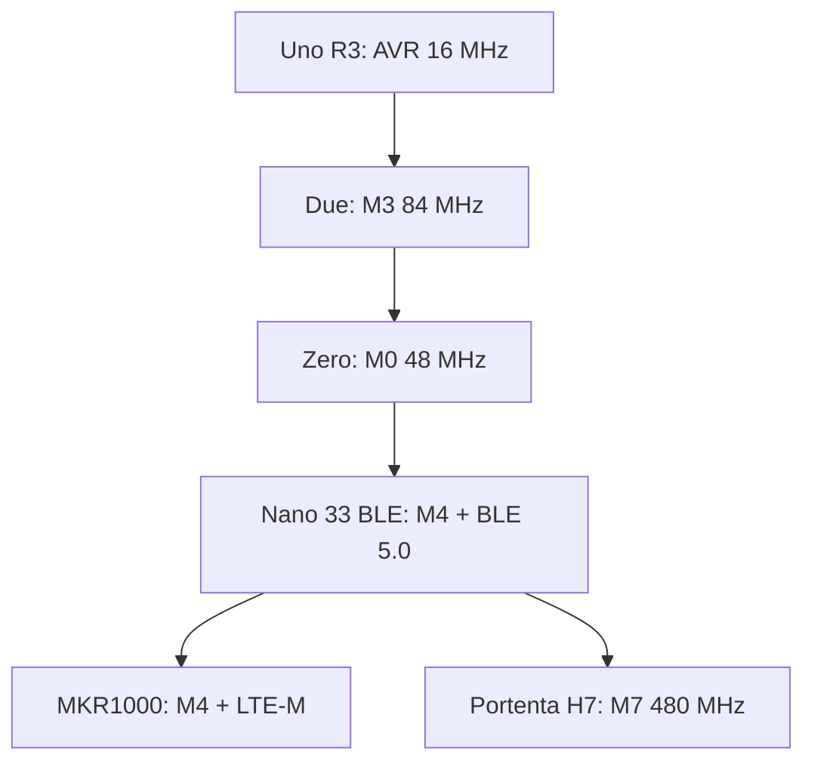

# 32-bit ARM beyond Due/Zero: Nano 33 BLE, MKR, Portenta

![[assets/img/ard-nano33-scheme.png|600]]
*Fig. Arduino ARM boards: Due (M3), Zero (M0), Nano 33 BLE (M4+BLE), MKR (LTE), Portenta (M7).*

> [!tip] What this note is
> Width extension: [[01-Hardware/01-AVR-Uno.en|AVR-Uno]] and [[01-Hardware/03-Due-Zero-ARM.en|Due-Zero]] are the basic 16/32-bit ones, and here are modern ARM boards: Nano 33 BLE, MKR, Portenta; core architecture, mbed, BLE and Cloud, and how to choose the environment.

Width extension:



*Fig. Arduino ARM board line: from Due to Portenta.*

## 1. Field: ARM board table

| Board | Chip | Core, MHz | RAM / Flash | Features |
| --- | --- | --- | --- | --- |
| Due | SAM3X8X | M3, 84 | 96 KB / 512 KB | USB, 7× ADC, "old" (2013) |
| Zero | SAMD21 | M0+, 48 | 32 KB / 256 KB | USB, Tiny, UART 48 Mbps |
| Nano 33 BLE | nRF52832 | M4, 64 | 512 KB / 1 MB | BLE 5.0, mbed core, USB-C |
| MKR1000 | SAMW25 | M4, 48 | 256 KB / 1 MB | LTE-M/NB-IoT, USB, Nano-SIM |
| MKR WiFi 1010 | ESP32 | duality | - | Wi-Fi in MKR form factor |
| Portenta H7 | STM32H743 | M7, 480 | 1 MB / 4 MB+ | EtherCAT, optics, industry |
| Portenta C33 | ESP32-C3 | RISC-V, 160 | - | TinyML, Wi-Fi 4, BLE |

## 2. Nano 33 BLE: deep dive

- nRF52832: Cortex-M4 @64 MHz, FPU, BLE 5.0, 512 KB RAM / 1 MB flash - more RAM than Due!
- core: Arduino Core for nRF52832 on top of mbed-RTOS; Wiring-API (Digital, I2C, SPI) the same;
- peripherals: 2× UART, 2× I2C, 4× SPI, 16-bit ADC, PWM;
- 3.3 V only (not 5 V!), 5 V modules - through level matching;
- charging: built-in controller, USB-C, 150-2000 mAh battery;
- Secure Element: built-in, for Cloud credentials.

## 3. Core arch: how it differs from AVR

| Aspect | AVR (Uno/Nano) | ARM (Nano 33 BLE / Due / Zero) |
| --- | --- | --- |
| Main loop | loop() in main | loop() in an RTOS task (mbed) |
| Interrupts | ISR vectors | NVIC, priorities, combining |
| USB | no (external CP2102/CH340 chips) | built-in (Due/Zero/Nano 33) |
| Flashing | ISP / UART bootloader | USB DFU / SDA mode |
| Memory | SRAM 2 KB | RAM 512 KB (nRF52832) |

- `#include <Arduino.h>` compiles the same - sketch portability;
- timer difference: M0/M4 - GPTIM with DMA, not 3 ATmega TIMs.

## 4. Arduino Cloud and Edge

- Device: OTP registration (QR on the board), credentials in Secure Element;
- Cloud: online variables, schematics, rules, free tier;
- Edge: logic runs on the board (offline), sync when linked;

```cpp
void setupCloud() {
  initDevice();          // Cloud або DevHub
}
int temperature = 21;    // змінна → хмара
void loopCloud() {
  temperature = readSensor();
  if (temperature > 30) relayOn = true;  // Edge-логіка, офлайн
}
```

## 5. BLE example: service with one variable

```cpp
#include <ArduinoBLE.h>
BLEService tempService("E7810A71-7DDE-4201-B283-23C7E0D1D4B1");
BLEIntegerCharacteristic tempChar("E7810A72-7DDE-4201-B283-23C7E0D1D4B1", BLENotify);

void setup() {
  Serial.begin(115200);
  while (!Serial);
  if (!BLE.begin()) { Serial.println("BLE не піднявся"); while (1); }
  BLE.deviceName("Nano33Sensor");
  BLE.addService(tempService);
  BLE.addCharacteristic(tempChar);
  BLE.advertise();
}

void loop() {
  BLE.poll();
  if (BLE.connected()) {
    tempChar.writeValue(readSensor());
    delay(2000);
  }
}
```

## 6. Which board to choose

| Task | Board |
| --- | --- |
| Simple BLE sensor, battery | Nano 33 BLE |
| LTE without Wi-Fi (fields, basement) | MKR1000 |
| Industrial HMI + EtherCAT | Portenta H7 |
| TinyML without radio | Portenta C33 |
| 328P ecosystem, 5 V, cheap | Uno R3 / Nano |

## Common issues

| Symptom | Cause | Fix |
| --- | --- | --- |
| Board not seen in IDE | wrong board selected | Boards Manager: "Arduino Nano 33 BLE", nRF52 core |
| USB does not enumerate on Linux | udev rules / permissions | rules for vid 0x239a, chmod dialout |
| BLE advertising disappears after 5 s | BLE.begin() in loop() or without poll | begin() once in setup, poll in loop |
| Sketch does not fit in Flash | mbed core is big | smaller tables in flash, remove extra libraries |
| Dies under USB load | 100 mA USB limit | external 5 V power supply ≥ 500 mA |
| Nano 33 "thinks" about 5 V | 3.3 V logic only | check for a 3.3 V module, match levels |

## 8. Related notes

- [[01-Hardware/03-Due-Zero-ARM.en|Due/Zero]] - basic ARM.
- [[00-Start/03-Porivnyannya-plat.en|Board comparison]] - the whole table.
- [[09-Proshivka/01-IDE-CLI.en|IDE/CLI]] - core installation.
- [[05-Radio/02-GSM-SIM800.en|GSM]] - LTE/MKR contrast.

## 7.1 Frequent questions

| Question | Answer |
| --- | --- |
| Does Nano 33 BLE replace Due? | Yes, for most tasks: 5× RAM, BLE, USB-C |
| Why is the core big? | mbed-RTOS + BLE stack in flash |
| Is there SPI? | Yes, 4× SPI, up to 18 MHz |
| Running from 5 V USB? | Yes, built-in supply down to 3.3 V |
| Bluetooth HID keyboard? | Yes: BLE HID profile or USB class |
| External interfaces? | I2C 400 kHz, 2× UART, 16-bit ADC |

## 7. Nano 33 BLE Sense revisions

- **Sense (v1)**: BME280 + APDS-9960 + LSM9DS1; firmware 1.x.
- **Sense rev 2**: BME688 (replaces BME280) + APDS-9960 + LSM9DS1 + added built-in status LED (not external); firmware 2.x - update Board Manager.
- If the sketch uses `BME280` directly - replace with `BME688` for rev 2; API is compatible (`Adafruit_BME680` with support for both).

## Official sources

- [Arduino board catalog](https://docs.arduino.cc/hardware/) - all boards with specifications.
- [Nano 33 BLE (Arduino docs)](https://docs.arduino.cc/hardware/arduinonano33ble) - nRF52832, Secure Element.
- [nRF52832 Product Specification (Nordic)](https://docs.nordicsemi.com/bundle/ps_nrf52832/page/index.html) - M4, BLE, RAM/Flash.
- [Getting Started with Arduino (docs)](https://docs.arduino.cc/learn/) - Cloud, Edge, sketches.
