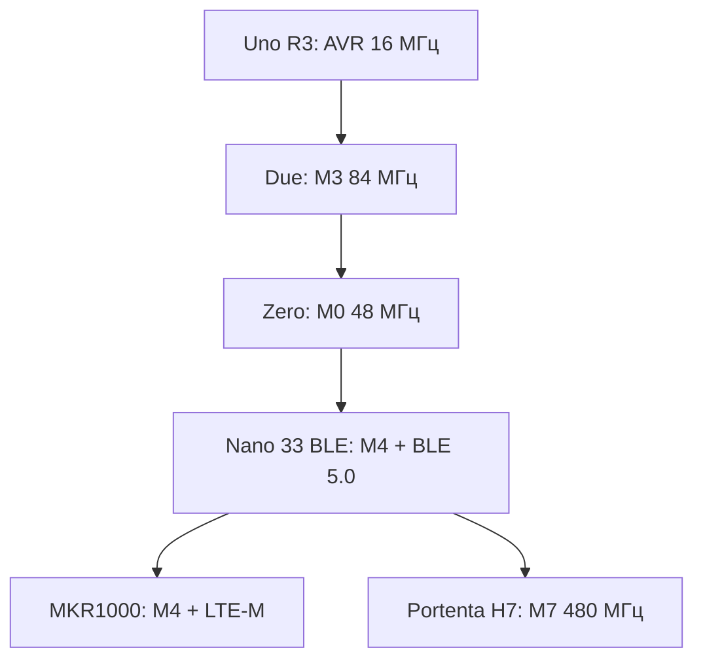

# 32-біт ARM за межами Due/Zero: Nano 33 BLE, MKR, Portenta

EN version: `ARDUINO-Reference/01-Hardware/05-Nano33-BLE-ARM.en.md`

![[assets/img/ard-nano33-scheme.png|600]]
*Рис. ARM-плати Arduino: Due (M3), Zero (M0), Nano 33 BLE (M4+BLE), MKR (LTE), Portenta (M7).*

> [!tip] Що це за нота
> Розширення по ширині: [[01-Hardware/01-AVR-Uno|AVR-Uno]] і [[01-Hardware/03-Due-Zero-ARM|Due-Zero]] - базові 16/32-біт, а тут - сучасні ARM-плати: Nano 33 BLE, MKR, Portenta; архітектура core, mbed, BLE і Cloud, і як обрати середовище.

Розширення по ширині:



*Рис. Лінія ARM-плат Arduino: від Due до Portenta.*

## 1. Поле: таблиця ARM-плат

| Плата | Чип | Ядро, МГц | RAM / Flash | Особливості |
| --- | --- | --- | --- | --- |
| Due | SAM3X8X | M3, 84 | 96 КБ / 512 КБ | USB, 7× АЦП, «старенька» (2013) |
| Zero | SAMD21 | M0+, 48 | 32 КБ / 256 КБ | USB, Tiny, UART 48 Мбіт/с |
| Nano 33 BLE | nRF52832 | M4, 64 | 512 КБ / 1 МБ | BLE 5.0, mbed core, USB-C |
| MKR1000 | SAMW25 | M4, 48 | 256 КБ / 1 МБ | LTE-M/NB-IoT, USB, Nano-SIM |
| MKR WiFi 1010 | ESP32 | duality | - | Wi-Fi у форм-факторі MKR |
| Portenta H7 | STM32H743 | M7, 480 | 1 МБ / 4 МБ+ | EtherCAT, оптика, промисловість |
| Portenta C33 | ESP32-C3 | RISC-V, 160 | - | TinyML, Wi-Fi 4, BLE |

## 2. Nano 33 BLE: глибок

- nRF52832: Cortex-M4 @64 МГц, FPU, BLE 5.0, 512 КБ RAM / 1 МБ flash - більше RAM, ніж у Due!
- core: Arduino Core для nRF52832 поверх mbed-RTOS; Wiring-API (Digital, I2C, SPI) ті ж;
- периферія: 2× UART, 2× I2C, 4× SPI, 16-бітний АЦП, PWM;
- тільки 3.3 В (не 5 В!), модулі 5 В - через узгодження рівнів;
- заряд: вбудований контролер, USB-C, батарея 150-2000 мАг·год;
- Secure Element: вбудований, для Cloud-креденшелів.

## 3. Archi core: чим відрізняється від AVR

| Аспект | AVR (Uno/Nano) | ARM (Nano 33 BLE / Due / Zero) |
| --- | --- | --- |
| Основний цикл | loop() у main | loop() у RTOS-задачі (mbed) |
| Переривання | вектори ISR | NVIC, пріоритети, комбінування |
| USB | ні (зовнішні чіп CP2102/CH340) | вбудований (Due/Zero/Nano 33) |
| Прошивка | ISP / UART bootloader | USB DFU / SDA-режим |
| Пам'ять | SRAM 2 КБ | RAM 512 КБ (nRF52832) |

- `#include <Arduino.h>` компілюється однаково - портативність скетчів;
- різниця в таймерах: M0/M4 - GPTIM із DMA, а не 3 TIM ATmega.

## 4. Arduino Cloud і Edge

- Device: реєстрація OTP (QR на платі), Credentials в Secure Element;
- Cloud: змінні онлайн, schematics, правила, безкоштовний шар;
- Edge: логіка виконується на платі (офлайн), синхронізація зі зв'язком;

```cpp
void setupCloud() {
  initDevice();          // Cloud або DevHub
}
int temperature = 21;    // змінна → хмара
void loopCloud() {
  temperature = readSensor();
  if (temperature > 30) relayOn = true;  // Edge-логіка, офлайн
}
```

## 5. BLE приклад: сервіс із однією змінною

```cpp
#include <ArduinoBLE.h>
BLEService tempService("E7810A71-7DDE-4201-B283-23C7E0D1D4B1");
BLEIntegerCharacteristic tempChar("E7810A72-7DDE-4201-B283-23C7E0D1D4B1", BLENotify);

void setup() {
  Serial.begin(115200);
  while (!Serial);
  if (!BLE.begin()) { Serial.println("BLE не піднявся"); while (1); }
  BLE.deviceName("Nano33Sensor");
  BLE.addService(tempService);
  BLE.addCharacteristic(tempChar);
  BLE.advertise();
}

void loop() {
  BLE.poll();
  if (BLE.connected()) {
    tempChar.writeValue(readSensor());
    delay(2000);
  }
}
```

## 6. Яку плати обирати

| Задача | Плата |
| --- | --- |
| Простий BLE-датчик, батарея | Nano 33 BLE |
| LTE без Wi-Fi (поля, підвал) | MKR1000 |
| Промисловий HMI + EtherCAT | Portenta H7 |
| TinyML без радіо | Portenta C33 |
| Екосистема 328P, 5 В, дешево | Uno R3 / Nano |

## 7. Типові помилки

| Симптом | Причина | Лікування |
| --- | --- | --- |
| Плата не бачиться в IDE | не обрано правильний board | Boards Manager: «Arduino Nano 33 BLE», core nRF52 |
| USB не перелічує на Linux | udev-правила / права | правила для vid 0x239a, chmod dialout |
| BLE-реклама зникає через 5 с | BLE.begin() у loop() або без poll | begin() раз у setup, poll у loop |
| Скетч не поміщується у Flash | mbed core великий | менші таблиці у flash, видалити зайві бібліотеки |
| Гасне під USB-навантаженням | ліміт 100 мА USB | зовнішнє живлення 5 В ≥ 500 мА |
| Nano 33 «думає» про 5 В | логіка 3.3 В тільки | перевірити, чи 3.3 В модуль, узгодити рівні |

## 8. Суміжні ноти

- [[01-Hardware/03-Due-Zero-ARM|Due/Zero]] - базові ARM.
- [[00-Start/03-Porivnyannya-plat|Порівняння плат]] - вся таблиця.
- [[09-Proshivka/01-IDE-CLI|IDE/CLI]] - встановлення core.
- [[05-Radio/02-GSM-SIM800|GSM]] - протиставлення LTE/MKR.

## 7.1 Часті питання

| Питання | Відповідь |
| --- | --- |
| Чи замінює Nano 33 BLE Due? | Так, для більшості задач: RAM ×5, BLE, USB-C |
| Чому core великий? | mbed-RTOS + BLE-стек у flash |
| Чи є SPI? | Так, 4× SPI, до 18 МГц |
| Робота від USB 5 В? | Так, вбудоване живлення до 3.3 В |
| Bluetooth HID-клавіатура? | Так: HID-профіль BLE або USB-клас |
| Зовнішні інтерфейси? | I2C 400 кГц, UART 2×, АЦП 16-біт |

## 7. Ревізії Nano 33 BLE Sense

- **Sense (v1)**: BME280 + APDS-9960 + LSM9DS1; прошивка 1.x.
- **Sense rev 2**: BME688 (замінено BME280) + APDS-9960 + LSM9DS1 + додано вбудований LED-індикатор стану (не зовнішній); прошивка 2.x — оновіть Board Manager.
- Якщо скетч використовує `BME280` напряму — замініть на `BME688` для rev 2; API сумісний (`Adafruit_BME680` з підтримкою обох).

## Офіційні джерела

- [Каталог плат Arduino](https://docs.arduino.cc/hardware/) - усі плати з характеристиками.
- [Nano 33 BLE (Arduino docs)](https://docs.arduino.cc/hardware/arduinonano33ble) - nRF52832, Secure Element.
- [nRF52832 Product Specification (Nordic)](https://docs.nordicsemi.com/bundle/ps_nrf52832/page/index.html) - M4, BLE, RAM/Flash.
- [Getting Started з Arduino (docs)](https://docs.arduino.cc/learn/) - Cloud, Edge, скетчі.
