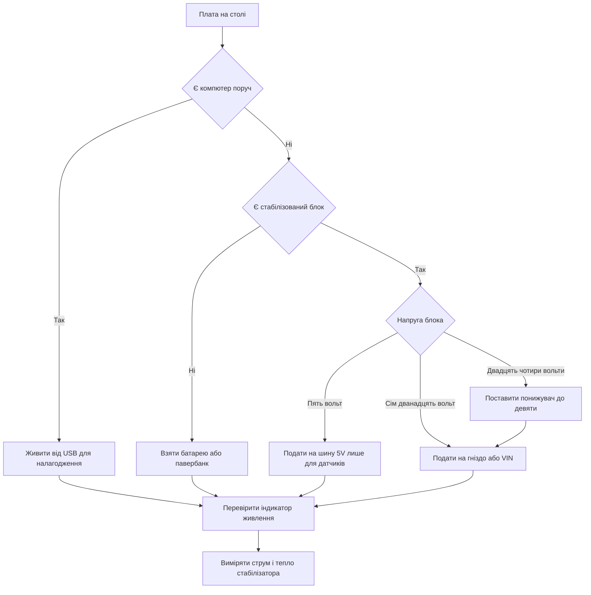

# Живлення Arduino - USB, VIN і LDO

![[assets/img/arduino-vin-power-scheme.png|600]]
*Рис. Живлення плати від USB і VIN через діод захисту і стабілізатор з роздачею на шини.*

> [!tip] Призначення ноти
> Пояснити три дороги живлення класичної плати і навчити вибирати блок без перегріву стабілізатора і просадок під серво.

## 1. Призначення

Ця нота закриває живлення класики на прикладі плат з чипом серії ATmega: звідки беруться пʼять вольт для логіки, куди подавати зовнішні вольти і чому стабілізатор гріється.

Головна думка проста: плата має два входи сили і один перетворювач вниз, а все інше це автоматика вибору і захист від помилок.

Після прочитання читач впевнено відрізняє шину USB від шини VIN, розуміє межі виходу на три вольти і вміє живити серво без перезавантажень.

Нота стане у пригоді і в лабораторії, і в корпусі готового виробу, де блок живлення вже не можна міняти щодня.

Звʼязка з іншими темами пряма: про плату як таку розповідає [[01-Hardware/01-AVR-Uno|класичний AVR]], про вибір носія розповідає [[00-Start/04-Devkit-plati|огляд плат]], а про довге життя від батарейки розповідає [[02-Zhivlennya/02-Batareyki|автономне живлення]].

## 2. Три дороги живлення

Класична плата вміє брати енергію трьома шляхами, але логіка завжди працює від чистих пʼяти вольт.

| Джерело | Куди подавати | Напруга | Струм | Коли брати |
| --- | --- | --- | --- | --- |
| USB від компʼютера | Гніздо USB-B або USB-C | 5 В | До 500 мА | Розробка і прошивка |
| Кругле гніздо | Джек 2.1 центр-плюс | 7-12 В | Залежить від блока | Стаціонарна робота |
| Пін VIN | Гребінка VIN і GND | 7-12 В | Залежить від стабілізатора | Живлення через шилд |
| Пін 5V | Тільки на вихід | Рівно 5 В | До 400 мА зі стабілізатора | Живлення датчиків |
| Пін 3V3 | Тільки на вихід | 3,3 В | До 50 мА | Слабкі датчики |

Автоматика на платі сама вибирає вище джерело: якщо є напруга на гнізді, ключ вимкає USB, інакше плата живе від порту.

Пін 5V це не вхід для блока на девʼять вольт, а вихід шини логіки для датчиків і малопотужних модулів.

Пін 3V3 це слабкий відвід для сенсорів з низькою логікою, а не для радіомодулів з імпульсним споживанням.

## 3. Круглий джек 2.1 і центр-плюс

Кругле гніздо на платі це стандартний джек 2.1 мм з плюсом у центрі і мінусом на корпусі.

| Параметр | Норма | Пояснення |
| --- | --- | --- |
| Діаметр штиря | 2.1 мм | Наймасовіший штекер блоків |
| Полярність | Центр-плюс | Плюс усередині, мінус ззовні |
| Напруга блока | 7-12 В | Запас для стабілізатора |
| Струм блока | 1 А і більше | Запас під серво і реле |
| Стабілізація | Стабілізований блок | Без стрибків при навантаженні |
| Перевірка | Мультиметр перед вмиканням | Полярність і холостий хід |

Блок з написом без стабілізації дає на холостому ходу значно більше за номінал, тому його не беруть для плати.

Штекер з центром-мінусом від музичної техніки сюди не підходить: плата захищена діодом, але працювати не буде.

Довгий тонкий кабель від блока дає просадку під навантаженням, тому для моторів беруть товсті дроти і коротку трасу.

```text
Джек 2.1 центр-плюс очима плати:

  штекер блока ---> [центр +] ---> діод ---> стабілізатор ---> шина 5 В
                     [корпус -] ---> земля плати ---> шина GND

  Перевірка перед вмиканням:
  1. Мультиметр у режим постійної напруги.
  2. Червоний щуп у центр, чорний на корпус.
  3. Має показати плюс 7-12 В, а не мінус.
  4. Під навантаженням напруга не падає нижче 7 В.
```

## 4. Чому VIN це 7-12 В

Пін VIN зʼєднаний з гніздом через діод, тому правила ті ж: не пʼять і не двадцять чотири.

| Вхід на VIN | Що буде | Чому так |
| --- | --- | --- |
| 5 В | Плата ледь дихає | Мало запасу для стабілізатора |
| 7-9 В | Ідеально | Малий нагрів і стабільні 5 В |
| 12 В | Працює, але гріється | Великий перепад гаситься теплом |
| 24 В | Перегрів і ризик | Стабілізатор іде в захист або горить |
| Змінна напруга | Не працює | Потрібна лише постійна напруга |
| Переплутані плюс і мінус | Діод рятує | Плата мовчить, але не горить |

Запас у два вольти над пʼятьма потрібен самому стабілізатору: без нього він виходить з режиму і шина пливе вниз.

Верхня межа у дванадцять вольт це компроміс між зручністю і теплом: чим вищий вхід, тим більше тепла на кожні сто міліампер.

Двадцять чотири вольти від промислових шаф сюди не подають: спочатку знижують окремим перетворювачем до девʼяти.

```text
Ланцюг VIN спрощено:

  VIN 7-12 В ---> діод захисту ---> LDO 5 В ---> шина 5V ---> логіка
       |                                              |
  GND блока ---> земля плати ------------------------> шина GND

  Заборонено:
  - подавати 5 В на VIN і чекати стабільності;
  - подавати 24 В без проміжного перетворювача;
  - живити плату через пін 5V від блока 9 В.
```

## 5. LDO AMS1117: тепло і межі

Стабілізатор AMS1117 це лінійний перетворювач: зайві вольти він перетворює на тепло.

| Параметр | Значення | Практичний сенс |
| --- | --- | --- |
| Тип | Лінійний LDO | Простий, тихий, але гріється |
| Вихід | 5 В | Живить логіку і шину 5V |
| Падіння | Близько 1 В | Тому вхід має бути від 7 В |
| Струм | 400-500 мА без радіатора (800 мА - лише з радіатором і Vin ≤ 9 В) | На голій платі реально 400-500 мА |
| Тепло | Перепад помножити на струм | 7 В різниці при 0.5 А це 3.5 Вт |
| Захист | Тепловий і струмовий | При перегріві вимикається |
| Охолодження | Мідний полігон плати | Пауза і обдув знижують температуру |

Приклад підрахунку: вхід 12 В, вихід 5 В, струм 300 мА дає сім вольт перепаду і трохи більше двох ват тепла.

Той же струм від входу 7.5 В дає менше вата тепла, тому блок на сім або девʼять вольт завжди холодніший.

Якщо палець не тримає корпус стабілізатора довше трьох секунд, значить треба знижувати вхід або знімати навантаження на окремий блок.

```text
Тепло стабілізатора на пальцях:

  вхід 7.5 В - 5 В = 2.5 В х 0.3 А = 0.75 Вт (теплий)
  вхід 9 В - 5 В = 4 В х 0.3 А = 1.2 Вт (гарячий)
  вхід 12 В - 5 В = 7 В х 0.3 А = 2.1 Вт (пече)

  Висновок:
  - для логіки і датчиків вистачає 7-9 В;
  - для серво беруть окремий блок 5-6 В;
  - радіатор і обдув лише відтягують межу.
```

## 6. Шина 5V і слабкий вихід 3.3V

Шина 5V це роздача чистих пʼяти вольт після стабілізатора, а вихід 3V3 це окремий слабкий відвід.

| Шина | Звідки береться | Що вішати | Чого не вішати |
| --- | --- | --- | --- |
| 5V | Після LDO або USB | Датчики, кнопки, світлодіоди | Мотори і довгі стрічки |
| 3V3 | Малий стабілізатор | Сенсори з малим струмом | Радіо з імпульсами 200 мА |
| VIN | До стабілізатора | Блок 7-12 В | Навантаження 5 В безпосередньо |
| GND | Земля плати | Спільна земля всіх блоків | Розрив землі між блоками |
| AREF | Опора вимірювання | Точна опора за потреби | Живлення датчиків |

Радіомодулі з піками споживання від слабкого виходу на три вольти перезавантажують плату: їм дають окремий перетворювач з конденсаторами.

Датчики температури, вологості і тиску зі струмом у міліампери спокійно живуть на шині 5V через короткі дроти.

Довгі стрічки світлодіодів живлять з обох кінців окремим блоком, а плата дає лише сигнал керування і землю.

## 7. Блок живлення під серво і мотори

Серво і мотори це індуктивне навантаження з кидками струму, тому їх ніколи не вішають на стабілізатор плати.

| Навантаження | Струм у спокої | Кидок при старті | Який блок брати |
| --- | --- | --- | --- |
| Мікро серво | 100-200 мА | До 600 мА | 5-6 В, 2 А на два серво |
| Стандартне серво | 300-500 мА | До 1.5 А | 5-6 В, 3 А і більше |
| Мотор з редуктором | 200-400 мА | До 2 А | Драйвер з окремим входом сили |
| Реле | 70-90 мА на котушку | Кидок при вмиканні | Окремий блок або запас 500 мА |
| Стрічка світлодіодів | 60 мА на сегмент | Сума сегментів | Блок з запасом третина |

Правило розводки: сила йде від блока до мотора товстими дротами, сигнал йде від піна плати тонким дротом, землі зʼєднані в одній точці.

Конденсатор на сотні мікрофарад біля серво згладжує кидок, а діод на моторі гасить зворотний викид.

Якщо плата перезавантажується в момент руху серво, це завжди просадка живлення, а не помилка в коді.

```text
Правильна розводка з серво:

  блок 5-6 В (+) ---> серво (+), плата (5V НЕ зʼєднана!)
  блок 5-6 В (-) ---> серво (-), плата (GND) ---> спільна земля
  пін 9 ---------сигнал---------> серво (сигнал)

  Неправильно:
  - серво (+) від піна 5V плати;
  - різні землі у блока і плати;
  - тонкі довгі проводи сили.
```

## 8. Діод захисту і полізапобіжник

Плата має два мовчазні охоронці: діод на вході VIN і запобіжник, що самовідновлюється, на лінії USB.

| Елемент | Де стоїть | Що робить | Межа |
| --- | --- | --- | --- |
| Діод на VIN | Після гнізда | Не пускає мінус при переплутаній полярності | Падає 0.7 В, гріється при струмі |
| Полізапобіжник | На лінії USB 5 В | Ріже струм при короткому замиканні | До 500 мА, остигає сам |
| Ключ вибору | Між USB і VIN | Бере вище джерело | Не любить одночасних стрибків |
| Конденсатори | На вході і виході LDO | Гасять пульсації | Сухі дають гул і перезавантаження |
| Стабілітрон | На окремих клонах | Ріже викиди | Не замінює правильний блок |

Діод зʼїдає близько 0.7 В, тому девʼять вольт на гнізді перетворюються на вісім з лишком перед стабілізатором.

Полізапобіжник після спрацювання потребує паузи без живлення: одразу вмикати назад марно.

Коротке замикання гребінкою на металевий корпус це класика: плата гасне, запобіжник остигає, урок засвоюється.

```text
Захист очима струму:

  гніздо ---> діод (мінус не проходить) ---> LDO ---> 5V
  USB -----> запобіжник 500 мА (при короткому росте опір) ---> 5V

  Після спрацювання:
  1. Відключити все живлення.
  2. Прибрати причину короткого.
  3. Зачекати хвилину.
  4. Увімкнути і перевірити тепло.
```

## 9. Вимір споживання мультиметром

Без виміру розмова про блок це гадання, тому струм міряють у розрив, а напругу паралельно.

| Крок | Дія | Як робити |
| --- | --- | --- |
| 1 | Напруга холостого ходу | Щупи на гніздо блока без плати |
| 2 | Напруга під навантаженням | Щупи на VIN і GND при роботі |
| 3 | Струм спокою | Мультиметр у розрив плюса блока |
| 4 | Струм при серво | Рух серво і фіксація піку |
| 5 | Тепло стабілізатора | Палець або термометр після 5 хвилин |
| 6 | Пульсації | Конденсатор і короткі дроти при просадках |

Мультиметр у режимі струму вмикають послідовно: розривають плюс блока і стають щупами в розрив.

Межу вимірювання починають з десяти ампер, потім переходять на міліампери, щоб не спалити запобіжник приладу.

Пік при старті мотора фіксує лише прилад з утриманням максимуму, звичайний екран його не встигає показати.

```text
Вимір струму в розрив:

  блок (+) ---розрив--- [червоний щуп] [прилад] [чорний щуп] --- VIN плати
  блок (-) ------------------------------------------------------ GND плати

  Послідовність:
  1. Чорний щуп у гніздо COM.
  2. Червоний у гніздо 10 А.
  3. Режим постійного струму.
  4. Увімкнути схему і записати пік.
```

## 10. Скетч контролю напруги

Вбудований вимірювач плати вміє міряти напругу на аналоговому вході через подільник з двох резисторів.

```cpp
// Контроль живлення: міряємо VIN через подільник 10к і 4.7к
// Подільник підключають між VIN і GND, середню точку на A0
// Калібрування: звірити з мультиметром і підправити коефіцієнт

const int PIN_DIV = A0;
const float R_TOP = 10000.0;   // верхнє плече до VIN
const float R_BOT = 4700.0;    // нижнє плече до землі
const float VREF = 5.0;        // опора вимірювання плати

void setup() {
  Serial.begin(9600);
  analogReference(DEFAULT);
  Serial.println("Monitor VIN start");
}

void loop() {
  int raw = analogRead(PIN_DIV);
  float vPin = (raw * VREF) / 1023.0;
  float vIn = vPin * (R_TOP + R_BOT) / R_BOT;
  Serial.print("RAW ");
  Serial.print(raw);
  Serial.print(" PIN ");
  Serial.print(vPin, 2);
  Serial.print(" VIN ");
  Serial.println(vIn, 2);
  if (vIn < 6.8) {
    Serial.println("WARN: low VIN, check supply");
  }
  if (vIn > 12.5) {
    Serial.println("WARN: high VIN, LDO overheat");
  }
  delay(1000);
}
```

Подільник рахують так, щоб на пін приходило не більше пʼяти вольт при максимальному вході.

Резистори беруть з допуском один відсоток, інакше похибка виміру сягне десятих вольта.

Середню точку подільника шунтують конденсатором на сто нанофарад, щоб прибрати шум довгих дротів.

## 11. Mermaid: вибір джерела



Схема читається згори вниз: спочатку наявність компʼютера, потім якість блока, потім точка подачі.

Гілка з понижувачем обовʼязкова для промислових шаф: безпосередньо двадцять чотири вольти не подають.

Гілка з пʼятьма вольтами це виняток для датчиків, а не спосіб живити всю плату через пін 5V.

## 12. Чекліст запуску без диму

| Крок | Перевірка | Ознака добра |
| --- | --- | --- |
| 1 | Полярність блока | Центр-плюс, плюс на табло |
| 2 | Холостий хід блока | 7-12 В без стрибків |
| 3 | Спільна земля | Один вузол землі для всіх блоків |
| 4 | Серво окремо | Сила від свого блока, сигнал від піна |
| 5 | Вихід 3V3 не перевантажений | Тільки слабкі сенсори |
| 6 | Тепло LDO через 5 хвилин | Палець тримає, запаху немає |
| 7 | Просадка при русі | Плата не перезавантажується |
| 8 | Запобіжник USB цілий | Порт бачить плату |

Перше вмикання роблять без серво і моторів: перевіряють саму плату, потім додають силу по одному вузлу.

Друге вмикання роблять з навантаженням і мультиметром у розриві: фіксують спокій і пік.

Третє вмикання вже в корпусі: перевіряють тепло після десяти хвилин закритого обʼєму.

## Типові помилки

| # | Помилка | Чому погано | Як правильно |
| --- | --- | --- | --- |
| 1 | Подавати 5 В на пін VIN | Мало запасу для LDO, шина пливе | 5 В лише на шину 5V, на VIN давати 7-12 В |
| 2 | Подавати 24 В на гніздо безпосередньо | Перегрів і спрацювання захисту | Поставити понижувач до 9 В перед платою |
| 3 | Живити серво від шини 5V плати | Кидки струму саджають логіку | Серво від окремого блока 5-6 В зі спільною землею |
| 4 | Вішати радіо на вихід 3V3 | Імпульси 200 мА валять живлення | Живити радіо від окремого перетворювача з конденсаторами |
| 5 | Центр-мінус у кругле гніздо | Плата мовчить, час втрачено | Перевірити центр-плюс мультиметром перед вмиканням |
| 6 | Міряти струм паралельно | Коротке через прилад палить запобіжник | Струм міряти лише в розрив плюсового дроти |
| 7 | Живити плату через пін 5V від блока 9 В | Обхід стабілізатора палить логіку | Блок 9 В подавати на гніздо або VIN |

## Офіційні джерела

- [Живлення Uno на docs.arduino.cc](https://docs.arduino.cc/hardware/uno-rev3/) - входи живлення, межі напруги і струму класичної плати.
- [Основи живлення на arduino.cc](https://www.arduino.cc/en/Guide/ArduinoUno) - посібник з підключення USB і зовнішнього блока.
- [Перетворювачі і батареї на docs.arduino.cc](https://docs.arduino.cc/learn/electronics/power/) - огляд джерел живлення і захисту від переполюсовки.

## Див. також

- [[Home]]
- [[01-Hardware/01-AVR-Uno|класичний AVR]]
- [[00-Start/04-Devkit-plati|огляд плат]]
- [[02-Zhivlennya/02-Batareyki|автономне живлення]]
- [[07-Timeri-Son/02-Son-WDT|сон і нагляд]]
