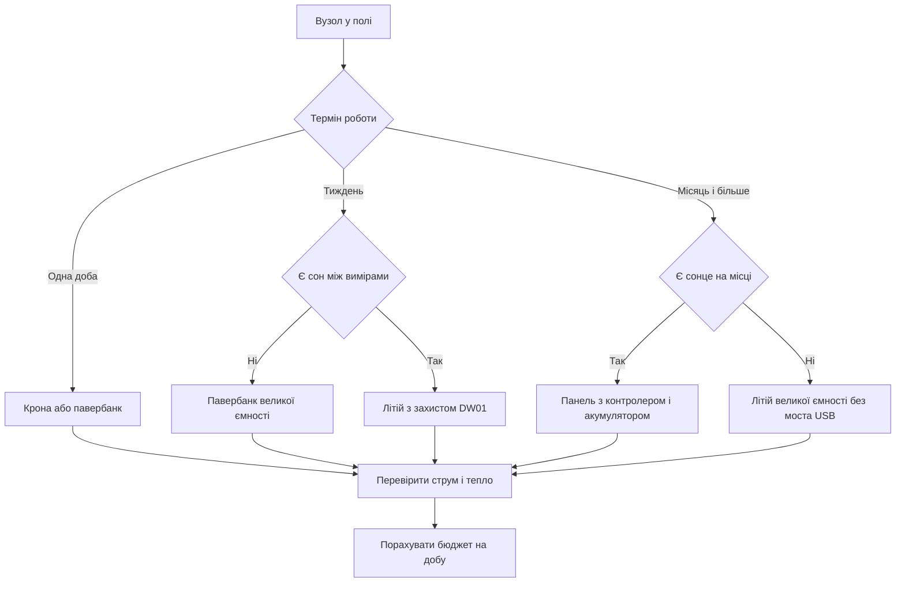

# Батарейки Arduino - автономність вузла

EN version: `02-Zhivlennya/02-Battery-Power.en.md`

![[assets/img/arduino-battery-scheme.png|600]]
*Рис. Автономний вузол на батарейках з сонячною панеллю і сном між вимірами для економії заряду.*

> [!tip] Призначення ноти
> Показати, скільки реально живе вузол від крони і літію, і навчити рахувати бюджет метеостанції зі сном між вимірами.

## 1. Призначення

Ця нота закриває життя без розетки: як живити плату в полі, в теплиці і на балконі, де немає стабільної мережі.

Головна думка проста: автономність це не ємність батарейки, а добуток середнього струму на час сну і бадьорості.

Після прочитання читач вміє відрізнити крону на день від збірки літію на місяць, розуміє захист DW01 і вміє додати сонячну панель із запасом.

Звʼязка з живленням від мережі пряма: про USB і VIN розповідає [[02-Zhivlennya/01-Zhivlennya-VIN|живлення від VIN]], про плату як таку розповідає [[01-Hardware/01-AVR-Uno|класичний AVR]], а про сон і нагляд розповідає [[07-Timeri-Son/02-Son-WDT|сон і нагляд]].

## 2. Крона 9 В: чому живе день-два

Крона це зручна батарейка на девʼять вольт, але з малою ємністю і великим внутрішнім опором.

| Параметр | Значення | Практичний сенс |
| --- | --- | --- |
| Напруга | 9 В | Підходить на VIN і гніздо |
| Ємність | 400-600 мАг | Мало для цілодобової роботи |
| Струм плати | 40-50 мА у спокої | Без сну вистачає на ніч |
| Струм зі світлодіодами | 60-80 мА | Живе менше доби |
| Внутрішній опір | Високий | Просідає при серво і радіо |
| Ціна | Висока за одиницю енергії | Добре лише для дослідів |
| Коли брати | Лабораторний дослід на вечір | Швидка перевірка без блока |

Підрахунок чесний: пʼятдесят міліампер середнього струму множимо на двадцять чотири години і отримуємо 1200 мАг на добу.

Крона з реальними пʼятсот мАг віддає менше половини доби, бо стабілізатор ще й гріє повітря зайвими вольтами.

Додайте радіо з передачею раз на хвилину, і вузол гасне ще раніше через просадку при піках.

```text
Крона на VIN очима струму:

  крона 9 В (+) ---> VIN ---> LDO 5 В ---> логіка 45 мА
  крона 9 В (-) ---> GND ----------------> земля

  Бюджет доби без сну:
  - спокій 45 мА х 24 год = 1080 мАг;
  - крона дає 500 мАг;
  - висновок: живе 10-12 годин.

  Висновок:
  - крона лише для дослідів;
  - для тижня потрібен літій і сон.
```

## 3. Літій-іон і захист DW01

Літій-іонна комірка дає велику ємність при малій вазі, але вимагає плати захисту від перерозряду і перезаряду.

| Елемент | Що робить | На що дивитись |
| --- | --- | --- |
| Комірка 18650 | Зберігає 2500-3500 мАг | Ємність і реальний виробник |
| Плата захисту | Ріже перезаряд і перерозряд | Мікросхема DW01 і збірка ключів |
| Поріг перезаряду | Близько 4.25 В | Вище не можна, деградація |
| Поріг перерозряду | Близько 2.5 В | Нижче не можна, смерть комірки |
| Струм захисту | 2-3 А | Вистачає для плати і радіо |
| Зарядний модуль | Заряджає від USB | Струм 0.5-1 А, індикація |
| Перетворювач вгору | Робить 5 В для плати | ККД і шум при радіо |

Збірка без захисту це ризик: глибокий розряд вбиває комірку за один сезон, а перезаряд веде до нагріву.

Модулі з написом без захисту беруть лише разом з окремою платою на DW01: плюс до плюса, мінус через плату.

Плата захисту не вирівнює комірки між собою, тому послідовні збірки без балансування не складають.

```text
Літій до плати через захист:

  комірка (+/-) ---> плата DW01 (B+ B-) ---> P+ P- ---> перетворювач 5 В ---> плата
                         |
  зарядний модуль ---> ті самі P+ P- (заряд через захист)

  Правила:
  1. Спочатку земля, потім плюс.
  2. Без захисту комірку не лишати.
  3. Заряд лише модулем для літію.
  4. Металевий корпус подалі від плати.
```

## 4. Павербанк через USB

Павербанк це зручний літій з готовим перетворювачем на пʼять вольт і розʼємом USB.

| Параметр | Плюс | Мінус |
| --- | --- | --- |
| Напруга | Готові 5 В | Без запасу на довгі дроти |
| Ємність | 10000 мАг і більше | Маркетингові цифри за коміркою 3.7 В |
| Струм | 1-2 А | Автовимкнення при малому струмі |
| Заряд | Звичайний кабель | Довго заряджається |
| Індикація | Світлодіоди рівня | Бреше при холоді |
| Холод | Ємність падає | Взимку тримати в теплоізоляції |
| Автовимкнення | Економить заряд | Гасить вузол у сні |

Головна пастка павербанка це автовимкнення: вузол заснув зі струмом у мікроампери, банк вирішив, що навантаження зникло, і вимкнувся.

Лікується трьома шляхами: банк без автовимкнення, періодичний імпульс навантаження або пряма комірка без банка.

Для метеостанції з передаванням раз на десять хвилин банк без автовимкнення живе тиждень, а звичайний може згаснути за ніч.

Про вибір носія під задачу розповідає [[00-Start/04-Devkit-plati|огляд плат]]: компактна плата менше їсть і довше живе від того ж банка.

```text
Павербанк до плати:

  павербанк USB 5 В ---> кабель USB ---> гніздо плати ---> шина 5V
         |
  автовимкнення при струмі менше 50 мА протягом 30 с

  Обхід:
  - банк з режимом слабкого струму;
  - імпульс світлодіодом раз на 20 с;
  - або комірка 18650 з перетворювачем без сну банка.
```

## 5. Сон між вимірами

Сон це головний важіль автономності: плата спить 99 відсотків часу і прокидається лише на вимір.

| Режим | Струм | Що працює |
| --- | --- | --- |
| Бадьорість | 40-50 мА | Ядро, датчики, радіо |
| Вимір | 50-80 мА | Датчик і передача |
| Сон зі сторожем | 5-10 мкА без USB-моста | Лише сторожовий таймер |
| Сон Nano з мостом | 1-5 мА | Міст USB не спить |
| Глибокий сон без світлодіодів | Десятки мікроампер | Випаяні індикатори |
| Радіо в ефірі | До 120 мА | Короткий пік передачі |

Класична плата з мостом USB ніколи не дасть мікроамперів: міст їсть міліампери навіть у сні ядра.

Тому для місяців автономності беруть плату без моста або виносять міст за межі вузла після налагодження.

Детальна карта сну і нагляду живе в ноті [[07-Timeri-Son/02-Son-WDT|сон і нагляд]]: там періоди сторожа і перезапуск при зависанні.

```cpp
// Сон між вимірами: прокинутись по сторожу, виміряти, заснути
// Для класики потрібна бібліотека сну, для чипа без USB-моста струм мінімальний
// Світлодіод живлення на платі для чесного виміру краще не живити

#include <avr/sleep.h>
#include <avr/wdt.h>

volatile bool woke = false;

void setup() {
  Serial.begin(9600);
  pinMode(13, OUTPUT);
  setupWatchdog();
}

void loop() {
  digitalWrite(13, HIGH);   // мітка бадьорості
  int t = analogRead(A0);   // умовний вимір датчика
  Serial.print("measure ");
  Serial.println(t);
  delay(50);                // дати дописати порт
  digitalWrite(13, LOW);
  goSleep();                // спати до сторожа
}

void setupWatchdog() {
  // Сторож на 8 секунд, лише переривання без скидання
  // Деталі періодів дивись у ноті про сон
}

void goSleep() {
  set_sleep_mode(SLEEP_MODE_PWR_DOWN);
  sleep_enable();
  sleep_mode();             // тут процесор спить
  sleep_disable();          // прокинулись по сторожу
}
```

Скетч вище це каркас: реальний сторож налаштовують регістрами, а вимір обгортають живленням датчика через пін.

Датчик живлять не постійно, а лише на час виміру: пін у високий рівень дає живлення, вимір, пін у низький рівень гасить датчик.

Радіо будять лише на передачу: заснули, прокинулись, відправили пакет, знову заснули.

## 6. Сонячна панель із запасом

Сонячна панель закриває денний струм і заряджає акумулятор на ніч, але лише із запасом за потужністю.

| Параметр | Норма для вузла | Пояснення |
| --- | --- | --- |
| Потужність | 5-10 Вт на вузол 1 Вт | Запас на хмари і пил |
| Напруга | 6 В або 12 В | Через контролер заряду |
| Контролер | Для літію або свинцю | Не безпосередньо на комірку |
| Акумулятор | На дві похмурі доби | Місткість з запасом |
| Орієнтація | Південь, кут широти | Без тіні від даху |
| Дроти | Короткі і товсті | Менше втрат при заряді |
| Діод | Проти нічного розряду | Часто вже в контролері |

Панель без контролера безпосередньо на літій не ставлять: перезаряд вбиває комірку за кілька сонячних днів.

Свинцевий акумулятор прощає перезаряд більше, але важкий і не любить морозу нижче нуля.

Пил і листя ріжуть віддачу вдвічі, тому панель миють і ставлять під кутом, щоб дощ змивав бруд.

```text
Сонце до вузла правильно:

  панель 6-12 В ---> контролер заряду ---> акумулятор ---> перетворювач 5 В ---> плата
                          |
  вночі діод не дає струму назад у панель

  Неправильно:
  - панель безпосередньо на VIN без акумулятора;
  - панель безпосередньо на літій без контролера;
  - тонкі проводи 5 метрів до панелі.
```

## 7. Бюджет метеостанції: приклад

Метеостанція міряє температуру і вологість раз на десять хвилин і відправляє пакет по радіо.

| Фаза | Тривалість | Струм | Заряд за цикл |
| --- | --- | --- | --- |
| Прокидання | 0.2 с | 45 мА | 0.0025 мАг |
| Вимір датчика | 0.5 с | 55 мА | 0.0076 мАг |
| Передача | 0.3 с | 110 мА | 0.0092 мАг |
| Сон | 599 с | 0.02 мА | 0.0033 мАг |
| Разом за 10 хв | 600 с | Середній 0.14 мА | 0.0226 мАг |
| За добу | 144 цикли | Середній 0.14 мА | 3.25 мАг |
| За місяць | 4320 циклів | Той же середній | Близько 100 мАг |

Без сну та сама станція їла б 50 мА постійно, тобто 1200 мАг на добу і 36000 мАг на місяць.

Зі сном комірка на 3000 мАг живе теоретично тридцять місяців, практично з саморозрядом і холодом близько року.

Класична плата з мостом USB дасть не 0.02 мА у сні, а 3 мА, тому бюджет зросте до 75 мАг на добу.

```text
Бюджет очима інженера:

  без сну:
  50 мА х 24 год = 1200 мАг на добу (крона на пів доби)

  зі сном на голому чипі:
  0.14 мА х 24 год = 3.4 мАг на добу (комірка на рік)

  зі сном на платі з мостом:
  3 мА х 24 год = 72 мАг на добу (комірка на місяць)

  Висновок:
  - міст USB зʼїдає виграш від сну;
  - для року беруть голий чип або плату без моста.
```

```cpp
// Метеостанція зі сном: живлення датчика через пін, передача раз на 10 хв
// Датчик живиться від D7, радіо будиться лише на передачу
// Період сну набирають циклами сторожа по 8 секунд

const int PIN_SENSOR_PWR = 7;
const int PIN_LED = 13;

void setup() {
  Serial.begin(9600);
  pinMode(PIN_SENSOR_PWR, OUTPUT);
  pinMode(PIN_LED, OUTPUT);
  digitalWrite(PIN_SENSOR_PWR, LOW);
}

void loop() {
  digitalWrite(PIN_LED, HIGH);
  digitalWrite(PIN_SENSOR_PWR, HIGH); // подати живлення на датчик
  delay(100);                         // дати датчику прокинутись
  int raw = analogRead(A1);           // вимір
  float volt = (raw * 5.0) / 1023.0;
  Serial.print("meteo raw ");
  Serial.print(raw);
  Serial.print(" volt ");
  Serial.println(volt, 2);
  // тут передача по радіо коротким пакетом
  digitalWrite(PIN_SENSOR_PWR, LOW);  // зняти живлення з датчика
  digitalWrite(PIN_LED, LOW);
  sleepTenMinutes();                  // 75 циклів сторожа по 8 с
}

void sleepTenMinutes() {
  // 75 разів заснути на 8 секунд через сторож
  // Реалізацію дивіться у ноті про сон
  delay(100); // заглушка для компіляції каркаса
}
```

Живлення датчика через пін економить більше за сам сон ядра: датчик не їсть у паузі.

Пакет роблять коротким: адреса, два байти виміру, контрольна сума, без рядків і форматування.

Логування на карту памʼяті вмикають лише для налагодження: запис їсть десятки міліампер.

## 8. Mermaid: вибір автономного живлення



Схема читається зліва направо за терміном: доба, тиждень, місяць, а далі за наявністю сну і сонця.

Гілка з кроною це лише дослід: для тижня вона не тримає за жодних умов.

Гілка з панеллю потребує акумулятора на дві похмурі доби, інакше перша хмара гасить вузол.

## 9. Холод, волога і корпус

| Фактор | Що робить | Як боротись |
| --- | --- | --- |
| Мороз | Ріже ємність літію вдвічі | Теплоізоляція і запас ємності |
| Спека | Прискорює саморозряд | Тінь для корпуса, не чорний колір |
| Волога | Окислює контакти | Герметичний корпус і силікагель |
| Конденсат | Коротить плату вранці | Вентиляційний клапан униз |
| Вібрація | Розхитує клеми | Пайка і фіксація дротів |
| Пил | Садить панель | Регулярне миття і кут нахилу |

Корпус беруть з ущільнювачем, а плату ставлять на стійки, щоб вода не стояла під нею.

Клеми мастять нейтральним мастилом, а відкриті контакти закривають термоусадкою.

Павербанк у мороз ховають разом з платою в один теплоізольований бокс, а панель виносять назовні.

## 10. Чекліст вузла перед полем

| Крок | Перевірка | Ознака добра |
| --- | --- | --- |
| 1 | Бюджет на добу порахований | Середній струм і ємність зійшлись |
| 2 | Сон реально працює | Мультиметр показує мікроампери або малі міліампери |
| 3 | Датчик гасне у сні | Живлення через пін, а не постійно |
| 4 | Захист літію на місці | Плата DW01 між коміркою і навантаженням |
| 5 | Павербанк не вимикається | Вузол живе ніч без переривань |
| 6 | Панель дає заряд у хмару | Струм заряду не нульовий |
| 7 | Корпус тримає дощ | Після поливу всередині сухо |
| 8 | Запас на дві доби | Акумулятор не в нуль після ночі |

Перший тест роблять на столі: добу логують напругу і перезапуски без виїзду.

Другий тест роблять на балконі: тиждень з дощем і сонцем показує реальний бюджет.

Третій виїзд вже в поле: з запасною коміркою і можливістю зняти лог без розбору корпуса.

## Типові помилки

| # | Помилка | Чому погано | Як правильно |
| --- | --- | --- | --- |
| 1 | Крона на місяць для метеостанції | Ємності вистачає на день-два | На місяць брати літій 3000 мАг зі сном |
| 2 | Літій без плати захисту | Перерозряд вбиває комірку | Ставити плату з DW01 між коміркою і схемою |
| 3 | Павербанк зі сплячим вузлом без перевірки | Банк вимикається і гасить вузол | Брати банк без автовимкнення або будити імпульсом |
| 4 | Датчик на постійному живленні | Їсть міліампери всю ніч | Живити датчик через пін лише на час виміру |
| 5 | Панель безпосередньо на літій | Перезаряд гріє і деградує комірку | Ставити контролер заряду між панеллю і акумулятором |
| 6 | Плата з мостом USB для року автономності | Міст їсть міліампери навіть у сні | Брати голий чип або плату без моста для довгого сну |
| 7 | Ігнорувати мороз у бюджеті | Ємність падає вдвічі, вузол гасне | Закладати подвійний запас і теплоізоляцію бокса |

## Офіційні джерела

- [Живлення проектів на docs.arduino.cc](https://docs.arduino.cc/learn/electronics/power/) - батареї, блоки живлення і безпека підключення.
- [Автономні вузли на arduino.cc](https://www.arduino.cc/en/Guide/ArduinoUno) - базова плата, споживання і робота від зовнішнього живлення.
- [Сон і низьке споживання на docs.arduino.cc](https://docs.arduino.cc/hardware/uno-rev3/) - характеристики плати і межі струмів для бюджету.

## Див. також

- [[Home]]
- [[01-Hardware/01-AVR-Uno|класичний AVR]]
- [[00-Start/04-Devkit-plati|огляд плат]]
- [[02-Zhivlennya/01-Zhivlennya-VIN|живлення від VIN]]
- [[07-Timeri-Son/02-Son-WDT|сон і нагляд]]
