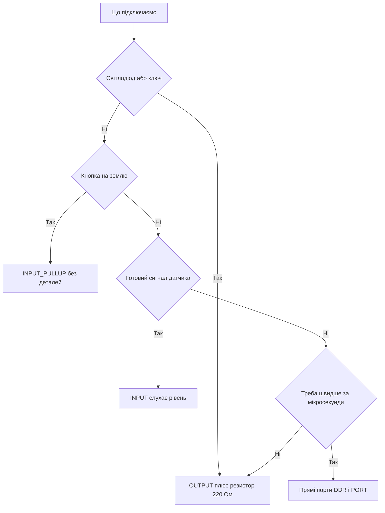

# Цифрові піни Arduino - режими і струми

![[assets/img/arduino-digital-scheme.png|600]]
*Рис. Цифрові піни: режими, підтяжки, струми і захист виходів.*

> [!tip] Призначення ноти
> Швидко налаштувати будь-який цифровий пін: вибрати режим, прочитати кнопку, засвітити світлодіод і не спалити вихід перевищенням струму.

## 1. Призначення

Цифровий пін розуміє лише два рівні: низький близько нуля і високий близько напруги живлення.

На платах з живленням 5 В високий рівень дорівнює п'ять вольт, а пороги за даташитом ATmega328P: VIL ≤ 0.3×Vcc, VIH ≥ 0.6×Vcc (це не «середина шкали», є гістерезис).

Кожен пін вміє працювати входом або виходом, а режим задається одним викликом налаштування на початку програми.

Входи читають кнопки, датчики з дискретним виходом і сигнали від інших мікросхем.

Виходи керують світлодіодами, транзисторами, реле через драйвер і логічними входами інших пристроїв.

Ця нота закриває базу: режими, читання і запис, підтяжки, межі струму, світлодіод через резистор і швидкість роботи.

## 2. Три режими піна

| Режим | Що робить | Коли брати |
| --- | --- | --- |
| OUTPUT | Пін видає 0 В або 5 В з низьким опором | Світлодіоди, керування транзистором, сигнали назовні |
| INPUT | Пін слухає рівень, струм майже не споживає | Датчики з власним виходом, сигнали від іншої логіки |
| INPUT_PULLUP | Вхід з внутрішнім резистором до живлення | Кнопки між піном і землею без зовнішніх деталей |

Режим задається викликом pinMode з номером піна і назвою режиму.

Налаштування виконують один раз у блоці setup, бо після скидання всі піни стають входами без підтяжок.

Пін 13 зручний для перших дослідів: до нього вже підключений світлодіод на платі через обмежувальний резистор.

Номери цифрових пінів друкують на платі поруч із гребінками, а префікс D у коді не пишуть.

Аналогові входи теж уміють працювати цифровими: номери A0 і далі доступні для читання і запису рівнів.

## 3. Запис і читання рівня

| Функція | Призначення | Приклад |
| --- | --- | --- |
| digitalWrite | Виставити високий або низький рівень на виході | digitalWrite(13, HIGH) вмикає світлодіод |
| digitalRead | Прочитати рівень на вході | digitalRead(2) повертає HIGH або LOW |
| HIGH | Константа високого рівня | Логічна одиниця, близько 5 В |
| LOW | Константа низького рівня | Логічний нуль, близько 0 В |

Запис працює лише на пінах, переведених у режим OUTPUT, а читання має сенс на входах.

Читання виходу поверне останнє записане значення, тому окрема змінна стану часто не потрібна.

Кнопку зазвичай читають у циклі з малою затримкою, щоб не реагувати на дребезг контактів кілька разів.

Стан кнопки зручно інвертувати одразу під час читання, якщо натиснення дає низький рівень.

Довгі дроти до кнопки збирають завади, тому поруч із платою ставлять конденсатор або програмний фільтр.

```cpp
const int LED_PIN = 13;
const int BTN_PIN = 2;

void setup() {
  pinMode(LED_PIN, OUTPUT);
  pinMode(BTN_PIN, INPUT_PULLUP);  // кнопка між піном і землею
}

void loop() {
  bool pressed = digitalRead(BTN_PIN) == LOW;  // натиснута дає нуль
  digitalWrite(LED_PIN, pressed ? HIGH : LOW);
  delay(10);  // пауза гасить дребезг контактів
}
```

Скетч світить вбудованим світлодіодом, поки утримують кнопку на другому піні.

Резистор для кнопки не потрібен: внутрішня підтяжка вже тримає рівень, коли контакти розімкнені.

Затримка десять мілісекунд робить опитування спокійним і прибирає хибні спрацьовування.

Таку схему повторюють для кожної кнопки, змінюючи лише номер піна у двох рядках.

## 4. Плаваючий вхід і підтяжки

| Стан входу | Що відбувається | Чим загрожує |
| --- | --- | --- |
| Підтягнутий догори | Резистор тримає рівень 5 В | Спокійна одиниця без кнопки |
| Підтягнутий донизу | Зовнішній резистор тримає 0 В | Спокійний нуль без кнопки |
| Плаваючий | Пін нікуди не підключена | Випадкові спрацьовування від навідних полів |

Вхід без підтяжки має великий опір і ловить наведення від рук, дротів і мережі освітлення.

Тому кнопку ніколи не лишають між піном і живленням без резистора: відпущена кнопка дасть саме плаваючий стан.

Внутрішня підтяжка має опір від 20 до 50 кОм і вмикається режимом INPUT_PULLUP без жодної деталі.

Опір підтяжки великий, тож струм через натиснуту кнопку становить частки міліампера.

```text
Кнопка на вхід з внутрішньою підтяжкою:

   живлення 5 В (усередині чипа)
    |
   [R] опір 20-50 кОм (режим INPUT_PULLUP)
    |
пін D2 ------+------> до цифрового входу
             |
          [кнопка]
             |
            земля

  Кнопка відпущена: вхід бачить 5 В.
  Кнопка натиснута: вхід притягнуто до землі.
```

Зовнішню підтяжку ставлять, коли потрібен точний опір, менший струм витоку або рівень донизу.

Для шлейфів і довгих ліній беруть зовнішній резистор близько 4,7 кОм: він жорсткіше тримає рівень проти завад.

## 5. Скільки струму витримає пін

| Межа | Значення | Практичний сенс |
| --- | --- | --- |
| Робочий струм піна | 20 мА | Світлодіод, база транзистора, логічний вхід |
| Абсолютний максимум піна | 40 мА | Короткий пік, а не робочий режим |
| Сумарний струм чипа | 200 мА | Стеля для всіх пінів і живлення разом |
| Струм піна 5V на платі | Залежить від стабілізатора | Датчики живлять з запасом |
| Струм рейки 3V3 на платі | До 50 мА (рейка, не пін!) | Делікатні датчики з низькою напругою |

Межа 20 мА означає тривалу роботу без перегріву кристала і просідання рівня.

Значення 40 мА записане як межа руйнування: кожен вихід понад нею ризикує деградацією порту.

Сума 200 мА стосується всього чипа: десять світлодіодів по 20 мА вже вперлися в стелю.

Мотори, реле і стрічки живлять через транзистор або драйвер, а пін лише керує ключем малим струмом.

```text
Розрахунок резистора для червоного світлодіода:

  живлення ............ 5 В
  падіння на діоді .... 2 В
  бажаний струм ....... 15 мА (менше межі 20 мА)

  R = (5 В - 2 В) / 0,015 А = 3 / 0,015 = 200 Ом

  Найближчий стандартний номінал догори — 220 Ом.
  Потужність: 0,015 А * 3 В = 0,045 Вт, корпус 0,25 Вт з запасом.
```

Світлодіод без резистора прямо на пін не вішають: струм обмежить лише внутрішній опір, і згорить або діод, або порт.

Для яскравих індикаторів беруть менший струм і більший резистор: очі різниці майже не помітять.

Синій і білий діоди мають падіння близько 3 В, тож резистор для них виходить меншим.

## 6. Швидкість і прямі порти

| Підхід | Швидкість перемикання | Коли вистачає |
| --- | --- | --- |
| digitalWrite | Кілька мікросекунд на виклик | Кнопки, реле, індикація, повільні протоколи |
| Прямий запис у порт | Десятки наносекунд | Генерація коротких імпульсів, швидкі шини |
| Бібліотека верхнього рівня | Як digitalWrite або повільніше | Дисплеї, датчики, готовий код |

Функція digitalWrite перевіряє номер піна і таблиці відповідності, тому витрачає час на сервіс.

Для миготіння світлодіодом і клацання реле така швидкість надлишкова з великим запасом.

Прямі порти записують цілий байт пінів однією інструкцією через регістри безпосередньо і даних.

Ціна швидкості - привʼязка до конкретного чипа: код для Uno не стане на плату з іншим ядром.

```text
Огляд прямих портів на ATmega328P:

  DDRD  — напрям: одиниця робить пін виходом
  PORTD — запис: одиниця видає 5 В на виході
  PIND  — читання: біти показують рівні входів

  Приклад: DDRD |= (1 << 5);  // пін D5 стає виходом
```

Починають завжди з digitalWrite, а до регістрів переходять лише за виміряною потребою.

Логічний аналізатор або осцилограф покаже реальну тривалість імпульсів краще за будь-які здогади.

## Mermaid: вибір режиму піна



## Типові помилки

| # | Помилка | Чому погано | Як правильно |
| --- | --- | --- | --- |
| 1 | Забутий pinMode перед digitalWrite | Пін лишився входом, навантаження не керується | Виставити OUTPUT у setup для кожного керованого піна |
| 2 | Кнопка без підтяжки на режимі INPUT | Вхід плаває і ловить наведення | Режим INPUT_PULLUP або зовнішній резистор |
| 3 | Світлодіод прямо на пін без резистора | Струм перевищує 40 мА, гине порт або діод | Резистор 220 Ом послідовно зі світлодіодом |
| 4 | Реле і мотор живлять від піна | Струм у сотні міліампер спалює вихід | Транзистор або драйвер, пін лише керує ключем |
| 5 | Перевірка кнопки без затримки | Дребезг дає серію хибних натискань | Пауза 10 мс або відлік часу між подіями |
| 6 | Сума струмів понад 200 мА на всі піни | Чип гріється і просідає живлення | Рахувати суму, потужне навантаження - на окремий блок |

## Офіційні джерела

- [Digital Pins на docs.arduino.cc](https://docs.arduino.cc/learn/microcontrollers/digital-pins/) - режими, підтяжки і межі струму цифрових пінів.
- [Функція pinMode на arduino.cc](https://www.arduino.cc/reference/en/language/functions/digital-io/pinmode/) - опис режимів INPUT, OUTPUT і INPUT_PULLUP.
- [Функція digitalWrite на arduino.cc](https://www.arduino.cc/reference/en/language/functions/digital-io/digitalwrite/) - запис рівня і швидкість роботи виходів.

## Див. також

- [[Home]]
- [[01-Hardware/01-AVR-Uno|класичний AVR]]
- [[03-GPIO/02-PWM-analogWrite|широтно-імпульсна модуляція]]
- [[03-GPIO/03-Pererivannya|переривання плати]]
