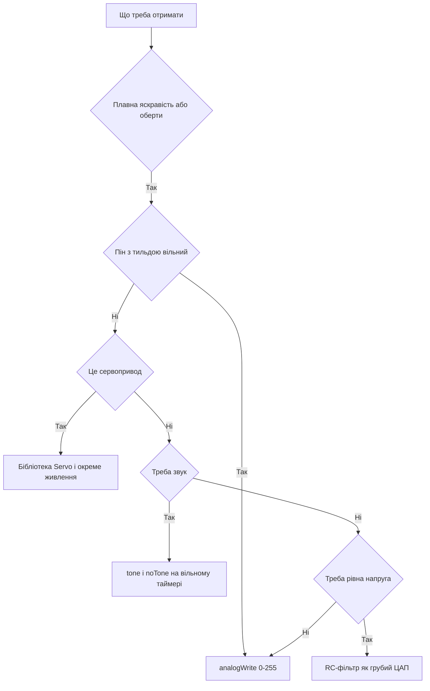

# ШІМ Arduino - analogWrite і таймери

![[assets/img/arduino-pwm-scheme.png|600]]
*Рис. ШІМ: шпаруватість, таймери, звук і грубий ЦАП на фільтрі.*

> [!tip] Призначення ноти
> Витиснути з цифрових пінів плавність аналога: гасити яскравість, гудіти пʼєзодинаміком, згладжувати напругу фільтром і крутити сервопривод бібліотекою.

## 1. Призначення

Функція analogWrite видає не справжню аналогову напругу, а швидкі прямокутні імпульси сталої амплітуди.

Середнє значення такого сигналу залежить від частки часу, коли пін тримає високий рівень.

Око бачить зміну яскравості світлодіода, вухо чує зміну гучності зумера, а мотор відчуває зміну обертів.

Такий підхід називають широтно-імпульсною модуляцією: ширина імпульсу кодує корисну величину.

Ця нота закриває практику: дозволені піни, шкала від нуля до максимуму, частоти, звук, фільтр і сервопривод.

## 2. Шпаруватість замість аналога

| Значення analogWrite | Що на піні | Що бачить око |
| --- | --- | --- |
| 0 | Постійний нуль | Світлодіод погашений |
| 64 | Чверть періоду високий рівень | Слабке світіння |
| 127 | Половина періоду високий рівень | Середня яскравість |
| 191 | Три чверті періоду високий рівень | Яскраве світіння |
| 255 | Постійна одиниця | Повна яскравість |

Шкала має 256 кроків: від нуля до 255 включно, тобто вісім біт роздільної здатності.

Нуль і максимум вироджуються у постійні рівні без перемикань: транзистор ключа при цьому не гріється.

Середина шкали дає половину напруги живлення лише в середньому: осцилограф покаже ті ж 5 В імпульсами.

Інерційні навантаження на кшталт лампи, мотора і нагрівача згладжують імпульси самі собою.

```text
Шпаруватість для трьох значень (один період):

  analogWrite 64:   ###.............
  analogWrite 127:  #######.........
  analogWrite 191:  ##########......

  Висота імпульсів однакова — 5 В.
  Міняється лише ширина високої полиці.
```

Малий крок унизу шкали око помічає сильніше, тому для плавного розпалу застосовують гамма-таблицю.

Лінійний перебір дає стрибок яскравості на старті і млявий хвіст наприкінці.

## 3. Піни з тильдою і таймери

| Плата | Піни з ШІМ | Таймери за ними |
| --- | --- | --- |
| Uno і Nano | 3, 5, 6, 9, 10, 11 | Два 8-біт і один 16-біт |
| Mega | від 2 до 13 включно | Кілька 8-біт і 16-біт |
| Leonardo | 3, 5, 6, 9, 10, 11, 13 | Розкладка інша, дивитись схему плати |
| Uno R4 | Усі цифрові піни | Апаратні таймери нового ядра |

Тильда біля номера на шовкографії плати позначає здатність піна видавати модуляцію.

Виклик analogWrite на звичайному піні дасть лише грубий поріг: менше половини шкали гасне, більше - світить.

Частота модуляції залежить від таймера: близько 490 Гц на більшості пінів і близько 980 Гц на пінах 5 і 6.

Таймер нуль обслуговує системний час, тому зміна його дільника ламає затримки і відлік мілісекунд.

```text
Відповідність таймерів і пінів на Uno:

  таймер 0 (піни 5 і 6 — 980 Гц)
  таймер 1 (16-біт, піни 9 і 10 — 490 Гц)
  таймер 2 (піни 3 і 11 — 490 Гц)

  Правило: чіпаєш таймер 0 — готуйся лагодити delay і millis.
```

Шістнадцятибітний таймер дає точнішу модуляцію і лежить в основі бібліотек сервоприводів.

Частота 490 Гц нечутна вухом як тон, але дешевий дросель у колі живлення може тихо пищати.

## 4. Плавне згасання світлодіода

| Прийом | Навіщо | Як виглядає |
| --- | --- | --- |
| Перебір догори | Розпал від темряви до максимуму | Цикл від нуля до 255 з кроком |
| Перебір донизу | Згасання до темряви | Цикл назад з тим самим кроком |
| Пауза між кроками | Видима швидкість ефекту | Затримка близько 10-20 мс |
| Гамма-корекція | Рівномірне сприйняття оком | Таблиця або степенева функція |

Світлодіод вмикають через резистор 220 Ом: модуляція не скасовує межі струму 20 мА.

Пін для досліду беруть із тильдою, інакше плавності не буде взагалі.

Крок 5 дає близько півсотні сходинок: око бачить суцільний перехід без мерехтіння.

```cpp
const int LED_PIN = 9;  // пін з тильдою, є ШІМ

void setup() {
  pinMode(LED_PIN, OUTPUT);
}

void loop() {
  for (int b = 0; b <= 255; b += 5) {
    analogWrite(LED_PIN, b);  // розпал
    delay(15);
  }
  for (int b = 255; b >= 0; b -= 5) {
    analogWrite(LED_PIN, b);  // згасання
    delay(15);
  }
}
```

Скетч ганяє яскравість туди-назад без жодної додаткової деталі, крім світлодіода з резистором.

Затримка між кроками задає темп: менша пауза дає жвавіше дихання індикатора.

Для нічного індикатора верх шкали обмежують: значення понад 40 уже сліпить у темряві.

## 5. Звук через tone і конфлікти

| Функція | Що робить | Обмеження |
| --- | --- | --- |
| tone | Генерує меандр заданої частоти | Моноканал, один пін одночасно |
| noTone | Зупиняє звук | Викликати після мелодії |
| analogWrite | Модуляція шпаруватості | Не звукова частота, лише гудіння мотором |

Функція tone будує звукову частоту таймером і конфліктує з модуляцією на сусідніх пінах того ж таймера.

Класичний симптом конфлікту: після виклику tone гаснуть або смикаються виходи ШІМ поруч.

Правило розведення просте: зумер вішають на пін, чий таймер не годує важливу модуляцію.

Пʼєзодинамік підключають через резистор близько 100 Ом: гучність лишається достатньою, а струм у нормі.

```cpp
const int BUZZER_PIN = 8;  // звичайний пін, без ШІМ

void setup() {
  pinMode(BUZZER_PIN, OUTPUT);
}

void loop() {
  tone(BUZZER_PIN, 880);  // нота ля першої октави
  delay(300);
  noTone(BUZZER_PIN);     // тиша між нотами
  delay(100);
  tone(BUZZER_PIN, 660);
  delay(300);
  noTone(BUZZER_PIN);
  delay(500);
}
```

Мелодію зручно тримати масивом пар частота-тривалість і крутити в циклі.

Динамік на 8 Ом без підсилювача не ставлять: опір занадто малий для прямого підключення.

## 6. Грубий ЦАП з резистора і конденсатора

| Деталь | Номінал | Навіщо |
| --- | --- | --- |
| Резистор | 4,7 кОм | Обмежує струм заряду конденсатора |
| Конденсатор | 10 мкФ | Згладжує імпульси у рівну напругу |
| Навантаження | Вхід з великим опором | Вимірювання або керування без струму |

Фільтр усереднює імпульси: на виході постає напруга, пропорційна значенню analogWrite.

Повна шкала дає діапазон від нуля до напруги живлення з кроком близько 20 мВ.

Пульсації лишаються завжди: більший конденсатор їх гасить, але сповільнює реакцію на зміну коду.

```text
Грубий ЦАП з ШІМ і RC-ланки:

  пін ШІМ ---> [R 4,7 кОм]---+---> вихід (середня напруга)
                             |
                            [C 10 мкФ]
                             |
                            земля

  analogWrite 0   -> близько 0 В
  analogWrite 127 -> близько 2,5 В
  analogWrite 255 -> близько 5 В
```

Такий вихід годиться для опорних напруг, керування яскравістю через підсилювач і повільних дослідів.

Струм з виходу фільтра не беруть: будь-яке навантаження просадить напругу і спотворить шкалу.

Для серйозних задач ставлять готовий цифроаналоговий перетворювач з буфером на операційному підсилювачі.

## 7. Сервопривод через бібліотеку

| Параметр сигналу | Значення | Сенс |
| --- | --- | --- |
| Період повторення | 20 мс | Стандарт керування хобі-серво |
| Імпульс мінімуму | 1 мс | Крайне ліве положення вала |
| Імпульс середини | 1,5 мс | Вал по центру |
| Імпульс максимуму | 2 мс | Крайне праве положення вала |
| Живлення мотора | Окремий блок 5-6 В | Плата такого струму не дасть |

Готова бібліотека Servo ховає таймерну кухню: користувач задає лише кут повороту.

Сервопривод живлять окремо, а землі плати і блока зʼєднують: сигнальний дріт несе лише керування.

Спроба живити серво від плати кінчається просіданням напруги і перезапуском контролера.

```cpp
#include <Servo.h>

Servo drive;  // обʼєкт сервопривода

void setup() {
  drive.attach(9);  // сигнальний дріт на пін 9
}

void loop() {
  drive.write(0);    // крайнє положення
  delay(1000);
  drive.write(90);   // середина
  delay(1000);
  drive.write(180);  // інший край
  delay(1000);
}
```

Кутонахил вала повторює задане число з точністю близько одного градуса.

Після attach частина пінів модуляції на цьому таймері вимикається: схему звіряють з документацією бібліотеки.

## Mermaid: що вибрати для задачі



## Типові помилки

| # | Помилка | Чому погано | Як правильно |
| --- | --- | --- | --- |
| 1 | analogWrite на піні без тильди | Плавності немає, лише поріг на половині шкали | Брати піни 3, 5, 6, 9, 10, 11 на Uno |
| 2 | Очікування справжнього аналога на виході | Осцилограф покаже імпульси 5 В, схема здивується | Для рівної напруги додати RC-фільтр |
| 3 | tone і ШІМ на одному таймері | Звук ламає модуляцію сусідніх пінів | Розвести звук і модуляцію по різних таймерах |
| 4 | Зміна дільника таймера нуль | Ламаються delay, millis і системний час | Не чіпати таймер нуль або перерахувати весь час |
| 5 | Сервопривод живлять від плати | Пік струму садить живлення, плата перезапускається | Окремий блок 5-6 В зі спільною землею |
| 6 | Світлодіод на ШІМ без резистора | Пікові імпульси палять кристал так само, як постійний струм | Резистор 220 Ом лишається обовʼязковим |

## Офіційні джерела

- [Функція analogWrite на arduino.cc](https://www.arduino.cc/reference/en/language/functions/analog-io/analogwrite/) - шкала 0-255, дозволені піни і зауваги про таймери.
- [Приклад Fading на docs.arduino.cc](https://docs.arduino.cc/built-in-examples/analog/Fading/) - плавна зміна яскравості світлодіода через модуляцію.
- [Функція tone на arduino.cc](https://www.arduino.cc/reference/en/language/functions/advanced-io/tone/) - генерація звуку і конфлікти з виходами модуляції.

## Див. також

- [[Home]]
- [[01-Hardware/01-AVR-Uno|класичний AVR]]
- [[03-GPIO/01-Digital-pini|цифрові піни]]
- [[03-GPIO/03-Pererivannya|переривання плати]]
