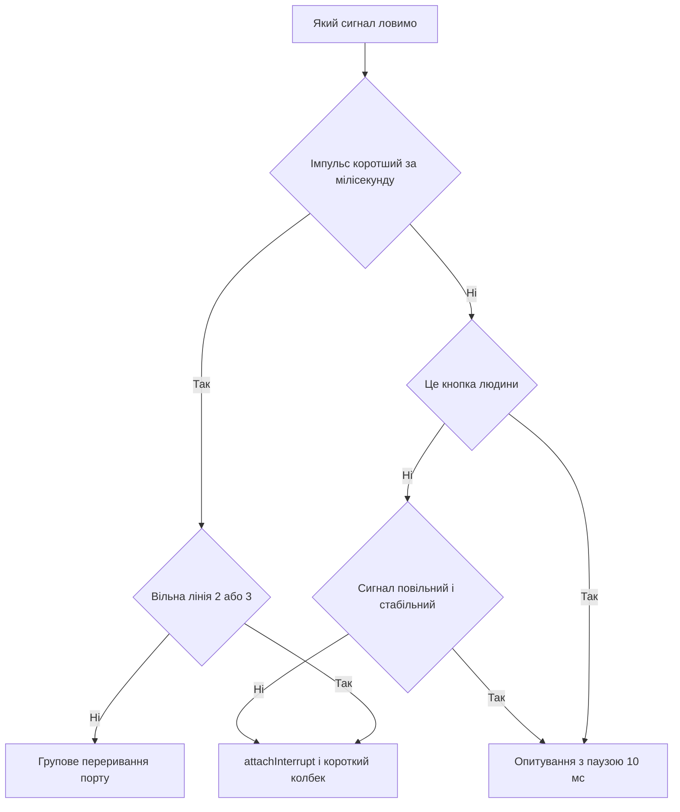

# Переривання Arduino - події без опитування

EN version: `03-GPIO/03-Interrupts.en.md`

![[assets/img/arduino-interrupt-scheme.png|600]]
*Рис. Переривання: події, режими спрацьовування і короткі колбеки.*

> [!tip] Призначення ноти
> Ловити швидкі події без зайнятого очікування: кнопка, імпульс датчика і крок енкодера обробляються миттєво, а головний цикл лишається вільним.

## 1. Призначення

Опитування входу в циклі пропускає короткі імпульси: програма саме малювала екран, а подія вже минула.

Переривання зупиняє головний код у момент події, виконує короткий колбек і повертається назад.

Такий підхід економить процесорний час: замість тисячі перевірок за секунду маємо один виклик за фактом.

Колбек називають процедурою обслуговування: вона має бути блискавичною і без побічних ефектів.

Ця нота закриває практику: режими спрацьовування, дозволені піни, прапорці, дребезг і приклади кнопки й енкодера.

## 2. Режими спрацьовування

| Режим | Момент виклику | Коли брати |
| --- | --- | --- |
| RISING | Фронт від нуля до одиниці | Лічильник імпульсів, початок події |
| FALLING | Спад від одиниці до нуля | Кнопка на землю з підтяжкою, кінець події |
| CHANGE | Будь-яка зміна рівня | Енкодер, вимірювання тривалості сигналу |
| LOW | Утримання низького рівня | Пробудження зі сну, повторні виклики поки тримають |

Режим передають третім аргументом виклику attachInterrupt разом з номером події і назвою колбека.

Кнопку між піном і землею ловлять на спад: натиснення притягує вхід до нуля.

Імпульси витратоміра рахують на фронті, щоб кожен квант рідини давав рівно один виклик.

Режим LOW викликає колбек знову і знову, поки тримають рівень, тому вихід з нього продумують заздалегідь.

## 3. Дозволені піни на різних платах

| Плата | Піни зовнішніх переривань | Заувага |
| --- | --- | --- |
| Uno і Nano | 2, 3 | Класична пара на чипі ATmega328P |
| Mega | 2, 3, 18, 19, 20, 21 | Шість ліній для складних щитів |
| Leonardo і Micro | 0, 1, 2, 3, 7 | Розкладка інша через USB-ядро |
| Uno R4 | Усі цифрові піни | Нове ядро вміє будити будь-який вхід |
| Due і Zero | Усі цифрові піни | Потужні ядра без жорстких обмежень |

На класиці доступні лише два входи, тому їх бережуть для найшвидших сигналів.

Номер переривання не дорівнює номеру піна: перетворення робить макрос digitalPinToInterrupt.

Прямі числа в коді працюють лише на одній платі і ламають переносимість між моделями.

```text
Переносне підключення колбека:

  пін 2 ---> кнопка ---> земля (Uno, Nano, Mega, Leonardo)
  код: attachInterrupt(digitalPinToInterrupt(2), onPress, FALLING);

  Макрос сам підставить номер події під конкретну плату.
```

Енкодеру потрібні дві лінії, тож на Uno він займає обидва доступні входи повністю.

Датчики з повільними сигналами лишають на опитуванні, а переривання віддають імпульсам коротше мілісекунди.

## 4. Короткий колбек і прапорці

| Правило | Чому так | Що буде за порушення |
| --- | --- | --- |
| Колбек триває мікросекунди | Головний код стоїть на паузі | Пропущені події і тремтіння сервоприводів |
| Жодних затримок усередині | Лічильник часу завмирає | Програма підвисає на кожній події |
| Жодного друку в порт | Виведення чекає переривань | Взаємне блокування і зависання |
| Спільні змінні через volatile | Компілятор не кешує значення | Головний цикл бачить застарілий стан |
| Довга робота - у loop | Колбек лише ставить прапорець | Відгук миттєвий, логіка спокійна |

Ключове слово volatile забороняє оптимізатору ховати змінну в регістр між перевірками.

Прапорець події читають і скидають у головному циклі з короткою критичною секцією.

Багатобайтні лічильники читають з вимкненими перериваннями, щоб не зловити половину оновлення.

```cpp
const int BTN_PIN = 2;

volatile bool flagPress = false;       // подія для головного циклу
volatile unsigned long lastHit = 0;    // мітка часу останнього спрацьовування

void onPress() {
  unsigned long now = millis();        // читати час можна, чекати не можна
  if (now - lastHit > 50) {            // відсікання дребезгу за часом
    flagPress = true;
    lastHit = now;
  }
}

void setup() {
  pinMode(BTN_PIN, INPUT_PULLUP);
  attachInterrupt(digitalPinToInterrupt(BTN_PIN), onPress, FALLING);
  Serial.begin(9600);
}

void loop() {
  if (flagPress) {                     // довга робота живе тут
    flagPress = false;
    Serial.println("press");
  }
}
```

Колбек лише фіксує факт натискання, а друк і логіка живуть у спокійному циклі.

Захист за часом на 50 мс відсікає пачку хибних спрацьовувань від пружинних контактів.

Такий самий каркас годиться для геркона, оптопари і будь-якого дискретного датчика.

## 5. Дребезг кнопок докладніше

| Метод | Як працює | Коли вистачає |
| --- | --- | --- |
| Пауза після події | Ігнор 30-50 мс після першого фронту | Одна кнопка, прості меню |
| Мітка часу | Порівняння мілісекунд у колбеку | Кілька кнопок без блокування циклу |
| Лічильник стабільності | Рівень сталий кілька опитувань | Опитування без переривань |
| Конденсатор 100 нФ | Апаратне згладжування фронту | Агресивні завади і довгі дроти |
| Тригер Шмітта | Чіткий фронт з повільного сигналу | Механічні контакти старої техніки |

Механічний контакт підстрибує кілька мілісекунд: контролер бачить чергу фронтів замість одного.

Без захисту лічильник натискань накручує зайве, а меню стрибає через пункти.

Часовий фільтр у колбеку дешевший за деталі і не блокує головний цикл на відміну від затримки.

Апаратний конденсатор ставлять близько до кнопки, щоб придушити заваду ще до входу.

```text
Картина дребезгу на вході (час зліва направо):

  ідеал:    11111111|0000000000000000
  реальність: 11111|01010101|00000000
               ^^^ пачка хибних фронтів

  Фільтр 50 мс бере перший фронт,
  а решту пачки мовчки ігнорує.
```

Для відповідальних вузлів поєднують обидва підходи: конденсатор плюс часовий фільтр.

Геркони і кінцевики деренчать довше кнопок, тому поріг для них піднімають до 100 мс.

## 6. Зміна рівня і вимірювання часу

| Задача | Режим | Як рахувати |
| --- | --- | --- |
| Тривалість імпульсу | CHANGE | Мітка фронту мінус мітка спаду |
| Частота сигналу | RISING | Різниця міток сусідніх фронтів |
| Шпаруватість сигналу | CHANGE | Два інтервали за період |
| Пробудження зі сну | LOW | Виклик будить ядро, далі звичайний код |

Мітки часу беруть функцією micros для точності до одиниць мікросекунд.

Змінні для міток оголошують як volatile unsigned long, щоб не губити старші розряди.

Ділення і друк результатів виконують у головному циклі, а не в колбеку.

Ультразвуковий далекомір і приймач інфрачервоного пульта читають саме так: фронти несуть дані.

## 7. Енкодер на двох лініях

| Сигнал | Куди вести | Роль у коді |
| --- | --- | --- |
| CLK | Пін 2, подія CHANGE | Тактує кроки обертання |
| DT | Пін 3, читання рівня | Напрям визначає рівень у момент фронту |
| GND | Земля плати | Спільна точка для обох каналів |

Механічний енкодер видає квадратурну пару: зсув фаз між каналами кодує напрям.

Колбек на зміну першого каналу читає другий: високий рівень означає крок уперед, низький - назад.

Лічильник позиції оголошують volatile long, бо головний цикл читає його між обертаннями ручки.

```cpp
const int ENC_CLK = 2;
const int ENC_DT = 3;

volatile long position = 0;  // лічильник кроків ручки

void onStep() {
  if (digitalRead(ENC_DT) == HIGH) {
    position++;  // крок уперед
  } else {
    position--;  // крок назад
  }
}

void setup() {
  pinMode(ENC_CLK, INPUT_PULLUP);
  pinMode(ENC_DT, INPUT_PULLUP);
  attachInterrupt(digitalPinToInterrupt(ENC_CLK), onStep, CHANGE);
  Serial.begin(9600);
}

void loop() {
  static long shown = 0;
  if (shown != position) {  // друк лише на зміні
    shown = position;
    Serial.println(shown);
  }
}
```

Внутрішні підтяжки закривають входи без зовнішніх резисторів: середній вивід енкодера йде на землю.

Дешеві енкодери деренчать, тому швидке прокручування перевіряють на пропуск кроків.

Для точних задач беруть оптичний енкодер: контакти не зношуються і фронти чисті.

## 8. Переривання зміни рівня оглядово

| Можливість | Що вміє | Коли згадати |
| --- | --- | --- |
| PCINT на AVR | Реакція на зміну будь-якого піна порту | Коли ліній 2 і 3 уже не вистачає |
| Маска порту | Вмикає окремі біти спостереження | Кілька кнопок на одному векторі |
| Спільний вектор | Один колбек на вісім пінів | У колбеку зʼясовують винуватця |
| Прапор порту | Біт причини спрацьовування | Скидають записом одиниці у прапор |

Групові переривання покривають усі піни, але не розрізняють фронт і спад: напрям зʼясовує код.

У колбеку читають стан порту і порівнюють з попереднім знімком для пошуку зміненого біта.

Такий рівень уже вимагає регістрів і даташита: бібліотеки ховають складність лише частково.

```text
Схема групового переривання порту:

  піни D8-D13 ---> [маска PCMSK] ---> спільний вектор PCINT0
                                              |
                                     колбек читає PINB
                                     і шукає змінений біт
```

Починають завжди зі штатних двох ліній, а до групових переходять за реальної нестачі.

На нових ядрах з перериванням на кожному піні ця техніка взагалі не потрібна.

## Mermaid: опитування чи подія



## Типові помилки

| # | Помилка | Чому погано | Як правильно |
| --- | --- | --- | --- |
| 1 | Довга робота і друк у колбеку | Головний код стоїть, події губляться | Прапорець volatile, а робота - у loop |
| 2 | Спільна змінна без volatile | Оптимізатор кешує значення, цикл не бачить події | Усі спільні змінні оголошувати volatile |
| 3 | Номер переривання замість макросу | Код привʼязаний до однієї плати | Завжди digitalPinToInterrupt з номером піна |
| 4 | Кнопка без захисту від дребезгу | Один натиск дає чергу подій | Часовий фільтр 50 мс або конденсатор |
| 5 | Режим LOW без продуманого виходу | Колбек викликається безперервно, цикл голодує | LOW лише для пробудження, далі міняти режим |
| 6 | attachInterrupt на піні без лінії | Виклик мовчки не працює на цій платі | Звірити пін з таблицею плати перед монтажем |

## Офіційні джерела

- [Функція attachInterrupt на arduino.cc](https://www.arduino.cc/reference/en/language/functions/external-interrupts/attachinterrupt/) - режими, дозволені піни і правила коротких колбеків.
- [Приклад Debounce на docs.arduino.cc](https://docs.arduino.cc/built-in-examples/digital/Debounce/) - придушення дребезгу кнопки часовим фільтром.
- [Посібник з переривань Ніка Гаммона](https://www.gammon.com.au/interrupts) - докладний розбір векторів, масок і групових переривань AVR.

## Див. також

- [[Home]]
- [[01-Hardware/02-Nano-Mega|компакт і ноги]]
- [[03-GPIO/01-Digital-pini|цифрові піни]]
- [[03-GPIO/02-PWM-analogWrite|широтно-імпульсна модуляція]]
