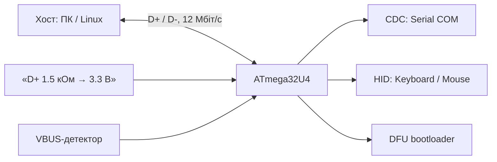

# USB на AVR: CDC і HID на ATmega32U4

![[assets/img/ard-usb-scheme.png|600]]
*Рис. USB на AVR: ATmega32U4 з вбудованим контролером D+/D−, 3.3 В, без зовнішнього UART-чипа.*

> [!tip] Що це за нота
> Глибок розділ: [[04-Shini/01-UART|UART]] - зовнішня шина, а тут - USB 1.5 Мбіт/с прямо в кристалі (ATmega32U4: Leonardo, Pro Micro). У 328P USB немає - там зовнішні CP2102/CH340 (див. [[01-Hardware/02-Nano-Mega|Nano/Mega]]).

USB на кристалі:



*Рис. Один кристал - три USB-класи, без зовнішнього UART-чипа.*

## 1. Чому ATmega32U4, а не 328P

| | ATmega328P (Uno) | ATmega32U4 (Leonardo) |
| --- | --- | --- |
| USB | не має (чіпи CP2102/CH340 на платі) | вбудований, full-speed 12 Мбіт/с |
| Частота | 16 МГц | 16 МГц (USB-PLL з кварця) |
| UART | 1 (HW) + 0 на USB | 1 (HW) + CDC (USB) - Serial = CDC! |
| Оновлення | ISP (AVRDUDE) | DFU через USB + ISP |
| Піни | 14 піни | 20 піни, D+/D− на PCB |

Важливий факт: на Leonardo `Serial` - це CDC по USB, а HW UART вільний (як `Serial1` у ядрі).

## 2. USB на чіпі: що відбувається

- D+/D−: вбудовані Schmitt-входи, D+ підтягнуто 1.5 кОм до 3.3 В (декларація full-speed);
- VBUS: детектор на окремому пін - плати мають резистор на D+/VBUS;
- струм: до SET_CONFIGURATION - 100 мА, після - 500 мА (згідно з конфігураційним дескриптором);
- годинник: PLL з кварця 16 МГц (зовнішнього USB-кварця не треба).

## 3. Класи: що може кристал

| Клас | Що це | Приклад на AVR |
| --- | --- | --- |
| CDC (ACM) | віртуальний COM-порт | Serial (Leonardo) |
| HID | клавіатура/миша/джойстик без драйверів | бібліотека Keyboard/Mouse |
| DFU | оновлення прошивки через USB | bootloader Leonardo |
| Composite | CDC + HID разом | Pro Micro (bootloader) |

## 4. Робочий код: CDC

```cpp
// Leonardo: Serial — це USB CDC (не UART!)
void setup() {
  pinMode(LED_BUILTIN, OUTPUT);
}

void loop() {
  if (Serial) {                    // хост відкрив COM-порт
    digitalWrite(LED_BUILTIN, HIGH);
    while (Serial.available()) {
      int c = Serial.read();
      if (c == 'h') Serial.println("hello, хост!");
    }
    delay(500);
    digitalWrite(LED_BUILTIN, LOW);
  }
}
```

- `if (Serial)` - спрацьовує, коли хост відкрив порт; без цього COM «мовчить».

## 5. Робочий код: HID-клавіатура

```cpp
#include <Keyboard.h>

void setup() {
  Keyboard.begin();
}

void loop() {
  Keyboard.print("hello");
  Keyboard.println();
  Keyboard.releaseAll();   // скидати reports між фразами!
  delay(2000);
}
```

- report: 6-ключове розбирання (6K), модифікатори окремо;
- миша: `Mouse.h` - рух/клік/колесо;
- джойстик: AdvancedHID (свій HID-дескриптор, 8-16 осей).

## 6. Прошивка через USB

- bootloader Leonardo: DFU через USB (boot-секція 4 КБ);
- в IDE: «Arduino Leonardo» → RST тримають 5 с → платі відкидається у DFU;
- Pro Micro (клон 32U4): той же DFU, але 3.3 В логіка і 3.3 В IO - не підключати 5 В датчики!

## 6.1 Дескриптори USB: що бачить хост

| Поле | Leonardo (типово) | Примітка |
| --- | --- | --- |
| bcdUSB | 2.0 | USB 2.0 |
| idVendor | 0x2341 | Arduino |
| idProduct | 0x0043 | Leonardo (CDC) |
| bDeviceClass | 0x02 (Communications) | CDC-first |
| bMaxPacketSize0 | 64 | EP0 |
| bcdDevice | 2.0 | версія дескриптора |
| макс. струм | 500 (до config - 100 мА) | у mA |

Читати дескриптор: `lsusb -v -d 2341:0043` (Linux) або `ioreg -p IOUSB -l` (macOS).

Додатково:

- плати без bootloader: завантаження по SPI (DUDE) або DFU-інструменти;
- COM-номер на Linux: /dev/ttyACM0 (CDC), не /dev/ttyUSB0 (як у CH340).

## 7. Типові помилки

| Симптом | Причина | Лікування |
| --- | --- | --- |
| Linux не бачить COM | права / udev | udev-правило для 0x2341, група dialout |
| «Клавіатура дублює» натискання | report не скинутий після надсилання | Keyboard.releaseAll() між фразами |
| Плата бачиться, але COM мовчить | хост не відкрив порт / CDC не запущений | перевірити `if (Serial)`, відкрити порт перед кодом |
| USB «відпадає» під навантаженням | ліміт 100 мА до configuration | descriptor 500 мА, зовнішнє живлення |
| Кабель «заряджає, але не комунікує» | зарядний кабель без D+/D− | повноцінний кабель, перевірити щілину |
| Pro Micro вмирає від 5 В датчика | логіка 3.3 В, не 5V-tolerant | рівнеузгодження, живлення 3.3 В модуля |

## 8. Суміжні ноти

- [[09-Proshivka/01-IDE-CLI|IDE/CLI]] - обирати board Leonardo/Pro Micro.
- [[09-Proshivka/02-Bootloader-AVRDUDE|Bootloader]] - AVRDUDE проти DFU.
- [[04-Shini/01-UART|UART]] - CP2102/CH340 на Uno.
- [[01-Hardware/02-Nano-Mega|Nano/Mega]] - плати з зовнішнім USB-UART.

## Офіційні джерела

- [ATmega32U4 (Wikipedia, огляд чіпа)](https://en.wikipedia.org/wiki/ATmega32U4) - USB-контролер, pinout.
- [Arduino Leonardo Guide](https://www.arduino.cc/en/Guide/Leonardo) - CDC, DFU, pinout.
- [Pro Micro (Playground Arduino)](https://playground.arduino.cc/Hardware/ProMicro) - 3.3 В, розпіновка.
- [Language Reference (Arduino docs)](https://docs.arduino.cc/language-reference/) - Serial, HID-бібліотеки.
