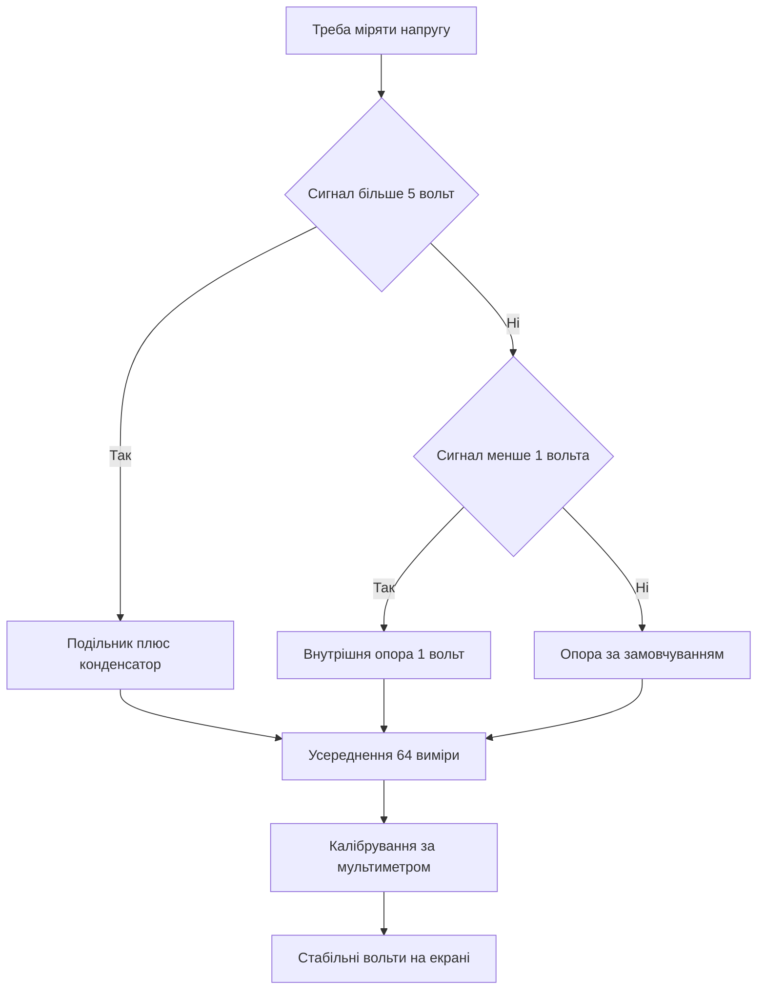

# АЦП Arduino - 10 біт виміру

![[assets/img/arduino-adc-scheme.png|600]]
*Рис. АЦП: вхід, опора, шкала і фільтр виміру.*

> [!tip] Призначення ноти
> Навчити точно міряти напругу: вибрати опору, перерахувати коди у вольти, прибрати шум усередненням і безпечно подати високу напругу через подільник.

## 1. Призначення

Аналоговий вхід перетворює напругу на число від нуля до тисячі двадцяти трьох.

Таке перетворення потрібне для датчиків температури, освітлення, струму і положення.

Класичний контролер має шість таких входів, позначених літерою А з номером.

Вимір відбувається відносно опорної напруги, а не абсолютного еталона у вакуумі.

Тому точність виміру дорівнює стабільності опори і чистоти живлення.

Ця нота закриває повний цикл: шкала, опора, формула, усереднення, подільник, швидкість і шум.

Розуміння цих тем знімає девʼяносто відсотків питань про стрибки показань.

Плата з пʼятивольтовою логікою за замовчуванням міряє діапазон від нуля до пʼяти вольт.

Крок одного коду становить близько пʼяти мілівольт.

Цього кроку вистачає для побутових датчиків, подільників і простих регуляторів.

Для точних задач вмикають внутрішню опору або зовнішнє джерело еталона.

Огляд плати дивись у ноті [[01-Hardware/01-AVR-Uno|класичний AVR]].

## 2. Як працює виклик виміру

| Елемент | Значення | Практичний сенс |
| --- | --- | --- |
| Функція | analogRead | Запускає перетворення і повертає код |
| Шкала кодів | від 0 до 1023 | Десять біт дають 1024 рівні |
| Нуль шкали | 0 вольт на вході | Земля дає нульовий код |
| Верх шкали | опора на вході | Напруга опори дає 1023 |
| Крок при опорі 5 вольт | близько 4,9 мілівольт | Дрібні зміни сигналу видно |
| Час одного виміру | близько 100 мікросекунд | До десяти тисяч вимірів за секунду |
| Входи | від А0 до А5 | Шість каналів з мультиплексором |
| Внутрішній опір джерела | бажано до 10 кілоом | Слабкі подільники дають похибку |

Вимір починається зверненням до потрібного каналу за номером.

Мультиплексор підключає вибраний вхід до єдиного перетворювача.

Перетворювач послідовного наближення порівнює вхід з частками опори.

Результат повертається цілим числом у діапазоні шкали.

Після зміни каналу перший вимір інколи викидають, бо конденсатор вибірки ще тримає старий рівень.

Для стабільного читання роблять паузу у кілька мікросекунд між каналами.

Вхід не можна годувати напругою вище опори або нижче землі.

Захисні діоди всередині кристала рятують лише від коротких сплесків.

## 3. Опорна напруга: три режими

| Режим | Виклик | Напруга верху | Коли брати |
| --- | --- | --- | --- |
| DEFAULT | analogReference(DEFAULT) | Живлення плати 5 вольт | Датчики з живленням від плати |
| INTERNAL | analogReference(INTERNAL) | Внутрішня 1,1 вольт | Малі сигнали до одного вольта |
| EXTERNAL | analogReference(EXTERNAL) | Напруга на піні AREF | Точний зовнішній еталон |

Режим за замовчуванням зручний для резистивних датчиків, що живляться від тієї самої шини.

Тоді коливання живлення однаково впливають на датчик і на опору, похибка частково скорочується.

Внутрішня опора 1,1 вольт дає дрібний крок близько одного мілівольта.

Такий режим підходить для термопар через підсилювач, шунтів струму і слабких мостів.

Зовнішня опора дозволяє подати прецизійні 2,5 або 4,096 вольт на пін AREF.

Перед вмиканням зовнішньої опори виклик роблять до першого виміру.

Заборонено подавати на AREF напругу вище живлення плати.

Після зміни опори перші кілька вимірів пропускають для усталення вузла.

Вибір опори записують коментарем на початку скетчу, щоб не здогадуватись потім.

```text
Опора і шкала наочно:

  DEFAULT:  0 вольт ............ 0
            2,5 вольт .......... 511
            5 вольт ............ 1023

  INTERNAL: 0 вольт ............ 0
            0,55 вольт ......... 511
            1,1 вольт .......... 1023

  EXTERNAL: верх задає напруга на AREF
            код = вхід / AREF * 1023
```

Схема показує лінійну залежність коду від вхідної напруги.

Зміна опори міняє лише масштаб, а кількість кодів лишається сталою.

Тому малий сигнал вигідніше міряти малою опорою.

Великий сигнал спочатку ділять подільником, а потім міряють.

## 4. Формула напруги і перший скетч

| Величина | Формула | Пояснення |
| --- | --- | --- |
| Код | raw від 0 до 1023 | Сире читання з входу |
| Опора | Vref у вольтах | 5 або 1,1 або зовнішня |
| Напруга | raw / 1023 * Vref | Лінійний перерахунок |
| Крок | Vref / 1024 | Роздільна здатність шкали |
| Струм подільника | V / (R1 + R2) | Має бути у міліамперах |

Формула працює лише з дійсною опорою, а не з написом на платі.

Живлення від USB гуляє від 4,7 до 5,2 вольт, тому верх шкали теж гуляє.

Для побутової індикації така похибка непомітна.

Для вольтметра калібрують коефіцієнт за мультиметром.

Калібрування зводиться до одного множника у коді.

```cpp
const int SENSOR_PIN = A0;

void setup() {
  Serial.begin(9600);
  analogReference(DEFAULT);
}

void loop() {
  int raw = analogRead(SENSOR_PIN);
  float voltage = raw * 5.0 / 1024.0;  // 1024 кроки, не 1023!
  Serial.print(raw);
  Serial.print(" -> ");
  Serial.print(voltage, 3);
  Serial.println(" V");
  delay(500);
}
```

Скетч читає вхід А0 двічі за секунду і друкує код з напругою.

Множник 5,0 відповідає живленню плати у режимі за замовчуванням.

Якщо плата живиться від просадженого USB, показання завищують реальність.

Тоді множник підганяють за мультиметром, наприклад 4,85 замість 5,0.

Друк з трьома знаками після коми показує реальну роздільну здатність.

Затримка пів секунди робить монітор читабельним.

Для внутрішньої опори множник міняють на 1,1.

## 5. Усереднення: 64 виміри проти шуму

| Підхід | Кількість вимірів | Що дає |
| --- | --- | --- |
| Один вимір | 1 | Швидко, але стрибає на кілька кодів |
| Мала пачка | 8 | Згладжує випадкові сплески |
| Стандартна пачка | 64 | Стабільні показання для індикатора |
| Довга пачка | 256 | Повільна, але дуже чиста лінія |

Одиничний вимір ловить шум живлення, наведення і квантування.

Усереднення пачки вимірів ділить випадковий шум приблизно як корінь з кількості.

Шістдесят чотири виміри зменшують шум у вісім разів.

Ціна методу становить близько шести мілісекунд часу.

Для термометра і вольтметра така затримка непомітна.

Для швидких сигналів беруть меншу пачку або ковзне середнє.

```cpp
float readAverage(int pin) {
  long sum = 0;
  for (int i = 0; i < 64; i++) {
    sum += analogRead(pin);
  }
  float raw = sum / 64.0;
  return raw * 5.0 / 1023.0;
}

void setup() {
  Serial.begin(9600);
}

void loop() {
  float v = readAverage(A0);
  Serial.println(v, 3);
  delay(200);
}
```

Функція збирає шістдесят чотири коди і повертає готову напругу.

Змінна суми має тип long, бо шістдесят чотири рази по тисячі не влізуть у малий тип.

Ділення з крапкою зберігає дробову частину.

Виклик у циклі дає чисті показання без тремтіння останнього знака.

Пауза двісті мілісекунд розвантажує монітор порту.

За потреби пачку зменшують до восьми для швидшої реакції.

Медіанний фільтр з трьох читань додатково ріже поодинокі викиди.

## 6. Подільник для високої напруги

| Задача | Подільник | Верх виміру |
| --- | --- | --- |
| Батарея 12 вольт | 30 кілоом і 10 кілоом | 12 вольт дають 3 вольти на вході |
| Акумулятор 8,4 вольт | 20 кілоом і 10 кілоом | Повний заряд дає 2,8 вольт |
| Живлення 24 вольт | 100 кілоом і 10 кілоом | Робоча точка дає 2,18 вольт |
| Мережевий датчик | Тільки через модуль | Гальванічна розвʼязка обовʼязкова |

Вхід не витримує напруги вище живлення плати.

Тому батарею ділять двома резисторами до безпечного рівня.

Коефіцієнт подільника рахують як R2 поділити на суму R1 плюс R2.

Напругу батареї відновлюють множенням виміряної на обернений коефіцієнт.

Опір подільника вибирають компромісом між струмом і точністю.

Занадто великі номінали дають похибку через струм витоку входу.

Занадто малі номінали садять батарею власним струмом.

```text
Подільник для батареї 12 вольт:

  батарея 12V ---- [R1 30k] ----+---- [R2 10k] ---- земля
                                |
                               вхід А0 (0-3 вольти)

  Коефіцієнт: 10 / (30 + 10) = 0,25
  Батарея = вимір * 4
  Струм подільника: 12 / 40000 = 0,3 міліампер
```

Схема показує класичний подільник на чотири.

Потужність на резисторах мізерна, корпуси чверть вата годяться.

Паралельно нижньому резистору ставлять конденсатор 100 нанофарад.

Конденсатор ріже високочастотний шум і дає заряд конденсатору вибірки.

Точні резистори з допуском один відсоток зменшують похибку масштабу.

Після монтажу шкалу калібрують за мультиметром одним множником.

## 7. Швидкість, шум і фільтр

| Джерело шуму | Симптом | Ліки |
| --- | --- | --- |
| Шум живлення USB | Коди гуляють на 5-10 одиниць | Усереднення і конденсатор на вході |
| Наведення від дротів | Пилка з періодом мережі | Вита пара, короткі дроти, екран |
| Високий опір джерела | Занижені і плаваючі коди | Повторювач або менші номінали |
| Швидке перемикання каналів | Хвіст попереднього каналу | Викинути перший вимір після зміни |
| Цифрові сплески | Викиди під час обміну по шинах | Міряти між пакетами, окремий провід землі |

Перетворення триває близько ста мікросекунд разом з вибіркою.

Теоретична стеля становить близько десяти тисяч вимірів за секунду.

Реальна швидкість нижча через друк, затримки і перемикання каналів.

Для звукових частот такий перетворювач не годиться.

Для температури, світла, вологості і батареї швидкості вистачає з запасом.

Аналогову землю ведуть окремим дротом до плати.

Довгі сигнальні лінії крутять витою парою з землею.

Конденсатор 10-100 нанофарад біля входу прибирає голки.

## Mermaid: шлях точного виміру



Схема читається згори вниз: спочатку масштаб, потім опора, потім фільтр.

Подільник захищає вхід від високої напруги.

Мала опора збільшує роздільну здатність слабкого сигналу.

Усереднення прибирає випадковий шум.

Калібрування прибирає систематичну похибку.

## Типові помилки

| # | Помилка | Чому погано | Як правильно |
| --- | --- | --- | --- |
| 1 | Напруга вище 5 вольт прямо на вхід | Пробій захисних діодів і смерть каналу | Подільник з коефіцієнтом під задачу |
| 2 | Опора за замовчуванням для мілівольт | Крок 5 мілівольт ховає сигнал | Внутрішня опора 1,1 вольт або підсилювач |
| 3 | Один вимір без усереднення | Показання стрибають на кілька кодів | Пачка 64 виміри або ковзне середнє |
| 4 | Зовнішня опора без виклику EXTERNAL | Шкала привʼязана до живлення, еталон ігнорується | Викликати analogReference до першого читання |
| 5 | Подільник на мегаомах без конденсатора | Конденсатор вибірки не встигає зарядитись | Номінали до 10 кілоом або конденсатор 100 нанофарад |
| 6 | Живлення від USB як точні 5 вольт | Шина гуляє, формула бреше на десяті вольта | Калібрувати множник за мультиметром |

## Офіційні джерела

- [Функція analogRead на docs.arduino.cc](https://docs.arduino.cc/language-reference/en/functions/analog-io/analogread/) - шкала, час виміру і приклад перерахунку.
- [Функція analogReference на arduino.cc](https://www.arduino.cc/reference/en/language/functions/analog-io/analogreference/) - режими опори і застереження про AREF.
- [Аналогові піни на docs.arduino.cc](https://docs.arduino.cc/learn/microcontrollers/analog-input/) - входи, роздільна здатність і поради щодо шуму.

## Див. також

- [[Home]]
- [[01-Hardware/01-AVR-Uno|класичний AVR]]
- [[06-Analog/02-DAC-nema|заміна ЦАП]]
- [[07-Timeri-Son/01-Timeri-millis|таймери і час]]
