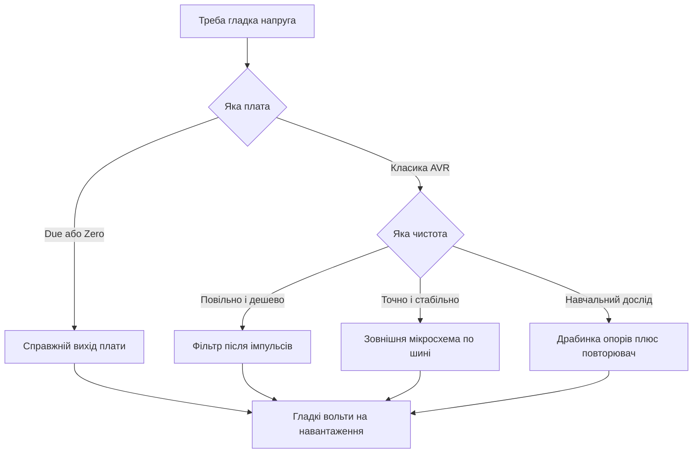

# ЦАП в Arduino - його немає і обходи

![[assets/img/arduino-dac-nema-scheme.png|600]]
*Рис. Обходи без ЦАП: фільтр, зовнішня мікросхема і справжні виходи.*

> [!tip] Призначення ноти
> Пояснити шок новачка: у класики немає перетворювача назад, зате є чотири робочі обходи від простого фільтра до точної мікросхеми.

## 1. Призначення

Цифроаналоговий перетворювач видає гладку напругу за кодом програми.

Такий вихід потрібен для звуку, керування живленням, зміщення датчиків і плавних регуляторів.

Класичний восьмибітний контролер такого вузла не має взагалі.

Функція з назвою analogWrite насправді видає імпульси, а не чисту напругу.

Тому гладку напругу будують обхідними шляхами.

Ця нота закриває всі обходи: фільтр після імпульсів, зовнішня мікросхема, справжні виходи старших плат і саморобна драбинка.

Вибір шляху залежить від потрібної чистоти, швидкості і бюджету.

Для світлодіодів вистачає імпульсів без жодного фільтра.

Для керування схемою потрібен вже гладкий рівень.

Огляд імпульсного режиму дивись у ноті [[03-GPIO/02-PWM-analogWrite|широтно-імпульсна модуляція]].

## 2. Чому в класиці порожньо

| Плата | ЦАП на борту | Що робити |
| --- | --- | --- |
| Uno на AVR | Немає взагалі | Фільтр або зовнішня мікросхема |
| Nano на AVR | Немає взагалі | Ті ж обходи, що й у старшої |
| Mega на AVR | Немає взагалі | Більше пінів, але без перетворювача |
| Due на ARM | Два справжні виходи | Писати код прямо у перетворювач |
| Zero на ARM | Один вихід на десять біт | Вистачає для звуку і регуляторів |
| Uno R4 | Один вихід на платі | Спрощує прості аналогові задачі |

Восьмибітне ядро проектували як цифрову логіку з аналоговим входом.

Кремнієва площа пішла на памʼять, таймери і послідовні блоки.

Аналоговий вихід тоді вважали розкішшю для окремої мікросхеми.

Тому функцію назвали analogWrite, хоча всередині працює таймер з імпульсами.

Маркетингова назва заплутує новачків уже десять років.

Імпульси добре гріють нитку лампи і крутять мотор, бо інерція згладжує.

Але операційний підсилювач і вимірювальний ланцюг бачать кожну голку.

Для таких навантажень ставлять згладжувальний фільтр або справжній перетворювач.

Вимір вхідної напруги дивись у ноті [[06-Analog/01-ADC|вимір напруги]].

## 3. Імпульси плюс фільтр: гладка напруга за копійки

| Елемент | Значення | Пояснення |
| --- | --- | --- |
| Несуча частота | близько 490 герц | Стандартні виходи класики |
| Підвищена частота | близько 980 герц | Пара виходів працює швидше |
| Резистор фільтра | 4,7 кілоом | Обмежує струм заряду конденсатора |
| Конденсатор фільтра | 10 мікрофарад | Накопичує середнє значення |
| Частота зрізу | близько 3,4 герц | Рахується за формулою нижче |
| Пульсації | одиниці мілівольт | Падають з ростом конденсатора |
| Час усталення | близько 100 мілісекунд | Плата за чистоту сигналу |

Ідея проста: імпульси з потрібною шпаруватістю дають потрібне середнє.

Конденсатор не встигає розрядитись між імпульсами і тримає рівень.

Резистор обмежує кидки струму і задає разом з конденсатором інерцію.

Формула зрізу має вигляд один поділити на два пі ер це.

Підстановка дає один поділити на шість цілих двадцять вісім сотих помножити на 4700 помножити на 0,00001.

Результат становить близько трьох герц, що у сто разів нижче несучої.

Тому пульсації тонуть, а повільна команда проходить майже без втрат.

```text
Фільтр нижніх частот після виходу D9:

  вихід D9 ---- [R 4,7k] ----+---- гладенько 0-5 вольт
                             |
                            [C] 10 мкФ
                             |
                            земля

  Зріз: f = 1 / (2 * Пі * R * C) = близько 3,4 герц
  Код 0 дає 0 вольт, код 128 дає 2,5 вольт, код 255 дає 5 вольт.
  Більший конденсатор чистіше, але повільніше реагує.
```

Схема складається з двох деталей і паяється за хвилину.

Навантаження підключають лише через повторювач на операційному підсилювачі.

Без повторювача вхідний опір навантаження зсуває масштаб.

Електролітичний конденсатор ставлять з правильною полярністю.

Плівковий конденсатор краще тримає точність, але коштує дорожче.

```cpp
const int DAC_PIN = 9;

void setup() {
  pinMode(DAC_PIN, OUTPUT);
}

void loop() {
  for (int code = 0; code < 256; code++) {
    analogWrite(DAC_PIN, code);
    delay(20);
  }
  for (int code = 255; code >= 0; code--) {
    analogWrite(DAC_PIN, code);
    delay(20);
  }
}
```

Скетч повільно піднімає і опускає шпаруватість імпульсів.

Після фільтра напруга плавно ходить від нуля до пʼяти вольт.

Період пилки становить близько десяти секунд, пульсацій не видно оком.

Затримка двадцять мілісекунд дає фільтру час усталитись.

Такий сигнал годиться для зміщення, яскравості через підсилювач і повільних регуляторів.

Для звуку несуча 490 герц занизька, чутно свист.

## 4. Зовнішня мікросхема по шині: точні вольти

| Мікросхема | Розрядність | Живлення | Особливість |
| --- | --- | --- | --- |
| MCP4725 | 12 біт | 2,7-5,5 вольт | Один канал, адресна пін |
| MCP4728 | 12 біт | 2,7-5,5 вольт | Чотири канали в одному корпусі |
| PCF8591 | 8 біт | 2,5-6 вольт | Вхід і вихід разом |
| PT8211 | 16 біт | 5 вольт | Стерео для звукових задач |

Зовнішній перетворювач спілкується з платою двома дротами шини.

Дванадцять біт дають 4096 рівнів замість 256 у фільтра.

Крок при живленні пʼять вольт становить близько 1,2 мілівольта.

Мікросхема тримає вихід самостійно, процесор вільний для інших задач.

Адреса на шині дозволяє повісити поруч дисплей, годинник і памʼять.

Модуль з готовим стабілізатором підключають до живлення плати.

Сигнальні лінії шини підтягують до живлення резисторами.

```cpp
#include <Wire.h>

const byte DAC_ADDR = 0x60;

void dacWrite(int code) {
  Wire.beginTransmission(DAC_ADDR);
  Wire.write(0x40);
  Wire.write(code >> 4);
  Wire.write((code & 0x0F) << 4);
  Wire.endTransmission();
}

void setup() {
  Wire.begin();
}

void loop() {
  for (int code = 0; code < 4096; code += 16) {
    dacWrite(code);
    delay(5);
  }
}
```

Функція запису кладе дванадцять біт у три байти протоколу.

Перший байт команди вмикає швидкий режим запису.

Два наступні байти несуть старший і молодший шматки коду.

Цикл нарощує код кроками по шістнадцять для швидкої пилки.

Затримка пʼять мілісекунд робить наростання видимим на мультиметрі.

Бібліотека шини ховає часові діаграми від користувача.

Перед запуском сканером шини перевіряють адресу модуля.

Живлення модуля шунтують керамікою біля пінів.

## 5. Старші плати зі справжнім виходом

| Плата | Виходи | Розрядність | Діапазон |
| --- | --- | --- | --- |
| Due | DAC0 і DAC1 | 12 біт | від 0,55 до 2,75 вольт |
| Zero | один вихід | 10 біт | від нуля до живлення |
| Uno R4 | один вихід | 12 біт | за описом плати |

Плата Due несе два справжні перетворювачі з буферами.

Діапазон обмежений внутрішньою схемою, а не повною шкалою живлення.

Роздільна здатність 4096 рівнів дає гладкі синусоїди без сходинок.

Код пишеться одним викликом запису після налаштування розрядності.

```cpp
void setup() {
  analogWriteResolution(12);
}

void loop() {
  for (int code = 0; code < 4096; code += 8) {
    analogWrite(DAC0, code);
    delayMicroseconds(50);
  }
}
```

Налаштування розрядності задає повну шкалу 4096 рівнів.

Цикл будує пилку з кроком вісім для швидкого огляду осцилографом.

Пауза пʼятдесят мікросекунд дає частоту пилки близько десятків герц.

Вихід Due не можна навантажувати низькоомним динаміком безпосередньо.

Струм виходу обмежений одиницями міліампер.

Для потужного звуку ставлять підсилювач або повторювач.

Піни справжніх виходів підписані на шовкографії плати.

## 6. Драбинка опорів: огляд для розуміння

| Вузол | Склад | Сенс |
| --- | --- | --- |
| Сходинка | Два номінали R і 2R | Кожен розряд важить удвічі менше |
| Ключі | Цифрові виходи | Підключають сходинки до живлення або землі |
| Вихід | Сума струмів | Код перетворюється на напругу |
| Точність | Допуск резисторів | Один відсоток дає вісім чистих біт |

Драбинка з резисторів двох номіналів складає струми розрядів у спільну точку.

Старший розряд важить половину шкали, наступний чверть, далі восьму частину.

Вісім виходів дають 256 рівнів без жодної мікросхеми.

Точність впирається в допуск резисторів і опір ключів.

Звичайні пʼятивідсоткові резистори дають лише шість чесних біт.

Прецизійні одновідсоткові дотягують до восьми біт для лабораторних дослідів.

```text
Ідея драбинки на вісім розрядів:

  D7 ---[2R]--+
  D6 ---[2R]--+-- ... --+--> вихід на повторювач
  ...         |         |
  D0 ---[2R]--+--[R]----+

  Код 10000000 дає половину живлення.
  Код 11111111 дає майже повне живлення.
  Повторювач ізолює драбинку від навантаження.
```

Схема показує принцип без точних номіналів.

За резистори беруть 10 кілоом і 20 кілоом з однієї партії.

Виходи перемикають разом прямим записом у порт для чистоти.

Навантаження беруть з виходу повторювача, а не з вузла сумування.

Метод годиться як навчальний, для виробу беруть готову мікросхему.

Дрейф температури розводить номінали і псує молодші біти.

## Mermaid: вибір обходу



Схема читається згори: спочатку плата, потім вимоги.

Справжній вихід найпростіший, якщо плата його має.

Фільтр коштує копійки і працює для повільних задач.

Мікросхема дає точність і звільняє процесор.

Драбинка вчить принципу, але програє точністю.

## Типові помилки

| # | Помилка | Чому погано | Як правильно |
| --- | --- | --- | --- |
| 1 | Чекати чисту напругу прямо з analogWrite | На виході імпульси, схема дзвенить | Ставити фільтр або зовнішню мікросхему |
| 2 | Фільтр з великим зрізом під звук | Несуча 490 герц проходить у динамік | Підняти несучу таймером або взяти мікросхему |
| 3 | Навантаження прямо на фільтр | Вхідний опір ділить напругу і валить масштаб | Повторювач на операційному підсилювачі між фільтром і навантаженням |
| 4 | Модуль мікросхеми без скану шини | Невірна адреса дає тишу без діагностики | Спочатку сканер шини, потім робочий код |
| 5 | Динамік прямо на вихід Due | Струм виходу мізерний, канал гріється | Підсилювач звуку після виходу |
| 6 | Драбинка з різномастих резисторів | Розкид номіналів кривить шкалу | Резистори один відсоток з однієї партії плюс повторювач |

## Офіційні джерела

- [Функція analogWrite на docs.arduino.cc](https://docs.arduino.cc/language-reference/en/functions/analog-io/analogwrite/) - природа імпульсів, частота і розрядність.
- [Вихід ЦАП на платі Due на arduino.cc](https://www.arduino.cc/en/Guide/ArduinoDue) - справжні канали, діапазон і приклад запису.
- [Модуль MCP4725 на docs.arduino.cc](https://docs.arduino.cc/hardware/mcp4725/) - підключення по шині і приклад коду.

## Див. також

- [[Home]]
- [[06-Analog/01-ADC|вимір напруги]]
- [[03-GPIO/02-PWM-analogWrite|широтно-імпульсна модуляція]]
- [[07-Timeri-Son/01-Timeri-millis|таймери і час]]
