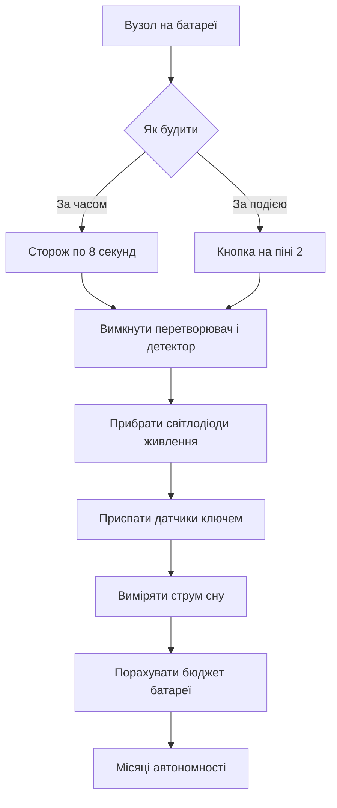

# Сон і WDT - батарея на місяці

![[assets/img/arduino-son-wdt-scheme.png|600]]
*Рис. Сон: наглядовий таймер, вимкнені блоки і бюджет батареї.*

> [!tip] Призначення ноти
> Навчити спати по вісім секунд і прокидатись у справі: різати струм у тисячу разів, будити плату таймером і кнопкою, рахувати місяці від батареї.

## 1. Призначення

Автономний вузол живе від батареї, а не від розетки.

Активний контролер їсть десятки міліампер навіть у простої.

Сон вимикає ядро і периферію, лишаючи лише сторожа.

Сторожовий таймер будить плату кожні кілька секунд.

Плата робить вимір, відправляє пакет і знову засинає.

Ця нота закриває повний цикл: сторож, режими сну, бібліотека економії, пробудження, вимкнення блоків і бюджет батареї.

Після неї вузол живе місяці замість годин.

Класична плата має лінійний стабілізатор і світлодіоди, що їдять навіть у сні.

Тому реальний мінімум плати вищий за мінімум голого чипа.

Голий чип спить на частках мікроампера, плата на сотнях мікроампер.

Для рекордних строків знімають світлодіоди і міняють стабілізатор.

Огляд плати дивись у ноті [[01-Hardware/01-AVR-Uno|класичний AVR]].

## 2. Сторожовий таймер: максимум 8 секунд

| Параметр | Значення | Пояснення |
| --- | --- | --- |
| Призначення | Перезапуск при зависанні | Окремий генератор 128 кілогерц |
| Періоди | від 15 мілісекунд до 8 секунд | Вибирається дільником |
| Максимум одного сну | 8 секунд | Довші паузи складають з циклів |
| Точність | плюс мінус десять відсотків | Залежить від температури |
| Споживання сторожа | близько 6 мікроампер | Додається до струму сну |
| Пробудження | переривання або скидання | Бібліотека ховає деталі |

Сторож крутиться від власного генератора і не залежить від кварцу.

Тому він добудиться навіть коли основний генератор зупинено.

Період 8 секунд беруть для найдовшого сну за один крок.

Довшу паузу на хвилини складають циклом з кількох снів.

Неточність генератора не критична для термометра і вологості.

Для точного часу ставлять годинник реального часу з будильником.

Переривання сторожа будить плату без перезапуску програми.

Скидання сторожа перезапускає плату з початку.

Бібліотека економії налаштовує потрібний режим однією командою.

```text
Періоди сторожа і кількість кроків:

  15 мс, 30 мс, 60 мс, 120 мс, 250 мс
  500 мс, 1 с, 2 с, 4 с, 8 с (максимум)

  Хвилина сну = сім разів по 8 с плюс один раз 4 с.
  Година сну = 450 циклів по 8 с.
  Лічильник циклів тримають у змінній.
```

Схема показує дискретний ряд періодів.

Дрібні періоди годяться для налагодження без довгого чекання.

Робочий режим використовує 8 секунд для мінімуму пробуджень.

Кожне пробудження їсть енергію, тому будити часто невигідно.

Лічильник циклів дозволяє спати годинами шматками по вісім секунд.

Змінну лічильника не обнуляють до кінця великої паузи.

## 3. Режими сну: від дрімоти до анабіозу

| Режим | Що зупиняється | Струм чипа | Пробудження |
| --- | --- | --- | --- |
| IDLE | лише ядро | близько 15 міліампер | будь-яке переривання |
| ADC_NOISE_REDUCTION | ядро і шум | близько 10 міліампер | перетворювач і переривання |
| POWER_SAVE | ядро і більшість тактів | сотні мікроампер | таймер і зовнішні події |
| STANDBY | майже все, швидкий старт | десятки мікроампер | зовнішні події |
| PWR_DOWN | майже все | частки мікроампера | сторож або зовнішня подія |

Найглибший режим зупиняє генератори і лишає лише асинхронні джерела.

Пробудження з глибокого сну триває кілька мілісекунд.

Програма продовжується з місця засинання, змінні зберігаються.

Регістри периферії зберігають налаштування.

Першим після сну перевіряють причину пробудження.

Для батарейного вузла беруть саме найглибший режим.

Проміжні режими годяться для мережевого живлення з швидкою реакцією.

Різниця струму між крайніми режимами сягає ста тисяч разів.

```cpp
#include <avr/sleep.h>
#include <avr/wdt.h>

void goSleep() {
  set_sleep_mode(SLEEP_MODE_PWR_DOWN);
  sleep_enable();
  sleep_mode();
  sleep_disable();
}

void setup() {
  Serial.begin(9600);
}

void loop() {
  Serial.println("work");
  delay(100);
  goSleep();
}
```

Функція засинання вибирає найглибший режим і зупиняє ядро.

Виклик режиму сну блокує до приходу переривання.

Після пробудження сон вимикають для нормальної роботи.

Приклад без сторожа прокинеться лише кнопкою.

Повний приклад зі сторожем дивись у наступному розділі.

Прямі виклики регістрів показують механіку, бібліотека спрощує рутину.

## 4. Бібліотека економії: сон одним викликом

| Виклик | Дія | Період |
| --- | --- | --- |
| powerDown 8 с | Глибокий сон | 8 секунд |
| powerDown 4 с | Глибокий сон | 4 секунди |
| powerDown 1 с | Глибокий сон | 1 секунда |
| idle | Легка дрімота | до переривання |

Бібліотека LowPower ховає регістри сторожа і сну.

Один виклик вимикає зайве, спить і вмикає назад.

Перед сном бібліотека гасить перетворювач і детектор просідання.

Після пробудження периферія повертається сама.

```cpp
#include <LowPower.h>

const int LED_PIN = 13;

void setup() {
  pinMode(LED_PIN, OUTPUT);
}

void loop() {
  digitalWrite(LED_PIN, HIGH);
  delay(50);
  digitalWrite(LED_PIN, LOW);
  for (int i = 0; i < 7; i++) {
    LowPower.powerDown(SLEEP_8S, ADC_OFF, BOD_OFF);
  }
  LowPower.powerDown(SLEEP_4S, ADC_OFF, BOD_OFF);
}
```

Скетч блимає раз на хвилину і спить решту часу.

Сім циклів по вісім секунд дають пʼятдесят шість секунд.

Останній цикл на чотири секунди добиває хвилину.

Параметри вимикають перетворювач і детектор на час сну.

Спалах на пʼятдесят мілісекунд видно оком і їсть мало.

Середній струм такого циклу падає у сотні разів.

Вимір напруги батареї дивись у ноті [[06-Analog/01-ADC|вимір напруги]].

Годинник мілісекунд описаний у ноті [[07-Timeri-Son/01-Timeri-millis|таймери і час]].

## 5. Пробудження: кнопка або сторож

| Джерело | Пін | Як працює |
| --- | --- | --- |
| Сторож | всередині | Періодично кожні 8 секунд |
| Зовнішнє INT0 | пін D2 | Фронт або рівень будять плату |
| Зовнішнє INT1 | пін D3 | Другий незалежний вхід |
| Зміна піна | багато пінів | Будь-який фронт у групі |
| Послідовний порт | піни D0 D1 | Старт біт будить у легких режимах |

Кнопку вішають між піном переривання і землею.

Внутрішня підтяжка тримає рівень у сні.

Преривання на спаді реагує на натискання.

Дребезг контактів гасять паузою після пробудження.

```cpp
#include <LowPower.h>
#include <avr/sleep.h>

volatile bool woke = false;

void wakeUp() {
  woke = true;
}

void setup() {
  pinMode(2, INPUT_PULLUP);
  attachInterrupt(0, wakeUp, FALLING);
  Serial.begin(9600);
}

void loop() {
  if (woke) {
    woke = false;
    Serial.println("button");
    delay(50);
  }
  LowPower.powerDown(SLEEP_FOREVER, ADC_OFF, BOD_OFF);
}
```

Програма спить безстроково до натискання кнопки.

Переривання ставить прапорець і будить ядро.

Головний цикл бачить прапорець і обробляє подію.

Пауза пʼятдесят мілісекунд гасить дребезг.

Прапорець має тип volatile, бо міняється у перериванні.

Режим безстрокового сну вимикає сторож для нуля споживання.

Деталі переривань описані у ноті [[03-GPIO/03-Pererivannya|переривання плати]].

## 6. Що вимкнути перед сном

| Блок | Як гасити | Економія |
| --- | --- | --- |
| АЦП | ADC_OFF у виклику | сотні мікроампер |
| Детектор просідання | BOD_OFF у виклику | десятки мікроампер |
| Світлодіод живлення | відпаяти або перерізати | близько міліампера |
| Стабілізатор плати | зовнішній імпульсний | міліампери спокою |
| Підтяжки без потреби | відʼєднати датчики | десятки мікроампер кожна |
| Датчики на шинах | транзистор живлення | міліампери сну датчиків |

Перетворювач у простої їсть навіть без вимірів.

Детектор просідання стежить за живленням і теж їсть.

Обидва гасять параметрами виклику сну.

Світлодіод живлення світить завжди, поки є батарея.

На батарейному вузлі його прибирають першим.

Штадний лінійний стабілізатор їсть на себе більше за сплячий чип.

Зовнішній імпульсний модуль з малим спокоєм ріже втрати.

Датчики з власним сном переводять у сон командою.

Датчики без сну живлять через ключ з піна.

```text
Чекліст перед сном:

  [ ] перетворювач вимкнено параметром
  [ ] детектор просідання вимкнено параметром
  [ ] світлодіоди живлення прибрано
  [ ] датчики приспано або знеструмлено ключем
  [ ] вільні входи підтягнуто, не висять
  [ ] виміряно струм сну мультиметром
```

Список проходять перед кожним польовим тестом.

Вільний вхід у повітрі ловить наведення і додає мікроампери.

Підтяжка або вихідний рівень фіксують кожен вільний пін.

Вимір струму підтверджує, що всі пункти спрацювали.

Розбіжність з очікуванням шукають по пунктах зверху вниз.

## 7. Вимір струму і бюджет батареї

| Стан | Струм плати | Струм голого чипа |
| --- | --- | --- |
| Робота | 40-50 міліампер | 10-15 міліампер |
| Сон плати | 300-800 мікроампер | 1-6 мікроампер |
| Сон без світлодіодів | 100-200 мікроампер | ті ж 1-6 мікроампер |
| Пік передачі | до 150 міліампер | залежить від модуля |

Струм міряють розривом плюса батареї мультиметром.

Режим мікроампер вмикають лише після усталення сну.

Щупи тримають коротко, дроти живлення крутять парою.

Пік передачі ловлять осцилографом на шунті.

Середній струм рахують за формулою з вагою часу.

```text
Бюджет вузла: вимір раз на хвилину

  Сон:     0,2 мА протягом 59,8 с
  Робота:  40 мА протягом 0,2 с

  Середній: (0,2 * 59,8 + 40 * 0,2) / 60
          = (11,96 + 8) / 60
          = близько 0,33 мА

  Батарея 2000 мАг / 0,33 мА = 6060 годин
  Це близько 252 діб, тобто вісім місяців.
```

Розрахунок показує вісім місяців від двох ампер годин.

Саморозряд батареї зʼїсть частину запасу.

Холод на вулиці ріже ємність удвічі.

Тому у проект закладають запас у два рази.

Збільшення періоду до пʼяти хвилин подовжує життя до року.

Зменшення часу роботи за рахунок швидкого коду теж помагає.

Радіомодуль з власним сном переводять у сон між пакетами.

## Mermaid: шлях до місяців роботи



Схема читається згори: спочатку причина пробудження, потім вимкнення зайвого.

Сторож дає періодичні виміри без участі людини.

Кнопка дає реакцію на подію з нульовим простоєм.

Вимкнені блоки ріжуть струм у сотні разів.

Вимір струму підтверджує розрахунок.

Бюджет показує реальні місяці життя.

## Типові помилки

| # | Помилка | Чому погано | Як правильно |
| --- | --- | --- | --- |
| 1 | Сон по 8 секунд без лічильника | Плата прокидається щовісім секунд і їсть зайве | Цикл з лічильником на хвилини і години |
| 2 | Перетворювач лишено увімкненим | Сотні мікроампер у сні зʼїдають батарею | Параметр ADC_OFF у кожному виклику сну |
| 3 | Детектор просідання лишено увімкненим | Десятки мікроампер постійно | Параметр BOD_OFF у кожному виклику сну |
| 4 | Світлодіод живлення на батареї | Міліампер постійно, місяці тануть | Відпаяти або перерізати доріжку світлодіода |
| 5 | Датчики живляться у сні | Кожен датчик їсть більше за сплячий чип | Ключ живлення або команда сну датчика |
| 6 | Затримка замість сну | Десятки міліампер у простої | Глибокий сон з пробудженням сторожем або кнопкою |

## Офіційні джерела

- [Бібліотека LowPower на docs.arduino.cc](https://docs.arduino.cc/libraries/low-power/) - режими сну, параметри вимкнення і приклади пробудження.
- [Сторожовий таймер на arduino.cc](https://www.arduino.cc/en/Tutorial/Foundations/WatchdogTimer) - періоди, точність і перезапуск при зависанні.
- [Енергоспоживання Uno на docs.arduino.cc](https://docs.arduino.cc/hardware/uno-rev3/) - струми плати, стабілізатор і межі живлення.

## Див. також

- [[Home]]
- [[01-Hardware/01-AVR-Uno|класичний AVR]]
- [[07-Timeri-Son/01-Timeri-millis|таймери і час]]
- [[06-Analog/01-ADC|вимір напруги]]
