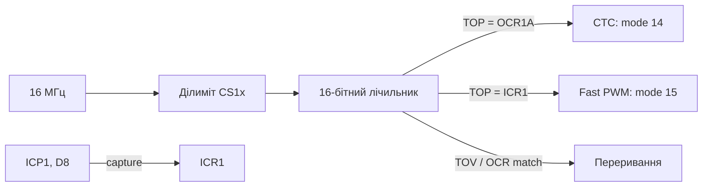

# Таймери ATmega: глибок розбір 16-бітних

![[assets/img/ard-timers16-scheme.png|600]]
*Рис. Таймер1: TCCR1A/B, OCR1A/B, ICR1, ділиміт і переривання.*

> [!tip] Що це за нота
> Глибок розбір після оглядової [[07-Timeri-Son/01-Timeri-millis|Таймери]]: реєстрами, таблицями режимів, і чому `analogWrite` може зламати `millis()`. Платформа - ATmega328P (Uno/Nano). Базовий ШІМ: [[03-GPIO/02-PWM-analogWrite|ШІМ]].

Робочий ланцюг таймера 1:



*Рис. Два корисні режими: CTC (чистий край) і Fast з input capture.*

## 1. Архітектура: три таймери, два з них 16-бітні

| Таймер | Розрядність | Канали (піни Uno) | Призначення в ядрі |
| --- | --- | --- | --- |
| Timer0 | 8 біт | OC0A (D6), OC0B (D5), T0 (D4), T1 (D5) | millis()/micros() + PWM D5/D6 |
| Timer1 | 16 біт | OC1A (D9), OC1B (D10), ICP1 (D8) | Servo() (D9/D10) + 16-бітний PWM D9/D10 |
| Timer2 | 8 біт | OC2A (D11), OC2B (D3) | PWM D3/D11, tone() |

Увага: шість PWM-пінів Uno (D3, D5, D6, D9, D10, D11) - це рівно шість вихідних порівнянь трьох таймерів: D5/D6 - Timer0 (OC0B/OC0A), D9/D10 - Timer1 (OC1A/OC1B), D3/D11 - Timer2 (OC2B/OC2A). Input capture ICP1 - це D8, не D5.

## 2. Режим WGM (Timer1): таблиця, яку треба знайти

| WGM | Назва | Top | Переривання | PWM |
| --- | --- | --- | --- | --- |
| 0 | Normal | overflow | TOV1F | - |
| 12 | Fast PWM | 0xFFFF | OCR1A/OCR1B match, TOV1F | 8-біт |
| 14 | CTC | OCR1A | OCR1A match | 16-біт (OC1B), чистий край |
| 15 | Fast PWM | ICR1 | OCR1A/B, ICR1 match | 16-біт + input capture |

Початковий вибір: mode 14 (CTC, 16-біт PWM, чистий край) або mode 15, якщо потрібен ICP1 одночасно.

## 3. Частоти ШІМ: таблиця на 16 МГц

Mode 14, TOP = OCR1A:

| Ділиміт | 16 МГц → частота (TOP = 4095, 12 біт) |
| --- | --- |
| /1 | 3874 Гц |
| /8 | 484 Гц |
| /64 | 61 Гц |
| /256 | 15 Гц |

Приклад: 100 Гц, TOP = 2499, ділиміт /64 → tick 250 кГц, топ 2500 → 100 Гц (12-бітне розрізнення).

## 4. Робочий код: реєстровий 16-біт PWM

```cpp
// Timer1 mode 14 (CTC): 16-біт PWM на D9 (OC1A), D10 (OC1B)
void setup() {
  TCCR1A = (1 << WGM12);             // CTC, TOP = OCR1A
  TCCR1B = (1 << WGM13) | (1 << CS11); // + ділиміт /8
  OCR1A = 65535;                     // TOP
  DDRB |= (1 << PB1) | (1 << PB2);   // D9 (PB1), D10 (PB2) вивід
}

void loop() {
  static uint16_t duty = 0;
  OCR1B = duty;                      // D10: 16-бітний ШІМ (OC1B)
  duty += 100;
  delay(5);
}
```

Ядро вже дає 16-бітний `analogWrite` на D9/D10 (Timer1); D5/D6 - 8-бітні (Timer0), D3/D11 - Timer2. Але реєстрами: чому, і що ламається, далі.

## 5. Input capture: вимірюємо зовнішній PWM

Mode 15 + ICPD=0, ділиміт /64 - для зовнішніх PWM до ~100 кГц:

```cpp
// вимірювання частоти/заповнення PWM на D8 (ICP1), mode 15
volatile uint16_t per = 0, high = 0, lastHigh = 0;
ISR(TCP1_vect) {
  uint16_t t = ICR1;
  if (TINS & (1 << ICP1)) {            // у момент перехоплення піна HIGH
    if (lastHigh != 0) per = t - lastHigh;
    lastHigh = t;
  } else {                             // піна LOW
    if (lastHigh != 0) high = t - lastHigh;
  }
  TIFR = (1 << OCF1F);                 // чистимо прапорець перехоплення
}
// частота = 16e6/64 / per; заповнення = high / per * 100
```

Логіка меж: рахуємо два типи івентів (вищий / нижчий край), стан піни читається через `TINS`, а не через `PINC` - перехоплення фіксує момент, а не поточний рівень.

## 6. Чому millis() падає: механізм

- millis() = лічильник на overflow-перериванні Timer0;
- `analogWrite(9, x)` / `analogWrite(10, x)` - Timer1 (16-біт), не чіпає Timer0 - безпечно;
- але якщо код сам виставив Timer0 під PWM / дуже високу частоту (реєстри WGM0x, CS0x) - overflow піде частіше / рідше;
- класика: «я зробив PWM на Timer0 з /1 - і millis став швидшим у 8 разів»;
- вихід: Timer0 не чіпати або повернути CS0x = /64 (як у ядрі).

## 7. Практичні рецепти

| Задача | Що робимо |
| --- | --- |
| Серво з 3000 позиціями | Timer1 mode 14, TOP = 3999, /8 → 50 Гц, 12-бітні позиції |
| Лічильник енкодера ×4 | ICP1 quadrature (COMF10/COMF11) → ICNT1 автоматично |
| Зміна частоти PWM на льоту | не міняти ділиміт під PWM (фазовий ривок); TOP змінювати поступово |
| Два незалежних PWM | Timer1 (D5/D6) + Timer2 (D9/D11) - Timer0 залишити ядру |

## 8. Типові помилки

| Симптом | Причина | Лікування |
| --- | --- | --- |
| millis() біжить швидше | PWM на Timer0 з дрібним ділимітром | Timer0 залишаємо ядру або повернути /64 |
| Servo (D9/D10) і мій 16-біт PWM конфліктують | обидва на Timer1 | один контур, або серво на пінах Timer2 |
| OCR1A не «тримає» TOP | WGM13/WGM12 не встановлені правильно | звірити TCCR1A/B із таблицею WGM |
| Input capture не ловить | ICPD=1 (роз'єднано) / занадто швидкий ділиміт | ICPD=0, /64, зовнішній сигнал 3.3 В |
| PWM «зірваний» після sleep | таймер стопнуто в idle-режимі | не виходити в sleep під PWM або перезапускати після |
| PWM на D3/D11 зникло після tone() | tone() захоплює Timer2 (D3/D11) | призначити один таймер на одну задачу |

## 9. Суміжні ноти

- [[07-Timeri-Son/01-Timeri-millis|Таймери]] - millis, заходи за часом.
- [[03-GPIO/02-PWM-analogWrite|ШІМ]] - аналоговий вивід, pin map.
- [[03-GPIO/03-Pererivannya|Переривання]] - attachInterrupt, EXTI.
- [[10-Sensori/08-Encoder|Енкодер]] - квадратура на ICNT1.

## 9.1 Чек-лист, перш ніж чіпати таймери

- перевірити, хто в ядрі користується таймером (analogWrite, Servo, tone);
- Timer0 не чіпати - це millis()/micros();
- перед зміною режиму: TCCR1A = 0; TCCR1B = 0;
- не чіпати D9/D10, якщо на них Servo();
- input capture: ICPD=0, mode 15, ділиміт /64;
- після sleep: заново виставити CS1x.

## Офіційні джерела

- [ATmega328P Datasheet (Microchip, AVR-08851)](https://ww1.microchip.com/aem/cs/AVR-08851) - таймери, режими WGM, регістри.
- [Language Reference (Arduino docs)](https://docs.arduino.cc/language-reference/) - millis, tone, attachInterrupt.
- [Arduino Uno Rev3 pinout (Arduino docs)](https://docs.arduino.cc/hardware/arduino-uno-rev3) - D5/D6/D9/D11, таймер-мапінг.
