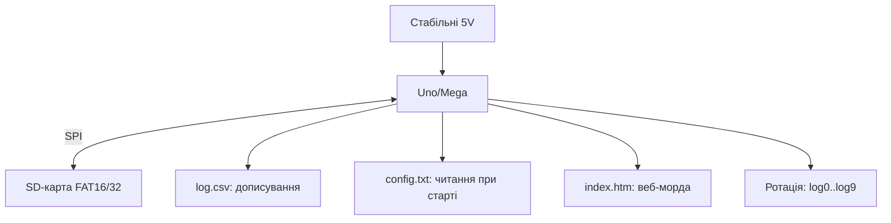

# Arduino SD-карти глибоко - FATFS, логи і веб-сторінки

![[assets/img/ard-sd-fatfs-deep-scheme.png|600]]
*Рис. Картка як диск: логи дописуються, сторінки читаються, живлення не рветься посеред запису.*

> [!tip] Що це за нота
> Глибина SD-теми: не «записати рядок», а логи роками, веб-морда з картки, ротація і живучість. База: [[08-Pamyat/01-Pamyat-EEPROM|пам'ять EEPROM]], [[12-Moduli-zvyazku/06-Ethernet-W5500-Deep|Ethernet-шилд]].

## 1. Мета

Зробити картку надійним диском:

- бібліотека SD: файли, директорії, нюанси 8.3;
- кільцеві логи з ротацією без участі ПК;
- веб-сторінки і конфіги з картки;
- знос: чому карти вмирають і як відтягнути;
- живлення: запис не переживає просадок.

| Операція | Швидкість | Нотатка |
| --- | --- | --- |
| Запис рядка 50 Б | ~5 мс | буферизувати! |
| Читання сторінки 2 КБ | ~10 мс | ок для вебу |
| Відкриття/закриття | ~20 мс | не смикати в циклі |
| Лістинг каталогу | повільно | кешувати |

## 2. Архітектура даних



Файл логу відкриваємо раз при старті, пишемо з `flush()` раз на хвилину, закриваємо перед вимкненням.

## 3. Розпіновка SD-модуля

| Сигнал SD | Пін Uno | Примітка |
| --- | --- | --- |
| MOSI/MISO/SCK | D11/D12/D13 | апаратний SPI |
| CS | D4 (шилд) / D10 (модуль) | вибрати один! |
| VCC | 5V (модуль з LDO) | голі слоти - 3.3V |
| GND | спільна | - |
| CD (детект) | D8 (опційно) | вийняли картку |

Голі microSD-слоти без перетворювача рівнів - тільки 3.3V живлення і логіка! Модулі з LDO/перетворювачем рівнів - 5V ок.

## 4. Імена 8.3 і кодування

- короткі імена: `LOG00001.CSV`, не `температура-січень.csv`;
- кирилиця в іменах - лотерея бібліотеки, уникати;
- один каталог `/logs`, не сотня файлів у корені;
- дата в імені: `240106.csv` (РРММДД);
- конфіг - простий `ключ=значення`, парсер 20 рядків.

## 5. Робочий код (C, Arduino)

```cpp
#include <SPI.h>
#include <SD.h>

File logf;
char fname[] = "/logs/000000.csv";
int fidx = 0;

void next_log() {
  if (logf) logf.close();
  fidx = (fidx + 1) % 10;
  snprintf(fname + 6, 7, "%06d", fidx);
  SD.remove(fname);
  logf = SD.open(fname, FILE_WRITE);
}

void setup() {
  Serial.begin(115200);
  SD.begin(10);
  SD.mkdir("/logs");
  next_log();
  logf.println("ts,temp,hum");
}

void loop() {
  static unsigned long t0 = 0, w0 = 0;
  if (millis() - t0 > 5000) {
    t0 = millis();
    logf.print(millis() / 1000);
    logf.print(',');
    logf.print(analogRead(A0) * 0.488);
    logf.print(',');
    logf.println(analogRead(A1) * 0.488);
  }
  if (millis() - w0 > 60000) {
    w0 = millis();
    logf.flush();
  }
  if (Serial.available() && Serial.read() == 'R') {
    next_log();
  }
}
```

Ротація 10 файлів: команда `R` з монітора починає новий. Старі затираються по колу - картка не переповнюється ніколи.

## 6. Робочий код (MicroPython)

```python
# MicroPython: кільцевий логер на SD по SPI
import time
import machine
import sdcard
import uos

spi = machine.SPI(1, baudrate=4000000,
                  sck=machine.Pin(10),
                  mosi=machine.Pin(11),
                  miso=machine.Pin(12))
sd = sdcard.SDCard(spi, machine.Pin(13))
uos.mount(sd, '/sd')

idx = 0

def next_log():
    global idx
    idx = (idx + 1) % 10
    return open(f'/sd/log{idx:02d}.csv', 'w')

logf = next_log()
logf.write('ts,adc0,adc1\n')

while True:
    a0 = machine.ADC(26).read_u16() >> 6
    a1 = machine.ADC(27).read_u16() >> 6
    logf.write(f'{time.time()},{a0},{a1}\n')
    logf.flush()
    time.sleep(5)
```

Модуль `sdcard` - у прошивках з SD-підтримкою або окремим файлом. Файли короткі, латиниця, без кирилиці в іменах.

## 7. Довговічність картки

- карти Endurance (відеоспостереження) живуть у рази довше;
- запис пачками, не по байту (буфер 512 Б);
- ротація файлів розподіляє знос;
- ніколи не виймати під час запису (LED-індикація!);
- резервна карта з образом поруч.

## 8. Типові помилки

| Симптом | Причина | Лікування |
| --- | --- | --- |
| `init failed` | не той CS / швидкість | CS за модулем, почати з 4 МГц |
| Кирилиця в іменах | кодування FAT | тільки латиниця і цифри |
| Файл нульовий після ребута | немає flush/close | flush щохвилини, close перед сном |
| Карта вмирає за місяць | запис щосекунди без ротації | пачки + ротація + Endurance |
| 5V на голий слот | модуль без перетворювача рівнів | тільки 3.3V або модуль з LDO |
| Гальма на лістингу | сотні файлів у корені | каталоги + ротація |

## 9. Швидка шпаргалка SD

- CS один на шині, не плутати;
- імена 8.3 латиницею;
- flush щохвилини, close перед сном;
- ротація 10 файлів по колу;
- Endurance-карти для логерів.

## 10. Суміжні ноти

- [[08-Pamyat/01-Pamyat-EEPROM|пам'ять EEPROM]] - малі дані без картки.
- [[12-Moduli-zvyazku/06-Ethernet-W5500-Deep|Ethernet-шилд]] - веб з картки.
- [[16-Proekti/04-Loger-SD|логер на SD]] - готовий проєкт.
- [[04-Shini/02-SPI|шина SPI]] - транспорт картки.
- [[Home|головна карта]] - повна навігація.

## Офіційні джерела

- [SD library (arduino-libraries, GitHub)](https://github.com/arduino-libraries/SD) - API файлів, приклади.
- [Ethernet Shield Rev2 (Arduino docs)](https://docs.arduino.cc/hardware/ethernet-shield-rev2/) - SD-слот шилда.
- [Language Reference (Arduino docs)](https://docs.arduino.cc/language-reference/) - SD, SPI, рядки.
