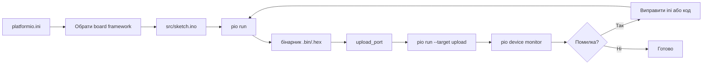

# PlatformIO : збірка і прошивка Arduino

![[assets/img/platformio-flow-scheme.png|600]]
*Рис. Схема збирання через PlatformIO: ini -> ядро -> компілятор -> прошивка.*

> [!tip] Призначення ноти
> Пояснити створення проекту PlatformIO для плати Arduino вибір ядра atmelavr написання platformio.ini і скетчу перевірку збірки та прошивку через CLI без довгих тире в описах.

## 1. Призначення

Ця нота описує роботу з PlatformIO для зборки скетчів Arduino через файл налаштувань та консоль. Після прочитання читач створює папку проекту пише ini з платформою atmelavr додає скетч збирає командою pio run і прошиває pio run --target upload. Підходить для автоматизації і повторюваних збірок.

PlatformIO обирають коли потрібна версифікація бібліотек чітке опис плати та автоматичний цикл перевірки на сервері. Редактор може залишатися будь-яким VS Code з розширенням або CLI в терміналі. Усі дії зводяться до трьох кроків: ini -> src/sketch.ino -> команда.

Звʼязок з іншими нотами: вибір середовища у [[00-Start/05-Vibir-seredovischa|вибір середовища]]; прошивка через avrdude у [[09-Proshivka/02-Bootloader-AVRDUDE|завантажувач і avrdude]]; класична плата у [[01-Hardware/01-AVR-Uno | Uno-класика]].

## 2. Що дає PlatformIO

PlatformIO зберігає проект у папці з файлом platformio.ini в корені і папкою src з кодом. Це відокремлює налаштування від коду і дозволяє повторювати збірку на іншому компʼютері без ручного вибору плати в редакторі. Бібліотеки ставляться з явними версіями і записуються в lib_deps.

Порівняння з класичним IDE показує переваги в керуванні версіями та автоматизації. Таблиця нижче коротко подає різницю.

| Параметр | Arduino IDE | PlatformIO |
| --- | --- | --- |
| Опис плати | Меню графічне | ini параметр board |
| Бібліотеки | Менеджер ручний | lib_deps з версією |
| Збірка | Кнопка | pio run |
| Прошивка | Кнопка | pio run --target upload |
| Монітор | Окреме вікно | pio device monitor |
| Версифікація | Не підтримується | Файл ini зберігає стан |

## 3. Структура проекту

Папка проекту має мінімум три елементи: platformio.ini з описом платформи та плати; папка src з файлом .ino або .cpp; папка lib якщо є локальні бібліотеки. Прошивка не потребує додаткових файлів якщо скетч самодостатній.

```text
my_project/
  platformio.ini
  src/
    main.cpp
  lib/
    MyLib/
```

Код може використовувати розширення .ino або .cpp. При .ino PlatformIO додає прототипи автоматично як класичний редактор. При .cpp треба оголосити функції до використання. Для простоти в ноті беремо .ino з розширеним скетчем.

## 4. Налаштування ini

Файл platformio.ini задає платформу atmelavr плату uno порт автоматичний або явний. Додатково можна вказати швидкість монітора бібліотеки та опції збірки. Приклад мінімального файлу наведено нижче.

```ini
[env:uno]
platform = atmelavr
board = uno
framework = arduino
monitor_speed = 9600
lib_deps =
    blynk/Blynk @ 1.3.1
```

Параметр framework = arduino включає сумісність з Arduino API. Параметр monitor_speed визначає швидкість серійного монітора при pio device monitor. Якщо порт змінний його можна не писати або вказати явним через upload_port.

## 5. Скетч Arduino

Скетч використовує стандартний шаблон setup і loop з виведенням у Serial і керуванням світлодіодом. Код сумісний з класичним Arduino та PlatformIO без змін якщо використано .ino. При .cpp треба додати #include <Arduino.h>.

```cpp
#include <Arduino.h>

const int ledPin = LED_BUILTIN;

void setup() {
    Serial.begin(9600);
    pinMode(ledPin, OUTPUT);
    Serial.println("PlatformIO start");
}

void loop() {
    digitalWrite(ledPin, HIGH);
    delay(500);
    digitalWrite(ledPin, LOW);
    delay(500);
    Serial.println("tick");
}
```

Якщо плата не має вбудованого LED_BUILTIN можна замінити на 13 або інший пін. Монітор порту зʼявляється після прошивки якщо кабель має лінії даних і порт вільний.

## 6. Команди CLI

Основні команді виконуються з папки проекту. Збірка перевіряє код і створює бінарник. Прошивка передає файл у порт. Монітор відкриває серійний канал для читання.

```text
pio run              # зібрати
pio run --target upload  # прошити
pio device monitor   # монітор порту
pio pkg install --library "blynk/Blynk@1.3.1"  # бібліотека
```

При зміні ini або додаванні lib_deps збірка оновлює залежності автоматично. Команда pio run без цілі лише перевіряє компіляцію що зручно для CI. Якщо порт зайнятий монітором прошивка не стартує і виводить помилку доступу.

## 7. Mermaid: маршрут збірки



Маршрут починається з ini і йде через збірку до прошивки. Якщо виникає помилка шлях повертається до джерела: ini для опису плати, src для коду, lib_deps для бібліотек.

## 8. Типові помилки

| # | Помилка | Чому погано | Як правильно |
| --- | --- | --- | --- |
| 1 | board не відповідає плати | Компілятор використовує інший розмір памʼяті і пін мапу | Обрати точну модель з списку atmelavr |
| 2 | framework пропущено | Не підключається Arduino API і функції отсутствують | Додати framework = arduino |
| 3 | lib_deps без версії | На іншому компʼютері інша версія бібліотеки | Вказати @версія в ini |
| 4 | Порт зайнятий монітором | Прошивка не може відкриті порт для запису | Закрити монітор перед upload |
| 5 | src без .ino або .cpp | PlatformIO не знаходить точку входу | Розмістити файл у папці src |
| 6 | upload_port не вказано | Прошивка не знає куди передавати файл | Вказати порт або залишити автоматично |
| 7 | Швидкість монітора невідповідна | У моніторі сміття замість даних | Встановити monitor_speed як у Serial.begin |

Помилка компіляції зазвичай вказує на перший рядок з червоним текстом у виводі pio run. Якщо помилка в бібліотеці перевіряйте lib_deps. Якщо плата мовчить після прошивки перевіряйте кабель з лініями даних.

## 9. Офіційні джерела

- [PlatformIO quickstart](https://docs.platformio.org/en/latest/core/quickstart.html) : створення проекту і перша збірка.
- [PlatformIO installation](https://docs.platformio.org/en/latest/installation.html) : встановлення CLI та розширення.
- [Project configuration](https://docs.platformio.org/en/latest/projectconf/index.html) : опис ini параметрів board framework lib_deps.
- [Library manager](https://docs.platformio.org/en/latest/librarymanager/index.html) : встановлення бібліотек з версіями.
- [Platformio.org/docs](https://docs.platformio.org/en/latest/) : корінь документації з розділами для AVR.

## Див. також

- [[00-Start/05-Vibir-seredovischa|вибір середовища]]
- [[01-Hardware/01-AVR-Uno | Uno-класика]]
- [[01-Hardware/02-Nano-Mega|компакт і ноги]]
- [[09-Proshivka/02-Bootloader-AVRDUDE|завантажувач і avrdude]]
- [[09-Proshivka/01-IDE-CLI.md|IDE і CLI : збірка скетчів]]
