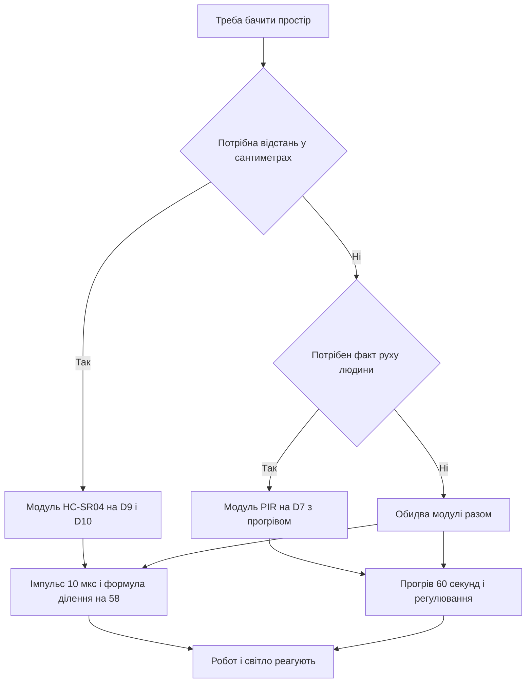

# HC-SR04 і PIR - дистанція і рух

![[assets/img/arduino-hcsr-pir-scheme.png|600]]
*Рис. Схема підключення HC-SR04 і PIR до Arduino з живленням і сигналами.*

> [!tip] Призначення ноти
> Навчити бачити без очей: міряти відстань ультразвуком, ловити рух теплом тіла, обходити сліпу зону і не лякатись хибних спрацьовувань.

## 1. Призначення

Далекомір HC-SR04 міряє відстань до перешкоди звуком.

Сенсор PIR помічає тепловий рух людини у кімнаті.

Перший датчик дає число у сантиметрах.

Другий датчик дає подію рух є або руху немає.

Разом вони закривають робота, двері, сигналізацію і розумне світло.

Ця нота закриває повний цикл: імпульс запуску, вимір луни, формула сантиметрів, прогрів PIR і налаштування чутливості.

Розуміння цих тем знімає більшість питань про нулі і стрибки показань.

Цифрові режими пінів описані у ноті [[03-GPIO/01-Digital-pini|цифрові піни]].

Точний відлік мікросекунд описаний у ноті [[07-Timeri-Son/01-Timeri-millis|таймери і час]].

## 2. Порівняння датчиків

| Параметр | HC-SR04 | PIR |
| --- | --- | --- |
| Що дає | Відстань у сантиметрах | Факт руху людини |
| Принцип | Луна ультразвуку 40 кілогерц | Теплове випромінення тіла |
| Діапазон | Від 2 до 400 сантиметрів | До 7 метрів віялом |
| Кут огляду | Близько 15 градусів | До 110 градусів з лінзою |
| Вихід | Імпульс з тривалістю луни | Високий рівень на час руху |
| Живлення | 5 вольт | 5 вольт |
| Сліпа зона | Перші 2 сантиметри | Перша хвилина після вмикання |
| Коли брати | Робот, паркування, рівень води | Світло, сигналізація, двері |

Таблиця показує різні задачі двох очей.

Далекомір міряє геометрію простору.

Тепловий сенсор стежить за людьми.

Далекомір працює у циклі опитування.

Тепловий сенсор сам піднімає вихід при русі.

Обидва живляться від пяти вольт плати.

Споживання мале, окремий блок не потрібен.

Земля спільна для всіх модулів.

Сигнальні дроти короткі і без петель.

## 3. HC-SR04: запуск і луна

| Контакт | Призначення | Підключення |
| --- | --- | --- |
| VCC | Живлення 5 вольт | До виходу 5V плати |
| GND | Земля | До землі плати |
| Trig | Вхід запуску | До цифрового виходу, наприклад D9 |
| Echo | Вихід луни | До цифрового входу, наприклад D10 через подільник для чутливих плат |

Запуск починають коротким імпульсом на вході Trig.

Тривалість імпульсу становить 10 мікросекунд.

Модуль посилає вісім ультразвукових посилок.

Луна повертається від перешкоди назад.

Вихід Echo тримається високим під час польоту звуку.

Тривалість високого рівня пропорційна відстані.

 плату міряє тривалість функцією виміру імпульсу.

Функція чекає фронт і рахує мікросекунди.

Формула перерахунку ділить час на 58.

Число 58 дає сантиметри для повітря кімнатної температури.

Швидкість звуку злегка пливе з температурою.

Для побутових задач поправку не вводять.

Для точних задач вводять поправку за термометром.

```text
Підключення HC-SR04 до Uno:

   плата Uno             модуль HC-SR04
   ---------             --------------
   5V    --------------- VCC
   GND   --------------- GND
   D9    --------------- Trig
   D10   --------------- Echo

   Датчик дивиться вперед без нахилу.
   Перешкода має стояти перпендикулярно.
   Мякі тканини і нахилені стіни глушать луну.
   Довжина дротів бажано до 2 метрів.
```

Схема показує чотири дроти без зайвих деталей.

Модуль ставлять горизонтально на стійці.

Нахил вгору дає відбиття у стелю.

Нахил вниз дає відбиття від підлоги.

Гладка стіна дає впевнену луну.

Коса стіна відводить звук убік.

Ворсиста поверхня поглинає посилки.

Для таких поверхонь зменшують відстань.

## 4. Скетч далекоміра з формулою

| Крок | Код | Пояснення |
| --- | --- | --- |
| Скидання Trig | Низький рівень 2 мікросекунди | Чистий фронт перед запуском |
| Імпульс | Високий рівень 10 мікросекунд | Команда на посилку звуку |
| Вимір | pulseIn на Echo | Тривалість луни у мікросекундах |
| Перерахунок | Час поділити на 58 | Відстань у сантиметрах |
| Пауза | 100 мілісекунд | Захист від перехресної луни |
| Фільтр | Медіана з трьох вимірів | Ріже поодинокі викиди |

Пауза між вимірами прибирає накладання лунок.

Без паузи нова посилка наздоганяє стару луну.

Часті виміри дають хаотичні стрибки.

Медіана з трьох читань дає рівну лінію.

Середнє теж годиться, але гірше ріже викиди.

Сліпа зона до 2 сантиметрів дає нулі.

Нулі відсікають програмною перевіркою.

Дистанцію понад 400 сантиметрів модуль не бачить.

Вихід за межі дає таймаут виміру.

```cpp
const int TRIG_PIN = 9;
const int ECHO_PIN = 10;

void setup() {
  Serial.begin(9600);
  pinMode(TRIG_PIN, OUTPUT);
  pinMode(ECHO_PIN, INPUT);
  digitalWrite(TRIG_PIN, LOW);
}

long readDistance() {
  digitalWrite(TRIG_PIN, LOW);
  delayMicroseconds(2);
  digitalWrite(TRIG_PIN, HIGH);
  delayMicroseconds(10);
  digitalWrite(TRIG_PIN, LOW);
  long dur = pulseIn(ECHO_PIN, HIGH, 30000);
  if (dur == 0) {
    return -1;
  }
  return dur / 58;
}

void loop() {
  long d = readDistance();
  if (d < 0) {
    Serial.println("Нема луни");
  } else {
    Serial.print("Дистанція: ");
    Serial.print(d);
    Serial.println(" см");
  }
  delay(100);
}
```

Скетч формує імпульс 10 мікросекунд за spec.

Функція виміру чекає луну до 30 мілісекунд.

Нульовий час означає таймаут і відсутність перешкоди.

Ділення на 58 дає сантиметри.

Значення мінус один позначає відсутність луни.

Друк показує число або повідомлення про порожнечу.

Пауза сто мілісекунд розділяє посилки.

Такий темп дає десять вимірів за секунду.

Для робота цього темпу вистачає.

Для рівня води беруть повільніший темп і фільтр.

## 5. Сліпа зона і поверхні

| Ситуація | Симптом | Що робити |
| --- | --- | --- |
| Перешкода ближче 2 сантиметрів | Нуль або стрибки | Відсунути датчик або взяти інший метод |
| Тонка пін стільця | Датчик не бачить | Додати ширму або другий датчик під кутом |
| Коса стіна | Занижені пропуски | Вирівняти датчик перпендикулярно |
| Штора і одяг | Слабка луна | Зменшити дистанцію, прибрати тканину |
| Два датчики поруч | Перехресні луни | Опитувати по черзі з паузою |
| Живлення просідає | Хаотичні нулі | Окремий провід живлення, конденсатор 100 мікрофарад |

Сліпа зона виникає через час перемикання приймача.

Перші сантиметри польоту приймач ще глухий.

Тому мінімальну дистанцію вказують 2 сантиметри.

Програмно нулі ігнорують як недостовірні.

Малі предмети дають слабку луну.

Вузькі піни губляться між посилками.

Для таких цілей ставлять широку мішень.

Кут падіння звуку має бути близьким до прямого.

Косий промінь відбивається геть від приймача.

Тканина поглинає високі частоти.

Гладкий пластик і стіна дають найкращу луну.

```text
Поле зору HC-SR04 згори:

        датчик
          ^
         /|\
        / | \
       /  |  \   кут близько 15 градусів
      /   |   \
     /  зона луни \
    /_____________\

   Ціль по центру видно найкраще.
   Ціль збоку видно гірше.
   Дві цілі дають ближчу з них.
```

Схема показує вузький конус чутливості.

Конус розширюється з відстанню.

На дальньому кінці ширина сягає метра.

Сусідні предмети потрапляють у конус.

Тому датчик бачить найближчу поверхню.

Для коридору це стіни з боків.

Для робота це підказка повертати.

Вузький прохід міряють повільно.

## 6. PIR: прогрів і регулювання

| Елемент | Значення | Практичний сенс |
| --- | --- | --- |
| Живлення | 5 вольт | Стабільна напруга без пульсацій |
| Вихід OUT | Високий рівень при русі | Читають цифровим входом |
| Прогрів | Близько 60 секунд | Сенсор усталюється після вмикання |
| Лінза Френеля | Білий ковпачок | Формує зони чутливості |
| Ручка чутливості | Дальність до 7 метрів | Крутять викруткою |
| Ручка часу | Довжина імпульсу | Від секунд до хвилин |
| Кут | До 110 градусів | Широке віяло для кімнати |

Тепловий сенсор бачить різницю тепла тіла і фону.

Лінза розбиває простір на чергування чутливих зон.

Рух між зонами дає сигнал.

Нерухома людина зливається з фоном.

Тому сенсор ловить саме рух, а не присутність.

Після вмикання сенсор хвилину видає хаос.

Прошивку вчать ігнорувати першу хвилину.

Ручка чутливості задає дальність.

Ручка часу задає довжину високого рівня.

Час ставлять малим для тестів.

Для світла ставлять хвилини.

```text
Підключення PIR до Uno:

   плата Uno             модуль PIR HC-SR501
   ---------             -------------------
   5V    --------------- VCC
   GND   --------------- GND
   D7    --------------- OUT

   Лінза дивиться у кімнату.
   Модуль кріплять нерухомо.
   протяг і батарея дають хибні спрацьовування.
   Тварини у полі зору теж будять сенсор.
```

Схема показує три дроти і правильну орієнтацію.

Модуль ставлять у кут кімнати під стелею.

Коливання теплого повітря від батареї будять сенсор.

Потік з вікна теж дає хибний рух.

Тварин прибирають з зони або зменшують чутливість.

Вібрація корпусу дає мікрофонний ефект.

Кріплення роблять жорстким.

## 7. Скетч PIR з прогрівом

| Крок | Код | Пояснення |
| --- | --- | --- |
| Пін OUT як вхід | pinMode на INPUT | Слухає рівень сенсора |
| Прогрів 60 секунд | Цикл з друком | Ігнорує хаос старту |
| Читання | digitalRead | Високий рівень означає рух |
| Фронт | Порівняння з минулим | Реакція на початок руху |
| Затримка | Невелика пауза | Гасить дребезг рішення |
| Дія | Світлодіод або реле | Наочний результат |

Прогрів роблять у блоці налаштування.

Під час прогріву друкують крапки у монітор.

Після прогріву переходять до основного циклу.

Фронт руху фіксують порівнянням станів.

Реакція на фронт дає одну подію.

Реакція на рівень дає потік повторів.

Для сигналізації беруть фронт.

Для світла беруть рівень з таймером.

Світлодіод на платі показує стан без деталей.

```cpp
const int PIR_PIN = 7;
const int LED_PIN = 13;
int lastState = LOW;

void setup() {
  Serial.begin(9600);
  pinMode(PIR_PIN, INPUT);
  pinMode(LED_PIN, OUTPUT);
  Serial.println("Прогрів PIR 60 секунд");
  for (int i = 0; i < 60; i++) {
    delay(1000);
  }
  Serial.println("Готово, стежу за рухом");
}

void loop() {
  int s = digitalRead(PIR_PIN);
  digitalWrite(LED_PIN, s);
  if (s == HIGH && lastState == LOW) {
    Serial.println("Рух помічено");
  }
  if (s == LOW && lastState == HIGH) {
    Serial.println("Зона вільна");
  }
  lastState = s;
  delay(100);
}
```

Скетч чекає хвилину перед роботою.

Цикл прогріву розбитий на секунди для точності.

Після прогріву читає вихід сто разів за секунду.

Світлодіод повторює стан сенсора.

Друк реагує тільки на зміну стану.

Такий підхід не засмічує монітор.

Затримка сто мілісекунд згладжує тремтіння.

Для кімнати чутливість ставлять середньою.

Для коридору чутливість ставлять максимальною.

Вимір напруги живлення дивись у ноті [[06-Analog/01-ADC|вимір напруги]].

## Mermaid: що ставить для задачі



Схема читається згори вниз: спочатку питання задачі.

Відстань веде до ультразвуку з формулою.

Рух веде до теплового сенсора з прогрівом.

Комбінована задача бере обидва модулі.

Імпульс запуску і прогрів обов'язкові.

Фінал дає реакцію без хибних тривог.

## Типові помилки

| # | Помилка | Чому погано | Як правильно |
| --- | --- | --- | --- |
| 1 | Імпульс Trig довжиною в мілісекунди | Модуль видає кілька посилок, луна каламутна | Рівно 10 мікросекунд через затримку у мікросекундах |
| 2 | Відсутня пауза між вимірами HC-SR04 | Нова посилка наздоганяє стару луну | Пауза мінімум 60 мілісекунд, краще 100 |
| 3 | Ігнорування сліпої зони 2 сантиметри | Нулі сприймають як стіну впритул | Відсікати значення менше 2 як недостовірні |
| 4 | Робота з PIR без прогріву хвилину | Стартові спрацьовування будять сирену | Цикл очікування 60 секунд після вмикання |
| 5 | PIR навпроти батареї або вікна | Теплові потоки дають постійні тривоги | Перевісити модуль, прибрати протяг, знизити чутливість |
| 6 | Echo прямо на чутливий вхід 3 вольти | Рівень 5 вольт пошкоджує вхід | Подільник з двох резисторів або перетворювач рівнів |

## Офіційні джерела

- [Ультразвуковий сенсор на docs.arduino.cc](https://docs.arduino.cc/built-in-examples/sensors/Ping/) - імпульс запуску, вимір луни і формула відстані.
- [Сенсор руху PIR на arduino.cc](https://www.arduino.cc/reference/en/libraries/pir-motion-sensor/) - підключення, прогрів і читання руху.
- [Даташит HC-SR04 від виробника](https://www.elecrow.com/download/HC-SR04.pdf) - діапазон, сліпа зона, таймінги і кут огляду.

## Див. також

- [[Home]]
- [[10-Sensori/01-DHT-DS18B20|температура по дроту]]
- [[10-Sensori/02-BME280|клімат по шині]]
- [[10-Sensori/04-LM35-NTC|аналогові датчики]]
- [[03-GPIO/01-Digital-pini|цифрові піни]]
- [[07-Timeri-Son/01-Timeri-millis|таймери і час]]
