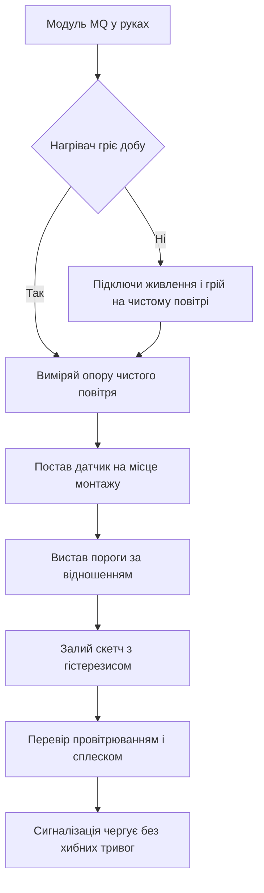

# MQ-датчики на Arduino - дим і гази

![[assets/img/arduino-mq-scheme.png|600]]
*Рис. Схема підключення MQ датчика до Arduino з аналоговим входом і порогом спрацювання.*

> [!tip] Призначення ноти
> Навчити чесній сигналізації без магії: прогріти нагрівач добу, знайти опір чистого повітря, працювати порогами з гістерезисом і не малювати фальшиві одиниці з повітря.

## 1. Призначення

Датчик серії MQ чує дим і горючі гази у повітрі.

Чутливий шар змінює опір при контакті з газом.

Плата міряє цей опір через дільник напруги.

Зміна опору перетворюється на сигнал тривоги.

Такий вузол ставлять у кухонну сигналізацію витоку.

Його ставлять у котельню поруч із котлом і лічильником.

Його ставлять у майстерню з фарбами і розчинниками.

Це індикатор небезпеки, а не лабораторний аналізатор.

Точні одиниці вимагають камери і еталонних сумішей.

Побутова плата дає рівні чисто брудно і поріг тривоги.

Ця нота закриває цикл: нагрівач, прогрів, опір чистого повітря, пороги і сирена з гістерезисом.

Точний вимір напруги дільника дивись у ноті [[06-Analog/01-ADC|вимір напруги]].

Основи двопровідної шини для екрана тривоги описані у ноті [[04-Shini/03-I2C-Wire|шина двох дротів]].

Кліматичні виміри для порівняння дивись у ноті [[10-Sensori/02-BME280|клімат по шині]].

Вузол руху і нахилу для охорони корпусу дивись у ноті [[10-Sensori/05-MPU6050|рух і нахил]].

## 2. Які бувають MQ

| Модель | Що чує краще | Куди ставлять |
| --- | --- | --- |
| MQ2 | Зріджений газ, пропан, дим, водень | Кухня, балон, котельня |
| MQ4 | Метан і природний газ | Лічильник, котел, плита |
| MQ5 | Природний газ і пропан | Котельня і дачний будиночок |
| MQ7 | Чадний газ | Гараж, котельня з пічкою |
| MQ9 | Чадний газ і горючі гази | Комбіновані сповіщувачі |
| MQ135 | Аміак, сірководень, бензол, дим | Майстерня, ферма, вентиляція |
| MQ136 | Сірководень | Каналізація і очисні вузли |

Таблиця показує спеціалізацію чутливих шарів.

Універсального датчика на всі гази не існує.

Кожен шар має пік чутливості до своєї групи.

Сусідні гази шар теж бачить, але слабше.

Тому датчик називають індикатором групи, а не селективним приладом.

Для кухні з балоном беруть MQ2.

Для квартири з природним газом беруть MQ4 або MQ5.

Для чадного газу беруть MQ7.

Для якості повітря і диму беруть MQ135.

Два різні датчики поруч дають кращу картину.

Пара MQ2 плюс MQ135 закриває витік і задимлення.

Вибір датчика починають з джерела небезпеки.

Джерело небезпеки диктує модель сенсора.

Потім підбирають пороги під приміщення.

Чужі пороги з інтернету без калібрування брешуть.

## 3. Нагрівач і струм

| Елемент | Значення | Практичний сенс |
| --- | --- | --- |
| Нагрівач | Спіраль усередині трубки сенсора | Гріє шар до робочої температури |
| Живлення нагрівача | П'ять вольт постійно | Холодний шар не чує газ |
| Струм нагрівача | Близько 150 міліампер | Відчутне навантаження для плати |
| Потужність | Близько 800 міліват | Корпус датчика теплий на дотик |
| Чутливий шар | Діоксид олова на кераміці | Опір падає у присутності газу |
| Навантажувальний резистор | Від 1 кілоома до 47 кілоомів | Дільник разом із опором сенсора |
| Аналоговий вихід | Середина дільника на вхід А0 | Напруга росте з концентрацією |
| Цифровий вихід | Компаратор з підстроюванням | Готовий поріг без коду |

Нагрівач вимагає стабільних п'яти вольт.

Живлення від слабкого перетворювача дає плаваючі показання.

Плата Uno тягне один нагрівач від свого стабілізатора.

Два нагрівачі вимагають окремого блока живлення.

Землі блока і плати з'єднують в одній точці.

Довгі тонкі дроти дають просідання напруги.

Просідання остуджує шар і зсуває показання.

Датчик гріється завжди під час роботи.

Гарячий корпус не можна закривати герметично.

Сенсору потрібен доступ повітря через сіточку.

Сіточка захищає від пилу і бризок.

Пил на сіточці зсуває чутливість вниз.

Корпус періодично продувають чистим повітрям.

```text
Підключення MQ модуля до Uno:

   плата Uno              модуль MQ
   ---------              ----------
   5V    ---------------- VCC
   GND   ---------------- GND
   A0    ---------------- A0 аналоговий вихід
   D7    ---------------- D0 цифровий поріг
   Потенціометр на модулі крутить поріг D0

   Нагрівач бере близько 150 міліампер.
   Два модулі живити від окремого блока 5V.
   Землі блока і плати зєднати разом.
   Дроти живлення короткі і товсті.
```

Схема показує два виходи модуля одразу.

Аналоговий вихід дає плавну криву зростання.

Цифровий вихід дає різкий поріг компаратора.

Поріг компаратора крутять викруткою на модулі.

Світлодіод на модулі дублює спрацювання порога.

Для серйозної логіки читають аналоговий вхід кодом.

Код дає гістерезис і затримки без хибних спрацювань.

Компаратор без гістерезиса цокотить на межі.

Тому відповідальну сигналізацію роблять кодом.

## 4. Прогрів доба і чисте повітря

| Етап | Тривалість | Пояснення |
| --- | --- | --- |
| Перший прогрів нового датчика | Доба безперервного нагріву | Випалювання заводських домішок з шару |
| Щоденний прогрів | Кілька хвилин після вмикання | Вихід на робочу температуру шару |
| Провітрювання | Чисте повітря без аерозолів | Опора для калібрування нуля |
| Заборона | Дим цигарок і пари фарб поруч | Отруюють шар і зсувають нуль |
| Місце | Вікно у режимі провітрювання | Найчистіше повітря у будинку |
| Контроль | Показання стоять рівно | Плаваючий нуль ознака протягу або холоду |
| Повтор | Після переїзду і ремонту | Нове тло вимагає нового нуля |

Новий датчик з коробки бреше першу добу.

Заводський шар містить залишки виробництва.

Нагрівач випалює їх протягом доби.

Без доби показання пливуть вниз годинами.

Датчик ставлять на чисте повітря біля вікна.

Живлення лишають увімкненим без перерв.

Періодично записують значення аналогового входу.

Крива спочатку падає, потім стає рівною.

Рівна ділянка означає готовність до калібрування.

Щоденний старт теж вимагає прогріву кілька хвилин.

Холодний шар показує завищені значення.

Програма перші хвилини має мовчати і гріти.

Тривогу дозволяють лише після прогріву.

Інакше кожне вмикання дає хибну сирену.

```text
Порядок першого запуску нового MQ:

   1. Винеси модуль у чисте повітря біля вікна.
   2. Підключи живлення 5V і землю.
   3. Лиши нагрівач увімкненим на добу.
   4. Раз на годину записуй число з входу А0.
   5. Дочекайся рівної ділянки без падіння.
   6. Зафіксуй опір чистого повітря як опору.
   7. Перенеси датчик на місце і вистав пороги.

   Живлення не вимикати протягом доби.
   Аерозолі і дим тримати подалі від сіточки.
```

Послідовність показує шлях від коробки до опори.

Доба прогріву економить тижні хибних тривог.

Записи чисел показують момент стабілізації.

Рівна ділянка довжиною кілька годин означає готовність.

Після готовності переходять до виміру опору.

Переїзд на місце монтажу змінює тло повітря.

Тло кухні і майстерні відрізняється від вікна.

Тому пороги виставляють уже на місці.

Опору лишають як заводську точку відліку.

## 5. Ro на чистому повітрі

| Величина | Формула | Пояснення |
| --- | --- | --- |
| Сире число | ADC від 0 до 1023 | Відлік аналогового входу плати |
| Напруга | ADC поділити на 1023 і помножити на 5 | Напруга на середині дільника |
| Опір сенсора | Rs дорівнює різниці живлення і виходу | Опір шару у поточному повітрі |
| Опора | Ro дорівнює Rs на чистому повітрі | Точка відліку для всіх порогів |
| Відношення | Rs поділити на Ro | Безрозмірна міра забруднення |
| Чисте повітря | Відношення близько одиниці | Шар у рівновазі з чистим тлом |
| Забруднення | Відношення падає нижче одиниці | Газ знижує опір шару |

Опір сенсора рахують з дільника напруги.

Навантажувальний резистор відомий з маркування.

Напруга виходу дає струм через дільник.

Струм дає опір сенсора за законом Ома.

Опору фіксують на чистому повітрі після доби.

Відношення опорів прибирає розкид між екземплярами.

Кожен датчик має свій розкид опори.

Абсолютні числа з чужого датчика не переносять.

Переносять лише метод і відношення.

Відношення одиниця означає чисте повітря.

Відношення половина означає відчутне забруднення.

Точні одиниці вимагають еталонної камери.

Без камери говорять рівнями, а не одиницями.

```cpp
// Вимір опору сенсора і пошук опори
// читати на чистому повітрі після доби прогріву

const int MQ_PIN = A0;
const float VCC = 5.0;
const float RL = 10.0;

float readRs() {
  int adc = analogRead(MQ_PIN);
  if (adc <= 0) {
    adc = 1;
  }
  if (adc >= 1023) {
    adc = 1022;
  }
  float vout = adc * VCC / 1023.0;
  float rs = (VCC - vout) * RL / vout;
  return rs;
}

void setup() {
  Serial.begin(9600);
}

void loop() {
  float rs = readRs();
  Serial.print("Опір Rs у кілоомах: ");
  Serial.println(rs, 2);
  delay(1000);
}
```

Скетч друкує опір шару у кілоомах.

Захист від країв діапазону прибирає ділення на нуль.

На чистому повітрі записують середнє за десять хвилин.

Середнє стає опорою для порогів.

Опору зберігають у константі програми.

Опору коментують датою і місцем виміру.

Такий коментар рятує при заміні датчика.

Новий екземпляр вимагає нової опори.

Стару опору чужого датчика підставляти заборонено.

## 6. Пороги а не ppm

| Підхід | Що обіцяє | Чому не працює вдома |
| --- | --- | --- |
| Таблиця з даташиту | Перевід відношення у одиниці | Крива для камери з еталоном, а не для кухні |
| Чужі коефіцієнти | Готові числа з інтернету | Інший екземпляр, інший резистор, інше тло |
| Логарифмічна шкала | Красивий графік | Малий шум дає велику похибку одиниць |
| Без температури | Одна формула на всі сезони | Шар пливе від холоду і вологості |
| Пороги рівнів | Тривога за відношенням | Стабільно працює без камери |
| Калібрування місцем | Поріг під своє приміщення | Враховує тло кухні або майстерні |
| Гістерезис | Два пороги вмикання і вимикання | Прибирає цокіт сирени на межі |

Крива з даташиту намальована для еталонних умов.

Домашня кухня не повторює камеру виробника.

Температура і вологість зсувають криву вбік.

Старіння шару зсуває криву вниз за місяці.

Тому одиниці з такої кривої дають ілюзію точності.

Чесний підхід працює рівнями забруднення.

Рівень чисто означає відношення біля одиниці.

Рівень увага означає помітне падіння відношення.

Рівень тривога означає глибоке падіння і стійкість у часі.

Пороги підбирають дослідом на місці.

Провітрене приміщення дає верхню межу.

Легкий запах з плити дає середню межу.

Стійке падіння нижче нижньої межі дає тривогу.

Тривогу підтверджують затримкою у секундах.

Миттєвий сплеск від аерозолю не має вмикати сирену.

Стійке перевищення протягом пів хвилини вмикає сирену.

## 7. Сигналізація з гістерезисом повністю

| Елемент | Значення | Практичний сенс |
| --- | --- | --- |
| Вхід | Аналоговий вхід А0 | Плавна крива забруднення |
| Усереднення | Середнє з 20 вимірів | Гасить шум нагрівача |
| Поріг тривоги | Відношення 0 дробів 6 | Вмикає сирену при падінні нижче |
| Поріг відбою | Відношення 0 дробів 75 | Вимикає сирену при провітрюванні |
| Затримка вмикання | 30 секунд стійкого перевищення | Захист від коротких сплесків |
| Прогрів при старті | 3 хвилини мовчання | Холодний шар не дає тривоги |
| Виходи | Світлодіод і активний зумер | Світло плюс звук для кухні |
| Живлення зумера | Через транзисторний ключ | Струм сирени не садить живлення |

Гістерезис розносить пороги вмикання і вимикання.

Сирена вмикається на низькому порозі.

Сирена вимикається лише на вищому порозі.

Між порогами стан зберігається без цокоту.

Без гістерезиса сирена тріщить на межі.

Усереднення гасить короткі сплески.

Затримка вимагає стійкості перевищення.

Прогрів при старті блокує хибний старт.

Зумер живлять через ключ, а не з піна.

Пін плати не тягне струм гучної сирени.

Світлодіод дублює звук для шумного приміщення.

Кнопка скидання дозволяє підтвердити провітрювання.

```cpp
#include <EEPROM.h>

const int MQ_PIN = A0;
const int LED_PIN = 8;
const int BUZZ_PIN = 9;
const float RL = 10.0;
const float VCC = 5.0;
float Ro = 9.8;

const float ALARM_ON = 0.60;
const float ALARM_OFF = 0.75;
const unsigned long WARMUP_MS = 180000UL;
const unsigned long CONFIRM_MS = 30000UL;

bool alarm = false;
unsigned long overSince = 0;
unsigned long startMs = 0;

float readRs() {
  long sum = 0;
  for (int i = 0; i < 20; i++) {
    sum += analogRead(MQ_PIN);
    delay(10);
  }
  int adc = sum / 20;
  if (adc < 1) {
    adc = 1;
  }
  if (adc > 1022) {
    adc = 1022;
  }
  float vout = adc * VCC / 1023.0;
  return (VCC - vout) * RL / vout;
}

void setup() {
  Serial.begin(9600);
  pinMode(LED_PIN, OUTPUT);
  pinMode(BUZZ_PIN, OUTPUT);
  startMs = millis();
  Serial.println("Прогрів датчика, тривога заблокована");
}

void loop() {
  float rs = readRs();
  float ratio = rs / Ro;
  Serial.print("Відношення Rs до Ro: ");
  Serial.println(ratio, 3);

  if (millis() - startMs < WARMUP_MS) {
    digitalWrite(LED_PIN, LOW);
    digitalWrite(BUZZ_PIN, LOW);
    delay(1000);
    return;
  }

  if (!alarm) {
    if (ratio < ALARM_ON) {
      if (overSince == 0) {
        overSince = millis();
      }
      if (millis() - overSince > CONFIRM_MS) {
        alarm = true;
        Serial.println("Тривога: газ або дим");
      }
    } else {
      overSince = 0;
    }
  } else {
    if (ratio > ALARM_OFF) {
      alarm = false;
      overSince = 0;
      Serial.println("Повітря чисте, відбій");
    }
  }

  digitalWrite(LED_PIN, alarm ? HIGH : LOW);
  digitalWrite(BUZZ_PIN, alarm ? HIGH : LOW);
  delay(1000);
}
```

Скетч збирає повну сигналізацію з пам'яттю стану.

Опору підставляють свою після доби на чистому повітрі.

Усереднення з двадцяти вимірів гасить шум.

Прогрів три хвилини блокує хибний старт.

Підтвердження тридцять секунд відсікає сплески.

Гістерезис тримає сирену до провітрювання.

Стан тривоги зберігається між ітераціями циклу.

Світлодіод і зумер працюють синхронно.

Для нічного режиму додають кнопку підтвердження.

Для журналу подій додають картку пам'яті.

Переривання плати для кнопки описані у ноті [[03-GPIO/03-Pererivannya|переривання плати]].

## Mermaid: запуск MQ з нуля



Схема читається згори вниз: спочатку тепло.

Доба прогріву є умовою стабільного шару.

Опора фіксує точку відліку чистого повітря.

Монтаж на місці враховує реальне тло.

Пороги за відношенням працюють без камери.

Код з гістерезисом прибирає цокіт сирени.

Перевірка провітрюванням підтверджує повернення.

Фінал дає чергування без хибних спрацювань.

## Типові помилки

| # | Помилка | Чому погано | Як правильно |
| --- | --- | --- | --- |
| 1 | Робота без доби прогріву нового датчика | Шар пливе, нуль падає годинами, тривоги хибні | Гріти добу на чистому повітрі, потім фіксувати опору |
| 2 | Малювання одиниць за чужою формулою | Інший екземпляр і тло дають кратну похибку | Працювати порогами відношення, а не фальшивими одиницями |
| 3 | Живлення нагрівача від слабкого перетворювача | Просідання остуджує шар, показання стрибають | Окремий блок п'ять вольт, короткі товсті дроти, спільна земля |
| 4 | Один поріг без гістерезиса | Сирена цокотить на межі і дратує мешканців | Два пороги вмикання і відбою плюс затримка підтвердження |
| 5 | Тривога одразу після вмикання | Холодний шар дає сплеск і хибну сирену | Блокувати тривогу на час прогріву кілька хвилин |
| 6 | Герметичний корпус без доступу повітря | Газ не доходить до шару, датчик мовчить у небезпеці | Сіточка відкрита, корпус з отворами, періодичне продування від пилу |

## Офіційні джерела

- [Датчики газу на docs.arduino.cc](https://docs.arduino.cc/learn/electronics/gas-sensor/) - нагрівач, прогрів і читання аналогового виходу.
- [Аналогові входи Arduino на arduino.cc](https://www.arduino.cc/reference/en/language/functions/analog-io/analogread/) - розрядність, час перетворення і усереднення.
- [MQ2 на Renesas Wiki](https://www.renesas.com/en/document/dst/mq2-semiconductor-sensor-lpg-propane-hydrogen) - чутливість, опора і криві відношення.

## Див. також

- [[Home]]
- [[06-Analog/01-ADC|вимір напруги]]
- [[04-Shini/03-I2C-Wire|шина двох дротів]]
- [[03-GPIO/03-Pererivannya|переривання плати]]
- [[10-Sensori/02-BME280|клімат по шині]]
- [[10-Sensori/05-MPU6050|рух і нахил]]
