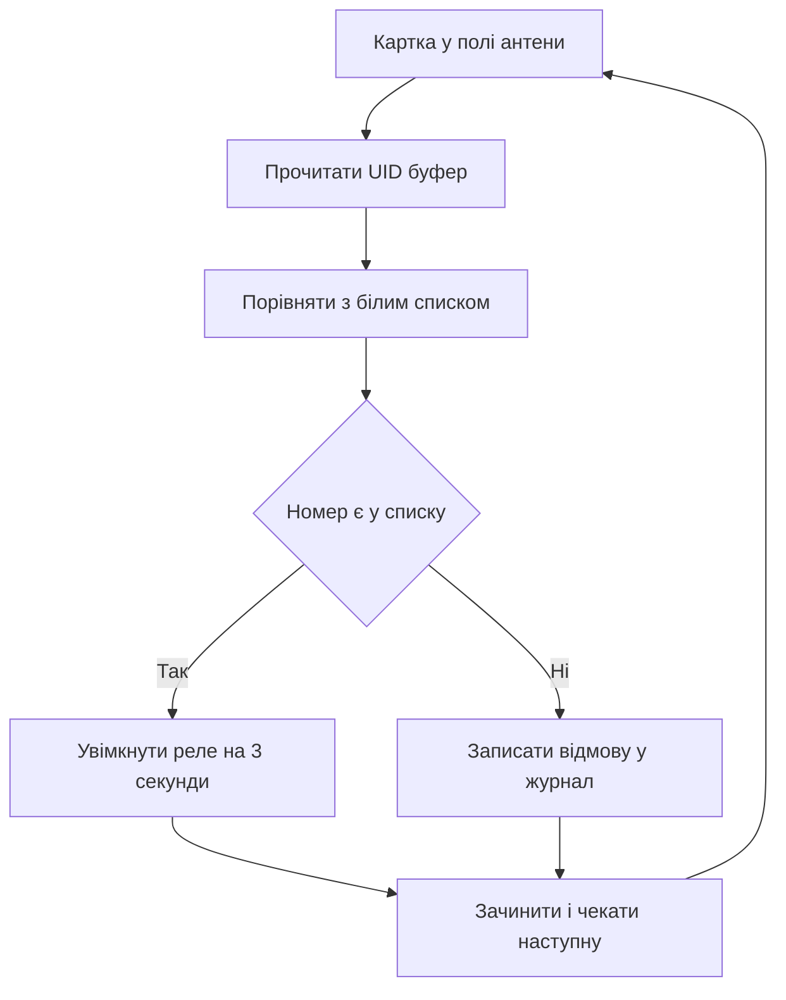

# RC522 на Arduino - картки доступу

![[assets/img/arduino-rfid2-scheme.png|600]]
*Рис. Схема підключення RC522 до Arduino через шину SPI з живленням 3,3 В.*

> [!tip] Призначення ноти
> Закрити питання безконтактних карток: як не спалити модуль живленням, як прочитати UID і як зробити простий замок з перевіркою списку.

## 1. Призначення

Модуль RC522 читає безконтактні картки і брелоки на частоті 13,56 МГц.

Плата Arduino опитує модуль по шині і отримує номер картки.

Такий номер називають UID і використовують як ключ доступу.

Дверний замок звіряє номер з білим списком і вмикає реле.

Облік робочого часу фіксує хто і коли приклав картку.

Каса самообслуговування впізнає картку клієнта за номером.

Основи обміну по шині описані у ноті [[04-Shini/02-SPI|швидка шина]].

Режими пінів і рівні сигналів описані у ноті [[03-GPIO/01-Digital-pini|цифрові піни]].

Ця нота веде від живлення до готового замка покроково.

Спочатку подаємо правильні 3,3 В без пятірки.

Потім зєднуємо шину і ставимо бібліотеку.

Далі читаємо UID тестовим скетчем.

Після цього розуміємо чому UID не пароль.

У фіналі збираємо замок з білим списком номерів.

Модуль працює з картками MIFARE Classic і сумісними мітками.

Радіус читання становить кілька сантиметрів над антеною.

Металеві предмети поруч зменшують дальність читання.

Пластиковий корпус над антеною на дальність майже не впливає.

## 2. Живлення тільки 3,3 В

| Вивід модуля | Куди вести | Пояснення |
| --- | --- | --- |
| VCC | 3,3 В плати | Живлення логіки і радіочастини |
| GND | GND плати | Спільна земля обов'язкова |
| RST | D9 через рівень 3,3 В | Скидання модуля |
| IRQ | Не підключати | Переривання для новачків зайве |
| MISO | MISO плати | Дані від модуля до плати |
| MOSI | MOSI через подільник | Дані від плати до модуля |
| SCK | SCK плати | Такт шини |
| SDA | D10 як вибір кристала | Вибір модуля на шині |

Модуль RC522 живиться тільки від 3,3 В.

Подача 5 В на вивід живлення спалює стабілізатор і чип.

Логічні входи модуля також розраховані на 3,3 В.

Плата Uno видає на виходах 5 В у високому рівні.

Пряме з'єднання виходів плати з входами модуля перевантажує входи.

Безпечний шлях дає подільник з двох резисторів на кожній лінії від плати.

Лінія від модуля до плати безпечна без подільника.

Модуль видає 3,3 В а плата розуміє такий рівень як високий.

Струм споживання в момент читання сягає десятків міліампер.

Вивід 3,3 В плати витримує такий струм без проблем.

Довгі тонкі дроти живлення дають просадку і зрив обміну.

Короткі дроти до десяти сантиметрів дають стабільний звязок.

## 3. Підключення через SPI до Uno

| Сигнал шини | Пін Uno | Пін Nano | Нотатка |
| --- | --- | --- | --- |
| SCK | D13 | D13 | Такт шини спільний |
| MOSI | D11 | D11 | Дані від плати |
| MISO | D12 | D12 | Дані до плати |
| SDA | D10 | D10 | Вибір модуля |
| RST | D9 | D9 | Скидання |
| VCC | 3,3 В | 3,3 В | Ні в якому разі не 5 В |
| GND | GND | GND | Спільна земля |

Шина SPI працює за схемою ведучий і підлеглий.

Плата виступає ведучою і задає такт.

Модуль відповідає тільки коли обраний сигналом вибору.

Кілька пристроїв на шині ділять три лінії даних і такту.

Кожен пристрій має окрему лінію вибору.

Деталі спільної шини дивись у ноті [[04-Shini/02-SPI|швидка шина]].

Налаштування безпосередньо пінів описані у ноті [[03-GPIO/01-Digital-pini|цифрові піни]].

```text
Підключення RC522 до Uno через подільники:

    плата Uno                 модуль RC522
    ---------                 ------------
    3,3 В ------------------  VCC
    GND --------------------  GND
    D13 --------------------  SCK
    D12 --------------------  MISO

    D11 ---[2к]---+----------  MOSI
                  |
                 [4к7]
                  |
                 GND

    D10 ---[2к]---+----------  SDA
                  |
                 [4к7]
                  |
                 GND

    D9 ----[2к]---+----------  RST
                  |
                 [4к7]
                  |
                 GND

    Подільник знижує 5 В до близько 3,3 В.
    Резистори ставлять близько до модуля.
    Довжина дротів бажано до 10 сантиметрів.
```

Схема показує три подільники на лініях від плати.

Лінія MISO йде безпосередньо без подільника.

Спільна земля зєднує обидва пристрої.

Перевірка починається з виміру 3,3 В на виводі живлення.

Далі перевіряють рівні на входах модуля.

Після цього запускають тестовий скетч.

## 4. Бібліотека MFRC522

| Крок | Дія | Практичний сенс |
| --- | --- | --- |
| Пошук | MFRC522 у менеджері бібліотек | Офіційна бібліотека від спільноти |
| Встановлення | Натиснути встановити | Підтягує приклади і залежності |
| Підключення | Заголовок MFRC522 | Компілятор бачить клас модуля |
| Обєкт | Вказати піни вибору і скидання | Звязує логіку з дротами |
| Ініціалізація | Виклик початку роботи | Налаштовує шину і антену |
| Приклади | DumpInfo і ReadNUID | Готові тести читання номера |

Бібліотеку ставлять через менеджер бібліотек за назвою MFRC522.

Окремих драйверів для плати ставити не треба.

Обєкт модуля створюють з номерами пінів вибору і скидання.

У блоці налаштування викликають початок роботи шини.

Потім викликають початок роботи модуля.

Після цього модуль вмикає антену і чекає картку.

Приклад читання номера лежить у меню прикладів бібліотеки.

Приклад виводу інформації показує версію чипа.

Якщо версія не читається то проблема у дротах або живленні.

Швидкість порту для тестів ставлять 9600 або 115200.

Обидві швидкості однаково показують номер у моніторі.

## 5. Читання UID тестовим скетчем

| Виклик | Що робить | Коли використовувати |
| --- | --- | --- |
| Початок роботи | Готує шину і антену | Один раз у налаштуванні |
| Нова картка | Перевіряє поле антени | Кожен прохід циклу |
| Читання серії | Зчитує UID у буфер | Після появи картки |
| Друк у порт | Показує байти номера | Для білого списку |
| Зупинка картки | Відпускає мітку | Після обробки |

Номер UID складається з чотирьох або семи байтів.

Чотирибайтний номер мають класичні картки доступу.

Семибайтний номер мають нові мітки з розширеним кодом.

Бібліотека складає байти у буфер і рахує довжину.

Друк у шістнадцятковому вигляді дає короткий ключ.

Пробіли між байтами роблять ключ читабельним.

```cpp
#include <SPI.h>
#include <MFRC522.h>

#define SS_PIN 10
#define RST_PIN 9

MFRC522 rfid(SS_PIN, RST_PIN);

void setup() {
  Serial.begin(9600);
  SPI.begin();
  rfid.PCD_Init();
  Serial.println("Прикладіть картку до антени");
}

void loop() {
  if (!rfid.PICC_IsNewCardPresent()) {
    return;
  }
  if (!rfid.PICC_ReadCardSerial()) {
    return;
  }
  Serial.print("UID:");
  for (byte i = 0; i < rfid.uid.size; i++) {
    if (rfid.uid.uidByte[i] < 0x10) {
      Serial.print(" 0");
    } else {
      Serial.print(" ");
    }
    Serial.print(rfid.uid.uidByte[i], HEX);
  }
  Serial.println();
  rfid.PICC_HaltA();
  rfid.PCD_StopCrypto1();
  delay(500);
}
```

Скетч чекає нову картку у полі антени.

Перевірка нової картки не блокує цикл.

Читання серії заповнює буфер номера.

Цикл друкує кожен байт у шістнадцятковому вигляді.

Нуль на початку робить вивід рівним за шириною.

Зупинка картки дозволяє прочитати наступну мітку.

Пауза пів секунди прибирає повтори одного прикладання.

Номери з монітора записують у білий список замка.

## 6. Чому UID не пароль

| Факт | Пояснення | Наслідок |
| --- | --- | --- |
| Номер відкритий | Картка віддає UID без перевірки | Зчитати може будь-який зчитувач |
| Клон за хвилину | Записувані брелоки копіюють номер | Дублікат відкриває замок |
| Радіоперехоплення | Обмін слухають з відстані | Номер дізнаються непомітно |
| Без шифру | Перевірка тільки порівнянням | Немає захисту від повтору |
| Висновок | UID годиться для обліку | Для дверей треба шифровані сектори |

Картка віддає номер без пароля кожному зчитувачу.

Записуваний брелок з магазину приймає будь-який номер.

Копія робиться за хвилину без знання ключів.

Тому замок на UID стримує лише випадкових перехожих.

Для дому і гуртка такого рівня часто вистачає.

Для грошей і серйозних дверей потрібна перевірка секторів.

Шифровані сектори читають тільки знаючи ключі доступу.

Лічильники і підписи у секторах не клонуються просто.

Починати варто з UID щоб зрозуміти механіку.

Потім переходити на ключі і шифрування секторів.

Журнал подій допомагає помітити підозрілі проходи.

## 7. Скетч замка з білим списком

| Елемент | Значення | Пояснення |
| --- | --- | --- |
| Реле | Пін D8 через транзистор | Вмикає замок на кілька секунд |
| Світлодіод | Вбудований пін D13 | Блимає при дозволі |
| Білий список | Масив дозволених номерів | Звірка кожного прикладання |
| Заборона | Короткий звук або друк | Реакція на чужий номер |
| Пауза | Відкриття на 3 секунди | Час штовхнути двері |

Реле вмикають через транзистор а не безпосередньо.

Пін плати не витримує струм котушки реле.

Окремий діод гасить кидок напруги котушки.

Світлодіод показує дозвіл без монітора порту.

Білий список зберігають у програмі як рядки.

Порівняння йде посимвольно без урахування регістру.

```cpp
#include <SPI.h>
#include <MFRC522.h>

#define SS_PIN 10
#define RST_PIN 9
#define RELAY_PIN 8

MFRC522 rfid(SS_PIN, RST_PIN);

const char* ALLOWED[] = {
  "A1 B2 C3 D4",
  "01 23 45 67"
};
const int ALLOWED_COUNT = 2;

String readUidString() {
  String s = "";
  for (byte i = 0; i < rfid.uid.size; i++) {
    if (rfid.uid.uidByte[i] < 0x10) {
      s += " 0";
    } else {
      s += " ";
    }
    s += String(rfid.uid.uidByte[i], HEX);
  }
  s.toUpperCase();
  s.trim();
  return s;
}

bool isAllowed(const String& uid) {
  for (int i = 0; i < ALLOWED_COUNT; i++) {
    if (uid == String(ALLOWED[i])) {
      return true;
    }
  }
  return false;
}

void setup() {
  Serial.begin(9600);
  pinMode(RELAY_PIN, OUTPUT);
  digitalWrite(RELAY_PIN, LOW);
  SPI.begin();
  rfid.PCD_Init();
  Serial.println("Замок готовий");
}

void loop() {
  if (!rfid.PICC_IsNewCardPresent()) {
    return;
  }
  if (!rfid.PICC_ReadCardSerial()) {
    return;
  }
  String uid = readUidString();
  Serial.print("Картка: ");
  Serial.println(uid);
  if (isAllowed(uid)) {
    Serial.println("Дозволено");
    digitalWrite(RELAY_PIN, HIGH);
    delay(3000);
    digitalWrite(RELAY_PIN, LOW);
  } else {
    Serial.println("Заборонено");
    delay(1000);
  }
  rfid.PICC_HaltA();
  rfid.PCD_StopCrypto1();
}
```

Функція читання складає номер у рядок.

Приведення до верхнього регістру знімає різницю букв.

Обрізка пробілів робить порівняння точним.

Функція перевірки гортає білий список.

Збіг вмикає реле на три секунди.

Чужий номер дає паузу і запис у журнал.

Зупинка картки готує модуль до наступної мітки.

Реле живлять від окремого блока а не від плати.

## Mermaid: логіка замка доступу



Схема читається згори вниз без розгалужень назад.

Спочатку модуль читає номер у буфер.

Потім програма порівнює номер зі списком.

Збіг вмикає реле на три секунди.

Чужий номер пише відмову у журнал.

Фінал повертає замок в очікування.

Журнал допомагає помітити підбір карток.

## Типові помилки

| # | Помилка | Чому погано | Як правильно |
| --- | --- | --- | --- |
| 1 | Живлення модуля від 5 В | Чип гріється і виходить з ладу | Тільки 3,3 В на вивід живлення |
| 2 | Прямі 5 В на MOSI і SDA | Входи перевантажені високим рівнем | Подільник або перетворювач рівнів |
| 3 | Немає спільної землі | Шина плаває і версія не читається | Зєднати GND плати і модуля |
| 4 | Віра в UID як пароль | Клон брелока відкриває двері | Для захисту читати шифровані сектори |
| 5 | Довгі дроти шини понад 30 сантиметрів | Такт спотворюється і обмін зривається | Короткі дроти до 10 сантиметрів |
| 6 | Реле безпосередньо від піна | Пін згорає від струму котушки | Транзистор плюс окреме живлення реле |

## Офіційні джерела

- [Бібліотека MFRC522 на arduino.cc](https://www.arduino.cc/reference/en/libraries/mfrc522/) - встановлення, приклади читання номера і функції модуля.
- [Посібник RC522 на docs.arduino.cc](https://docs.arduino.cc/learn/electronics/mfrc522-rfid-reader/) - підключення по шині, живлення 3,3 В і тестовий скетч.
- [Даташит MFRC522 від NXP](https://www.nxp.com/docs/en/data-sheet/MFRC522.pdf) - регістри, команди, антена і електричні межі.

## Див. також

- [[Home]]
- [[04-Shini/02-SPI|швидка шина]]
- [[03-GPIO/01-Digital-pini|цифрові піни]]
- [[10-Sensori/05-MPU6050|рух і нахил]]
- [[10-Sensori/08-Encoder|кроки обертання]]
- [[12-Moduli-zvyazku/02-RC522-RFID|бездротовий бік RC522]] - живлення антени і SPI-практика
