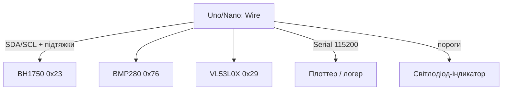

# Arduino міряє світло, тиск і дальність - BH1750, BMP280, VL53L0X

![[assets/img/ard-svitlo-tisk-tof-scheme.png|600]]
*Рис. Три I2C-сенсори на одній шині: BH1750 - люкси, BMP280 - гектопаскалі, VL53L0X - міліметри.*

> [!tip] Що це за нота
> Найпопулярніша трійця після DHT: освітленість для теплиці, тиск для висотоміра, ToF для робота-пилососа. Усі три - I2C, усі три - 3.3V логіка (увага на 5V Uno!). База: [[10-Sensori/02-BME280|сенсор BME280]], [[04-Shini/03-I2C-Wire|шина I2C Wire]].

## 1. Мета

Закрити три виміри одним скетчем:

- освітленість 1-65535 лк - BH1750 (ROHM);
- тиск 300-1100 гПа + температура - BMP280 (Bosch);
- дальність 30-2000 мм - VL53L0X (ST);
- усі на одній шині: адреси не конфліктують (0x23, 0x76, 0x29).

| Сенсор | Адреса | Діапазон | Час виміру |
| --- | --- | --- | --- |
| BH1750 | 0x23 (ADDR LOW) | 1-65535 лк | 120 мс |
| BMP280 | 0x76 (SDO LOW) | 300-1100 гПа | ~10 мс |
| VL53L0X | 0x29 | 30-2000 мм | 30-200 мс |

## 2. Архітектура



Підтяжки 4.7 кОм до 3.3V (не до 5V!). Модулі GY-302/GY-BMP280/VL53L0X вже мають стабілізатор і перетворювач рівнів - живимо від 5V, SDA/SCL толерантні.

## 3. BH1750: люкси без перерахунків

- команда 0x10 - H-Resolution, 1 лк, 120 мс;
- результат / 1.2 = люкси (ділимо одразу у float);
- режими: 0x10 (1 лк), 0x11 (0.5 лк), 0x13 (4 лк, 16 мс);
- power-down 0x00 між вимірами для батареї;
- ADDR на GND - 0x23, на VCC - 0x5C (два датчики на шині).

## 4. BMP280: тиск і висота

- oversampling x4 тиск + x1 температура - компроміс шум/швидкість;
- компенсація - обов'язково: читаємо калібрувальні коефіцієнти 0x88-0xA1;
- висота: `44330 × (1 − (P/P0)^0.1903)`, P0 оновлюємо з метеослужби;
- режим forced - виміряв і заснув, для батареї тільки він;
- IIR-фільтр x4 згладжує дверні хлопки.

## 5. Робочий код

```cpp
#include <Wire.h>

float bh_read_lux() {
  Wire.beginTransmission(0x23);
  Wire.write(0x10);
  Wire.endTransmission();
  delay(130);
  Wire.requestFrom(0x23, 2);
  if (Wire.available() < 2) return -1;
  uint16_t v = Wire.read() << 8 | Wire.read();
  return v / 1.2;
}

float bmp_read_hpa() {
  uint32_t adc_P = bmp_read24(0xF7);
  int32_t t_fine = bmp_comp_temp(bmp_read24(0xFA));
  int64_t var1 = ((int64_t)t_fine) - 128000;
  int64_t var2 = var1 * var1 * dig_P6;
  var2 += var1 * dig_P5 * 131072;
  var2 += (int64_t)dig_P4 * 34359738368;
  var1 = (var1 * var1 * dig_P3 / 256) + (var1 * dig_P2 * 4096);
  var1 = (140928000000LL + var1) / 1;
  if (var1 == 0) return -1;
  int64_t p = 1048576 - adc_P;
  p = (p - var2 / 4096) * 6250 / var1;
  return p / 256.0 / 100.0;
}

uint16_t vl_read_mm() {
  Wire.beginTransmission(0x29);
  Wire.write(0x00); Wire.write(0x01);
  Wire.endTransmission();
  delay(40);
  Wire.beginTransmission(0x29);
  Wire.write(0x14);
  Wire.endTransmission(false);
  Wire.requestFrom(0x29, 2);
  return Wire.read() << 8 | Wire.read();
}

void setup() {
  Serial.begin(115200);
  Wire.begin();
  Wire.setClock(100000);
}

void loop() {
  Serial.print(bh_read_lux());
  Serial.print(" lx, ");
  Serial.print(bmp_read_hpa());
  Serial.print(" hPa, ");
  Serial.print(vl_read_mm());
  Serial.println(" mm");
  delay(1000);
}
```

Коефіцієнти `dig_Px` читаємо з 0x88 один раз у `setup`. VL53L0X тут у спрощеному single-shot - для продакшну беріть бібліотеку Pololu VL53L0X.

## 6. Калібрування

| Датчик | Як перевірити | Норма |
| --- | --- | --- |
| BH1750 | застосунок-люксметр поруч | ±20 % |
| BMP280 | аеропорт QNH або другий барометр | ±1 гПа |
| VL53L0X | лінійка 100/500/1000 мм | ±3 % до 1 м |

## 7. Живлення і рівні

- модулі GY - живлення 5V (є свій LDO), логіка через перетворювач рівнів;
- голі чипи - тільки 3.3V, Uno дає 3.3V до 150 мА - вистачить;
- довжина шини до 30 см на 100 кГц без проблем;
- [[02-Zhivlennya/01-Zhivlennya-VIN|живлення VIN]] - не вішати датчики на нестабільні 5V USB-хаба.

## 8. Типові помилки

| Симптом | Причина | Лікування |
| --- | --- | --- |
| BH1750 дає 54612 в темряві | читання без команди виміру | слати 0x10 і чекати 130 мс |
| BMP280 - нулі | не прочитані dig-коефіцієнти | читати 0x88-0xA1 у setup |
| VL53L0X вісить | XSHUT притягнутий до землі | підтягнути XSHUT до VCC |
| Сканер бачить лише 1 адресу | SDO/ADDR однакові у двох однакових модулів | розвести перемички, другого такого ж - немає |
| Стрибки тиску при дверях | немає IIR-фільтра | oversampling x4 + медіана з 5 |
| На Nano все, на Uno ні | підтяжки до 5V замість 3.3V | перемкнути підтяжки на 3.3V |

## 9. Суміжні ноти

- [[10-Sensori/02-BME280|сенсор BME280]] - вологість плюс тиск.
- [[04-Shini/03-I2C-Wire|шина I2C Wire]] - сканер, швидкості, підтяжки.
- [[10-Sensori/03-HC-SR04-PIR|ультразвук і рух]] - дешева альтернатива ToF.
- [[06-Analog/01-ADC|аналогові входи]] - коли I2C-сенсора немає.
- [[16-Proekti/01-Meteostantsiya|метеостанція]] - куди вбудувати трійцю.

## Офіційні джерела

- [BH1750FVI-TR (DigiKey, ROHM)](https://www.digikey.com/en/products/detail/rohm-semiconductor/BH1750FVI-TR/2041441) - режими, команди, адреси.
- [BMP280 (Adafruit)](https://www.adafruit.com/product/2651) - модуль, SDO-адресація.
- [VL53L0X (Adafruit)](https://www.adafruit.com/product/3317) - ToF-модуль, XSHUT.
- [VL53L0X (ST)](https://www.st.com/en/sensors-actuators/vl53l0x.html) - даташит, таймінги ranging.
