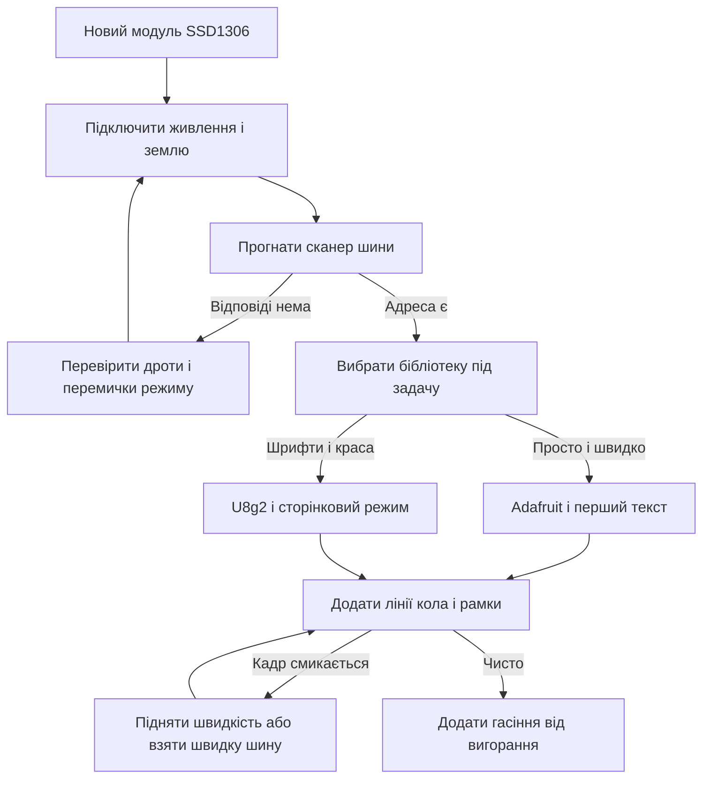

# OLED SSD1306 - графіка на Arduino

![[assets/img/arduino-oled-scheme.png|600]]
*Рис. Екран SSD1306: пікселі що світяться самі, буфер у памяті, шина на вибір, текст і фігури.*

> [!tip] Призначення ноти
> Малювати на маленькому екрані як на великому: підключити шину, вибрати бібліотеку, вивести текст і фігури та не спалити матрицю статикою.

## 1. Призначення

Графічний екран малює крапками: текст будь-яким кеглем, лінії, кола, рамки, прості іконки.

Кожна крапка світиться сама, тому чорний колір справді чорний, а підсвітки немає взагалі.

Ціна такої свободи: кадр спочатку збирають у памяті плати, а потім шлють у матрицю.

Ця нота закриває практику: розміри матриць, живлення, бібліотеки, буфер, шини, малювання, кирилиця, вигорання.

Адреси двопровідної шини і сканер описані у ноті [[04-Shini/03-I2C-Wire|шина двох дротів]].

Швидка чотиридротова шина для великих кадрів описана у ноті [[04-Shini/02-SPI|швидка шина]].

Символьний попередник графіки описаний у ноті [[11-Vivid/01-LCD1602|символьний екран]].

## 2. Характеристики матриць

| Параметр | Варіант малий | Варіант великий |
| --- | --- | --- |
| Розмір у крапках | Сто двадцять вісім на тридцять два | Сто двадцять вісім на шістдесят чотири |
| Діагональ | Близько половини дюйма | Близько одного дюйма |
| Контролер | SSD1306 | SSD1306 |
| Кольори | Білий або блакитний на чорному | Білий, блакитний, жовто-блакитний |
| Живлення логіки | Три і три вольта, часто терпить пять | Пять вольт через стабілізатор модуля |
| Контраст | Програмний, командою яскравості | Той же програмний |
| Кути огляду | Широкі, картинка не інвертується | Такі самі широкі |

Матриця сто двадцять вісім на шістдесят чотири просить рівно один кілобайт буфера.

Матриця сто двадцять вісім на тридцять два просить уполовину менше, пів кілобайта.

Маленька плата з двома кілобайтами памяті віддає екрану половину і живе далі.

Жовто-блакитні модулі мають фіксовані зони кольору: верх жовтий, низ блакитний.

## 3. Бібліотеки на вибір

| Бібліотека | Сильні сторони | Коли брати |
| --- | --- | --- |
| Adafruit SSD1306 плюс GFX | Прості виклики, тони прикладів | Перший екран, швидкий старт |
| U8g2 повний буфер | Шрифти на будь-який смак, кирилиця | Красивий текст і дрібні кеглі |
| U8g2 сторінковий режим | Кадр без великого буфера | Мало памяті, повільне оновлення |

Обидві бібліотеки ставлять через менеджер бібліотек середовища за іменем.

Бібліотека Adafruit тягне за собою GFX: примітиви малювання живуть саме там.

Бібліотека U8g2 вміє сотні шрифтів, кириличні теж є, назви містять позначку кирилиці.

Для першого досліду беруть Adafruit: менше налаштувань, картинка з першого разу.

Для годинника з гарним шрифтом беруть U8g2 і сторінковий режим.

```text
Вибір бібліотеки за трьома питаннями:

  Треба швидко і просто ......... Adafruit SSD1306
  Треба гарні шрифти ............ U8g2 повний буфер
  Памяті впритул ................ U8g2 сторінковий режим

  Правило: перший запуск на Adafruit,
  краса і шрифти потім на U8g2.
```

## 4. Буфер у памяті

| Матриця | Байтів на кадр | Частка памяті малої плати |
| --- | --- | --- |
| Сто двадцять вісім на шістдесят чотири | Тисяча двадцять чотири | Половина від двох кілобайтів |
| Сто двадцять вісім на тридцять два | Пятсот дванадцять | Чверть памяті |
| Текстовий режим без буфера | Десятки байтів | Сторінковий режим U8g2 |

Формула проста: ширина помножити на висоту поділити на вісім, бо крапка це біт.

Кадр малюють у буфері викликами, а на матрицю шлють одним викликом показу.

Забутий виклик показу дає темний екран при правильному коді малювання.

Великі масиви шрифтів теж їдять пам'ять, їх тримають у флеші, а не в оперативці.

Ознака голоду памяті: плата перезапускається саме після додавання екрана.

## 5. Шина I2C проти SPI

| Тема | I2C варіант | SPI варіант |
| --- | --- | --- |
| Дроти | Два: дані і такти | Чотири плюс живлення: швидкість ціною пінів |
| Адреса | Нуль ікс три сі або нуль ікс три ді | Адрес немає, вибір кристалом |
| Швидкість | Чотириста кілогерц типово | Мегагерци, анімація гладша |
| Піни плати | Економить, шина спільна | Їсть піни, зате летить |
| Перемички | Вибір адреси на модулі | Вибір режиму перемичкою або пайкою |

Для тексту і повільних приладів двопровідної шини вистачає з запасом.

Для анімації і графіків беруть швидку шину: кадр долітає у рази швидше.

Модулі часто вміють обидві шини, режим вибирають перемичками на звороті.

Після перепайки перемичок модуль не відповідає на старій шині, це нормально.

Живлення модуля не залежить від шини: пять вольт лишаються пятьма вольтами.

## 6. Малювання: текст і фігури

| Виклик | Що малює | Порада |
| --- | --- | --- |
| setTextSize | Кегль тексту множником | Два для заголовка, один для рядків |
| setCursor | Позиція тексту | Рахувати з урахуванням кегля |
| print і println | Рядок або число | Форматувати заздалегідь |
| drawPixel | Одна крапка | Для графіків і шуму |
| drawLine | Відрізок | Осі графіків і стрілки |
| drawRect і fillRect | Рамка і заливка | Панелі і прогрес |
| drawCircle і fillCircle | Коло і диск | Індикатори і циферблати |
| display | Кадр на матрицю | Завжди в кінці малювання |
| clearDisplay | Чистий буфер | На початку кожного кадру |

Текст кладуть сіткою: кегль один дає двадцять один знак у рядку на широкій матриці.

Кегль два дає близько десяти знаків, зате читається через кімнату.

Фігури за межами матриці обрізаються мовчки, помилки не буде.

Заливка великої площі білим прискорює вигорання, тлі краще тримати чорним.

## 7. Вигорання і яскравість

| Тема | Сенс | Практика |
| --- | --- | --- |
| Вигорання | Статика випалює люмінофор | Рухома картинка, гасіння в простої |
| Яскравість | Програмна команда | Середина для кімнати, максимум для вітрини |
| Скрінсейвер | Гасіння через хвилину спокою | Обов'язковий для табло |
| Інверсія | Біле на чорному проти чорного на білому | Темний фон живе довше |
| Тепло | Яскравість плюс спека старять швидше | Не ставити біля нагріву |

Годинник з нерухомими цифрами зсувають на крапку раз на годину або гаснуть уночі.

Прогрес замість статичної смуги малюють цифрами: менше білих крапок горить.

Яскравість на повну ставлять лише для виставки, вдома вистачає половини.

Екран для вимірювань будять кнопкою, а не тримають увімкненим цілодобово.

## 8. Скетч з текстом і фігурами

```cpp
#include <Wire.h>
#include <Adafruit_GFX.h>
#include <Adafruit_SSD1306.h>

#define W 128
#define H 64

Adafruit_SSD1306 oled(W, H, &Wire, -1);

void setup() {
  Wire.begin();
  Wire.setClock(400000);
  oled.begin(SSD1306_SWITCHCAPVCC, 0x3C);
  oled.clearDisplay();
  oled.setTextSize(2);
  oled.setTextColor(SSD1306_WHITE);
  oled.setCursor(0, 0);
  oled.println("Privit!");
  oled.setTextSize(1);
  oled.setCursor(0, 24);
  oled.println("Temp: 23 C");
  oled.drawRect(0, 40, 100, 12, SSD1306_WHITE);
  oled.fillRect(2, 42, 64, 8, SSD1306_WHITE);
  oled.drawCircle(114, 46, 10, SSD1306_WHITE);
  oled.display();
}

void loop() {
  delay(500);
}
```

Адресу беруть зі сканера: нуль ікс три сі частіше, нуль ікс три ді рідше.

Швидкість чотириста кілогерц ставлять після запуску шини для жвавого кадру.

Мінус один у конструкторі означає відсутність піни скидання на модулі.

Прямокутник малює рамку батареї, заливка показує рівень, коло світить індикатором.

Кирилицю у цьому прикладі дають транслітом: знакогенератор латинський.

## 9. Підключення до плати

```text
Звязки модуля по двопровідній шині:

  Плата                Модуль SSD1306
  -----                --------------
  SDA ----------------> SDA
  SCL ----------------> SCL
  5V -----------------> VCC
  GND ----------------> GND

  Звязки модуля по швидкій шині:

  Плата                Модуль SSD1306
  -----                --------------
  MOSI ---------------> MOSI (дані)
  SCK ----------------> SCK (такти)
  D9 -----------------> DC (дані або команда)
  D10 ----------------> CS (вибір кристала)
  D8 -----------------> RES (скидання)
  5V -----------------> VCC
  GND ----------------> GND

  Умови чистої картинки:
  короткі дроти, спільна земля,
  спочатку живлення, потім код.
```

Піни швидкої шини залежать від плати, номери звіряють зі схемою плати.

Лінія скидання на дешевих модулях відсутня, тоді у коді мінус один.

Після зміни шини перемичками старий скетч не працює, міняють конструктор.

## 10. Mermaid: запуск графіки



Схема читається згори вниз: живлення, адреса, бібліотека, фігури, захист.

Без адреси зі сканера вибір бібліотеки нічого не дасть.

Захист від вигорання додають одразу, а не після перших тіней.

## Типові помилки

| # | Помилка | Чому погано | Як правильно |
| --- | --- | --- | --- |
| 1 | Немає виклику показу кадру | Буфер повний, матриця темна | Кінчати малювання викликом display |
| 2 | Адреса з прикладу замість своєї | Запуск падає мовчки | Прогнати сканер і вписати свою адресу |
| 3 | Повний буфер на малій платі | Памяті не вистачає, плата висне | Сторінковий режим U8g2 або менша матриця |
| 4 | Статика на повній яскравості цілодобово | Матриця вигорає за місяці | Гасіння в простої, темний фон |
| 5 | Довгі дроти на швидкому режимі | Кадр рветься, сміття на екрані | Вкоротити дроти або знизити швидкість |
| 6 | Живлення з просадкою | Екран блимає і скидається | Окремий стабільний блок зі спільною землею |

## Офіційні джерела

- [Шина Wire на docs.arduino.cc](https://docs.arduino.cc/language-reference/en/functions/communication/wire/) - запуск шини, швидкість, сканер адрес для модуля.
- [Розділ навчання на docs.arduino.cc](https://docs.arduino.cc/learn/) - статті з електроніки, живлення, підключення модулів.
- [Довідник мови на arduino.cc](https://www.arduino.cc/reference/en/) - базові функції, типи даних, робота з текстом.

## Див. також

- [[Home]]
- [[04-Shini/03-I2C-Wire|шина двох дротів]]
- [[04-Shini/02-SPI|швидка шина]]
- [[11-Vivid/01-LCD1602|символьний екран]]
- [[11-Vivid/03-NeoPixel-Servo-Rele|стрічки і сила]]
