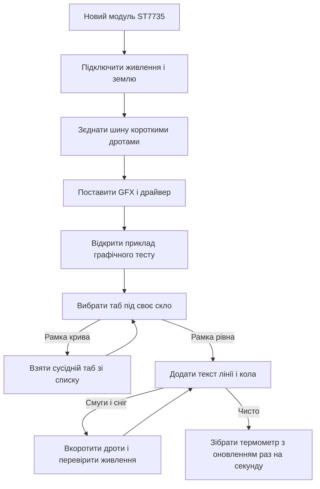

# TFT ST7735 - колір по SPI

![[assets/img/arduino-tft-scheme.png|600]]
*Рис. Кольоровий модуль ST7735: швидка шина, окремі лінії команди і скидання, яскрава підсвітка, термометр на екрані.*

> [!tip] Призначення ноти
> Зібрати маленький кольоровий прилад за вечір: підключити модуль по швидкій шині, вибрати таб під свій розмір, малювати текст і фігури без смуг.

## 1. Призначення

Маленький кольоровий екран перетворює плату на прилад: цифри видно здалеку, графік читається миттєво, меню керується кнопками.

Контролер ST7735 керує матрицею з тисяч крапок, кожна крапка має свій колір з палітри у шістдесят пять тисяч відтінків.

Ціна кольору проста: кадр летить по швидкій шині, бо повільна шина для такої кількості крапок занадто млява.

Ця нота закриває практику: розміри скла і таби, бібліотеки, лінії DC і RST, ініціалізація, текст і фігури, швидкість і смуги, термометр.

Основи швидкої шини, такти і вибір кристала описані у ноті [[04-Shini/02-SPI|швидка шина]].

Монохромний попередник з буфером у памяті описаний у ноті [[11-Vivid/02-OLED-SSD1306|графічний екран]].

Живлення логіки і запас по струму для підсвітки описані у ноті [[02-Zhivlennya/01-Zhivlennya-VIN|живлення від VIN]].

## 2. Модулі і розміри скла

| Варіант | Крапок на склі | Діагональ | Де живе |
| --- | --- | --- | --- |
| Малий квадрат | Сто двадцять вісім на сто двадцять вісім | Близько трьох чвертей дюйма | Брелки, годинники, датчики |
| Середній прямокутник | Сто двадцять вісім на сто шістдесят | Близько одного дюйма | Пульти, термометри, іграшки |
| Вузький довгий | Вісімдесят на сто шістдесят | Менше дюйма | Браслети, міні панелі |
| Великий | Сто шістдесят на сто двадцять вісім | Близько півтора дюйма | Панелі приладів |

Скло одного розміру випускають різні заводи, тому зсув картинки відрізняється на кілька крапок.

Саме для цього у бібліотеці існують таби: готові налаштування зсуву під конкретну партію скла.

Неправильний таб дає картину зі смугою збоку або зсунуті кольори по краю.

Правило просте: не сподобався край картинки, перебери сусідній таб і глянь знову.

Підсвітка у всіх модулів світлодіодна, струм бере з лінії живлення модуля.

## 3. Бібліотеки Adafruit ST7735 і GFX

| Бібліотека | Що дає | Коли ставити |
| --- | --- | --- |
| Adafruit GFX | Текст, лінії, кола, рамки, заливка | Завжди, це база малювання |
| Adafruit ST7735 | Драйвер скла, ініціалізація, таби | Завжди, без неї скло мовчить |
| Adafruit BusIO | Обмін по шині на низькому рівні | Тягується сама як залежність |
| Приклади з комплекту | Тести графіки і табів | Перший запуск і підбір табу |

Обидві головні бібліотеки ставлять через менеджер бібліотек середовища за іменем.

Спочатку ставлять GFX, потім ST7735, залежності підтягнуться самі.

Версії бібліотек тримають свіжими: старі версії плутають таби місцями.

Для першого досліду відкривають приклад графічного тесту і дивляться чи ціла рамка.

Якщо рамка ціла з усіх боків, таб вгадано з першого разу.

```text
Ланцюжок підготовки середовища:

  Крок один ......... поставити Adafruit GFX
  Крок два .......... поставити Adafruit ST7735
  Крок три .......... відкрити приклад графічного тесту
  Крок чотири ....... вибрати свій розмір у виклику ініціалізації
  Крок пять ......... залити і глянути рамку по краю

  Рамка рівна з усіх боків означає вгаданий таб.
  Тонка смуга збоку означає сусідній таб.
```

Приклади з комплекту бібліотеки економлять години: там вже є перебір табів.

Власний код пишуть лише після того як приклад показав рівну рамку.

## 4. Піни DC і RST

| Пін модуля | Куди на платі | Сенс лінії |
| --- | --- | --- |
| MOSI | Шинний вихід даних плати | Байти картинки і команд летять сюди |
| SCK | Шинні такти плати | Ритм обміну, мегагерци |
| CS | Будь який цифровий вихід | Вибір кристала, низький рівень активний |
| DC | Будь який цифровий вихід | Дані або команда, серце керування |
| RST | Будь який цифровий вихід або земля через резистор | Скидання контролера |
| VCC | Пять вольт або три і три вольта за версією модуля | Живлення логіки і підсвітки |
| GND | Земля плати | Спільна точка для сигналу і живлення |
| LED | Живлення підсвітки на окремих модулях | Яскравість через резистор або ключ |

Лінія DC вирішує долю кожного байта: низький рівень означає команда, високий рівень означає дані картинки.

Без DC контролер не розуміє де команда очищення, а де колір крапки.

Лінія RST будить контролер чистим: короткий низький імпульс і пауза творять дива після кривого старту.

Модулі без виведеного RST працюють за рахунок програмного скидання, але окремий дріт надійніший.

Лінію CS можна тримати постійно активною коли модуль на шині один.

```text
Звязки модуля з платою:

  Плата                Модуль ST7735
  -----                -------------
  MOSI ---------------> MOSI (дані картинки)
  SCK ----------------> SCK (такти шини)
  D10 ----------------> CS (вибір кристала)
  D9 -----------------> DC (команда або дані)
  D8 -----------------> RST (скидання)
  5V -----------------> VCC (живлення модуля)
  GND ----------------> GND (спільна земля)

  Умови яскравої картинки:
  короткі дроти даних і тактів,
  спільна земля без довгих петель,
  живлення з запасом на підсвітку.
```

Номери шинних пінів залежать від плати, їх звіряють зі схемою плати.

Довгі дроти на швидкій шині дають сніг і смуги, короткі дають чистий кадр.

Спільна земля обов'язкова: без неї навіть правильний код малює сміття.

## 5. Ініціалізація під свій розмір

| Виклик | Для якого скла | Коментар |
| --- | --- | --- |
| INITR BLACKTAB | Класика сто двадцять вісім на сто шістдесят | Починають з нього |
| INITR GREENTAB | Зелений таб тієї самої геометрії | Зсув на кілька крапок вбік |
| INITR REDTAB | Червоний таб тієї самої геометрії | Інший зсув тієї самої геометрії |
| INITR MINITAB | Квадрат сто двадцять вісім на сто двадцять вісім | Маленькі брелки |
| INITR HALLOWING | Вузький вісімдесят на сто шістдесят | Довгі міні панелі |

Ініціалізація завжди йде до першого малювання: скидання, таб, орієнтація, очищення.

Орієнтацію задають поворотом: нуль портрет, один альбом, далі дзеркальні варіанти.

Поворот міняє систему координат: ширина і висота міняються місцями в альбомі.

Початківці губляться саме тут: малюють за старими межами після повороту.

Після зміни табу прошивку заливають заново і дивляться рамку по краю.

```text
Порядок запуску у головній функції:

  початок шини на максимумі плати,
  створення обєкта з пінами CS DC RST,
  виклик ініціалізації з потрібним табом,
  поворот у портрет або альбом,
  очищення чорним кольором,
  перший текст поверх чистого фону.
```

Чорний фон беруть за базовий: він щадить підсвітку і дає контраст тексту.

Білий фон ставлять лише для вулиці, де сонце зїдає темну картинку.

## 6. Малювання: текст лінії кола

| Виклик | Що малює | Порада з практики |
| --- | --- | --- |
| setTextSize | Кегль тексту множником | Один для рядків, два для заголовка |
| setCursor | Позиція пера тексту | Рахувати з урахуванням кегля |
| setTextColor | Колір букв і фону | Жовтий на чорному читається здалеку |
| print і println | Рядок або число | Числа форматувати заздалегідь |
| drawPixel | Одна крапка | Графіки температури по крапках |
| drawLine | Відрізок між крапками | Осі шкал і стрілки |
| drawRect і fillRect | Рамка і суцільна панель | Корпус приладу і прогрес |
| drawCircle і fillCircle | Коло і диск | Циферблат і сигнальна лампа |
| fillScreen | Заливка всього поля | Чистий кадр перед новою картинкою |

Текст кладуть сіткою: кегль один дає близько двадцяти знаків у рядку на середньому склі.

Кегль два дає близько десяти знаків, зате видно через кімнату.

Кольори задають шістнадцятковим кодом п'ять шість пять: червоний зелений синій у одному числі.

Готові імена кольорів з бібліотеки читаються легше за числа: чорний, білий, жовтий, червоний.

Фігури за межами поля обрізаються мовчки, програма не падає.

Велику заливку білим тримають недовго: підсвітка гріється і їсть струм.

## 7. Швидкість і смуги

| Тема | Прояв | Ліки |
| --- | --- | --- |
| Такти шини | Кадр оновлюється повільно | Підняти швидкість шини до межі плати |
| Довгі дроти | Сніг, биті пікселі, смуги | Вкоротити дроти, скрутити землю поруч |
| Просадка живлення | Блимання підсвітки, скидання | Товсті дроти живлення, окремий блок |
| Повний перемальовок | Мерехтіння тексту | Перемальовувати лише змінену зону |
| Завеликий кегль | Текст не влазить | Менший кегль або коротший рядок |
| Чужий таб | Тонка смуга збоку | Сусідній таб з таблиці ініціалізації |

Швидка шина любить короткі звязки: кожен зайвий сантиметр краде мегагерци.

Швидкість за замовчуванням з прикладів підходить більшості плат без змін.

Розгін шини вище межі плати дає зворотний ефект: сміття замість приросту.

Розумний прийом для приладів: фон малюють один раз, цифри оновлюють поверх.

Для термометра достатньо оновлювати значення раз на секунду, графік раз на кілька секунд.

Часте очищення всього поля дає мерехтіння, точкове оновлення дає спокійну картинку.

## 8. Скетч термометра

```cpp
#include <Adafruit_GFX.h>
#include <Adafruit_ST7735.h>
#include <SPI.h>

#define TFT_CS 10
#define TFT_DC 9
#define TFT_RST 8

Adafruit_ST7735 tft = Adafruit_ST7735(TFT_CS, TFT_DC, TFT_RST);

float fakeTemp = 21.5;

void setup() {
  tft.initR(INITR_BLACKTAB);
  tft.setRotation(0);
  tft.fillScreen(ST77XX_BLACK);
  tft.setTextWrap(false);
  tft.drawRect(2, 2, 124, 50, ST77XX_WHITE);
  tft.setCursor(10, 10);
  tft.setTextColor(ST77XX_YELLOW);
  tft.setTextSize(2);
  tft.println("Thermo");
  tft.setCursor(10, 30);
  tft.setTextColor(ST77XX_WHITE);
  tft.setTextSize(1);
  tft.println("Celsii sensor");
  tft.drawRect(2, 60, 124, 20, ST77XX_GREEN);
  tft.drawRect(2, 90, 124, 60, ST77XX_BLUE);
}

void loop() {
  fakeTemp += 0.1;
  if (fakeTemp > 30.0) {
    fakeTemp = 20.0;
  }
  tft.fillRect(10, 62, 100, 16, ST77XX_BLACK);
  tft.setCursor(10, 64);
  tft.setTextColor(ST77XX_GREEN);
  tft.setTextSize(2);
  tft.print(fakeTemp, 1);
  tft.print(" C");
  int h = (int)((fakeTemp - 20.0) * 10.0);
  if (h < 0) {
    h = 0;
  }
  if (h > 100) {
    h = 100;
  }
  tft.fillRect(4, 92, 120, 56, ST77XX_BLACK);
  tft.drawLine(4, 140, 122, 140, ST77XX_BLUE);
  for (int i = 0; i < h; i++) {
    int x = 4 + i;
    int y = 138 - (i / 2);
    tft.drawPixel(x, y, ST77XX_YELLOW);
  }
  delay(1000);
}
```

Значення температури у прикладі росте само, датчик підключають замість лічильника.

Рядок з літерами Цельсія дають транслітом: вбудований шрифт латинський.

Рамка корпусу малюється один раз у старті, цифри оновлюють поверх чорної плашки.

Графік росте крапками по діагоналі: наочна пилка без складних масивів.

Справжній датчик читають у тому місці де зараз додається десята градуса.

## 9. Живлення і підсвітка

| Вузол | Струм | Практика |
| --- | --- | --- |
| Логіка контролера | Одиниці міліампер | Живиться від плати без проблем |
| Підсвітка | Десятки міліампер | Головний споживач модуля |
| Плата загалом через кабель | Обмежена тонким дротом | Товстий кабель або окремий блок |
| Окремий блок | З запасом на яскравість | Спільна земля з платою обов'язкова |

Підсвітка через тонкий кабель дає просадку: картинка тьмяніє на білому полі.

Яскравість знижують резистором у лінії світлодіодів коли живлення слабке.

Для настільного приладу беруть блок з запасом: плата плюс екран плюс запас на кнопки.

Перед монтажем у корпус міряють струм на білому полі: це пік споживання.

## 10. Mermaid: запуск кольору



Схема читається згори вниз: живлення, шина, бібліотеки, таб, графіка, живлення знову.

Без рівної рамки у прикладі власний термометр малювати зарано.

Смуги лікують дротами і живленням, а не новим кодом.

## Типові помилки

| # | Помилка | Чому погано | Як правильно |
| --- | --- | --- | --- |
| 1 | Чужий таб під своє скло | Смуга збоку і зсунута картинка | Перебрати сусідні таби з таблиці ініціалізації |
| 2 | Плутанина DC і RST місцями | Контролер не розуміє команди, білий екран | Звірити номери пінів у конструкторі з дротами |
| 3 | Довгі дроти шини | Сніг і биті пікселі на швидкості | Вкоротити до кількох сантиметрів, землю поруч |
| 4 | Живлення підсвітки від слабкого кабелю | Тьмяна картинка і скидання плати | Товстий кабель або окремий блок зі спільною землею |
| 5 | Повний перемальовок у кожному циклі | Мерехтіння тексту і повільний кадр | Фон один раз, цифри точково поверх плашки |
| 6 | Кирилиця вбудованим шрифтом | Замість букв знаки питання | Трансліт або свій шрифт з кирилицею у памяті |

## Офіційні джерела

- [Довідник мови на arduino.cc](https://www.arduino.cc/reference/en/) - базові виклики, типи даних, робота з текстом і числами.
- [Керівництво по платах на docs.arduino.cc](https://docs.arduino.cc/hardware/) - піни шини для різних плат, межі живлення, схеми підключення.
- [Бібліотека GFX на github](https://github.com/adafruit/Adafruit-GFX-Library) - примітиви малювання, текст, координати, кольори.

## Див. також

- [[Home]]
- [[04-Shini/02-SPI|швидка шина]]
- [[11-Vivid/02-OLED-SSD1306|графічний екран]]
- [[02-Zhivlennya/01-Zhivlennya-VIN|живлення від VIN]]
- [[11-Vivid/05-Servo-Motor-L298N|серво і мотори]]
