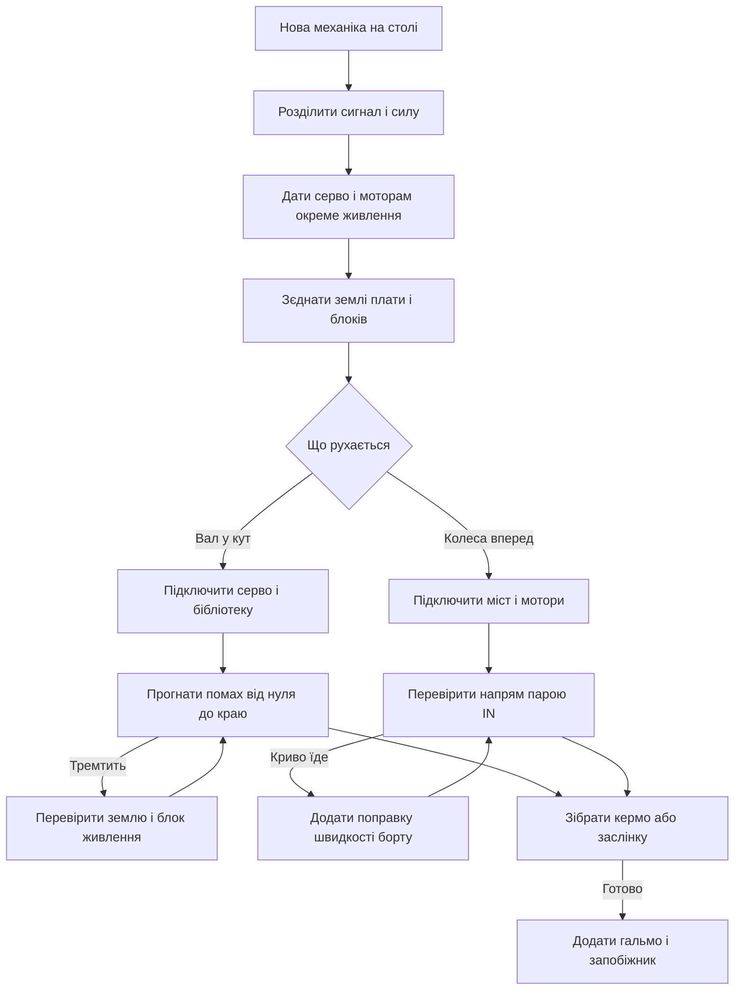

# Серво і мотори - L298N і сила

![[assets/img/arduino-motor-scheme.png|600]]
*Рис. Сила руху на столі: маленьке серво з окремим живленням, міст потужності для двох моторів, напрям і швидкість під контролем.*

> [!warning] L298N - застарілий міст (dropout 2-4 В, гріється): для нових збірок беріть TB6612/DRV8833, L298 нижче лише як спадщина.

> [!tip] Призначення ноти
> Рухати валом і колесами без диму: ставити серво у заданий кут, крутити мотори через міст, живити силу окремо і гальмувати грамотно.

## 1. Призначення

Серво ставить вал у заданий кут: кермо моделі, заслінка годівниці, рука маніпулятора.

Колекторний мотор просто крутиться: колеса машинки, вентилятор, насос, шнек дозатора.

Плата дає лише сигнал керування, силу для руху беруть з окремого живлення.

Ця нота закриває практику: бібліотека серво і кути, окреме живлення, міст L298N і його піни, швидкість модуляцією, напрям і гальмо, діоди, два скетчі.

Основи модуляції для швидкості описані у ноті [[03-GPIO/02-PWM-analogWrite|широтно-імпульсна модуляція]].

Запас живлення плати і просадки від моторів описані у ноті [[02-Zhivlennya/01-Zhivlennya-VIN|живлення від VIN]].

Швидка шина для екранів приладів описана у ноті [[04-Shini/02-SPI|швидка шина]].

Кольоровий екран для панелі керування машинкою описаний у ноті [[11-Vivid/04-TFT-ST7735|кольоровий дисплей]].

## 2. Серво: кути від нуля до ста вісімдесяти

| Тема | Сенс | Практика |
| --- | --- | --- |
| Кут нуль | Вал вліво до упору | Калібрують тяги саме звідси |
| Кут девʼяносто | Середина ходу | Нейтраль керма і заслінки |
| Кут сто вісімдесят | Вал вправо до упору | Протилежний край механіки |
| Імпульс керування | Ширина задає кут | Бібліотека формує сама |
| Період сигналу | Близько двадцяти мілісекунд | Стандарт хобі серво |
| Механічний упор | Далі кута вал не йде | Силовий тріск означає упор |

Бібліотека серво ховає часові деталі: програміст задає кут числом і чекає повороту.

Кут задають цілим числом: нуль мінімум, девʼяносто середина, сто вісімдесят максимум.

Плавний рух роблять циклом з малим кроком і паузою між кроками.

Різкий стрибок кута дає ривок струму: механіка бʼє по упору.

Маленьке серво крутить легких ляльок, велике серво крутить важкі дверцята.

```text
Хід вала серво по кутах:

  Кут нуль ............ упор ліворуч
  Кут сорок пять ...... чверть ходу
  Кут девʼяносто ...... середина, нейтраль
  Кут сто тридцять .... три чверті ходу
  Кут сто вісімдесят .. упор праворуч

  Правило: від упору до упору не гнати,
  крайні градуси залишати як запас.
```

Запас по краях бережуть тяги: упор за кута зїдає шестерні за тижні.

Середину ходу мітять маркером: зручно збирати механіку після розбору.

## 3. Живлення серво окремо

| Вузол | Струм | Практика |
| --- | --- | --- |
| Сигнал з плати | Частки міліампера | Жовтий або помаранчевий дріт |
| Живлення маленького серво | До пів ампера у ривку | Окремий блок, не пін плати |
| Живлення великого серво | Ампери у ривку | Товсті дроти і запас блока |
| Земля | Спільна для плати і блока | Без неї серво смикається |
| Конденсатор біля серво | Сотні мікрофарад | Гасить ривок струму |

Головна помилка новачків: живлення серво з піна плати, плата йде у перезапуск.

Пін плати дає сотні міліампер, ривок серво просить більше, напруга падає.

Окремий блок на пять вольт вирішує проблему: сила з блока, сигнал з плати.

Землі блока і плати зʼєднують обовʼязково: спільна точка для сигналу.

Конденсатор біля розʼєму серво згладжує піки: електроліт плюс кераміка поруч.

```text
Правильне живлення серво:

  Плата                Серво              Блок пять вольт
  -----                -----              ---------------
  D9 -----------------> Сигнал
  GND ----------------> Земля -----------> Мінус блока
                       Плюс -------------> Плюс блока

  Умови спокійного вала:
  товсті дроти плюса і мінуса,
  спільна земля плати і блока,
  конденсатор біля розʼєму.
```

Тонкі макетні дроти для сили не годяться: на піках падає пів вольта.

Після появи окремого блока зникають дивні смикання і перезапуски.

## 4. Міст L298N: піни IN і EN

| Пін моста | Куди | Сенс |
| --- | --- | --- |
| IN1 і IN2 | Два цифрові виходи плати | Напрям першого мотора |
| IN3 і IN4 | Два цифрові виходи плати | Напрям другого мотора |
| ENA | Швидкісний вихід плати | Дозвіл і швидкість першого мотора |
| ENB | Швидкісний вихід плати | Дозвіл і швидкість другого мотора |
| OUT1 і OUT2 | Виводи першого мотора | Силові клеми під викрутку |
| OUT3 і OUT4 | Виводи другого мотора | Силові клеми під викрутку |
| Живлення моторів | Окремий блок або батарея | Сила для колекторів |
| Земля | Спільна з платою | Опорна точка сигналів |

Міст це чотири ключі на кожен мотор: комбінація верхніх і нижніх задає напрям.

Плата керує лише затворами ключів через IN, струм моторів тече з окремого входу.

Перемичка на EN тримає міст постійно увімкненим: для швидкості її знімають.

Без перемички на EN подають модуляцію: шпаруватість задає середню напругу мотора.

Радіатор на мікросхемі гріється завжди: це норма для біполярного моста.

| Режим IN1 IN2 | Що робить мотор | Коментар |
| --- | --- | --- |
| Низький низький | Вільний вибіг | Колеса котяться самі |
| Високий низький | Вперед | Класичний хід машинки |
| Низький високий | Назад | Реверс для розвороту |
| Високий високий | Гальмо обмоткою | Різка зупинка, струм у ключах |

Вибіг дає плавну зупинку накатом, гальмо дає різку зупинку на місці.

Для машинки вибіг природний, для маніпулятора беруть гальмо.

## 5. Швидкість модуляцією на EN

| Шпаруватість | Середня напруга | Поведінка машинки |
| --- | --- | --- |
| Нуль | Мотор стоїть | Стартова точка калібрування |
| Чверть | Повільний рух | Маневри у кімнаті |
| Половина | Середній хід | Базова швидкість прогулянки |
| Три чверті | Швидкий хід | Вулиця і рівна підлога |
| Максимум | Повна сила | Обгін і підйом |

Модуляція на EN ріже живлення мотора на часті скибки: середнє значення і крутить.

Частота модуляції плати підходить моторам без змін: свист чутно, рух рівний.

Низька швидкість з малим навантаженням смикається: редуктор просить більше струму.

Старт з місця дають поштовхом: короткий імпульс повної сили зриває ротор.

Швидкість різних моторів вирівнюють поправками: лівий трохи швидше правого з коробки.

Основи модуляції, частота і розрядність описані у ноті [[03-GPIO/02-PWM-analogWrite|широтно-імпульсна модуляція]].

```text
Керування швидкістю на пальцях:

  EN постійний високий ...... повна швидкість
  EN меандр половина ........ половина швидкості
  EN рідкісні імпульси ...... повільний рух
  EN постійно низький ....... мотор стоїть

  Напрям задають парою IN,
  швидкість задають сигналом EN.
```

Постійний високий рівень на EN означає повний газ без регулювання.

Знята перемичка і дріт до швидкісного виходу відкривають плавне регулювання.

## 6. Окреме живлення моторів і діоди

| Вузол | Вимога | Чому так |
| --- | --- | --- |
| Батарея моторів | Окрема від плати | Пусковий струм садить логіку |
| Спільна земля | Товстий дріт між землями | Сигналам потрібна опора |
| Діоди на моторі | Штатно всередині моста | Гасять викиди самоіндукції |
| Конденсатор на моторі | Десятки нанофарад між виводами | Давить іскри щіток |
| Запобіжник | Послідовно з батареєю | Рятує дроти при заклинюванні |

Колекторний мотор це індуктивність з іскрами: вимикання дає викид напруги.

Міст вже має захисні діоди всередині, зовнішні ставлять лише на саморобних ключах.

Керамічний конденсатор прямо на виводах мотора прибирає тріск у ефірі.

Заклинене колесо дає струм у кілька разів більший за робочий: плавиться ізоляція.

Запобіжник або самовідновлюваний елемент у колі батареї рятує машинку від пожежі.

Живлення логіки моста беруть з плати або зі стабілізатора плати моста за версією модуля.

```text
Силові звязки машинки на мості:

  Батарея моторів ---> Живлення моста (окрема пара)
  Плата D4 D5 -------> IN1 IN2 (напрям лівого)
  Плата D6 D7 -------> IN3 IN4 (напрям правого)
  Плата D9 D10 ------> ENA ENB (швидкість парою)
  GND плати ---------> GND моста (товста земля)

  Мотор лівий -------> OUT1 OUT2
  Мотор правий ------> OUT3 OUT4

  Правило сили:
  батарея окрема, земля спільна,
  тонкі дроти лише для сигналів.
```

Тонкі сигнальні дроти до IN і EN не гріються, силові до моторів беруть товсті.

Переплутані полюси батареї палять міст миттєво: маркують кольором і перевіряють двічі.

## 7. Скетч серво з плавним ходом

```cpp
#include <Servo.h>

Servo kern;
int pinServo = 9;

void setup() {
  kern.attach(pinServo);
  kern.write(90);
  delay(1000);
}

void loop() {
  for (int k = 0; k <= 180; k += 2) {
    kern.write(k);
    delay(20);
  }
  delay(500);
  for (int k = 180; k >= 0; k -= 2) {
    kern.write(k);
    delay(20);
  }
  delay(500);
}
```

Бібліотека сама формує імпульси: програміст задає лише кут числом.

Крок два градуси з паузою двадцять мілісекунд дає спокійний помах за дві секунди.

Пауза після краю ходу дає механіці дійти без тремтіння.

Живлення серво у цьому скетчі мається на увазі окреме: сигнал з піни девʼять, сила з блока.

Спільна земля блока і плати обовʼязкова, інакше вал бʼється в судомах.

## 8. Скетч машинки на мості

```cpp
#define IN1 4
#define IN2 5
#define IN3 6
#define IN4 7
#define ENA 9
#define ENB 10

void motorLeft(int speed, bool fwd) {
  digitalWrite(IN1, fwd ? HIGH : LOW);
  digitalWrite(IN2, fwd ? LOW : HIGH);
  analogWrite(ENA, speed);
}

void motorRight(int speed, bool fwd) {
  digitalWrite(IN3, fwd ? HIGH : LOW);
  digitalWrite(IN4, fwd ? LOW : HIGH);
  analogWrite(ENB, speed);
}

void stopAll() {
  analogWrite(ENA, 0);
  analogWrite(ENB, 0);
  digitalWrite(IN1, LOW);
  digitalWrite(IN2, LOW);
  digitalWrite(IN3, LOW);
  digitalWrite(IN4, LOW);
}

void brakeAll() {
  digitalWrite(IN1, HIGH);
  digitalWrite(IN2, HIGH);
  digitalWrite(IN3, HIGH);
  digitalWrite(IN4, HIGH);
  analogWrite(ENA, 255);
  analogWrite(ENB, 255);
}

void setup() {
  pinMode(IN1, OUTPUT);
  pinMode(IN2, OUTPUT);
  pinMode(IN3, OUTPUT);
  pinMode(IN4, OUTPUT);
  pinMode(ENA, OUTPUT);
  pinMode(ENB, OUTPUT);
  stopAll();
}

void loop() {
  motorLeft(180, true);
  motorRight(180, true);
  delay(2000);
  stopAll();
  delay(500);
  motorLeft(150, false);
  motorRight(150, true);
  delay(1000);
  brakeAll();
  delay(300);
  stopAll();
  delay(1000);
}
```

Функції лівого і правого моторів ховають комбінації IN: правда означає вперед.

Швидкість числом від нуля до двохсот пятдесяти пяти задає середню напругу.

Розворот на місці роблять реверсом одного борта: лівий назад, правий вперед.

Зупинка вибігом дає накат, гальмо обмоткою дає різкий стоп перед стіною.

Поправку на кривий хід вносять числами: слабшому борту додають десяток одиниць.

## 9. Mermaid: запуск руху



Схема читається згори вниз: спочатку сила і земля, потім рух, потім тонке налаштування.

Без спільної землі обидва напрями марні: серво тремтить, міст ловить завади.

Гальмо і запобіжник додають після першого вдалого заїзду, а не замість нього.

## Типові помилки

| # | Помилка | Чому погано | Як правильно |
| --- | --- | --- | --- |
| 1 | Живлення серво з піна плати | Ривок струму садить плату у перезапуск | Окремий блок пять вольт зі спільною землею |
| 2 | Живлення моторів з плати | Пусковий струм палить стабілізатор | Окрема батарея моторів, плата лише сигнали |
| 3 | Перемичка на EN лишилась | Швидкість не регулюється | Зняти перемичку і подати модуляцію з плати |
| 4 | Плутанина IN пари | Мотор крутить у протилежний бік | Поміняти логіку пари або дроти на клемах |
| 5 | Немає спільної землі | Хаотичні смикання і завади | Товстий дріт між землями плати і моста |
| 6 | Гальмо замість вибігу завжди | Міст гріється, батарея сідає швидше | Вибіг для накату, гальмо для різкого стопу |

## Офіційні джерела

- [Бібліотека Servo на docs.arduino.cc](https://docs.arduino.cc/libraries/servo/) - кути, підключення, приклади помаху валом.
- [Аналоговий вихід на docs.arduino.cc](https://docs.arduino.cc/language-reference/en/functions/analog-io/analogWrite/) - модуляція для швидкості моторів через EN.
- [Довідник мови на arduino.cc](https://www.arduino.cc/reference/en/) - базові виклики, типи даних, робота з пінами.

## Див. також

- [[Home]]
- [[03-GPIO/02-PWM-analogWrite|широтно-імпульсна модуляція]]
- [[02-Zhivlennya/01-Zhivlennya-VIN|живлення від VIN]]
- [[11-Vivid/04-TFT-ST7735|кольоровий дисплей]]
- [[04-Shini/02-SPI|швидка шина]]
