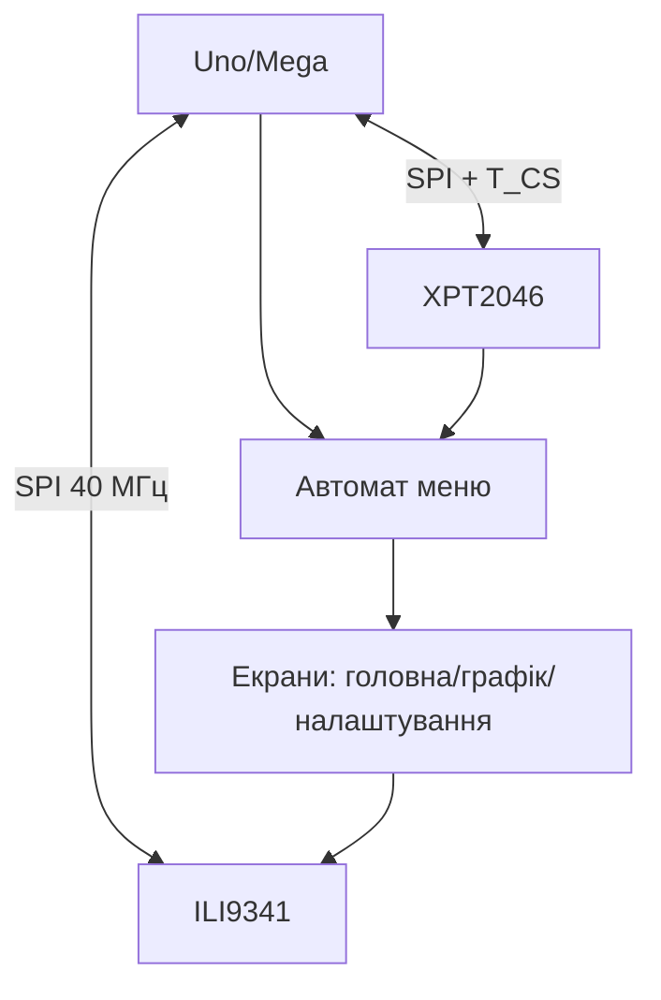

# Arduino TFT з тачем глибоко - ILI9341, калібрування і меню

![[assets/img/ard-tft-touch-deep-scheme.png|600]]
*Рис. TFT-екран: дисплей по SPI, тач окремим CS, меню - станами, шрифти в PROGMEM.*

> [!tip] Що це за нота
> Глибина TFT-теми: не «вивести текст», а меню з кнопками, калібрований тач і життя в 2 КБ SRAM. База: [[11-Vivid/04-TFT-ST7735|дисплей TFT]], [[04-Shini/02-SPI|шина SPI]].

## 1. Мета

Зробити прилад з екраном:

- ILI9341 320×240: ініціалізація і швидкості;
- тач XPT2046: калібрування матрицею;
- меню-автомат: екрани, кнопки, повернення;
- пам'ять: фреймбуфер не влізе - малюємо частинами;
- кирилиця: свій шрифт у PROGMEM.

| Екран | Контролер | Тач | Пам'ять кадру |
| --- | --- | --- | --- |
| 2.8" shield | ILI9341 | XPT2046 | 150 КБ (зовні!) |
| 2.4" модуль | ILI9341 | XPT2046 | малюємо без буфера |
| 3.5" модуль | ILI9488 | XPT2046 | тільки Mega/Due |

## 2. Архітектура



Один SPI на двох CS: дисплей і тач не заважають один одному. Швидкість 40 МГц - межа стабільності на шлейфах.

## 3. Розпіновка шилда/модуля

| Сигнал TFT | Пін Uno (шилд) | Пін модуля (вручну) |
| --- | --- | --- |
| SCK/MOSI | D13/D11 | D13/D11 |
| CS дисплея | D10 | D10 |
| DC/RS | D9 | D9 |
| RST | D8 | D8 |
| T_CS тача | D4 | D4 |
| T_IRQ | D3 (переривання!) | D3 |
| VCC/GND | 5V/GND (шилд) | 3V3 для голого! |

Голi модулі - 3.3V логіка! Шилди мають перетворювачі рівнів. T_IRQ на переривання - тач без опитування.

## 4. Калібрування тача

- сирі 0-4095 по осях, екран 320×240;
- 3 точки (кути): розв'язуємо афінне перетворення;
- поворот екрана = поворот матриці калібрування;
- фільтр: медіана з 5 натискань;
- дрейф країв - мертва зона 5 пікселів.

## 5. Робочий код (C, Arduino)

```cpp
#include <Adafruit_GFX.h>
#include <Adafruit_ILI9341.h>
#include <XPT2046_Touchscreen.h>

#define TFT_CS 10
#define TFT_DC 9
#define TFT_RST 8
#define TS_CS 4
Adafruit_ILI9341 tft(TFT_CS, TFT_DC, TFT_RST);
XPT2046_Touchscreen ts(TS_CS);

enum Screen { HOME, GRAPH, SETUP };
Screen scr = HOME;
long calX0 = 200, calX1 = 3800, calY0 = 200, calY1 = 3800;

int tx(int raw) { return map(raw, calX0, calX1, 0, 320); }
int ty(int raw) { return map(raw, calY0, calY1, 0, 240); }

void draw_home() {
  tft.fillScreen(ILI9341_BLACK);
  tft.setTextSize(3);
  tft.setCursor(20, 20);
  tft.print("Temp: 23.5");
  tft.fillRect(20, 100, 130, 60, ILI9341_BLUE);
  tft.fillRect(170, 100, 130, 60, ILI9341_RED);
}

void setup() {
  tft.begin();
  tft.setRotation(1);
  ts.begin();
  draw_home();
}

void loop() {
  if (ts.touched()) {
    TS_Point p = ts.getPoint();
    int x = tx(p.x), y = ty(p.y);
    if (scr == HOME && y > 100 && y < 160) {
      if (x < 150) digitalWrite(5, HIGH);
      else digitalWrite(5, LOW);
    }
  }
}
```

Кнопки - прямокутники з хітбоксами: координати в константах, логіка - автоматом станів.

## 6. Робочий код (MicroPython)

```python
# MicroPython: TFT-панель (драйвер ili9341 + xpt2046)
import time
from machine import Pin, SPI

spi = SPI(1, baudrate=40000000, sck=Pin(10), mosi=Pin(11), miso=Pin(12))
cs = Pin(13, Pin.OUT, value=1)
dc = Pin(9, Pin.OUT)
rst = Pin(8, Pin.OUT)

def cmd(b, data=None):
    dc.value(0)
    cs.value(0)
    spi.write(bytes([b]))
    if data:
        dc.value(1)
        spi.write(bytes(data))
    cs.value(1)

def fill(color):
    cmd(0x2C, [(color >> 8) & 0xFF, color & 0xFF] * 100)

cmd(0x01)
time.sleep_ms(150)
cmd(0x11)
time.sleep_ms(200)
fill(0x001F)
print('tft init ok')
```

Низькорівневий старт без бібліотек: команди 0x01 (reset), 0x11 (сон геть), 0x2C (потік пікселів). Далі - малювання в тому самому стилі.

## 7. Пам'ять: як жити в 2 КБ

- фреймбуфера немає і не буде - малюємо примітивами;
- шрифти в PROGMEM (`PROGMEM` + `pgm_read_byte`);
- кирилиця - свій шрифт 8×12, латиниця Adafruit;
- картинки - RLE або з SD шматками;
- подвійна буферизація - тільки на Mega/Due з SRAM.

## 8. Типові помилки

| Симптом | Причина | Лікування |
| --- | --- | --- |
| Білий екран | не той драйвер/ініціалізація | ILI9341 vs ILI9488, приклад під модуль |
| Тач дзеркалить | калібрування/поворот | матриця + поворот разом |
| 5V на голий модуль | немає перетворювача рівнів | модуль згорів - новий + перетворювач рівнів |
| Гальма прокрутки | перемальовка всього | малювати лише зміни |
| SRAM закінчилась | буфери/шрифти в RAM | PROGMEM, `F()` для рядків |
| SPI конфлікт з SD | спільний CS | окремі CS, чергування |

## 9. Швидка шпаргалка TFT

- драйвер за чипом модуля, не «навпаки»;
- тач: калібрування + T_IRQ;
- голі модулі - 3.3V!
- малювати зміни, не все;
- шрифти і картинки в PROGMEM/SD.

## 10. Суміжні ноти

- [[11-Vivid/04-TFT-ST7735|дисплей TFT]] - стартова нота.
- [[11-Vivid/02-OLED-SSD1306|OLED-дисплей]] - монохромна альтернатива.
- [[04-Shini/02-SPI|шина SPI]] - транспорт екрана.
- [[11-Vivid/08-Nextion-HMI|дисплей Nextion]] - розумна альтернатива.
- [[Home|головна карта]] - повна навігація.

## Офіційні джерела

- [2.8 TFT Touch Shield (Adafruit)](https://www.adafruit.com/product/2090) - ILI9341 + XPT2046, піни шилда.
- [Language Reference (Arduino docs)](https://docs.arduino.cc/language-reference/) - SPI, PROGMEM, переривання.
- [Ethernet Shield Rev2 (Arduino docs)](https://docs.arduino.cc/hardware/ethernet-shield-rev2/) - приклад конфлікту CS на шині.
