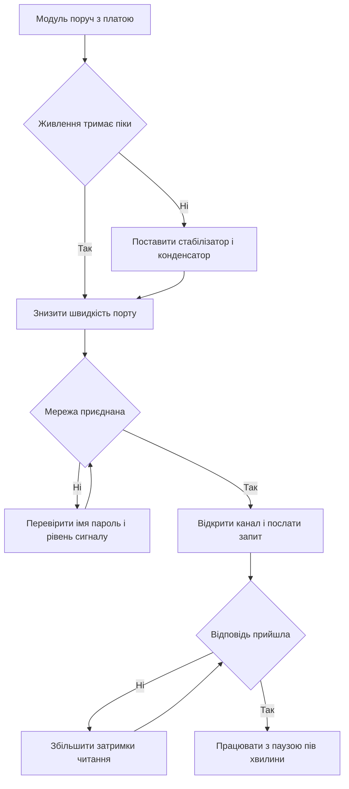

# ESP8266 поруч з Arduino - WiFi-модем

![[assets/img/arduino-esp01-scheme.png|600]]
*Рис. Модуль поруч з платою, окреме живлення три вольта, звязок через програмний порт і вихід у мережу.*

> [!tip] Призначення ноти
> Показати модемний режим модуля поруч з платою: яке живлення тримає піки струму, як говорити командами і коли плату лишати лише пультом.

## 1. Призначення

Модуль дає платі вихід у бездротову мережу без заміни самої плати.

Плата лишається головною: читає датчики, керує виходами, приймає рішення.

Модуль працює модемом: приймає команди через послідовний порт і сам веде обмін з мережею.

Таке поєднання зручне для модернізації готових вузлів, де код плати вже написаний.

Межа чесна: модемний режим повільніший і примхливіший за окрему плату з мережею на борту.

Ця нота закриває базу: живлення, запуск, команди, скетч клієнта і чесний перехід на окремий чип.

Базу послідовного порту дивись у ноті [[04-Shini/01-UART|послідовний порт]].

Живлення плати від зовнішнього блока описано у ноті [[02-Zhivlennya/01-Zhivlennya-VIN|живлення від VIN]].

## 2. Що таке ESP-01 у режимі модема

| Питання | Відповідь | Практичний сенс |
| --- | --- | --- |
| Вигляд | Маленька плата з вісьмома пінами і друкованою антеною | Ставиться у макетку через перехідник |
| Прошивка з коробки | Набір команд керування через текст | Плата шле рядки і читає відповіді |
| Роль | Модем поруч з головною платою | Головна плата не веде мережу сама |
| Напруга сигналів | Три вольта на всіх пінах | Пять вольтів на вхід заборонено |
| Струм | Середній малий, піки великі у момент передачі | Слабке живлення дає перезапуски |
| Швидкість з коробки | Висока швидкість порту дев'яносто шість тисяч | Для програмного порту її знижують |
| Антена | Доріжка на платі | Тримати далі від металу і дротів |

Модуль з коробки відповідає на короткі текстові команди і повертає коди результату.

Головна плата відкриває порт, шле команду, чекає відповідь з кодом добра.

Команди прості: перевірка звязку, пошук мереж, приєднання, відкриття з'єднання, відправка даних.

Швидкість з коробки зависока для програмного порту, тому першим кроком її знижують.

```text
Режими роботи модуля:

  Модем поруч з платою:
  плата керує, модуль веде мережу
  команди текстом, відповіді кодами

  Окремий чип:
  код виконується всередині модуля
  плата не потрібна взагалі

  Правило вибору:
  готовий вузол на платі ..... модем
  новий вузол з нуля ......... окремий чип
```

## 3. Живлення три вольта і піки струму

| Питання | Відповідь | Чому так |
| --- | --- | --- |
| Напруга живлення | Три цілих три десятих вольта | Вища напруга руйнує кристал |
| Пять вольтів на живлення | Заборонено | Модуль гріється і гине |
| Вихід три вольта на платі | Слабкий, піки не тримає | Модем перезапускається у момент передачі |
| Правильне рішення | Окремий стабілізатор з запасом струму | Піки закриваються без просадки |
| Конденсатор | Електроліт сотні мікрофарад плюс кераміка | Ставиться прямо біля пінів живлення |
| Земля | Спільна для плати, стабілізатора і модуля | Без спільної землі обмін рветься |
| Дроти живлення | Короткі і товсті | Довгі тонкі дають просадку |

Найчастіша причина дивних перезапусків це просадка у момент виходу в ефір.

Модуль у спокої бере мало, а у піку смикає струм коротким стрибком.

Слабкий вихід плати такий стрибок не тримає, напруга падає, кристал іде на старт.

Окремий стабілізатор з запасом і конденсатор біля пінів прибирають більшість таких стартів.

```text
Живлення з окремим стабілізатором:

  Зовнішній блок ------- стабілізатор на три вольта
                              |
  Плата GND ------------------+---------- модуль GND
  Плата порт ----------------------------- модуль порт
  Стабілізатор вихід -----+-------------- модуль VCC
                           |
  Конденсатор між VCC і GND
  якомога ближче до модуля

  Правило:
  землі зєднані,
  живлення коротке.
```

## 4. Підключення до плати

| Сигнал модуля | Куди вести | Сенс |
| --- | --- | --- |
| VCC | Вихід стабілізатора три вольта | Живлення кристала |
| GND | Спільна земля | Обов'язкова для всіх блоків |
| TX | Прийом програмного порту плати | Дані від модуля до плати |
| RX | Передача програмного порту плати через дільник | Дані від плати до модуля |
| CH_PD | Живлення три вольта через резистор | Дозвіл роботи кристала |
| RST | Живлення три вольта через резистор | Скидання високим рівнем |
| GPIO нуль | Живлення через резистор для роботи | Низький рівень лише для прошивки |
| GPIO два | Живлення через резистор | Не лишати висячим |

Сигнал дозволу підтягують до живлення, без нього кристал мовчить.

Сигнал скидання теж тримають високим, коротким замиканням на землю роблять перезапуск.

Лінію прийому модуля не годують пятьма вольтами безпосередньо, ставлять дільник з двох резисторів.

Лінію передачі модуля ведуть прямо на вхід плати, модуль видає три вольта, плата їх розуміє.

```text
Зєднання з програмним портом:

  Плата                     Модуль
  -------                   ------
  GND --------------------- GND
  10 прийом --------------- TX
  11 передача - дільник --- RX
  3V3 стабілізатор -------- VCC
  3V3 через резистор ------ CH_PD
  3V3 через резистор ------ RST

  Дільник на RX модуля:
  плата TX -- 1к -- вузол -- 2к -- GND
  вузол -------------------- RX модуля

  Правило:
  CH_PD високий,
  живлення три вольта.
```

## 5. AT-команди звязку

| Команда | Що робить | Яка відповідь добра |
| --- | --- | --- |
| Перевірка звязку | Питає чи живий кристал | Повертає добро |
| Скидання | Перезапускає кристал | Кристал стартує і вітається |
| Швидкість порту | Знижує швидкість для програмного порту | Підтвердження запису |
| Режим роботи | Ставить режим клієнта мережі | Підтвердження режиму |
| Пошук мереж | Показує сусідні мережі | Список імен і рівнів |
| Приєднання | Чіпляється до домашньої мережі | Підтвердження приєднання |
| Адреса | Показує видану адресу | Рядок з адресою |
| З'єднання | Відкриває канал до сервера | Підтвердження каналу |
| Відправка | Шле байти у відкритий канал | Прийнято і закрито |

Команди шлють великими літерами з кінцем рядка, відповідь приходить рядками з кодом.

Перша перевірка проста: послати запит звязку і дочекатись слова добра.

Далі ставлять режим клієнта, приєднуються до мережі і питають адресу.

Швидкість знижують один раз і запамятовують у модулі, далі працюють на низькій.

Пошук мереж роблять для перевірки антени: порожній список означає екран або далеку точку.

Хмару через окремий чип описано у ноті [[15-Protokoli/02-MQTT-ESP|хмара через ESP]].

## 6. Скетч WiFi-клієнта через програмний порт

Скетч говорить з модулем через програмний порт і раз на пів хвилини питає сторінку сервера.

Апаратний порт лишають для монітора: туди друкують відповіді модуля для очей.

Алгоритм простий: скидання, перевірка, приєднання, відкриття каналу, відправка запиту, читання відповіді.

Затримки між командами ставлять щедрі, модем відповідає повільніше за плату.

```cpp
#include <SoftwareSerial.h>

const int PIN_RX = 10;
const int PIN_TX = 11;

SoftwareSerial modem(PIN_RX, PIN_TX);

const char WIFI_NAME[] = "home-net";
const char WIFI_PASS[] = "secret-pass";
const char HOST[] = "192.168.1.50";
const int HOST_PORT = 80;

String ask(const String &cmd, unsigned long waitMs) {
  modem.print(cmd);
  modem.print("\r\n");
  unsigned long t0 = millis();
  String ans = "";
  while (millis() - t0 < waitMs) {
    while (modem.available()) {
      char c = (char)modem.read();
      ans += c;
      Serial.write(c);
    }
  }
  return ans;
}

bool waitWord(const String &ans, const char *word) {
  return ans.indexOf(word) >= 0;
}

void setup() {
  Serial.begin(9600);
  modem.begin(9600);
  Serial.println("modem start");
  delay(2000);
  ask("AT", 1000);
  ask("AT+CWMODE=1", 1000);
  String join = "AT+CWJAP=\"" + String(WIFI_NAME) + "\",\"" + String(WIFI_PASS) + "\"";
  String r = ask(join, 8000);
  if (waitWord(r, "OK")) {
    Serial.println("joined ok");
  } else {
    Serial.println("joined fail");
  }
  ask("AT+CIFSR", 2000);
}

void loop() {
  String get = "GET /data HTTP/1.0\r\nHost: 192.168.1.50\r\n\r\n";
  ask("AT+CIPSTART=\"TCP\",\"192.168.1.50\",80", 3000);
  String s = "AT+CIPSEND=" + String(get.length());
  ask(s, 1000);
  String r = ask(get, 5000);
  if (waitWord(r, "OK") || waitWord(r, "+IPD")) {
    Serial.println("sent ok");
  } else {
    Serial.println("sent fail");
  }
  ask("AT+CIPCLOSE", 1000);
  delay(30000);
}
```

Швидкість програмного порту ставлять низьку з обох боків, інакше лізуть сміттєві знаки.

Імя мережі і пароль вписують свої, довгі пробіли і кирилицю в імені прибирають.

Адресу сервера беруть числову, імена вузлів модем розуміє гірше.

Відповідь читають до кінця затримки, коротка затримка ріже хвіст сторінки.

## 7. Коли замість модема взяти окремий чип

| Ознака | Лишити модем | Взяти окремий чип |
| --- | --- | --- |
| Плата вже зібрана | Так, модем додається дротами | Ні, переробка зайва |
| Вільна памяті плати | Мало коду для мережі | Багато логіки, памяті не вистачає |
| Швидкість обміну | Рідкі короткі запити | Часті запити і відповіді |
| Надійність | Достатня для дослідів | Потрібна стабільна служба |
| Живлення вузла | Є місце під стабілізатор | Вузол живиться від батареї |
| Ціна нового вузла | Модуль дешевший за плату | Окремий чип дешевший за пару |

Окремий чип веде мережу сам і не ганяє текст через повільний програмний порт.

Код плати переїздить всередину чипа майже без змін, додається лише мережева частина.

Для батарейних вузлів окремий чип спить між вимірами і бере мізерний струм.

Радіоканал малої дальності описано у ноті [[12-Moduli-zvyazku/01-NRF24|радіомодуль]].

Координати з неба для рухомих вузлів описані у ноті [[12-Moduli-zvyazku/04-GPS-NEO|координати з неба]].

## 8. Mermaid: запуск модема



Схема читається згори вниз: спочатку живлення, потім швидкість, потім мережа, потім обмін.

Живлення вирішує більшість перезапусків, код винен рідше.

Швидкість знижують один раз, далі працюють на низькій для стабільності.

Паузу між запитами тримають щедру, частий стукіт ріже з'єднання.

## Типові помилки

| # | Помилка | Чому погано | Як правильно |
| --- | --- | --- | --- |
| 1 | Живлення від виходу плати три вольта | Піки саджають напругу і дають перезапуск | Окремий стабілізатор з запасом і конденсатор біля пінів |
| 2 | Пять вольтів на вхід прийому модуля | Вхід гріється і деградує | Дільник з двох резисторів між платою і входом модуля |
| 3 | Сигнал дозволу висить у повітрі | Кристал не стартує або стартує через раз | Підтягнути дозвіл до живлення через резистор |
| 4 | Висока швидкість на програмному порту | Сміттєві знаки і рвані відповіді | Знизити швидкість і працювати на низькій |
| 5 | Короткі затримки читання відповіді | Хвіст відповіді губиться | Читати з запасом часу і друкувати все у монітор |
| 6 | Часті запити без паузи | Сервер ріже з'єднання, модуль висне | Пауза пів хвилини між запитами, канал закривати |

## Офіційні джерела

- [Довідка SoftwareSerial на arduino.cc](https://www.arduino.cc/en/Reference/SoftwareSerial) - програмний порт, швидкості, межі прийому і приклад обміну.
- [Довідка Serial на arduino.cc](https://www.arduino.cc/en/Reference/Serial) - апаратний порт, монітор, швидкості і читання рядків.
- [Набір команд ESP-AT на docs.espressif.com](https://docs.espressif.com/projects/esp-at/en/latest/esp32/AT_Command_Set/index.html) - перевірка звязку, приєднання, відкриття каналу і відправка даних.

## Див. також

- [[Home]]
- [[04-Shini/01-UART|послідовний порт]]
- [[02-Zhivlennya/01-Zhivlennya-VIN|живлення від VIN]]
- [[12-Moduli-zvyazku/01-NRF24|радіомодуль]]
- [[12-Moduli-zvyazku/04-GPS-NEO|координати з неба]]
- [[15-Protokoli/02-MQTT-ESP|хмара через ESP]]
