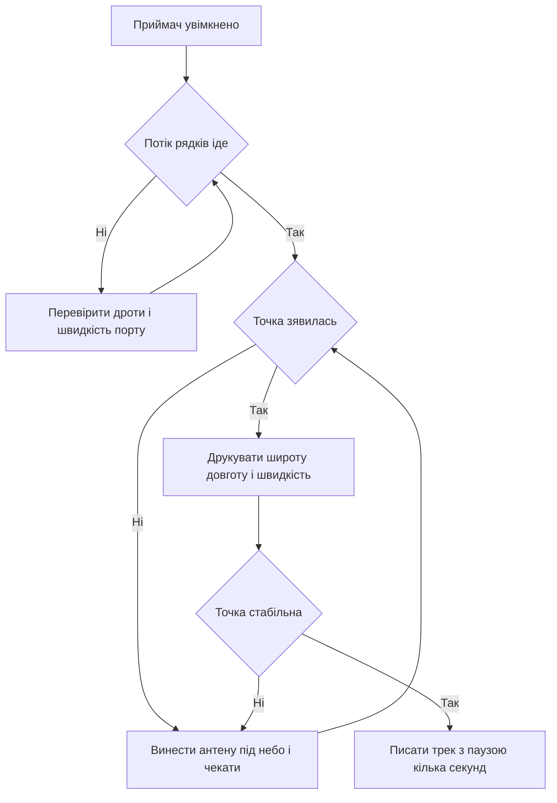

# GPS NEO - координати на Arduino

![[assets/img/arduino-gps-scheme.png|600]]
*Рис. Приймач з антеною під небом, звязок через програмний порт, плата друкує широту довготу і швидкість.*

> [!tip] Призначення ноти
> Навчити брати координати з неба: куди покласти антену, як читати речення, як дочекатись першого фіксу і як зібрати трекер зі швидкістю.

## 1. Призначення

Приймач дає платі місце на планеті: широту, довготу, висоту, час і швидкість руху.

Плата сама нічого не міряє, вона лише слухає потік рядків і витягає з них числа.

Таке поєднання підходить для трекерів, годинників, метеостанцій з міткою місця і рухомих макетів.

Межа чесна: у кімнаті під дахом фіксу немає, точність метри, а не сантиметри.

Ця нота закриває практику: речення, антена, бібліотека, старт, імпульс секунди і скетч трекера.

Базу послідовного порту дивись у ноті [[04-Shini/01-UART|послідовний порт]].

Живлення плати від зовнішнього блока описано у ноті [[02-Zhivlennya/01-Zhivlennya-VIN|живлення від VIN]].

## 2. Що вміє приймач

| Параметр | Значення | Практичний сенс |
| --- | --- | --- |
| Родина | Модулі з антеною і кристалом прийому | Беруть для дослідів з готовим портом |
| Вихід | Потік текстових речень раз на секунду | Плата читає і розбирає рядки |
| Швидкість порту | Девять тисяч шістсот з коробки | Програмний порт встигає |
| Живлення | Три або пять вольтів за написом на платі | Дивитись напис біля гребінки |
| Антена | Керамічна латка або зовнішня на кабелі | Без неба фіксу немає |
| Точність | Метри на відкритій місцевості | Для кімнати не годиться |
| Час старту | Від пів хвилини до багатьох хвилин | Залежить від пам'яті ефемерид |

Приймач слухає супутники і сам рахує місце, платі лишається читати готовий результат.

Рядки йдуть безперервно, навіть без фіксу, порожні поля означають очікування супутників.

Світлодіод імпульсу секунди блимає після фіксу раз на секунду, до фіксу мовчить або світить постійно.

Плату для першого досліду виносять ближче до вікна, а краще на подвіря.

```text
Склад вузла:

  Приймач .......... плата з кристалом
  Антена ........... латка або гриб на кабелі
  Плата ............ слухає потік рядків
  Живлення ......... за написом на гребінці

  Правило:
  антена дивиться в небо,
  плата лише читає.
```

## 3. Речення потоку на швидкості дев'ять тисяч шістсот

| Речення | Що несе | Навіщо плати |
| --- | --- | --- |
| Координати широти і довготи | Місце і час виміру | Точка на карті |
| Швидкість і курс | Вузли і градуси | Трекер руху |
| Дата і час | День і секунди всесвітнього часу | Годинник без мережі |
| Висота | Метри над морем | Профіль маршруту |
| Супутники | Кількість видимих і рівень | Діагностика прийому |
| Ознака фіксу | Літера порожньо або актив | Розуміти чи вірити точці |
| Контрольна сума | Хвостове число рядка | Відсікати биті рядки |

Рядки починаються знаком долара і закінчуються контрольною сумою після зірочки.

Плата не розбирає рядки вручну, для цього беруть готову бібліотеку розбору.

Вручну дивляться лише у моніторі порту для перевірки: чи йде потік і чи є ознака фіксу.

Биті рядки з невірною сумою бібліотека мовчки відкидає, це нормально для ефіру.

```text
Вигляд потоку:

  долар, ім'я, поля через кому, зірочка, сума
  один рядок = один вимір або статус

  Приклад будови:
  початок - долар
  середина - числа через кому
  кінець - зірочка і два знаки

  Правило:
  порожні поля - фіксу нема,
  заповнені - точка є.
```

## 4. Антена з видом на небо

| Питання | Відповідь | Чому так |
| --- | --- | --- |
| Де тримати | Латкою догори під відкритим небом | Сигнал з орбіти слабкий |
| Вікно | Біля скла гірше, але інколи ловить | Скло і стіни ріжуть рівень |
| Кімната всередині | Фіксу немає | Залізобетон закриває небо |
| Метал поруч | Прибирати набік | Екран глушить прийом |
| Довгий кабель | Зовнішню антену на підвіконня | Активна антена має підсилювач |
| Перший запуск | Подвіря або балкон | Чекати фіксу терпляче |
| Корпус макета | Пластик, не метал | Метал робить тінь |

Антена латка приймає верхню півсферу, тому її кладуть горизонтально розємом донизу.

Зовнішній гриб на кабелі чіпляють на метал даху машини як на екран, у полі кладуть на пластик.

Під час першого досліду плату живлять від компютера довгим дротом і виносять антену до вікна.

Рівень сигналу дивляться у реченні про супутники: мало супутників означає погане небо.

Хмара через плату з мережею описана у ноті [[15-Protokoli/02-MQTT-ESP|хмара через ESP]].

## 5. Холодний і теплий старт

| Старт | Коли буває | Скільки чекати |
| --- | --- | --- |
| Холодний | Перше вмикання або переїзд далеко | Багато хвилин пошуку неба |
| Теплий | Вмикання наступного дня на тому самому місці | Близько хвилини |
| Гарячий | Коротка пауза без втрати живлення | Пів хвилини або швидше |
| Резервна батарейка | Тримає годинник і пам'ять орбіт | Прискорює теплий старт |
| Без батарейки | Пам'ять губиться при кожному вимиканні | Кожен старт як холодний |
| Рух під час старту | Пошук довший | Стояти на місці до фіксу |
| Тінь і стіни | Пошук довший | Вийти на відкрите місце |

Пам'ять орбіт старіє за кілька годин, вчорашній старт сьогодні вже не гарячий.

Резервна батарейка на платі тримає годинник кілька годин, її наявність видно як круглий тримач.

Після переїзду в інше місто приймач шукає небо заново, це нормальна поведінка.

Під час очікування фіксу плату не смикають, антену не крутять, порт лише слухають.

```text
Очікування фіксу:

  Вмикання .................... потік іде, точка порожня
  Хвилина ..................... супутники зявляються
  Фікс ........................ поля заповнені, імпульс блимає

  Правило:
  стояти на місці,
  антеною догори.
```

## 6. Бібліотека розбору

| Дія | Виклик | Коментар |
| --- | --- | --- |
| Підключити | Підключити заголовок розбору | На початку скетча |
| Створити | Створити обєкт розбору | Один на весь скетч |
| Порт | Відкрити програмний порт на низькій швидкості | Швидкість збігається з приймачем |
| Годувати | Віддавати кожен знак у розбір | У циклі без затримок |
| Точка | Питати широту і довготу | Перевіряти ознаку свіжості |
| Швидкість | Питати вузли і кілометри | Для трекера руху |
| Час | Питати годину і дату | Всесвітній час, пояс рахувати самому |
| Супутники | Питати кількість | Діагностика неба |

Бібліотеку ставлять через менеджер за назвою розбору, приклад трекера відкривають з меню.

Головне правило: годувати розбір кожним знаком без пауз, довгі затримки гублять рядки.

Числа координат беруть у вигляді десяткових градусів, так зручно писати у журнал.

Ознаку свіжості перевіряють перед записом: стара точка гірша за відсутність.

## 7. Імпульс секунди

| Питання | Відповідь | Практика |
| --- | --- | --- |
| Що це | Короткий імпульс раз на секунду | Точна мітка часу |
| Коли є | Лише після фіксу | До фіксу мовчить |
| Куди вести | На вхід переривання плати | Для годинника і синхронізації |
| Тривалість | Мікросекунди, оком видно як блим | Світлодіод повторює імпульс |
| Навіщо | Синхронізація вимірів і міток | Точніше за програмні затримки |
| Без нього | Можна працювати лише з рядками | Для трекера вистачає рядків |
| Перевірка | Світлодіод блимає раз на секунду | Значить фікс є |

Імпульс використовують для точного годинника: переривання ставить мітку, рядки дають числа.

Для простого трекера імпульс не обов'язковий, досить читати рядки раз на секунду.

Світлодіод на платі приймача повторює імпульс і служить індикатором фіксу здалеку.

Довгі дроти імпульсу ведуть крученою парою з землею, щоб не ловити шум.

Радіоканал малої дальності описано у ноті [[12-Moduli-zvyazku/01-NRF24|радіомодуль]].

Модем поруч з платою описано у ноті [[12-Moduli-zvyazku/03-ESP8266-WiFi|WiFi поруч]].

## 8. Скетч трекера зі швидкістю

Трекер друкує час, широту, довготу і швидкість раз на кілька секунд.

Годування розбору йде у кожному колі, друк лише коли прийшла свіжа порція.

```cpp
#include <SoftwareSerial.h>
#include <TinyGPS++.h>

const int PIN_RX = 4;
const int PIN_TX = 3;

SoftwareSerial gpsPort(PIN_RX, PIN_TX);
TinyGPSPlus gps;

unsigned long lastPrint = 0;

void setup() {
  Serial.begin(9600);
  gpsPort.begin(9600);
  Serial.println("gps tracker start");
  Serial.println("wait fix near window");
}

void loop() {
  while (gpsPort.available()) {
    char c = (char)gpsPort.read();
    gps.encode(c);
  }
  if (millis() - lastPrint > 3000) {
    lastPrint = millis();
    Serial.print("sats ");
    Serial.print(gps.satellites.value());
    Serial.print(" fix ");
    if (gps.location.isValid() && gps.location.isUpdated()) {
      Serial.print("yes ");
    } else {
      Serial.print("no ");
    }
    Serial.print("lat ");
    if (gps.location.isValid()) {
      Serial.print(gps.location.lat(), 6);
    } else {
      Serial.print("--");
    }
    Serial.print(" lng ");
    if (gps.location.isValid()) {
      Serial.print(gps.location.lng(), 6);
    } else {
      Serial.print("--");
    }
    Serial.print(" kmh ");
    if (gps.speed.isValid()) {
      Serial.print(gps.speed.kmph());
    } else {
      Serial.print("--");
    }
    Serial.print(" time ");
    if (gps.time.isValid()) {
      Serial.print(gps.time.hour());
      Serial.print(":");
      Serial.print(gps.time.minute());
      Serial.print(":");
      Serial.print(gps.time.second());
    } else {
      Serial.print("--");
    }
    Serial.println();
  }
  if (millis() > 5000 && gps.charsProcessed() < 10) {
    Serial.println("no data: check wires");
    delay(5000);
  }
}
```

Порт приймача ведуть на вказані піни: передача приймача на прийом плати і навпаки.

Швидкість з обох боків однакова низька, інакше потік рветься.

Перевірка дротів проста: лічильник знаків росте, порожній лічильник означає обрив.

Свіжість точки перевіряють перед записом на картку, стару точку не пишуть.

## 9. Mermaid: від вмикання до точки



Схема читається згори вниз: спочатку потік, потім небо, потім точка, потім запис.

Потік без точки означає живий приймач під дахом.

Точку чекають на місці, рух відкладають до стабільного фіксу.

Запис ведуть з паузою, щосекундний запис швидко забиває памяті.

## Типові помилки

| # | Помилка | Чому погано | Як правильно |
| --- | --- | --- | --- |
| 1 | Дослід у глибині кімнати | Дах закриває небо, фіксу немає | Антена на балкон або подвіря латкою догори |
| 2 | Переплутані прийом і передача | Потік не йде, лічильник порожній | Передача приймача на прийом плати і навпаки |
| 3 | Чужа швидкість порту | Сміттєві знаки замість рядків | Низька швидкість з обох боків за написом |
| 4 | Довгі затримки у циклі | Знаки губляться, розбір мовчить | Годувати розбір без пауз, друк окремо за часом |
| 5 | Запис старої точки | Трек веде у минуле | Перевіряти свіжість перед кожним записом |
| 6 | Живлення за чужим написом | Пять вольтів на тривольтову плату дають перегрів | Читати напис біля гребінки і міряти перед пуском |

## Офіційні джерела

- [Бібліотека TinyGPSPlus на docs.arduino.cc](https://docs.arduino.cc/libraries/tinygpsplus/) - встановлення, приклад трекера, опис полів місця швидкості і часу.
- [Довідка SoftwareSerial на arduino.cc](https://www.arduino.cc/en/Reference/SoftwareSerial) - програмний порт, швидкості, межі прийому і приклад обміну.
- [Довідка Serial на arduino.cc](https://www.arduino.cc/en/Reference/Serial) - апаратний порт, монітор, друк чисел з крапкою і читання рядків.

## Див. також

- [[Home]]
- [[04-Shini/01-UART|послідовний порт]]
- [[02-Zhivlennya/01-Zhivlennya-VIN|живлення від VIN]]
- [[12-Moduli-zvyazku/01-NRF24|радіомодуль]]
- [[12-Moduli-zvyazku/03-ESP8266-WiFi|WiFi поруч]]
- [[15-Protokoli/02-MQTT-ESP|хмара через ESP]]
