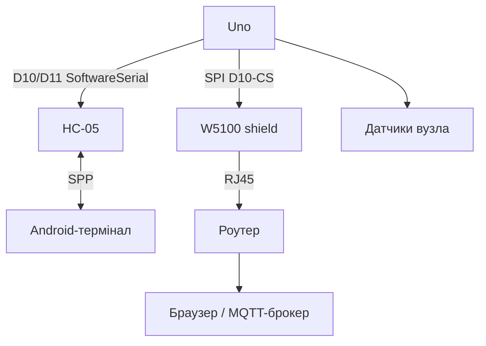

# Arduino і безпровідність - Bluetooth HC-05 та Ethernet-шилд

![[assets/img/ard-bt-ethernet-scheme.png|600]]
*Рис. HC-05 - прозорий SPP-міст на UART, Ethernet-шилд W5100 - повноцінний TCP-сервер по SPI.*

> [!tip] Що це за нота
> Два класичні способи вивести Arduino в світ: HC-05 (телефон як пульт/термінал) і Ethernet-шилд (веб-сервер без WiFi). Обидва - зразки «зробив за вечір». База: [[12-Moduli-zvyazku/03-ESP8266-WiFi|WiFi через ESP8266]], [[04-Shini/01-UART|шина UART]], [[04-Shini/02-SPI|шина SPI]].

## 1. Мета

Дати Arduino зв'язок під задачу:

- HC-05: керування з Android-термінала, телеметрія в телефон;
- Ethernet-шилд: веб-сторінка з кнопками, MQTT без радіо;
- обидва - бібліотеки з коробки (SoftwareSerial, Ethernet);
- чіткий вибір: мобільність чи стабільність.

| Критерій | HC-05 | Ethernet-шилд W5100 |
| --- | --- | --- |
| Середовище | ефір, 10 м | кабель, весь світ |
| Швидкість | ~30 КБ/с | мегабіти |
| Живлення | міліампери | ~200 мА сам шилд |
| Телефон | SPP-термінал | браузер |
| iPhone | не працює (SPP закритий) | працює |

## 2. Архітектура



Увага на пін D10: Ethernet-шилд використовує D10 як CS. HC-05 вішаємо на інші піни (D2/D3 або D7/D8), конфліктів не буде.

## 3. HC-05: мінімум

- живлення 5V (модуль), логіка 3.3V - TX Arduino через подільник 1к/2к;
- швидкість за замовчуванням 9600, міняємо AT-командою;
- AT-режим: KEY в HIGH до вмикання, порт 38400;
- команди: `AT+NAME=Arduino`, `AT+PSWD=1234`, `AT+UART=9600,0,0`;
- спарювання з Android, далі - прозорий міст байтів.

## 4. Ethernet-шилд: мінімум

- W5100 (старий синій шилд) або W5500 (новий);
- бібліотека Ethernet з коробки, приклад WebServer;
- MAC - зі стікера шилда, IP - DHCP або статика;
- SD-слот на шилді - логи і веб-сторінки з картки;
- струм: шилд + Uno ≈ 300 мА, USB вистачить впритул, краще БЖ 9V.

## 5. Робочий код

```cpp
#include <SoftwareSerial.h>
#include <SPI.h>
#include <Ethernet.h>

SoftwareSerial bt(7, 8);
byte mac[] = {0xDE, 0xAD, 0xBE, 0xEF, 0xFE, 0xED};
EthernetServer server(80);
String cmd = "";

void setup() {
  Serial.begin(115200);
  bt.begin(9600);
  Ethernet.begin(mac);
  server.begin();
  pinMode(5, OUTPUT);
  pinMode(6, OUTPUT);
}

void handle_bt() {
  while (bt.available()) {
    char c = bt.read();
    if (c == '\n') {
      if (cmd == "LED1") digitalWrite(5, HIGH);
      if (cmd == "LED0") digitalWrite(5, LOW);
      if (cmd.startsWith("PWM")) {
        analogWrite(6, cmd.substring(3).toInt());
      }
      bt.println("OK:" + cmd);
      cmd = "";
    } else if (c != '\r') {
      cmd += c;
    }
  }
}

void handle_web() {
  EthernetClient cl = server.available();
  if (!cl) return;
  String req = "";
  while (cl.connected()) {
    if (cl.available()) {
      char c = cl.read();
      req += c;
      if (req.endsWith("\r\n\r\n")) break;
    }
  }
  if (req.indexOf("GET /on") >= 0) digitalWrite(5, HIGH);
  if (req.indexOf("GET /off") >= 0) digitalWrite(5, LOW);
  cl.println("HTTP/1.1 200 OK");
  cl.println("Content-Type: text/html");
  cl.println();
  cl.println("<a href=/on>ON</a> <a href=/off>OFF</a>");
  cl.stop();
}

void loop() {
  handle_bt();
  handle_web();
}
```

Протокол BT - текстові команди з `\n`: `LED1`, `PWM128`. Веб - дві лінки, без CSS/JS: сторінка важить байти, а не кілобайти.

## 6. Живлення і монтаж

- HC-05 на 5V піні Uno - струм 40 мА, ок;
- шилд на USB - межа: при просадках додати БЖ 9V у VIN;
- антена HC-05 - доріжка на платі, не закривати металом;
- кабель Ethernet - до 100 м, PoE шилд не підтримує.

## 7. Розширення

- BT + реле = розумна розетка з телефона;
- Ethernet + SD = логер з веб-мордою;
- обидва разом - шлюз BT→LAN для датчиків без WiFi;
- далі - [[15-Protokoli/03-HTTP-Web|HTTP і веб-клієнт]] для виходу в хмару.

## 8. Типові помилки

| Симптом | Причина | Лікування |
| --- | --- | --- |
| HC-05 не відповідає на AT | немає KEY або швидкість не 38400 | KEY в HIGH до живлення, порт 38400 |
| Телефон спарився, даних немає | термінал не підключився (лише пара) | натиснути «connect» у застосунку |
| Ethernet 0.0.0.0 | немає DHCP або кабель | статика 192.168.1.177, перевірити лінки |
| Шилд гріється і висне | живлення з USB на межі | БЖ 9V 1A у VIN |
| Конфлікт D10 | HC-05 на пінах шилда | BT на D7/D8, шилд лишити D10-D13 |
| iPhone не бачить HC-05 | iOS без SPP | тільки BLE-модулі (див. STM32-базу) |

## 9. Суміжні ноти

- [[12-Moduli-zvyazku/03-ESP8266-WiFi|WiFi через ESP8266]] - безпровідна альтернатива.
- [[12-Moduli-zvyazku/01-NRF24|радіо NRF24]] - дешевше за BT на вузол.
- [[04-Shini/01-UART|шина UART]] - SoftwareSerial і обмеження.
- [[04-Shini/02-SPI|шина SPI]] - CS-лінії шилда.
- [[15-Protokoli/03-HTTP-Web|HTTP і веб-клієнт]] - клієнтська сторона.

## Офіційні джерела

- [HC-05 Bluetooth Module (Components101)](https://components101.com/wireless/hc-05-bluetooth-module) - піни, AT, режими.
- [Ethernet Shield Rev2 (Arduino docs)](https://docs.arduino.cc/hardware/ethernet-shield-rev2/) - W5500, SD-слот, бібліотека.
- [Language Reference (Arduino docs)](https://docs.arduino.cc/language-reference/) - SoftwareSerial, Ethernet, SPI.
