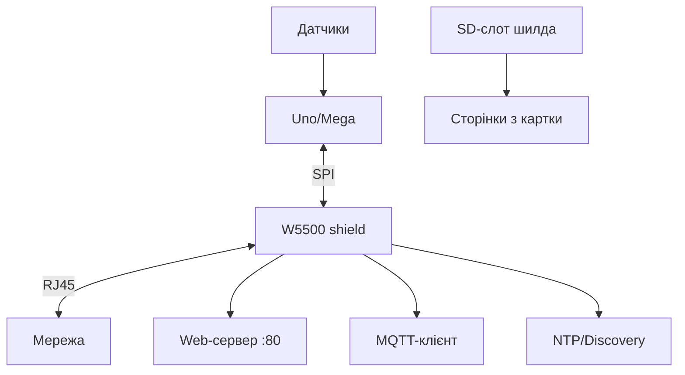

# Arduino Ethernet глибоко - W5500, сокети і веб-сервер

![[assets/img/ard-ethernet-w5500-deep-scheme.png|600]]
*Рис. Шилд на SPI: W5500 тримає TCP/IP, Arduino віддає сторінку і MQTT - провід замість радіо.*

> [!tip] Що це за нота
> Глибина поверх BT/Ethernet-огляду: сокети, сервер, MQTT, PoE-нюанси. Шилд: [[12-Moduli-zvyazku/05-BT-Ethernet|BT і Ethernet оглядово]], HTTP-клієнт: [[15-Protokoli/03-HTTP-Web|HTTP-клієнт]].

## 1. Мета

Вичавити з шилда максимум:

- W5100 vs W5500: чим новий кращий (буфери, SPI-швидкість);
- Ethernet-бібліотека: клієнт, сервер, UDP;
- веб-сервер статусу вузла з кнопками;
- MQTT-клієнт поверх Ethernet;
- PoE-варіант шилда для стелі.

| Шилд | Чип | Сокети | Буфер |
| --- | --- | --- | --- |
| Ethernet Shield R3 | W5100 | 4 | 16 КБ |
| Ethernet Shield 2 | W5500 | 8 | 32 КБ |
| Китайські W5500-модулі | W5500 | 8 | 32 КБ |

## 2. Архітектура



SD-слот на шилді - окрема радість: веб-морда і логи на картці, скетч худий.

## 3. Розпіновка шилда

| Сигнал | Пін Uno | Примітка |
| --- | --- | --- |
| MOSI/MISO/SCK | D11/D12/D13 | апаратний SPI |
| CS Ethernet | D10 | не чіпати! |
| CS SD-карти | D4 | не чіпати! |
| INT | D2 (опційно) | переривання сокетів |
| 5V/GND | живлення | ~200 мА сам шилд |

D10 і D4 зайняті шилдом завжди - навіть якщо SD не використовуємо. Врахувати в плануванні пінів.

## 4. Бібліотека Ethernet детально

- `Ethernet.begin(mac)` - DHCP, `Ethernet.begin(mac, ip)` - статика;
- `EthernetServer(80)` + `available()` - клієнти по черзі;
- `EthernetClient` - вихідні з'єднання (HTTP/MQTT);
- `Ethernet.maintain()` - продовження DHCP-оренди;
- `EthernetUDP` - NTP, discovery, syslog.

## 5. Робочий код (C, Arduino)

```cpp
#include <SPI.h>
#include <Ethernet.h>
#include <SD.h>

byte mac[] = {0xDE, 0xAD, 0xBE, 0xEF, 0xFE, 0x02};
EthernetServer server(80);

void setup() {
  Serial.begin(115200);
  Ethernet.begin(mac, IPAddress(192, 168, 1, 178));
  server.begin();
  SD.begin(4);
}

void handle(EthernetClient &cl, const String &req) {
  if (req.indexOf("GET /on") >= 0) digitalWrite(5, HIGH);
  if (req.indexOf("GET /off") >= 0) digitalWrite(5, LOW);
  File f = SD.open("index.htm");
  cl.println("HTTP/1.1 200 OK");
  cl.println("Content-Type: text/html");
  cl.println();
  while (f.available()) cl.write(f.read());
  f.close();
  cl.stop();
}

void loop() {
  EthernetClient cl = server.available();
  if (!cl) return;
  String req;
  while (cl.connected()) {
    if (cl.available()) {
      char c = cl.read();
      req += c;
      if (req.endsWith("\r\n\r\n")) break;
    }
  }
  handle(cl, req);
}
```

Сторінка `index.htm` лежить на SD: правимо без перепрошивки.

## 6. Робочий код (MicroPython)

```python
# MicroPython: Ethernet-вузол через W5500-SPI
import network
import time
from machine import Pin, SPI

spi = SPI(1, baudrate=40000000, sck=Pin(10), mosi=Pin(11), miso=Pin(12))
nic = network.WIZNET5K(spi, Pin(13), Pin(14))
nic.active(True)
nic.ifconfig(('192.168.1.178', '255.255.255.0', '192.168.1.1', '8.8.8.8'))

import usocket
srv = usocket.socket()
srv.bind(('0.0.0.0', 80))
srv.listen(1)
led = Pin(5, Pin.OUT)

while True:
    cl, _ = srv.accept()
    req = cl.recv(512).decode()
    if 'GET /on' in req:
        led.value(1)
    if 'GET /off' in req:
        led.value(0)
    cl.send('HTTP/1.1 200 OK\r\nContent-Type: text/html\r\n\r\n'
            '<a href=/on>ON</a> <a href=/off>OFF</a>')
    cl.close()
```

Той же W5500, той же SPI - код один в один за логікою. Піни під свою плату.

## 7. MQTT поверх Ethernet

- PubSubClient з `EthernetClient` замість WiFi;
- keepalive 60, перепідключення в циклі;
- LWT-топік про смерть вузла;
- локальний брокер - затримки мілісекунди;
- QoS 0 для телеметрії, QoS 1 для команд.

## 8. Типові помилки

| Симптом | Причина | Лікування |
| --- | --- | --- |
| 0.0.0.0 замість IP | немає DHCP/кабелю | статика для тесту, інший кабель |
| Сторінка рветься | клієнт не закритий | `stop()` після відповіді |
| SD і Ethernet конфліктують | CS переплутані | Ethernet D10, SD D4 - святе |
| Працює хвилину і висне | немає maintain() при DHCP | викликати або статика |
| Повільно вантажиться | великий index.htm | стиснути сторінку, без картинок |
| Шилд гріється | перевірити струм споживання | до 200 мА норма, більше - КЗ |

## 9. Швидка шпаргалка Ethernet

- D10/D4 зайняті завжди;
- статика надійніша за DHCP;
- сторінки на SD, не в скетчі;
- клієнта закривати завжди;
- PoE - для стелі і шаф.

## 10. Суміжні ноти

- [[12-Moduli-zvyazku/05-BT-Ethernet|BT і Ethernet оглядово]] - стартова нота.
- [[15-Protokoli/03-HTTP-Web|HTTP-клієнт]] - веб-сторона.
- [[15-Protokoli/02-MQTT-ESP|MQTT протокол]] - верхній протокол.
- [[04-Shini/02-SPI|шина SPI]] - транспорт шилда.
- [[Home|головна карта]] - повна навігація.

## Офіційні джерела

- [Ethernet Shield Rev2 (Arduino docs)](https://docs.arduino.cc/hardware/ethernet-shield-rev2/) - W5500, SD-слот, піни.
- [ArduinoHttpClient (GitHub)](https://github.com/arduino-libraries/ArduinoHttpClient) - HTTP поверх Ethernet.
- [Language Reference (Arduino docs)](https://docs.arduino.cc/language-reference/) - SPI, SD, Ethernet.
