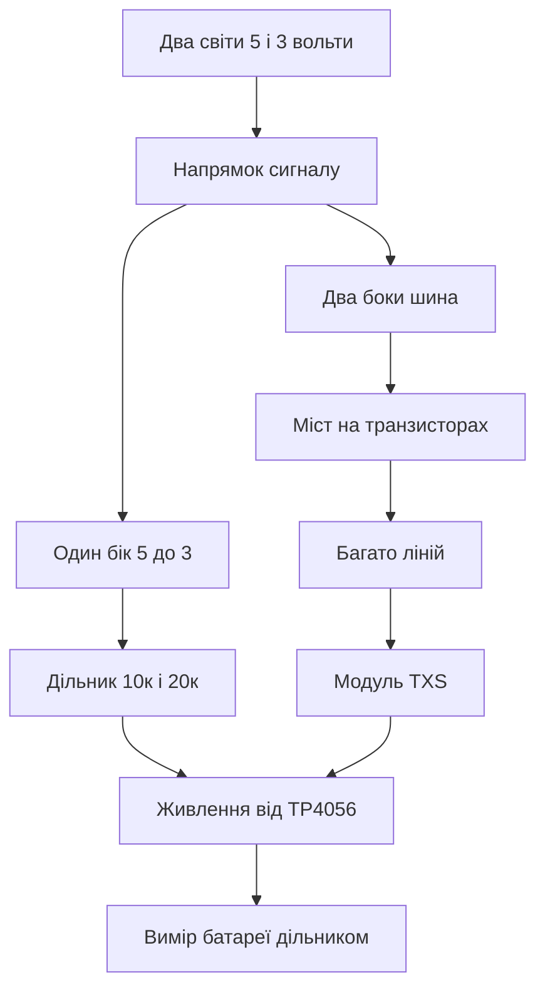

# Рівні і заряд - 3.3В та Li-Ion

![[assets/img/arduino-level-scheme.png|600]]
*Рис. Узгодження рівнів між пятьма і трьома вольтами та заряд літієвого акумулятора модулем.*

> [!tip] Призначення ноти
> Навчити зєднувати пять вольт з три вольти без диму і заряджати літій без феєрверків.

## 1. Призначення

Плата Уно говорить рівнями нуль і пять вольт. Сучасні датчики і радіомодулі говорять нуль і 3.3 вольта. Пряме з'єднання виходу пять вольт у вхід три вольти перевантажує вхід, гріє захист і з часом вбиває чип. Тому між світами ставлять узгодження рівнів.

Друга половина ноти це живлення від літію. Вузол у полі не має розетки, тому живе від акумулятора 18650. Акумулятор треба правильно заряджати і не доводити до глибокого розряду. Для цього беруть дешевий модуль заряду TP4056 з захистом DW01.

Після ноти вмітимеш три речі. Знизити пять вольт до трьох подільником для повільних ліній, пропустити шину I2C через міст на транзисторах, виміряти батарею дільником і не спалити вхід.

## 2. Чому рівні не можна змішувати

| Звязка | Що буде | Висновок |
| --- | --- | --- |
| Вихід 5В у вхід 3.3В | Струм через захист входу | Так не можна |
| Вихід 3.3В у вхід 5В Уно | Часто читається як одиниця | Працює, але на межі |
| Два виходи назустріч | Коротке через ключі | Так не можна ніколи |
| Живлення 5В на пін 3.3В модуля | Перегрів і смерть | Так не можна |

Вхід плати Уно бачить одиницю приблизно від трьох вольт, тому відповідь модуля 3.3 вольта читається нормально. А от вхід модуля від пяти вольт плати страждає. Саме цей напрямок і треба ослаблювати.

```text
Напрямки узгодження:
  Уно TX 5В ----ослабити----> RX модуля 3.3В
  Модуль TX 3.3В ----прямо----> Уно RX 5В читається як одиниця
  Шина I2C SDA SCL ----міст---- в обидва боки
  Живлення не плутати: 5В і 3.3В окремі шини
```

## 3. Дільник для повільних входів

| Параметр | Значення | Коментар |
| --- | --- | --- |
| Вхід 5 В | Резистор 10к до входу модуля | Перший плече подільника |
| Вихід на модуль | Резистор 20к до землі | Дає близько 3.3 В |
| Швидкість | До 115200 бод | Для UART і керування вистачає |
| Споживання | Близько 0.17 мА | Не садить батарею |
| Точність | Плюс мінус пять відсотків | Входу достатньо |

Формула проста. Напруга на нижньому резисторі дорівнює вхідній помноженій на відношення нижнього до суми. Десять і двадцять кілоом дають дві третини від пяти, тобто близько 3.3 вольта. Резистори беруть точністю пять відсотків, цього досить.

Дільник підходить для повільних ліній. Кнопки, керування, програмний UART, сигнали вибору. Для швидкої шини SPI на мегагерцах дільник завалює фронти, там беруть активний перетворювач.

## 4. Міст для шини I2C

| Елемент | Призначення |
| --- | --- |
| Два транзистори MOSFET | По одному на SDA і SCL |
| Підтяжки до 5 В з боку Ардуіно | 4.7к на кожну лінію |
| Підтяжки до 3.3 В з боку датчика | 4.7к на кожну лінію |
| Спільна земля | Без неї міст не працює |
| Готові модулі | Чотири або вісім каналів одразу |

Шина I2C двобічна, тому подільник там не працює. Беруть міст на транзисторах. Класична схема з двома N канальними транзисторами пропускає нуль в обидва боки, а одиницю підтягує кожна сторона до своєї напруги. Готовий модуль з написом level converter робить те саме з коробки.

Підключення уважне. Сторона HV до пяти вольт і плати Уно, сторона LV до трьох вольт і датчика. Живлення обох сторін подають обов'язково, бо підтяжки без живлення не працюють. Землі зєднують.

## 5. Модулі TXS і готові рішення

| Модуль | Канали | Швидкість | Коли брати |
| --- | --- | --- | --- |
| Подільник з резисторів | Один напрямок | Повільно | Один дріт UART |
| MOSFET міст | Два або чотири | До 400 кГц I2C | Датчики по I2C |
| TXS0108 | Вісім | До SPI частот | Багато ліній разом |
| TXB0108 | Вісім | Швидко | Лише поштовх без підтяжок |

Модулі TXS зручні для купи ліній. Вісім каналів закривають дисплей і картку разом. Але вони вередливі до довгих дротів і зайвих підтяжок. Якщо шина не заводиться, прибирають зайві підтяжки і коротшають дроти.

Для одного вузла з датчиком BME280 вистачає MOSFET моста на два канали. Дешево, стабільно, зрозуміло. TXS беруть для складних щитів з купою периферії.

## 6. TP4056 і заряд літію

| Параметр | Значення | Коментар |
| --- | --- | --- |
| Вхід заряду | 5 В від USB | Зарядка телефону підходить |
| Струм заряду | До 1 А | Виставляється резистором |
| Кінець заряду | 4.2 В | Світлодіод змінює колір |
| Захист DW01 | Від перерозряду і короткого | Версія з двома чипами на платі |
| Акумулятор | 18650 без свого захисту | Захист вже на модулі |

Модуль TP4056 це маленька плата з розємом USB і клемами до акумулятора. Червоний світлодіод іде заряд, синій заряд готовий. Плата з захистом має два чипи. Маленький DW01 стежить за напругою, великий ключ вимкає навантаження при аварії.

Заряджають лише під наглядом і на негорючій підставці. Пошкоджений акумулятор зі здутим корпусом не заряджають взагалі. Струм заряду для старих банок зменшують удвічі.

```text
ASCII схема батарейного вузла:
  USB 5В --> IN+ TP4056 --BAT+--> плюс 18650
  USB GND -> IN- TP4056 --BAT---> мінус 18650
  OUT+ OUT- модуля --> вузол через buck або LDO
  Дільник батареї 100к і 27к --> вхід А0 для контролю
  Конденсатор 100 нФ біля входу А0 проти шуму
```

Версія модуля без виходу OUT живить вузол прямо від акумулятора. Версія з OUT вимкає вузол при розряді. Для автономного датчика беруть саме версію з OUT і захистом.

## 7. Вимір батареї дільником

Акумулятор 4.2 вольта не можна тикати прямо у вхід АЦП при опорі пять вольт помилки не буде, але при опорі 3.3 вольта буде перевантаження. Тому ставлять дільник 100к і 27к. Він зменшує батарею приблизно у 4.7 раза. Струм через дільник мікроампери, батарея його не помічає.

| Напруга батареї | Стан | Дія |
| --- | --- | --- |
| 4.2 В | Повна | Працюємо |
| 3.9 В | Норма | Працюємо |
| 3.6 В | Скоро спати | Зменшити опитування |
| 3.3 В | Межа | Засинати до заряду |
| 3.0 В | Перерозряд | Захист вимкить вузол |

Опору АЦП беруть пять вольт за замовчуванням. Тоді формула множить вимір на коефіцієнт дільника. Усереднення десяти вимірів прибирає шум. Виміряють раз на хвилину, а не у кожному циклі.

## 8. Скетч виміру батареї

```cpp
const int PIN_BAT = A0;
const float KDIV = 4.70;
const float VREF = 5.0;

float readBat() {
  long sum = 0;
  for (int i = 0; i < 10; i++) {
    sum += analogRead(PIN_BAT);
    delay(5);
  }
  float avg = sum / 10.0;
  float vadc = avg * (VREF / 1023.0);
  return vadc * KDIV;
}

void setup() {
  Serial.begin(9600);
}

void loop() {
  float v = readBat();
  Serial.print(F("BAT="));
  Serial.println(v);
  if (v < 3.30) {
    Serial.println(F("LOW BATTERY SLEEP"));
  }
  delay(5000);
}
```

Коефіцієнт дільника уточнюють тестером. Міряють реальну батарею тестером і підганяють KDIV у коді, щоб екран показував те саме. Після калібрування похибка менше десятої вольта.

## 9. Безпека літію коротко

Акумулятори не люблять трьох речей. Перезаряду вище 4.25 вольта, розряду нижче 3.0 вольта, короткого замикання. Модуль з захистом закриває всі три, але колгосп з дротами все одно неприпустимий. З'єднання роблять пайкою або пружинним тримачем, а не скруткою на ізоленті.

Зберігають банки у пластикових боксах. Ключі і монети у кишені з голою банкою це коротке і опік. Заряд без нагляду на ніч не лишають.

## Mermaid: вибір узгодження



Схема читається зверху вниз. Один напрямок закриває дільник, двобічну шину закриває міст, купу ліній закриває TXS. Живлення і контроль батареї спільні для всіх гілок.

## Типові помилки

| # | Помилка | Чому погано | Як правильно |
| --- | --- | --- | --- |
| 1 | Пять вольт прямо у вхід 3.3В | Вхід деградує і вмирає | Дільник або перетворювач на кожну лінію 5 до 3 |
| 2 | Дільник на шині I2C | Шина двобічна і лягає | Міст на транзисторах для SDA і SCL |
| 3 | Немає спільної землі | Мости і порти бачать сміття | Одна спільна земля всіх модулів |
| 4 | Заряд літію без нагляду | Пожежа при бракованій банці | Нагляд і негорюча підставка |
| 5 | Версія TP4056 без захисту | Перерозряд вбиває банку | Плата з DW01 і виходом OUT |
| 6 | Вимір батареї без дільника на опорі 3.3В | Перевантаження входу АЦП | Дільник 100к і 27к плюс калібрування |

## Офіційні джерела

- [TP4056 datasheet (Top Power)](https://dlnmh9ip6v2uc.cloudfront.net/datasheets/Prototyping/TP4056.pdf) - струм заряду, напруга 4.2 В, індикація.
- [Arduino analogRead reference](https://docs.arduino.cc/learn/electronics/adc/) - входи АЦП, опора і роздільна здатність.

## Див. також

- [[Home]]
- [[13-Moduli-zhivlennya-rivniv/01-Buck-peretvoryuvach|імпульсне живлення]]
- [[02-Zhivlennya/02-Batareyki|автономне живлення]]
- [[02-Zhivlennya/01-Zhivlennya-VIN|живлення від VIN]]
- [[01-Hardware/01-AVR-Uno|класичний AVR]]
- [[12-Moduli-zvyazku/01-NRF24|радіомодуль]]
