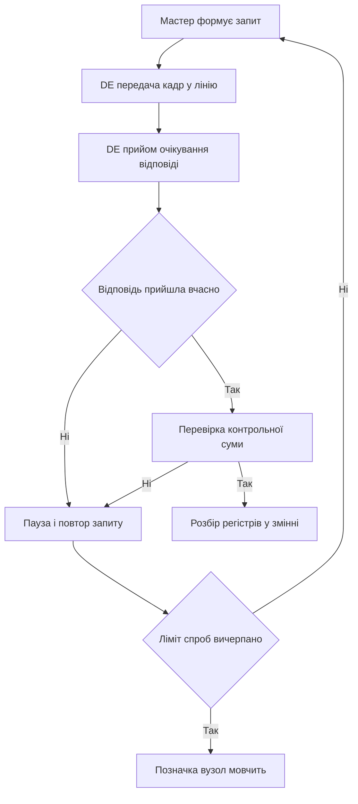

# Modbus на Arduino - регістри і CRC

![[assets/img/arduino-modbus-scheme.png|600]]
*Рис. Modbus: мастер опитує слейви по крученій парі, DE-пін перемикає напрям драйвера.*

> [!tip] Призначення ноти
> Дати робочий мінімум промислового протоколу: як влаштований кадр, як рахується контрольна сума, як перемикати драйвер крученої пари і як розкласти дані по регістрах.

## 1. Призначення

Modbus RTU - найпоширеніший промисловий протокол для опитування датчиків, лічильників і контролерів по двопровідній лінії. Arduino виступає мастером, який опитує слейви, або слейвом, який віддає свої регістри зовнішньому контролеру. Фізичний рівень тут диференціальна пара з драйвером приймача передавача, логічний рівень - кадри з адресою, кодом функції, даними і контрольною сумою.

## 2. RTU-кадр: поля і порядок байтів

Кожен кадр починається з адреси слейва і закінчується контрольною сумою. Пауз між байтами кадру не повинно бути, а між кадрами витримується тиша довжиною у кілька символів.

| Поле | Довжина | Призначення |
| --- | --- | --- |
| Адреса | 1 байт | Номер слейва від одиниці до верхньої межі діапазону |
| Функція | 1 байт | Код операції читання або запису |
| Дані | змінна | Стартовий регістр, кількість регістрів або значення |
| CRC | 2 байти | Контрольна сума, молодший байт іде першим |

```text
Структура запиту читання регістрів:
  +--------+--------+----------+----------+--------+--------+
  | Адреса | Функ.  | Старт Hi | Старт Lo | Кіл. Hi| Кіл. Lo|
  +--------+--------+----------+----------+--------+--------+
  | 0x01   | 0x03   | 0x00     | 0x00     | 0x00   | 0x02   |
  +--------+--------+----------+----------+--------+--------+
  +----------+----------+
  | CRC Lo   | CRC Hi   |
  +----------+----------+
  Відповідь повертає кількість байтів даних і самі значення.
```

## 3. Коди функцій, які потрібні щодня

| Код | Назва за змістом | Що робить |
| --- | --- | --- |
| 1 | Читання дискретних входів | Повертає стани двійкових входів слейва |
| 2 | Читання дискретних входів подій | Повертає стани входів тривог і сигналів |
| 3 | Читання регістрів зберігання | Головна операція читання вимірів і уставок |
| 4 | Читання вхідних регістрів | Читання вимірів тільки для перегляду |
| 5 | Запис одного двійкового виходу | Вмикає або вимикає один канал |
| 6 | Запис одного регістра | Записує одну уставку слейва |
| 15 | Запис групи двійкових виходів | Вмикає групу каналів одним кадром |
| 16 | Запис групи регістрів | Записує блок уставок одним кадром |

## 4. Фізика: кручена пара і DE-пін

Драйвер крученої пари працює в напівдуплексі: або передача, або прийом. Контакт дозволу передачі перемикає напрям. Без узгоджувальних резисторів на кінцях довгої лінії кадри бються відбиттями сигналу.

| Контакт модуля | Куди підключати | Пояснення |
| --- | --- | --- |
| RO | Прийом послідовного порту плати | Лінія прийому даних від слейвів |
| DI | Передача послідовного порту плати | Лінія відправлення запитів у шину |
| DE | Цифровий пін керування напрямом | Високий рівень означає передачу |
| RE | Той же пін керування через інверсію | Часто зєднують з DE перемичкою |
| A | Лінія А шини до всіх вузлів | Перший провід крученої пари |
| B | Лінія Б шини до всіх вузлів | Другий провід крученої пари |

```text
Підключення драйвера до плати:
  Плата Nano            Модуль драйвера          Шина
  +----------+          +-------------+        ============
  | D2       |--------->| DE + RE     |
  | TX       |--------->| DI          |        A o----XXXX----o A
  | RX       |<---------| RO          |        B o----XXXX----o B
  | GND      |----------| GND         |        GND спільна для всіх
  +----------+          +-------------+
  Резистори узгодження ставляться тільки на кінцях лінії.
```

## 5. Карта регістрів слейва

Карта регістрів - це домовленість, за якою адресою лежить кожен вимір. Мастер і слейв повинні мати однакову карту, інакше температура прочитається як вологість.

| Адреса | Тип доступу | Зміст комірки |
| --- | --- | --- |
| 0 | Читання | Температура повітря у десятих градуса |
| 1 | Читання | Відносна вологість у десятих відсотка |
| 2 | Читання | Стан двійкових входів побітово |
| 10 | Читання і запис | Уставка температури для регулятора |
| 11 | Читання і запис | Гістерезис регулятора у десятих градуса |
| 20 | Читання і запис | Режим роботи пристрою за номером |
| 100 | Читання | Код версії прошивки слейва |

## 6. Бібліотека ModbusMaster: мастер за хвилину

| Виклик бібліотеки | Призначення виклику |
| --- | --- |
| begin адреса порт | Привязати обєкт до адреси слейва |
| readHoldingRegisters старт кількість | Прочитати блок регістрів зберігання |
| readInputRegisters старт кількість | Прочитати блок вхідних регістрів |
| writeSingleRegister адреса значення | Записати одну уставку |
| writeMultipleRegisters старт кількість | Записати блок уставок |
| getResponseBuffer індекс | Забрати прочитане значення з буфера |
| clearResponseBuffer | Очистити буфер перед новим запитом |

```cpp
#include <ModbusMaster.h>

const uint8_t PIN_DE = 2;
ModbusMaster node;

void preTransmission() {
  digitalWrite(PIN_DE, HIGH);
  delayMicroseconds(50);
}

void postTransmission() {
  delayMicroseconds(50);
  digitalWrite(PIN_DE, LOW);
}

void setup() {
  pinMode(PIN_DE, OUTPUT);
  digitalWrite(PIN_DE, LOW);
  Serial.begin(9600);
  node.begin(1, Serial);
  node.preTransmission(preTransmission);
  node.postTransmission(postTransmission);
}

void loop() {
  uint8_t result = node.readHoldingRegisters(0, 2);
  if (result == node.ku8MBSuccess) {
    int temp = node.getResponseBuffer(0);
    int hum = node.getResponseBuffer(1);
    Serial.print(temp);
    Serial.print(' ');
    Serial.println(hum);
  } else {
    Serial.println(F("Slave silent"));
  }
  delay(1000);
}
```

## 7. Слейв на Arduino: віддаємо свої регістри

Слейв слухає лінію, перевіряє адресу і контрольну суму, виконує функцію і відповідає. Нижче спрощений каркас слейва з адресою один і таблицею з семи комірок.

```cpp
#include <ModbusRTUSlave.h>

const uint8_t PIN_DE = 2;
const uint8_t SLAVE_ID = 1;
uint16_t regs[7];

ModbusRTUSlave slave(Serial, PIN_DE);

void setup() {
  regs[0] = 235;
  regs[1] = 610;
  regs[2] = 0;
  Serial.begin(9600);
  slave.configureHoldingRegisters(regs, 7);
  slave.begin(SLAVE_ID, 9600);
}

void loop() {
  regs[0] = 235;
  regs[1] = 610;
  slave.poll();
}
```

## 8. Mermaid: цикл опитування шини



## 9. Налагодження і контроль лінії

| Симптом | Ймовірна причина | Як перевірити |
| --- | --- | --- |
| Тиша у відповідь | Переплутані лінії шини | Поміняти дроти місцями на одному кінці |
| Сміття замість даних | Різна швидкість вузлів | Звірити бод усіх пристроїв шини |
| Відповіді через раз | Немає пауз між кадрами | Додати затримку між запитами |
| Помилка суми | Відбиття на довгій лінії | Поставити узгодження на кінцях |
| Висне вся шина | Два слейви з однією адресою | Опитувати вузли по одному |

## Типові помилки

| # | Помилка | Чому погано | Як правильно |
| --- | --- | --- | --- |
| 1 | DE-пін не перемикають взагалі | Драйвер глушить власний прийом і відповідь губиться | Перемикати напрям до і після кожного кадру |
| 2 | Молодший і старший байти суми переплутані | Слейв відкидає кожен кадр як битий | Відправляти молодший байт суми першим |
| 3 | Однакова адреса у двох слейвів | Обидва відповідають одночасно і псують кадр | Призначити кожному вузлу свій номер |
| 4 | Швидкість плати і слейва різні | Замість байтів приходить сміття | Виставити однаковий бод на всій шині |
| 5 | Немає спільної землі між вузлами | Плаває потенціал і рвуться кадри | Зєднати землі всіх вузлів третім дротом |
| 6 | Опитування без пауз упритул | Слейв не встигає обробити запит | Тримати паузу між кадрами у кілька символів |

## Офіційні джерела

- [Специфікації Modbus на сайті організації](https://www.modbus.org/specs.php) - опис кадру, функцій і контрольної суми.
- [Бібліотека ModbusMaster для Arduino](https://github.com/4-20ma/ModbusMaster) - вихідний код мастера і приклади викликів.
- [Довідник мови Arduino](https://www.arduino.cc/reference/en/) - опис послідовного порту і часових функцій.

## Див. також

- [[Home]]
- [[04-Shini/01-UART|послідовний порт]]
- [[15-Protokoli/02-MQTT-ESP|хмара через ESP]]
- [[16-Proekti/02-Rozumniy-dim|автоматика дому]]
