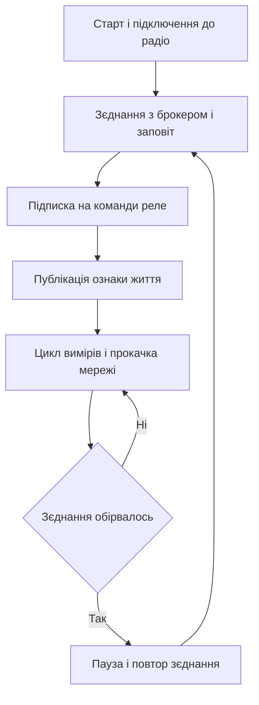

# MQTT через ESP - Arduino в хмарі

![[assets/img/arduino-mqtt-esp-scheme.png|600]]
*Рис. Хмара: плата міряє, модуль передає, брокер роздає телеметрію підписникам.*

> [!tip] Призначення ноти
> Показати два робочі шляхи виходу в мережу: швидкий через набір команд модему і гнучкий через власну прошивку шлюзу, плюс мінімум протоколу для стабільної телеметрії.

## 1. Призначення

Класична плата не має мережі, а модуль з радіо цей недолік закриває. Звязка плати і модуля працює так: плата збирає виміри з датчиків, модуль тримає з'єднання з брокером і ганяє повідомлення. Протокол обміну повідомленнями легкий, тому його тягне навіть слабкий контролер через послідовний порт.

## 2. Два шляхи: AT-модем або шлюз-прошивка

| Підхід | Як працює | Коли брати |
| --- | --- | --- |
| Заводський набір команд | Плата шле текстові команди, модуль сам тримає мережу | Швидкий старт і прості задачі відправлення |
| Власна прошивка шлюзу | Модуль виконує логіку мережі і говорить з платою простим форматом | Складна логіка, черги, повторні відправлення |
| Модуль як головний контролер | Вся програма живе в модулі, плата лише розширює піни | Мало датчиків і вистачає пінів модуля |
| Паралельна робота двох контролерів | Кожен робить своє, обмін кадрами по порту | Надійність важливіша за простоту |

```text
Варіант з набором команд модему:
  Плата                      Модуль                    Хмара
  +----------+               +------------+          +--------+
  | Сенсори  |--запит------->| AT-прошивка|--мережа->| Брокер |
  | Логіка   |<--відповідь---| Радіо      |<-мережа--| Дашборд|
  +----------+  послідовний  +------------+   WiFi   +--------+
  Плата керує, модуль лише виконує команди мережі.
```

## 3. Словник протоколу: мінімум для роботи

| Поняття | Зміст простими словами |
| --- | --- |
| Брокер | Сервер посередник, який приймає і роздає повідомлення |
| Топік | Назва каналу, за якою сортуються повідомлення |
| Публікація | Відправлення значення у named канал |
| Підписка | Заявка отримувати все, що приходить у канал |
| Клієнт | Будь-який пристрій, підключений до посередника |
| Сесія | Збережений стан підписок між підключеннями |
| Утримане повідомлення | Останнє значення, яке отримує новий підписник одразу |

## 4. Топіки: дерево адрес пристрою

Дерево топіків будують ієрархією від загального до конкретного. Маска з решіткою підписує цілу гілку, маска з плюсом підписує один рівень.

| Топік | Призначення |
| --- | --- |
| dim/kitchen/temp | Температура кухні для графіків |
| dim/kitchen/hum | Вологість кухні для графіків |
| dim/kitchen/relay/set | Команда вмикання реле кухні |
| dim/kitchen/relay/state | Підтверджений стан реле кухні |
| dim/kitchen/status | Ознака життя вузла кухні |
| dim/balcony/temp | Температура балкона для порівняння |

```text
Дерево топіків одного дому:
  dim
   +-- kitchen
   |     +-- temp
   |     +-- hum
   |     +-- relay
   |     |     +-- set
   |     |     +-- state
   |     +-- status
   +-- balcony
         +-- temp
         +-- status
  Підписка на dim гілку забирає все дерево дому.
```

## 5. QoS: три рівні доставки

| Рівень | Гарантія доставки | Ціна гарантії |
| --- | --- | --- |
| Нульовий | Без підтвердження, може загубитись | Мінімальний трафік і затримка |
| Перший | Дійде хоча б раз, можливі дублі | Потрібна обробка повторів |
| Другий | Дійде рівно один раз | Чотири службові пакети на повідомлення |

Для телеметрії датчиків вистачає нульового рівня: значення йдуть часто, втрата одного відліку погоди не робить. Для команд реле беруть перший рівень, а дублі команд роблять безпечними повторним виконанням.

## 6. LWT: заповіт на випадок зникнення

Заповіт - це повідомлення, яке брокер публікує сам, коли клієнт мовчки зникає з мережі. Вузол при підключенні заявляє топік статусу і текст на випадок обриву, а також одразу публікує ознаку життя.

| Крок | Дія вузла |
| --- | --- |
| 1 | При з'єднанні заявити топік статусу і текст обриву |
| 2 | Одразу опублікувати ознаку життя з утриманням |
| 3 | Регулярно слати пульс або покладатись на пінг протоколу |
| 4 | Перед плановою зупинкою слати ознаку сну |
| 5 | Дашборд сірим показує вузли з текстом обриву |

## 7. Клієнт PubSubClient: кістяк програми

| Виклик клієнта | Призначення виклику |
| --- | --- |
| setServer адреса порт | Вказати адресу посередника |
| setCallback функція | Призначити обробник вхідних команд |
| connect ідентифікатор | Зєднатись з оголошенням заповіту |
| publish топік текст | Відправити значення у канал |
| subscribe топік | Підписатись на команди |
| loop | Прокачати мережу і тримати пінг |
| connected | Перевірити чи живе з'єднання |

## 8. Скетч телеметрії: датчик у хмару

Повний приклад для модуля: читає температуру і вологість, публікує у два топіки, слухає команду реле, тримає статус життя.

```cpp
#include <ESP8266WiFi.h>
#include <PubSubClient.h>

const char* WIFI_NAME = "HomeNet";
const char* WIFI_PASS = "secret123";
const char* BROKER = "192.168.1.50";

WiFiClient net;
PubSubClient client(net);

void onCommand(char* topic, byte* payload, unsigned int len) {
  String cmd;
  for (unsigned int i = 0; i < len; i++) {
    cmd += (char)payload[i];
  }
  if (cmd == "ON") {
    digitalWrite(LED_BUILTIN, LOW);
    client.publish("dim/kitchen/relay/state", "ON");
  } else {
    digitalWrite(LED_BUILTIN, HIGH);
    client.publish("dim/kitchen/relay/state", "OFF");
  }
}

void reconnect() {
  while (!client.connected()) {
    String id = "kitchen-" + String(ESP.getChipId());
    if (client.connect(id.c_str(), "dim/kitchen/status", 0, true, "offline")) {
      client.publish("dim/kitchen/status", "online", true);
      client.subscribe("dim/kitchen/relay/set");
    } else {
      delay(3000);
    }
  }
}

void setup() {
  pinMode(LED_BUILTIN, OUTPUT);
  WiFi.begin(WIFI_NAME, WIFI_PASS);
  while (WiFi.status() != WL_CONNECTED) {
    delay(500);
  }
  client.setServer(BROKER, 1883);
  client.setCallback(onCommand);
}

void loop() {
  if (!client.connected()) {
    reconnect();
  }
  client.loop();
  static unsigned long last = 0;
  if (millis() - last > 10000) {
    last = millis();
    client.publish("dim/kitchen/temp", "23.5");
    client.publish("dim/kitchen/hum", "61.0");
  }
}
```

## 9. Mermaid: життя вузла у мережі



## 10. Живлення модуля: окремий стабілізатор

| Вимога | Причина |
| --- | --- |
| Окремий стабілізатор з запасом струму | Піки передачі просаджують слабкі ланцюги |
| Конденсатор біля пінів живлення | Згладжує короткі кидки споживання |
| Спільна земля плати і модуля | Без неї пливуть рівні порту |
| Рівень порту нижчий за пятивольтовий | Вхід модуля не любить завищеної напруги |

## Типові помилки

| # | Помилка | Чому погано | Як правильно |
| --- | --- | --- | --- |
| 1 | Виклик мережі без прокачки у циклі | Пінг не йде і брокер рве з'єднання | Крутити прокачку кожну ітерацію циклу |
| 2 | Заповіт не заданий при з'єднанні | Обрив вузла ніхто не помітить вчасно | Завжди заявляти топік статусу і текст обриву |
| 3 | Команди реле на нульовому рівні | Команда може загубитись дорогою | Команди слати з підтвердженням доставки |
| 4 | Живлення модуля від слабкого ланцюга плати | Передача перезавантажує модуль | Окремий стабілізатор з запасом струму |
| 5 | Підписка без повтору після перез'єднання | Сесія скинулась і команди не доходять | Після кожного з'єднання підписуватись заново |
| 6 | Рядки топіків збирають з помилками | Публікація летить в нікуди | Тримати топіки константами в одному місці |

## Офіційні джерела

- [Специфікація MQTT (OASIS)](https://mqtt.org/mqtt-specification/) - опис моделі публікацій і підписок.
- [Клієнт PubSubClient для контролерів](https://github.com/knolleary/pubsubclient) - вихідний код, приклади і межі бібліотеки.
- [Сторінка радіомодуля від виробника](https://www.espressif.com/en/products/socs/esp8266) - характеристики живлення і режимів.

## Див. також

- [[Home]]
- [[04-Shini/01-UART|послідовний порт]]
- [[15-Protokoli/01-Modbus|промисловий протокол]]
- [[16-Proekti/01-Meteostantsiya|погодний вузол]]
