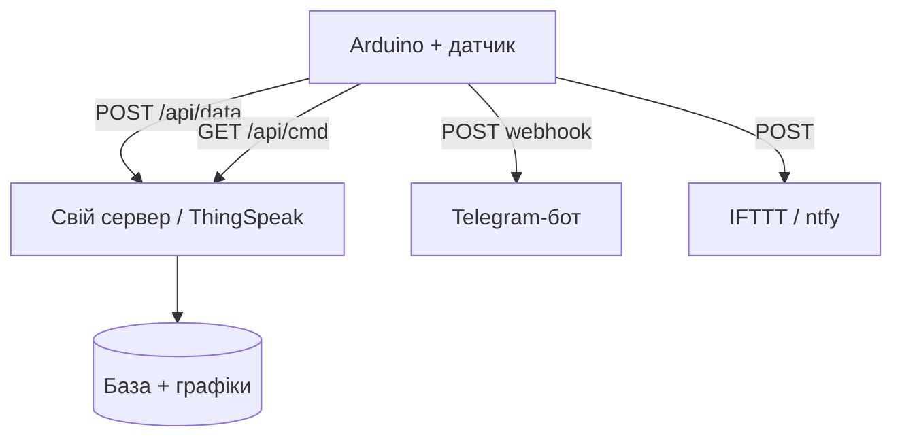

# Arduino в інтернеті - HTTP-клієнт, REST і вебхуки

![[assets/img/ard-http-web-scheme.png|600]]
*Рис. Arduino як HTTP-клієнт: GET забирає команди, POST віддає телеметрію, вебхук стукає у світ.*

> [!tip] Що це за нота
> MQTT - не єдиний шлях у хмару: звичайний HTTP вистачає для телеметрії раз на хвилину і команд з сервера. Працює на ESP8266, Ethernet-шилді і Nano ESP32. База: [[15-Protokoli/01-Modbus|протокол Modbus]], [[15-Protokoli/02-MQTT-ESP|MQTT на ESP]], [[12-Moduli-zvyazku/03-ESP8266-WiFi|WiFi через ESP8266]].

## 1. Мета

Навчити Arduino розмовляти з вебом:

- GET - забрати команду/налаштування з сервера;
- POST з JSON - віддати телеметрію;
- вебхуки - стукати в Telegram/IFTTT без свого сервера;
- HTTPS - де вистачає пам'яті (ESP8266/ESP32, не Uno+шилд).

| Транспорт | Бібліотека | HTTPS | Пам'ять |
| --- | --- | --- | --- |
| ESP8266 (AT або ядро) | ArduinoHttpClient / ESP8266HTTPClient | так, з відбитком | вистачає |
| Ethernet W5100/W5500 | Ethernet + ручний HTTP | ні | вистачає |
| Uno + ESP-01 (AT) | ручні AT+CIPSEND | ні | мінімум |

## 2. Архітектура



Період: телеметрія раз на 60 с, команди - раз на 60 с тим самим GET. Deep-sleep між циклами для батареї.

## 3. GET і POST вручну

Мінімальний HTTP/1.0 без бібліотек - працює всюди, де є TCP-клієнт:

```text
GET /api/cmd?node=1 HTTP/1.0
Host: example.com

POST /api/data HTTP/1.0
Host: example.com
Content-Type: application/json
Content-Length: 24

{"t":23.5,"h":61}
```

Правила: `Host` обов'язковий, після заголовків - порожній рядок, `Content-Length` рахуємо точно. Відповідь читаємо до закриття з'єднання (HTTP/1.0 закриває сам).

## 4. JSON без бібліотек

- відправка: `snprintf` з форматом, числа - без лапок;
- парсинг відповіді: шукаємо ключі `strstr`, значення - `atoi/atof`;
- повноцінний ArduinoJson - коли відповіді складні (масиви, вкладеність);
- пам'ять Uno: StaticJsonDocument не більше 512 байт;
- екранування: у своїх рядках не допускаємо лапок взагалі.

## 5. Робочий код

```cpp
#include <SPI.h>
#include <Ethernet.h>

byte mac[] = {0xDE, 0xAD, 0xBE, 0xEF, 0xFE, 0xED};
EthernetClient client;
char server[] = "example.com";

void post_telemetry(float t, float h) {
  char body[48];
  snprintf(body, sizeof(body), "{\"t\":%.1f,\"h\":%.0f}", t, h);
  if (!client.connect(server, 80)) return;
  client.println("POST /api/data HTTP/1.0");
  client.println("Host: example.com");
  client.println("Content-Type: application/json");
  client.print("Content-Length: ");
  client.println(strlen(body));
  client.println();
  client.println(body);
  unsigned long t0 = millis();
  while (!client.available() && millis() - t0 < 3000) {}
  while (client.available()) Serial.write(client.read());
  client.stop();
}

int get_command() {
  if (!client.connect(server, 80)) return -1;
  client.println("GET /api/cmd?node=1 HTTP/1.0");
  client.println("Host: example.com");
  client.println();
  String resp = "";
  unsigned long t0 = millis();
  while (millis() - t0 < 3000) {
    while (client.available()) resp += (char)client.read();
    if (resp.indexOf("CMD:") >= 0) break;
  }
  client.stop();
  int i = resp.indexOf("CMD:");
  if (i < 0) return -1;
  return resp.substring(i + 4).toInt();
}

void setup() {
  Serial.begin(115200);
  Ethernet.begin(mac);
  delay(1000);
}

void loop() {
  post_telemetry(23.5, 61);
  int cmd = get_command();
  digitalWrite(5, cmd == 1 ? HIGH : LOW);
  delay(60000);
}
```

Таймаути скрізь: завислий `connect` без таймауту вішає вузол назавжди. Для ESP8266 той же код через `ESP8266HTTPClient` - коротший удвічі.

## 6. Вебхуки: світ без сервера

- ntfy: POST на `https://ntfy.sh/my-topic` - і пуш у телефоні;
- Telegram Bot API: `sendMessage` GET-запитом з токеном;
- IFTTT Webhooks: ключ у URL, три значення в JSON;
- ThingSpeak: поле `api_key` + `field1`, графіки з коробки;
- ліміти безкоштовних тарифів - читаємо до проєкту, не після.

## 7. HTTPS і безпека

- Uno + W5100: HTTPS немає принципово - тільки своя мережа або шлюз;
- ESP8266: відбиток SHA1 сертифіката (`setFingerprint`), оновлюємо при ротації;
- ESP32: повний CA-bundle, NTP-час для перевірки строку;
- токени - не в коді на GitHub: окремий `secrets.h` поза репозиторієм;
- HTTP Basic Auth - мінімум для свого сервера.

## 8. Типові помилки

| Симптом | Причина | Лікування |
| --- | --- | --- |
| Сервер ріже з'єднання | немає `Host` або кривий `Content-Length` | звірити заголовки з прикладом вище |
| Відповідь обрізана | читаємо до таймауту замість закриття | HTTP/1.0 + читати поки `connected()` |
| Працює раз, далі тиша | не закрили клієнта | `client.stop()` після кожного запиту |
| 400 Bad Request | JSON з лапками всередині | числа без лапок, рядки без спецсимволів |
| Пам'ять тече на Uno | String-конкатенація в циклі | char-буфери фіксованого розміру |
| HTTPS на W5100 | шилд не вміє TLS | тільки HTTP або ESP8266-шлюз |

## 9. Суміжні ноти

- [[15-Protokoli/02-MQTT-ESP|MQTT на ESP]] - альтернатива для частих даних.
- [[12-Moduli-zvyazku/05-BT-Ethernet|BT і Ethernet]] - транспортний рівень.
- [[12-Moduli-zvyazku/03-ESP8266-WiFi|WiFi через ESP8266]] - безпровідний транспорт.
- [[16-Proekti/01-Meteostantsiya|метеостанція]] - перший клієнт хмар.
- [[09-Proshivka/01-IDE-CLI|середовище IDE і CLI]] - бібліотеки і менеджери.

## Офіційні джерела

- [ArduinoHttpClient (arduino-libraries, GitHub)](https://github.com/arduino-libraries/ArduinoHttpClient) - GET/POST/PUT, приклади.
- [Getting Started (Arduino docs)](https://docs.arduino.cc/learn/) - мережеві бібліотеки, Cloud.
- [MQTT Specification (OASIS)](https://mqtt.org/mqtt-specification/) - коли HTTP замало, переходимо на MQTT.
