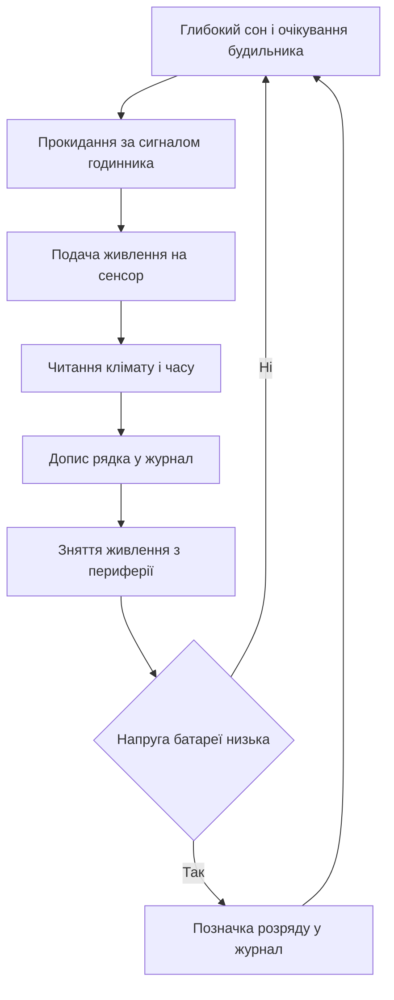

# Метеостанція на Arduino - вузол

![[assets/img/arduino-meteo-scheme.png|600]]
*Рис. Вузол: сенсор міряє клімат, годинник мітить час, карта складає журнал.*

> [!tip] Призначення ноти
> Зібрати автономний погодний вузол повного циклу: точні виміри клімату, мітка часу для кожного запису, журнал на карті памяті і живлення від батареї зі сном.

## 1. Призначення

Домашній погодний вузол пише температуру, вологість і тиск у файл кожні десять хвилин і живе місяцями від батареї. Три кити конструкції: точний кліматичний сенсор, годинник реального часу для міток і карта памяті для журналу. Контролер між вимірами спить, тому середнє споживання мізерне.

## 2. Склад вузла: що купувати

| Вузол | Роль у станції | На що дивитись |
| --- | --- | --- |
| Плата контролера | Збирає виміри і пише журнал | Економний сон і стабільний порт |
| Сенсор клімату | Міряє температуру вологість тиск | Заводське калібрування з памяті сенсора |
| Годинник реального часу | Дає дату і час кожному запису | Резервна батарейка ходу |
| Карта памяті | Зберігає журнал вимірів | Модуль з перетворювачем рівнів |
| Корпус з захистом | Ховає електроніку від дощу | Вентиляція сенсора без прямого сонця |
| Живлення | Годує вузол у полі | Батарея плюс сонячна панель за бажанням |

```text
Блочна схема вузла:
  +------------------+     шина даних     +------------------+
  | Сенсор клімату   |------------------->| Контролер        |
  +------------------+                    |  +------------+  |
  +------------------+     шина даних     |  | Годинник   |  |
  | Годинник часу    |------------------->|  +------------+  |
  +------------------+                    |  +------------+  |
                                          |  | Карта      |<---> Журнал
                                          |  +------------+  |
                                          +------------------+
  Живлення окремим блоком, земля спільна для всіх модулів.
```

## 3. Сенсор клімату: чому саме такий

| Параметр сенсора | Що означає для станції |
| --- | --- |
| Три величини в одному корпусі | Менше модулів і менше дротів у полі |
| Цифровий вихід з калібруванням | Не треба колхозити формули компенсації |
| Мале споживання у сні | Батарея живе місяцями без заміни |
| Адреса на вибір перемичкою | Два сенсори на одній шині без конфлікту |
| Режими надлишкової вибірки | Точність проти швидкості на вибір |

## 4. Годинник реального часу: мітка кожного запису

| Функція годинника | Використання у журналі |
| --- | --- |
| Дата і час з батарейкою | Мітка не зникає після перезапуску |
| Будильник перериванням | Будить контролер за розкладом |
| Пам'ять налаштувань | Зберігає період опитування |
| Корекція ходу | Періодична звірка з еталоном |

Без годинника записи журналу злипаються в кашу без часу, а будь-який збій живлення обнуляє лічильник. Тому годинник з резервною батарейкою обов'язковий для польового вузла.

## 5. Карта памяті по швидкій шині

Журнал пишеться на карту через швидку послідовну шину: такт, вхід, вихід і окремий вибір кристала карти. Шина швидка, тому файл закривається миттєво і контролер одразу йде спати.

| Сигнал шини | Роль у записі |
| --- | --- |
| Такт | Синхронізує біти запису |
| Вихід контролера | Несе команди і дані на карту |
| Вхід контролера | Повертає відповіді карти |
| Вибір карти | Активує саме карту серед пристроїв шини |

```text
Підключення карти до плати:
  Плата                 Модуль карти
  +----------+          +-------------+
  | Такт     |--------->| CLK         |
  | Вихід    |--------->| MOSI        |
  | Вхід     |<---------| MISO        |
  | Вибір    |--------->| CS          |
  | Живлення |----------| VCC через перетворювач |
  | Земля    |----------| GND         |
  +----------+          +-------------+
  Довжина проводів шини мінімальна, інакше збої запису.
```

## 6. Формат журналу: рядок CSV

| Колонка | Зміст колонки |
| --- | --- |
| Дата | Рік місяць день через дефіс |
| Час | Години хвилини секунди через двокрапку |
| Температура | Градуси з одним знаком після коми |
| Вологість | Відсотки з одним знаком після коми |
| Тиск | Гектопаскалі з одним знаком після коми |
| Напруга | Вольти батареї для контролю розряду |

```text
Приклад файлу журналу:
  date,time,temp,hum,press,batt
  2026-10-05,08:00:00,14.2,78.5,982.1,4.05
  2026-10-05,08:10:00,14.6,77.1,982.0,4.04
  2026-10-05,08:20:00,15.1,75.8,981.9,4.04
  Шапка пишеться один раз при створенні файлу.
```

## 7. Сон між вимірами: батарея живе довго

| Прийом економії | Ефект для батареї |
| --- | --- |
| Глибокий сон контролера | Споживання падає до мікроамперів |
| Зняття живлення з сенсора | Сенсор не гріється і не їсть струм |
| Рідкі виміри за розкладом | Десять хвилин сну проти секунд роботи |
| Пакетний запис на карту | Карта вмикається рідко і коротко |
| Контроль напруги батареї | Вузол вчасно сигналізує про розряд |

## 8. Скетч вузла: вимір запис сон

```cpp
#include <Wire.h>
#include <SPI.h>
#include <SD.h>
#include <RTClib.h>
#include <Adafruit_BME280.h>
#include <LowPower.h>

const uint8_t CHIP_SELECT = 4;
const uint8_t POWER_SENSOR = 7;

Adafruit_BME280 bme;
RTC_DS3231 rtc;

void setup() {
  pinMode(POWER_SENSOR, OUTPUT);
  digitalWrite(POWER_SENSOR, HIGH);
  Wire.begin();
  bme.begin(0x76);
  rtc.begin();
  SD.begin(CHIP_SELECT);
}

void loop() {
  digitalWrite(POWER_SENSOR, HIGH);
  delay(200);
  float t = bme.readTemperature();
  float h = bme.readHumidity();
  float p = bme.readPressure() / 100.0;
  DateTime now = rtc.now();

  File f = SD.open("log.csv", FILE_WRITE);
  if (f) {
    f.print(now.year());
    f.print('-');
    f.print(now.month());
    f.print('-');
    f.print(now.day());
    f.print(',');
    f.print(now.hour());
    f.print(':');
    f.print(now.minute());
    f.print(',');
    f.print(t, 1);
    f.print(',');
    f.print(h, 1);
    f.print(',');
    f.println(p, 1);
    f.close();
  }
  digitalWrite(POWER_SENSOR, LOW);
  for (uint8_t i = 0; i < 75; i++) {
    LowPower.powerDown(SLEEP_8S, ADC_OFF, BOD_OFF);
  }
}
```

## 9. Mermaid: цикл життя вузла



## 10. Корпус: сенсор дихає, плата суха

| Правило корпусу | Пояснення |
| --- | --- |
| Сенсор у вентильованому відсіку | Застійне повітря бреше на градуси |
| Плата у герметичному відсіку | Конденсат вбиває контакти |
| Екран від прямого сонця | Сонце гріє корпус вище повітря |
| Введення кабелів знизу | Вода не затікає по дротах |
| Вологопоглинач усередині | Збирає залишкову вологу монтажу |

## Типові помилки

| # | Помилка | Чому погано | Як правильно |
| --- | --- | --- | --- |
| 1 | Сенсор поруч з теплим стабілізатором | Вимір гріється від плати | Винести сенсор на шлейфі подалі від тепла |
| 2 | Файл журналу не закривають | Рядок губиться при зникненні живлення | Закривати файл після кожного запису |
| 3 | Довгі дроти швидкої шини | Запис на карту бється збоями | Тримати шину короткою і з доброю землею |
| 4 | Контролер не спить між вимірами | Батарея сідає за дні | Спати глибоким сном між вимірами |
| 5 | Корпус без вентиляції сенсора | Температура пливе від перегріву | Окремий дихаючий відсік для сенсора |
| 6 | Немає контролю батареї | Вузол мовчки вмирає у полі | Писати напругу у кожен рядок журналу |

## Офіційні джерела

- [Сенсор тиску вологості температури від виробника](https://www.bosch-sensortec.com/products/environmental-sensors/humidity-sensors-bme280/) - характеристики точності і режимів.
- [Бібліотека годинника реального часу](https://github.com/adafruit/RTClib) - приклади читання дати і будильників.
- [Довідник мови Arduino](https://www.arduino.cc/reference/en/) - робота з файлами, шинами і сном.

## Див. також

- [[Home]]
- [[04-Shini/02-SPI|швидка шина]]
- [[10-Sensori/02-BME280|клімат по шині]]
- [[10-Sensori/01-DHT-DS18B20|температура по дроту]]
- [[16-Proekti/02-Rozumniy-dim|автоматика дому]]
