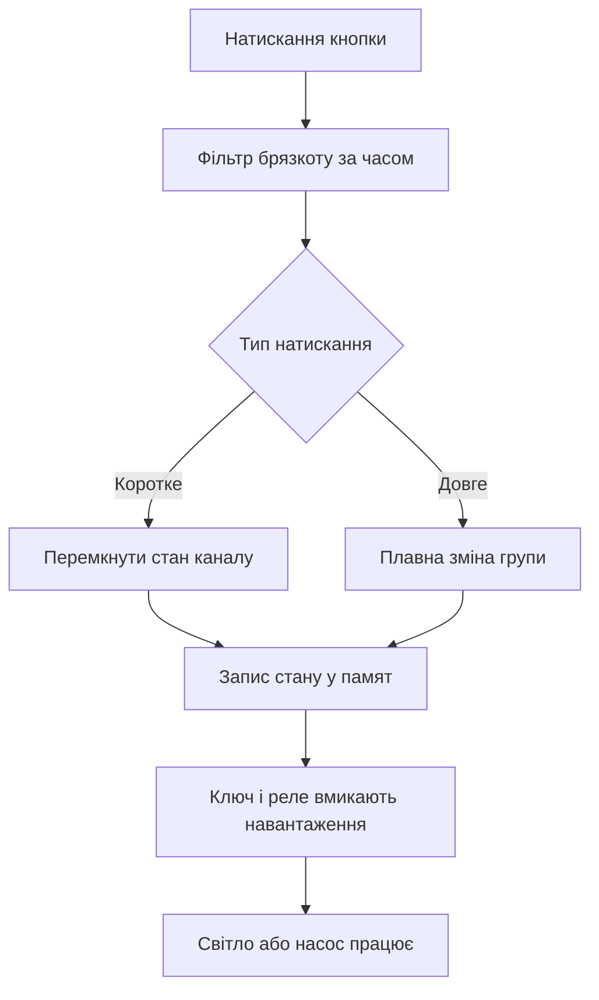

# Розумний дім - реле і кнопки

![[assets/img/arduino-smart-scheme.png|600]]
*Рис. Дім: кнопки просять, контролер вирішує, реле вмикає навантаження.*

> [!tip] Призначення ноти
> Побудувати надійну автоматику світла і навантаження: силові ключі з розв'язкою, кнопки без брязкоту, памят станів після зникнення живлення і ручне керування поверх автоматики.

## 1. Призначення

Автоматика дому вмикає світло, насоси і обігрівачі за кнопками, розкладом і датчиками. Плата не тягне силові струми безпосередньо, тому між ніжною логікою і жорсткою мережею стоять ключі і реле. Кнопки дають ручне керування, яке працює навіть коли автоматика вирішила інакше.

## 2. Реле через транзистор: чому не безпосередньо

| Причина каскаду | Пояснення |
| --- | --- |
| Струм котушки більший за межу піна | Пін згорить при прямому підключенні |
| Індуктивний кидок при вимиканні | Викид напруги бє по кристалу |
| Розв'язка земель силової частини | Завади насосів не лізуть у логіку |
| Інверсія логіки модулів | Багато модулів вмикаються низьким рівнем |

```text
Ключ керування реле:
  Пін плати ---[1к]---> База транзистора
  Емітер -----------> Земля спільна
  Колектор ---------> Котушка реле ---> Живлення котушки
  Діод навпаки паралельно котушці гасить кидок.
  Світлодіод з резистором показує стан каналу.
```

## 3. Модулі реле: вибір під навантаження

| Параметр модуля | Як вибирати |
| --- | --- |
| Струм контактів | З запасом проти пускових струмів |
| Напруга котушки | Під наявне живлення шафи |
| Кількість каналів | За кількістю зон світла і розеток |
| Розв'язка входу | Оптрон між логікою і котушками |
| Стан при старті | Канали вимкнені до ініціалізації пінів |

## 4. Кнопки без дребезгу: опитування за часом

Механічний контакт брязкає мілісекунди і дає пачку спрацьовувань замість одного натискання. Програмний фільтр приймає стан лише після стійкої витримки часу.

| Крок фільтра | Дія програми |
| --- | --- |
| 1 | Читати сирий стан кнопки кожні кілька мілісекунд |
| 2 | При зміні стану запустити витримку |
| 3 | Ігнорувати брязкіт до кінця витримки |
| 4 | Прийняти новий стан після стабільної витримки |
| 5 | Розрізнити коротке і довге натискання за часом |

```text
Часові діаграми натискання:
  Сирий контакт : _--_-_-___--------__-_--____
  Витримка     : +.........+.........+......+
  Прийнятий    : __________-----------________
  Брязкіт зникає, лишається один чистий фронт.
```

## 5. Сценарії натискань: одна кнопка багато дій

| Жест | Дія автоматики |
| --- | --- |
| Коротке натискання | Перемкнути світло зони |
| Довге утримання | Плавно гасити або розпалювати групу |
| Подвійне натискання | Вмикати все світло поверху |
| Тривале утримання вночі | Нічник мінімальної яскравості |

## 6. EEPROM: памят станів після темряви

| Прийом роботи з памяттю | Навіщо потрібен |
| --- | --- |
| Зберігати стани каналів | Після повернення світла все як було |
| Писати тільки при зміні | Комірки памяті мають межу перезаписів |
| Контрольна сума блоку | Виявляє зіпсовані дані при старті |
| Значення за замовчуванням | Безпечний стан при першому вмиканні |
| Лічильник моторесурсу | Рахує години насосів для обслуговування |

## 7. Ручне дублювання автоматики

Автоматика не повинна замикати людину у темряві: кожен автоматичний канал дублюється кнопкою. Ручна команда завжди старша за розклад, а автоматика повертає керування лише після підтвердження.

| Правило дублювання | Пояснення |
| --- | --- |
| Кнопка на кожен канал | Світло вмикається без мережі і програм |
| Ручний режим старший | Людина перебиває таймери і датчики |
| Повернення в авто за згодою | Автоматика не відбирає керування мовчки |
| Індикація режиму | Світлодіод показує ручний або авто |

## 8. Скетч: два канали, кнопки, памят

```cpp
#include <EEPROM.h>

const uint8_t BTN_A = 2;
const uint8_t BTN_B = 3;
const uint8_t RELAY_A = 8;
const uint8_t RELAY_B = 9;
const unsigned long DEBOUNCE = 50;

struct Channel {
  uint8_t btn;
  uint8_t relay;
  bool state;
  bool lastRaw;
  bool stable;
  unsigned long changedAt;
};

Channel ch[2] = {
  {BTN_A, RELAY_A, false, HIGH, HIGH, 0},
  {BTN_B, RELAY_B, false, HIGH, HIGH, 0},
};

void applyChannel(Channel &c) {
  digitalWrite(c.relay, c.state ? LOW : HIGH);
}

void saveStates() {
  EEPROM.update(0, ch[0].state);
  EEPROM.update(1, ch[1].state);
  EEPROM.update(2, 0xA5);
}

void loadStates() {
  if (EEPROM.read(2) == 0xA5) {
    ch[0].state = EEPROM.read(0);
    ch[1].state = EEPROM.read(1);
  }
}

void pollChannel(Channel &c) {
  bool raw = digitalRead(c.btn);
  if (raw != c.lastRaw) {
    c.lastRaw = raw;
    c.changedAt = millis();
  }
  if (millis() - c.changedAt > DEBOUNCE && raw != c.stable) {
    c.stable = raw;
    if (raw == LOW) {
      c.state = !c.state;
      applyChannel(c);
      saveStates();
    }
  }
}

void setup() {
  pinMode(BTN_A, INPUT_PULLUP);
  pinMode(BTN_B, INPUT_PULLUP);
  pinMode(RELAY_A, OUTPUT);
  pinMode(RELAY_B, OUTPUT);
  loadStates();
  applyChannel(ch[0]);
  applyChannel(ch[1]);
}

void loop() {
  pollChannel(ch[0]);
  pollChannel(ch[1]);
}
```

## 9. Mermaid: від кнопки до реле



## 10. Безпека силової частини

| Правило безпеки | Пояснення |
| --- | --- |
| Запобіжник на вводі шафи | Рятує проводку при короткому замиканні |
| Заземлення корпусів | Прибирає небезпеку пробою на корпус |
| Розділення слабкострумки і сили | Жгути логіки подалі від силових жил |
| Маркування кожного автомата | Ремонт без вгадування зон |
| Тест захисного вимикання | Перевірка спрацьовування за кнопкою тесту |

## Типові помилки

| # | Помилка | Чому погано | Як правильно |
| --- | --- | --- | --- |
| 1 | Реле безпосередньо від піна плати | Струм котушки палить вихід | Керувати через транзисторний ключ |
| 2 | Немає діода на котушці | Кидок самоіндукції бє по схемі | Ставити діод навпаки паралельно котушці |
| 3 | Кнопка без фільтра брязкоту | Одне натискання дає пачку перемикань | Тримати часову витримку стабільності |
| 4 | Запис у памят кожен цикл | Комірки зношуються завчасно | Писати тільки при зміні стану |
| 5 | Канали стартують увімкненими | Навантаження смикається при подачі живлення | Ініціалізувати виходи до безпечного стану |
| 6 | Немає ручного дублювання | Збій програми лишає дім без світла | Кожен канал дублювати кнопкою |

## Офіційні джерела

- [Довідник мови Arduino](https://www.arduino.cc/reference/en/) - цифрові виходи, підтяжки входів і часові функції.
- [Керівництво по енергонезалежній памяті](https://docs.arduino.cc/learn/built-in-libraries/eeprom/) - правила запису станів і межі перезаписів.
- [Бібліотека клієнта повідомлень для звязки з домом](https://github.com/knolleary/pubsubclient) - команди реле через мережу поверх кнопок.

## Див. також

- [[Home]]
- [[11-Vivid/03-NeoPixel-Servo-Rele|стрічки і сила]]
- [[15-Protokoli/01-Modbus|промисловий протокол]]
- [[16-Proekti/01-Meteostantsiya|погодний вузол]]
