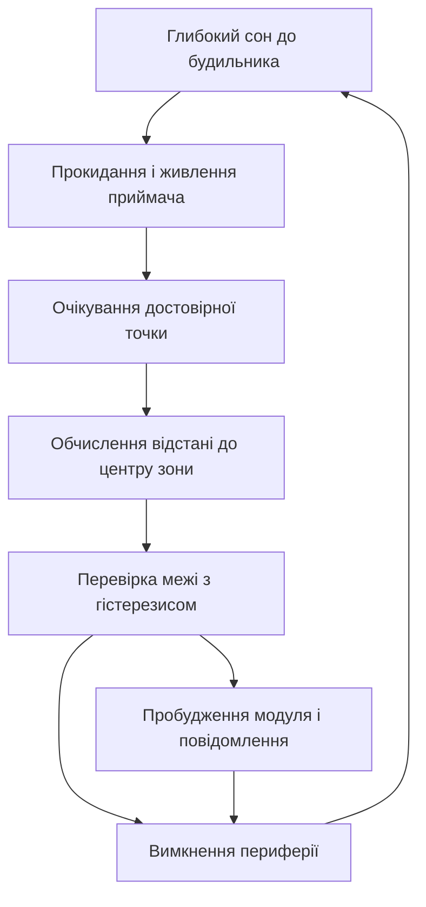

# GPS-трекер на Arduino - координати і SMS

![[assets/img/arduino-tracker-scheme.png|600]]
*Рис. Трекер: приймач ловить координати з неба, контролер будить стільниковий модуль і шле повідомлення.*

> [!tip] Призначення ноти
> Зібрати рухомий маячок повного циклу: приймач координат дає місце, стільниковий модуль шле повідомлення, батарея тримає піки струму, а сон між точками розтягує автономність на тижні.
> Нота закриває типові питання: як поєднати два послідовні порти, чим годувати модуль з піками у два ампери і коли слати повідомлення про вихід з геозони.

## 1. Призначення

Рухомий трекер пише маршрут точками і повідомляє власника про вихід за межі дозволеної зони. Контролер опитує приймач координат, рахує відстань до центру геозони і через стільниковий модуль відправляє коротке повідомлення з широтою, довготою і швидкістю. Між точками плата спить, тому середнє споживання лишається малим навіть з двома радіомодулями на борту.

Трекер ставиться на велосипед, I2C-адаптер, човен або службовий ящик. Вдома лишається лише телефон з повідомленнями: жодного сервера, жодної хмари, лише координати у кишені.

## 2. Склад трекера: що купувати

| Вузол | Роль у трекері | На що дивитись |
| --- | --- | --- |
| Плата контролера | Збирає координати і керує модулями | Два послідовні порти або програмний порт |
| Приймач координат | Ловить супутники і видає широту і довготу | Винесена антена і вихід раз на секунду |
| Стільниковий модуль | Шле повідомлення і дзвінки | Окреме живлення з запасом по струму |
| Батарея з перетворювачем | Годує піки передавача | Піковий струм не менше двох амперів |
| Корпус з кріпленням | Тримає трекер на транспорті | Антена дивиться у небо без металу над нею |
| Карта оператора | Дає мережу для повідомлень | Тариф з дешевими повідомленнями |

```text
Блочна схема трекера:
  +------------------+   послідовний порт   +------------------+
  | Приймач координат|--------------------->| Контролер        |
  +------------------+                      |  +------------+  |
  Антена дивиться у небо                     |  | Геозона    |  |
                                             |  +------------+  |
  +------------------+   послідовний порт   |  +------------+  |
  | Стільниковий     |<-------------------->|  | Повідомлення|  |
  | модуль           |   команди і відповіді |  +------------+  |
  +------------------+                      +------------------+
  Живлення окремим каналом, земля спільна для всіх модулів.
```

## 3. Приймач координат: як читати місце

| Параметр приймача | Що означає для трекера |
| --- | --- |
| Вихід раз на секунду | Контролер завжди має свіжу точку маршруту |
| Холодний старт кілька хвилин | Перша точка після вмикання запізнюється |
| Гарячий старт секунди | Повторне прокидання дає точку швидко |
| Вбудована антена | Працює на вікні, у корпусі гірше |
| Зовнішня активна антена | Ловить у сумці і під одягом |
| Енергозбереження | Приймач спить між точками за командою |

Приймач видає рядки з широтою, довготою, швидкістю і часом. Контролер розбирає рядок, перевіряє ознаку достовірності і лише потім пише точку у памяті. Без ознаки достовірності точка бреше на сотні метрів, тому сирі дані без прапорця у маршрут не пишуть.

## 4. Стільниковий канал: повідомлення про рух

| Функція модуля | Використання у трекері |
| --- | --- |
| Текстові повідомлення | Координати і швидкість власнику |
| Дзвінок зворотним викликом | Власник дзвонить і трекер скидає точку у відповідь |
| Баланс за запитом | Періодична перевірка рахунку карти |
| Режим сну модуля | Модуль мовчить між подіями і бере міліампери |
| Індикатор мережі | Блимання показує реєстрацію у мережі |

Повідомлення збирається коротким шаблоном: широта, довгота, швидкість, заряд батареї. Довгі речення з описами не потрібні, бо кожен символ коштує енергії передавача і грошей тарифу.

```text
Підключення двох портів до плати:
  Плата                 Приймач координат
  +----------+          +------------------+
  | Вхід     |<---------| Передача         |
  | Земля    |----------| Земля            |
  +----------+          +------------------+
  Плата                 Стільниковий модуль
  +----------+          +------------------+
  | Вхід     |<---------| Передача         |
  | Вихід    |--------->| Прийом           |
  | Керування|--------->| Живлення модуля  |
  | Земля    |----------| Земля            |
  +----------+          +------------------+
  Швидкість портів однакова з обох боків, інакше сміття замість тексту.
```

## 5. Живлення: піки у два ампери

| Правило живлення | Пояснення |
| --- | --- |
| Окремий перетворювач для модуля | Плата не тягне піки передавача |
| Піковий запас два ампери | Передача у слабкій мережі бере максимум |
| Товсті короткі дроти | Тонкі дроти просаджують напругу у піку |
| Великий конденсатор біля модуля | Згладжує стрибок струму при передачі |
| Контроль напруги батареї | Контролер міряє батарею перед кожною передачею |
| Запобіжник у ланцюзі батареї | Рятує дроти при короткому замиканні |

Головна причина мовчання модуля у полі це слабке живлення. Модуль реєструється у мережі, починає передачу, напруга просідає, модуль перезапускається, і коло повторюється без кінця. Лікується лише чесним живленням з запасом струму, а не новим кодом.

## 6. Сон між точками: тижні автономності

| Прийом економії | Ефект для батареї |
| --- | --- |
| Глибокий сон контролера | Споживання падає до мікроамперів |
| Зняття живлення з приймача | Приймач не гріється між точками |
| Сон стільникового модуля | Модуль прокидається лише на подію |
| Рідкі точки за розкладом | Хвилина сну проти секунд роботи |
| Пачка точок у памяті | Модуль шле одне повідомлення на кілька точок |
| Нічний режим тиші | Вночі лише охоронні події без маршруту |

Типовий цикл виглядає так: прокинутись, увімкнути приймач, дочекатись достовірної точки, порівняти з геозоною, за потреби розбудити модуль і слати повідомлення, вимкнути все і заснути до наступного будильника.

## 7. Геозони: вихід за межу як подія

| Елемент геозони | Як рахувати |
| --- | --- |
| Центр зони | Широта і довгота дому або бази |
| Радіус зони | Відстань у метрах від центру |
| Відстань до центру | Формула кола по широті і довготі |
| Гістерезис межі | Зовнішній радіус більший за внутрішній |
| Лічильник підтверджень | Подія після трьох точок поспіль за межею |
| Текст тривоги | Координати виходу і швидкість руху |

Гістерезис прибирає деренчання на межі: трекер вважає вихід лише за зовнішнім радіусом, а повернення лише за внутрішнім. Без гістерезису одна точка на межі шле десяток повідомлень за хвилину і спустошує баланс карти.

```text
Логіка межі з гістерезисом:
  Усередині зони ......... точки пишуться мовчки
  Перетнув зовнішній ...... перша підозра, лічильник росте
  Три точки поспіль ....... подія, повідомлення власнику
  Повернувся всередину ... повідомлення про повернення
  Одна точка на межі ...... ігнорується без лічильника
```

## 8. Скетч трекера: точка, зона, повідомлення

```cpp
#include <SoftwareSerial.h>
#include <TinyGPS++.h>

const uint8_t PIN_GPS_RX = 4;
const uint8_t PIN_GSM_RX = 7;
const uint8_t PIN_GSM_TX = 8;
const uint8_t PIN_GSM_PWR = 9;

const double ZONE_LAT = 50.4501;
const double ZONE_LON = 30.5234;
const long ZONE_OUT = 500;
const long ZONE_IN = 400;
const char PHONE[] = "+380000000000";

SoftwareSerial portGps(PIN_GPS_RX, 3);
SoftwareSerial portGsm(PIN_GSM_RX, PIN_GSM_TX);
TinyGPSPlus gps;

bool outside = false;
uint8_t hits = 0;

void gsmCmd(const char *cmd, unsigned long wait) {
  portGsm.println(cmd);
  delay(wait);
}

void gsmSms(const char *text) {
  gsmCmd("AT+CMGF=1", 300);
  portGsm.print("AT+CMGS=\"");
  portGsm.print(PHONE);
  portGsm.println("\"");
  delay(500);
  portGsm.print(text);
  delay(300);
  portGsm.write(26);
  delay(3000);
}

void setup() {
  pinMode(PIN_GSM_PWR, OUTPUT);
  digitalWrite(PIN_GSM_PWR, HIGH);
  portGps.begin(9600);
  portGsm.begin(9600);
  delay(1000);
  gsmCmd("AT", 300);
}

double distMeters(double la1, double lo1, double la2, double lo2) {
  double dLa = (la2 - la1) * 111320.0;
  double dLo = (lo2 - lo1) * 111320.0 * 0.64;
  return sqrt(dLa * dLa + dLo * dLo);
}

void loop() {
  while (portGps.available()) {
    gps.encode(portGps.read());
  }
  if (!gps.location.isValid() || !gps.location.isUpdated()) {
    return;
  }
  double la = gps.location.lat();
  double lo = gps.location.lng();
  double d = distMeters(ZONE_LAT, ZONE_LON, la, lo);

  if (!outside && d > ZONE_OUT) {
    hits++;
    if (hits >= 3) {
      outside = true;
      hits = 0;
      char msg[120];
      snprintf(msg, sizeof(msg), "OUT lat=%.5f lon=%.5f sp=%.1f", la, lo, gps.speed.kmph());
      gsmSms(msg);
    }
  } else if (outside && d < ZONE_IN) {
    outside = false;
    hits = 0;
    char msg[120];
    snprintf(msg, sizeof(msg), "HOME lat=%.5f lon=%.5f", la, lo);
    gsmSms(msg);
  } else {
    hits = 0;
  }
  delay(5000);
}
```

Скетч тримає два програмні порти і ніколи не слухає обидва одночасно: спочатку слухає приймач, потім перемикається на модуль для відправки. Апаратний порт лишається вільним для живого перегляду точок через монітор порту.

## 9. Mermaid: цикл життя трекера



## 10. Корпус і монтаж: антена бачить небо

| Правило монтажу | Пояснення |
| --- | --- |
| Антена приймача вгору | Метал над антеною ріже супутники |
| Модуль подалі від антени | Передавач забиває слабкий сигнал супутників |
| Дроти живлення короткі і товсті | Довгі тонкі дроти дають просадку у піку |
| Кріплення з гасінням вібрації | Вібрація розбиває розєми на ямах |
| Герметичний корпус з вентиляцією | Волога вбиває контакти, спека варить батарею |
| Кнопка живлення всередині | Випадкове вимкнення у сумці неприпустиме |

## Типові помилки

| # | Помилка | Чому погано | Як правильно |
| --- | --- | --- | --- |
| 1 | Живлення модуля від плати | Пік передачі просаджує плату і модуль ребутається | Окремий перетворювач з піком два ампери |
| 2 | Відправка сирої точки без прапорця | Маршрут бреше на сотні метрів | Чекати ознаки достовірності перед записом |
| 3 | Один програмний порт на два модулі | Дані губляться при одночасному прийомі | Слухати по черзі або взяти плату з двома портами |
| 4 | Геозона без гістерезису | Десяток повідомлень з межі за хвилину | Зовнішній радіус більший за внутрішній |
| 5 | Довгі тонкі дроти живлення | Просадка напруги у піку передачі | Короткі товсті дроти плюс конденсатор біля модуля |
| 6 | Антена під металом | Супутники не ловляться взагалі | Антена вгору, над нею лише пластик |

## Офіційні джерела

- [Довідник мови Arduino](https://www.arduino.cc/reference/en/) - послідовні порти, сон, робота з рядками і живлення.
- [Керівництво з послідовного порту програмної реалізації](https://docs.arduino.cc/learn/built-in-libraries/software-serial/) - обмеження одночасного прийому і вибір швидкості.
- [Опис команд стільникового модуля SIM800](https://www.simcom.com/product/sim800c/) - режими сну, повідомлення і вимоги до живлення.

## Див. також

- [[Home]]
- [[12-Moduli-zvyazku/04-GPS-NEO|координати з неба]]
- [[05-Radio/02-GSM-SIM800|стільниковий звязок]]
- [[02-Zhivlennya/02-Batareyki|автономне живлення]]
- [[16-Proekti/01-Meteostantsiya|погодний вузол]]
- [[16-Proekti/04-Loger-SD|запис на картку]]
