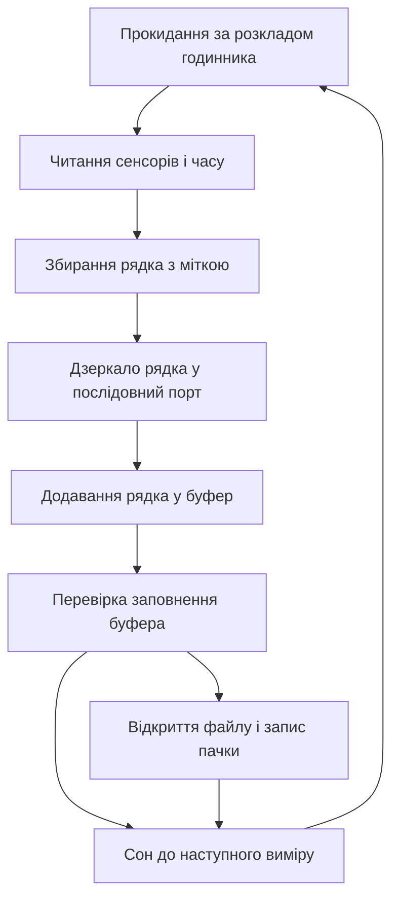

# Логер на SD - запис з годинником

![[assets/img/arduino-logger-scheme.png|600]]
*Рис. Логер: годинник мітить час, контролер складає буфер, карта приймає пачку записів.*

> [!tip] Призначення ноти
> Зібрати всеїдний самописець повного циклу: точні мітки часу на кожному рядку, надійний запис на карту памяті, живий перегляд вимірів через монітор порту і доба окремого файлу для порядку в архіві.
> Нота закриває типові питання: як не вбити карту частими записами, чим мітити час після перезапуску і як дивитись дані наживо без зупинки журналу.

## 1. Призначення

Настільний і польовий логер пише виміри у файл кожну хвилину і переживає зникнення живлення без втрати архіву. Годинник реального часу дає дату і час кожному рядку, контролер тримає рядки у буфері і скидає пачкою на карту, а монітор порту показує ті ж рядки наживо для налагодження. Файл змінюється щодоби, тому архів лишається акуратною стопкою добових файлів.

Логер ставиться поруч з трекером, метеостанцією або стендом випробувань: скрізь, де потрібен чесний журнал з часом без сервера і мережі.

## 2. Склад логера: що купувати

| Вузол | Роль у логері | На що дивитись |
| --- | --- | --- |
| Плата контролера | Збирає виміри і пише файли | Апаратна швидка шина і послідовний порт |
| Модуль карти памяті | Тримає архів добових файлів | Перетворювач рівнів на платі модуля |
| Годинник реального часу | Дає дату і час кожному рядку | Резервна батарейка ходу |
| Карта памяті | Носій журналу | Карта малого обсягу відомого виробника |
| Блок живлення | Годує логер без пауз | Стабільна напруга при записі пачки |
| Корпус | Ховає електроніку від пилу | Доступ до карти без розбирання |

```text
Блочна схема логера:
  +------------------+     шина часу      +------------------+
  | Годинник часу    |------------------->| Контролер        |
  +------------------+                    |  +------------+  |
  +------------------+     виміри         |  | Буфер      |  |
  | Сенсори          |------------------->|  +------------+  |
  +------------------+                    |  +------------+  |
                                          |  | Файл доби |<---> Карта
                                          |  +------------+  |
                                          +------------------+
  Живий перегляд іде у послідовний порт паралельно із записом.
```

## 3. Карта по швидкій шині: бібліотека SD

| Сигнал шини | Роль у записі |
| --- | --- |
| Такт | Синхронізує біти кожної команди |
| Вихід контролера | Несе команди і дані на карту |
| Вхід контролера | Повертає відповіді і блоки даних |
| Вибір карти | Активує саме карту серед пристроїв шини |
| Живлення через перетворювач | Узгоджує рівні плати і карти |
| Земля | Спільна опора для всіх сигналів шини |

Бібліотека SD ховає складність файлової системи: відкриття файлу, допис рядка і закриття виглядають як три рядки коду. Під капотом бібліотека пише блоками фіксованого розміру, тому поодинокі короткі записи без буфера зношують карту швидше і довше тримають контролер.

```text
Підключення модуля карти до плати:
  Плата                 Модуль карти
  +----------+          +-------------+
  | Такт     |--------->| CLK         |
  | Вихід    |--------->| MOSI        |
  | Вхід     |<---------| MISO        |
  | Вибір    |--------->| CS          |
  | Живлення |----------| VCC через перетворювач |
  | Земля    |----------| GND         |
  +----------+          +-------------+
  Проводи шини короткі, вибір карти підтягнутий до живлення.
```

## 4. Годинник часу: мітка кожного рядка

| Функція годинника | Використання у журналі |
| --- | --- |
| Дата і час з батарейкою | Мітка не зникає після перезапуску |
| Імя добового файлу | Файл доби збирається з дати годинника |
| Будильник перериванням | Будить контролер рівно за розкладом |
| Пам'ять налаштувань | Тримає період запису і номер точки |
| Корекція ходу | Звірка з еталоном раз на місяць |

Без годинника журнал після кожного перезапуску починається з нуля, а добові файли злипаються в один. Тому годинник з резервною батарейкою обов'язковий навіть для настільного логера поруч з розеткою.

## 5. Буфер і пачковий запис: карта живе довше

| Прийом запису | Ефект для карти і батареї |
| --- | --- |
| Рядки у буфері памяті | Карта вмикається рідко і пише одразу багато |
| Пачка раз на десять хвилин | Десять рядків одним відкриттям файлу |
| Закриття файлу після пачки | Пачка переживає зникнення живлення |
| Промивання буфера перед сном | Жоден рядок не губиться у сні |
| Резервний рядок у памяті налаштувань | Останній вимір переживає перезапуск |
| Перевірка місця на карті | Логер сигналізує про повну карту завчасно |

Буфер тримає рядки у памяті контролера і скидає на карту однією пачкою. Карта вдячна: менше відкриттів файлу, менше зносу блоків, менше часу з високим струмом запису.

## 6. Файл щодоби: порядок в архіві

| Правило імені | Приклад для доби |
| --- | --- |
| Рік місяць день у імені | Файл доби з датою годинника |
| HAT-плата колонок один раз | Новий файл починається з HAT-плати |
| Роздільник кома | Рядки читаються таблицею без конвертації |
| Час у кожному рядку | Рядок самодостатній без імені файлу |
| Місячна папка за бажанням | Папка місяця для великого архіву |
| Ротація старих файлів | Найстаріші доби видаляються при нестачі місця |

```text
Приклад добового файлу:
  date,time,temp,hum,batt
  2026-10-05,08:00:00,14.2,78.5,4.05
  2026-10-05,08:01:00,14.3,78.1,4.05
  2026-10-05,08:02:00,14.3,77.9,4.04
  Шапка пишеться один раз при створенні файлу доби.
```

Добовий файл закриває одразу три болі: пошук потрібної дати очима, видалення старої доби одним файлом і читання архіву будь-якою таблицею без склеювання.

## 7. Живий перегляд по USB: дані наживо

| Прийом перегляду | Як користуватись |
| --- | --- |
| Дзеркало рядка у порт | Кожен рядок дублюється у монітор порту |
| Мітки часу у перегляді | Ті ж мітки, що йдуть у файл |
| Команди через порт | Одна літера міняє період запису |
| Статус при старті | Плата друкує дату, файл і вільне місце |
| Помилка карти на екрані | Відсутність карти видно одразу у порту |
| Швидкість порту фіксована | Монітор порту налаштований на ту саму швидкість |

Живий перегляд не чіпає файл: рядок одночасно йде у карту і у порт. Плата з підключеним кабелем показує дані наживо, а вимкена мовчки пише той же журнал у карту.

## 8. Скетч логера: буфер, пачка, файл доби

```cpp
#include <Wire.h>
#include <SPI.h>
#include <SD.h>
#include <RTClib.h>

const uint8_t CHIP_SELECT = 4;
const uint8_t LED_OK = 13;
const uint8_t BUF_ROWS = 10;
const unsigned long PERIOD_MS = 60000;

RTC_DS3231 rtc;
char buf[10][48];
uint8_t filled = 0;
char curFile[16] = "";

void dateName(DateTime t, char *out) {
  snprintf(out, 16, "%04d%02d%02d.csv", t.year(), t.month(), t.day());
}

void ensureHeader(const char *name) {
  if (!SD.exists(name)) {
    File f = SD.open(name, FILE_WRITE);
    if (f) {
      f.println("date,time,temp,hum,batt");
      f.close();
    }
  }
}

float readTemp() {
  return 21.5;
}

float readHum() {
  return 55.0;
}

float readBatt() {
  return 4.02;
}

void flushBuf(const char *name) {
  ensureHeader(name);
  File f = SD.open(name, FILE_WRITE);
  if (!f) {
    Serial.println("ERR card open");
    return;
  }
  for (uint8_t i = 0; i < filled; i++) {
    f.println(buf[i]);
    Serial.println(buf[i]);
  }
  f.close();
  filled = 0;
  digitalWrite(LED_OK, HIGH);
  delay(80);
  digitalWrite(LED_OK, LOW);
}

void setup() {
  pinMode(LED_OK, OUTPUT);
  Serial.begin(115200);
  Wire.begin();
  rtc.begin();
  SD.begin(CHIP_SELECT);
  DateTime t = rtc.now();
  dateName(t, curFile);
  Serial.print("logger start file=");
  Serial.println(curFile);
}

void loop() {
  DateTime t = rtc.now();
  char name[16];
  dateName(t, name);
  if (strcmp(name, curFile) != 0) {
    flushBuf(curFile);
    strcpy(curFile, name);
  }
  char row[48];
  snprintf(row, sizeof(row), "%04d-%02d-%02d,%02d:%02d:%02d,%.1f,%.1f,%.2f",
    t.year(), t.month(), t.day(), t.hour(), t.minute(), t.second(),
    readTemp(), readHum(), readBatt());
  strcpy(buf[filled], row);
  filled++;
  if (filled >= BUF_ROWS) {
    flushBuf(curFile);
  } else {
    Serial.println(row);
  }
  unsigned long steps = PERIOD_MS / 1000;
  for (unsigned long i = 0; i < steps; i++) {
    delay(1000);
  }
}
```

Скетч збирає рядки у малий буфер і пише пачкою: десять рядків одним відкриттям файлу. Зміна доби зливає старий буфер у вчорашній файл і відкриває новий з HAT-платою. Живий перегляд іде паралельно: кожен рядок друкується у порт незалежно від стану буфера.

## 9. Mermaid: шлях рядка до архіву



## 10. Надійність: журнал переживає аварії

| Загроза журналу | Захист логера |
| --- | --- |
| Зникнення живлення mid-запису | Файл закривається після кожної пачки |
| Повна карта | Перевірка місця при старті і сигнал світлодіодом |
| Битий рядок сенсора | Перевірка діапазону перед додаванням у буфер |
| Збитий час годинника | Стартові мітки звіряються з минулим файлом |
| Вийнята карта | Помилка відкриття друкується у порт одразу |
| Знос блоків карти | Пачковий запис замість запису кожного рядка |

## Типові помилки

| # | Помилка | Чому погано | Як правильно |
| --- | --- | --- | --- |
| 1 | Запис кожного рядка окремим відкриттям | Карта зношується і довго їсть струм | Буфер на десять рядків і пачковий запис |
| 2 | Час з лічильника замість годинника | Перезапуск обнуляє мітки і плутає архів | Годинник з батарейкою для кожної мітки |
| 3 | Файл не закривають після пачки | Пачка губиться при зникненні живлення | Закривати файл після кожної пачки |
| 4 | Довгі дроти швидкої шини | Блоки бються збоями і файл кривий | Коротка шина і спільна земля з модулем |
| 5 | Модуль карти без перетворювача рівнів | Карта гріється і вмирає завчасно | Модуль з узгодженням рівнів на платі |
| 6 | Один файл на весь рік | Файл росте без меж і не відкривається таблицею | Новий файл щодоби з датою в імені |

## Офіційні джерела

- [Довідник мови Arduino](https://www.arduino.cc/reference/en/) - файли, послідовний порт, робота з рядками і памяттю.
- [Довідка бібліотеки SD](https://docs.arduino.cc/learn/programming/sd-guide/) - відкриття файлів, допис пачкою і обмеження карт.
- [Бібліотека годинника реального часу](https://github.com/adafruit/RTClib) - читання дати, будильники і приклади міток часу.

## Див. також

- [[Home]]
- [[04-Shini/02-SPI|швидка шина]]
- [[02-Zhivlennya/02-Batareyki|автономне живлення]]
- [[16-Proekti/01-Meteostantsiya|погодний вузол]]
- [[16-Proekti/03-Treker|трекер координат]]
- [[12-Moduli-zvyazku/04-GPS-NEO|координати з неба]]
