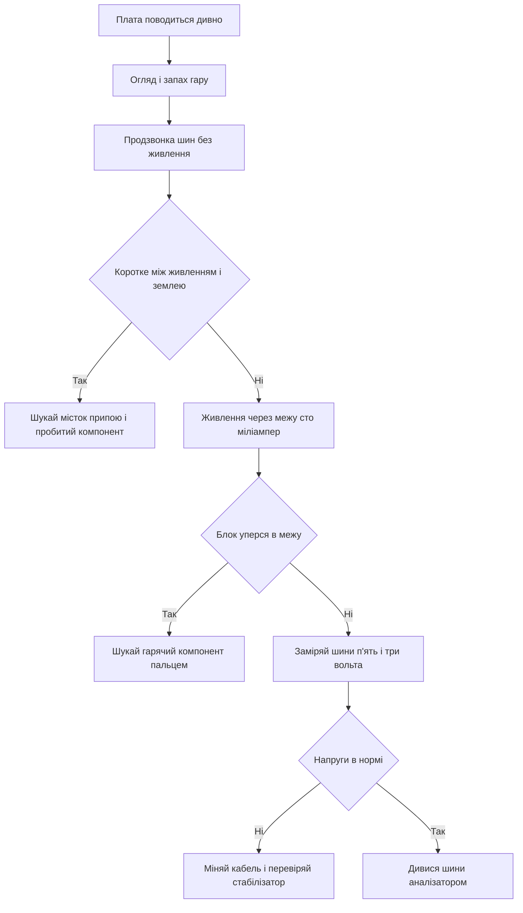

# Прилади майстерні - мультиметр і осцилограф

![[assets/img/arduino-tools-scheme.png|600]]
*Рис. Робоче місце: мультиметр, USB-тестер, логічний аналізатор і блок живлення з обмеженням струму.*

> [!tip] Призначення ноти
> Показати мінімальний набір приладів для налагодження плат Ардуіно: що міряє кожен прилад, у якому порядку їх брати і які цифри вважати нормою.

## 1. Призначення

Більшість несправностей Ардуіно - це живлення, дроти і логічні рівні, а не складний код.
Мультиметр закриває девять із десяти питань: напруга на шинах, цілість дротів, відсутність короткого замикання.
USB-тестер показує реальний струм плати і ловить просідання живлення від слабкого кабелю.
Логічний аналізатор робить видимими шини обміну: видно кожен байт, кожен біт підтвердження, кожну паузу між посилками.
Осцилограф потрібен рідше, але тільки він показує форму сигналу: дзвін на фронтах, шуми, короткі провали живлення.
Блок живлення з обмеженням струму рятує плату, коли помилка вже зроблена: струм впирається в межу, а не в дим.
Ця нота задає порядок дій: спочатку прості виміри мультиметром, потім струм, потім шини, і лише потім складна техніка.

## 2. Мультиметр: три головні режими

| Режим | Що показує | Куди ставити щупи | Норма для Ардуіно |
| --- | --- | --- | --- |
| Напруга постійна | Рівень на шині живлення | Чорний на землю, червоний на точку | Пять вольт плюс мінус пять сотих |
| Струм постійний | Споживання плати | У розрив кола живлення, послідовно | Десятки міліампер без навантаження |
| Продзвонка | Цілість дроту і відсутність короткого | Між двома точками, без живлення | Писк на цілому дроті, тиша між шинами |
| Опір | Номінал резистора і обриви | Паралельно деталі, без живлення | Близько до маркування на корпусі |
| Діодний тест | Падіння на переході | Прямо на діод або світлодіод | Приблизно два вольти на світлодіоді |

Головне правило: напругу міряють паралельно, струм - послідовно, продзвонку - тільки без живлення.
Гніздо щупів для струму окреме: після виміру струму перестав червоний щуп назад у гніздо напруги.
Інакше наступний замір напруги стане коротким замиканням через низький опір струмового шунта.
Діапазон починають із більшого: спочатку двадцять вольт, потім два вольти для точності.
Автовибір діапазону зручний, але повільніший: на швидких перевірках краще ручний.

## 3. Напруга: що і де міряти

| Точка | Очікувана цифра | Що означає відхилення |
| --- | --- | --- |
| Шина п'ять вольт від USB | Від 4.75 до 5.25 | Нижче - слабкий кабель або перевантаження |
| Вихід стабілізатора 3.3 | Від 3.2 до 3.4 | Нижче - перегрів або забагато споживачів |
| Пін скидання у спокої | Близько п'яти вольт | Нуль - плата постійно у скиданні |
| Логічна одиниця на виході | Вище 4.2 при живленні п'ять | Нижче - пін перевантажений або пошкоджений |
| Аналоговий вхід датчика | Середина шкали при середньому освітленні | Край шкали - обрив або коротке на датчику |
| Гніздо живлення під навантаженням | Не нижче семи вольт | Нижче - блок живлення слабкий для Vin |

```text
Порядок обходу плати мультиметром:
  1. Чорний щуп на землю плати, там він і лишається.
  2. Червоним торкнися шини 5V, запиши цифру.
  3. Червоним торкнися шини 3V3, запиши цифру.
  4. Пройдися по гребінках живлення з обох боків.
  5. Перевір напругу на ніжках живлення мікроконтролера.
  6. Тільки потім міряй сигнали: скидання, кварц, шини.
```

## 4. Струм: як не спалити прилад і плату

| Сценарій | Типовий струм | Висновок |
| --- | --- | --- |
| Гола плата Uno у простої | Близько 45 міліампер | Норма, міст USB теж споживає |
| Плата Nano у простої | Близько 20 міліампер | Норма, перетворювача USB немає |
| Світлодіод через резистор | Близько 10 міліампер | Норма, резистор підібрано правильно |
| Нуль міліампер, плата мовчить | Нуль | Обрив живлення або спрацював запобіжник |
| Струм понад пів ампера | Аварія | Коротке на платі, живлення геть |
| Струм плаває без причини | Нестабільність | Поганий контакт у макетці або дріт надламаний |

Струм міряють у розриві: відʼєднай дріт живлення, замкни розрив через мультиметр.
Червоний щуп у гніздо струму, межу обери з запасом: десять ампер для першої проби.
Запобіжник усередині приладу згорає мовчки: якщо струм завжди нуль, перевір запобіжник.
Ніколи не міряй струм паралельно шині: прилад стане коротким і спалить доріжку.
Для довгого спостереження кращий USB-тестер: він показує струм наживо, без розриву кола.

## 5. USB-тестер: очі на кабелі живлення

| Показник | Норма | Тривожний знак |
| --- | --- | --- |
| Напруга під навантаженням | Вище 4.75 | Падає до 4.5 - кабель тонкий або довгий |
| Струм у простої | Десятки міліампер | Стрибає сотнями - коротке або кільце перезавантажень |
| Струм із модулями | Сума за паспортами модулів | Більше суми - модуль несправний або шина зайва |
| Ємність за сесію | Росте рівномірно | Не росте при увімкненій платі - контакту немає |

USB-тестер вставляють між зарядним пристроєм і платою: він нічого не розриває і не потребує щупів.
Головна знахідка тестера - погані кабелі: тонкі жили дають просідання, плата перезавантажується, скетч нібито висить.
Перевірка проста: той же сетап на двох кабелях, цифри напруги під навантаженням порівнюють.
Тестер із тригером протоколів швидкого заряджання для Ардуіно не потрібен: вистачає базового вольтамперметра.
Зате корисний екран із графіком: видно кидки струму в момент старту двигуна або передачі радіомодуля.

## 6. Логічний аналізатор: шини як на долоні

| Шина | Що дивитися | Ознака здоровʼя |
| --- | --- | --- |
| UART | Старт, вісім біт, стоп, швидкість | Байти рівні, сміття немає, паузи стабільні |
| I2C | Адреса, біт підтвердження, стоп | Кожен байт підтверджено, адреса саме та |
| SPI | Фронт синхронізації, вибір веденого | Дані стабільні на активному фронті |
| ШІМ | Період і шпаруватість | Період рівний, шпаруватість відповідає до коду |
| Переривання | Частота і тривалість імпульсів | Немає пачок і пропусків без причини |

Найдешевший восьмиканальний аналізатор на 24 мегагерци закриває всі шини Ардуіно.
Вільна програма PulseView із декодерами протоколів показує байти прямо поверх осцилограм.
Землю аналізатора зʼєднують із землею плати коротким дротом: довга земля дає дзвін і хибні фронти.
Поріг спрацювання для пʼятивольтової логіки виставляють посередині: близько двох з половиною вольт.
Захоплення починають із повільної розгортки: спочатку факт обміну, потім деталі кожного байта.

```text
Мінімальна сесія з аналізатором для шини I2C:
  1. Канал 0 на SDA, канал 1 на SCL, земля на GND плати.
  2. Частота захоплення 1 МГц, обсяг два мільйони відліків.
  3. Запуск скетчу, зупинка захоплення після першої посилки.
  4. Декодер I2C: перевір адресу і біт підтвердження.
  5. Нема підтвердження — адреса не та або ведений без живлення.
```

## 7. Блок живлення з обмеженням струму

| Ручка | Як виставити | Навіщо |
| --- | --- | --- |
| Напруга | Пʼять вольт для логіки, сім для гнізда | Точна цифра без просідання кабелю |
| Обмеження струму | 100 міліампер для першого вмикання | Помилка коштує спрацювання межі, а не диму |
| Індикація переходу в межу | Світлодіод і падіння напруги | Сигнал: на платі коротке, живлення геть |

Перше вмикання невідомої плати - завжди через обмеження: напруга пʼять, межа сто міліампер.
Якщо блок одразу вперся в межу, а плата холодна - шукай коротке продзвонкою, живлення не додавай.
Якщо межа спрацьовує, а гріється один компонент - кандидат на заміну знайдений пальцем.
Межу піднімають поступово: сто, двісті, пʼятсот - кожен крок із контролем температури.
Лабораторний блок не скасовує продзвонку: коротке шукають без живлення, блок лише страхує вмикання.

## 8. Що міряти першим: порядок за пʼять хвилин

| Крок | Дія | Інструмент |
| --- | --- | --- |
| 1 | Оглянь плату: потьоки припою, тріщини, запах | Очі і ніс |
| 2 | Продзвони шини живлення між собою без живлення | Мультиметр |
| 3 | Подай живлення через обмеження сто міліампер | Блок живлення |
| 4 | Заміряй пʼять вольт і три і три вольта | Мультиметр |
| 5 | Заміряй струм спокою і порівняй із нормою | USB-тестер |
| 6 | Перевір скидання і тактові сигнали | Аналізатор або осцилограф |
| 7 | Дивися шини обміну і декодуй посилки | Логічний аналізатор |

## 9. Перевірка живлення скетчем

```cpp
// Швидка перевірка внутрішнього джерела опори 1.1 В.
// Якщо показує далеко від норми — шукай проблему в живленні,
// а не в коді датчика.
void setup() {
  Serial.begin(9600);
}

void loop() {
  int raw = analogRead(A0);
  float volts = raw * 5.0 / 1023.0;
  Serial.print("A0 = ");
  Serial.print(volts, 2);
  Serial.println(" V");
  delay(500);
}
```

Цей скетч не калібрує датчик: він відповідає на питання, чи живе опорна напруга.
Подай на вхід відому напругу з дільника і порівняй покази з мультиметром.
Розбіжність більше десятої вольта - привід перевірити землю дільника і шину пʼять вольт.
Плаваючі молодші розряди без підключеного входу - норма: вхід ловить наведення з повітря.
Підтяжка входу до землі через десять кілоом прибирає плавання і дає чесний нуль.

## 10. Mermaid: дерево перших вимірів



## Типові помилки

| # | Помилка | Чому погано | Як правильно |
| --- | --- | --- | --- |
| 1 | Вимір струму щупами паралельно шині | Прилад стає коротким, горить доріжка або запобіжник | Струм тільки в розрив кола, послідовно |
| 2 | Лишили червоний щуп у гнізді струму | Наступний замір напруги закоротить шину | Після струму одразу перестав щуп у гніздо напруги |
| 3 | Продзвонка під живленням | Прилад бреше, можливий вихід із ладу | Живлення геть, конденсатори розряджені, потім дзвони |
| 4 | Довга земля аналізатора через пів макетки | Дзвін і хибні фронти на захопленні | Короткий дріт землі прямо біля сигналу |
| 5 | Живлення невідомої плати без межі струму | Перша помилка стає останньою для плати | Перше вмикання через сто міліампер межі |
| 6 | Віра кабелю з коробки без перевірки | Просідання дає фантомні перезавантаження | Порівняй два кабелі USB-тестером під навантаженням |

## Офіційні джерела

- [Arduino documentation - основи вимірювань і живлення](https://docs.arduino.cc/learn/electronics/power/) - напруги, струми, вибір живлення для плат.
- [Sigrok PulseView - вільна програма аналізаторів](https://sigrok.org/wiki/PulseView) - захоплення, декодери шин, підтримані прилади.
- [Arduino UNO R3 - схема і характеристики живлення](https://docs.arduino.cc/hardware/uno-rev3/) - шини плати, межі струму, точки контролю.

## Див. також

- [[Home]]
- [[01-Hardware/01-AVR-Uno|класичний AVR]]
- [[02-Zhivlennya/01-Zhivlennya-VIN|живлення від VIN]]
- [[17-Lab/02-Maketka-PCB|макетка і плата]]
- [[99-Dodatki/01-Troubleshooting-FAQ|відповіді на питання]]
