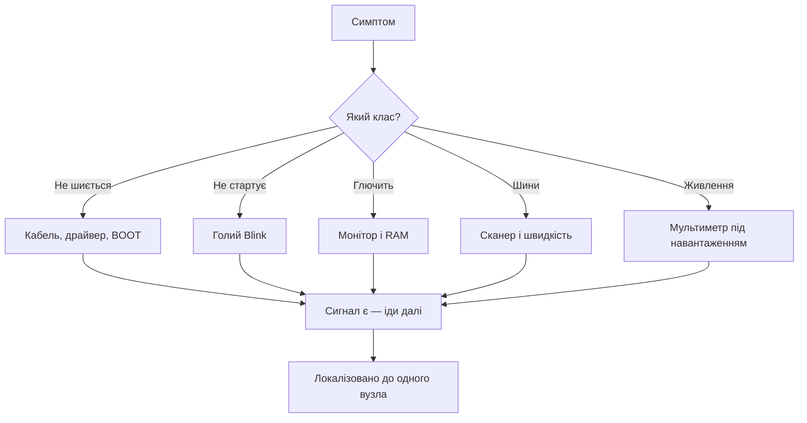

# Карта діагностики Arduino - симптом, інструмент, сигнал

![[assets/img/arduino-diagmap-scheme.png|600]]
*Рис. Від симптому до сигналу: яким приладом і що дивитись.*

> [!tip] Призначення ноти
> Дати таблицю-маршрут: симптом - прилад - сигнал. Доповнення до FAQ, а не дубль.

## 1. Як користуватись картою

Знайди симптом, візьми прилад, перевір сигнал. Сигналу немає - причина знайдена. Розбір причин - у [[99-Dodatki/01-Troubleshooting-FAQ|відповідях на питання]], тут тільки маршрут вимірів.

## 2. Заливка і порт

| Симптом | Прилад | Сигнал |
| --- | --- | --- |
| Порту немає | Диспетчер + інший кабель | COM зявляється при підключенні |
| Заливка рветься | Verbose-лог IDE | На якому відсотку обрив |
| Порт зайнято | Закрити все | Монітор і плотер закриті |
| Клон мовчить | Драйвер моста | CH340/CP2102 видно в системі |

## 3. Старт і стабільність

| Симптом | Прилад | Сигнал |
| --- | --- | --- |
| Не стартує | Blink-тест | Світлодіод блимає чи ні |
| Ребути | Монітор + палець на LDO | Причина і нагрів |
| Висне випадково | Вільна RAM в лозі | Залишок SRAM у байтах |
| Гріється | Мультиметр струму | Хто їсть понад норму |

## 4. Шини і датчики

| Симптом | Прилад | Сигнал |
| --- | --- | --- |
| I2C мовчить | Скетч-сканер | Адреса на лінії |
| SPI сміття | Зниження швидкості | Чисто на мінімумі чи ні |
| UART крякозябри | Бодрейт монітора | Збіг зі скетчем |
| АЦП пливе | Мультиметр опори | 5В або 1.1В стабільно |

## 5. Живлення

| Симптом | Прилад | Сигнал |
| --- | --- | --- |
| Просадка | Мультиметр під навантаженням | 5В тримається чи ні |
| Гарячий LDO | Струм і напруга VIN | Потужність розсіювання |
| Від батареї гірше | Напруга банки | Внутрішній опір |

## Mermaid: маршрут діагностики

## 6. Покажчик інструментів

| Маю | Можу | Не можу |
| --- | --- | --- |
| Тільки USB | Порт, лог, заливка | Аналог і струми |
| Плюс мультиметр | Живлення, короткі, струм | Таймінги |
| Плюс аналізатор | Шини з декодерами | Аналоговий шум |
| Плюс осцилограф | ШІМ, пульсації, фронти | Радіо |

## 7. Журнал: що записати

| Поле | Навіщо |
| --- | --- |
| Плата і клон чи ні | Клони поводяться по-різному! |
| Симптом дослівно | Повторити через місяць |
| Мінімальний скетч | Голий приклад з багом |
| Що вже перевірено | Не ходити колами |

## 8. Війністорії карти: ще три

### К1. Плотер тримає порт

| Поле | Запис |
| --- | --- |
| Симптом | Заливка падає, монітор закрито |
| Вимір | Плотер відкрито в сусідній вкладці! |
| Причина | Той же COM зайнято |
| Фікс | Закривати все крім IDE при заливці |

### К2. 12 В на VIN і дим

| Поле | Запис |
| --- | --- |
| Симптом | Запах, плата мертва |
| Вимір | БЖ стояв на 12 В понад ліміт з реле |
| Причина | Перегрів LDO + струм реле |
| Фікс | Нова плата, VIN 7-9 В, реле окремо |

### К3. Сканер знайшов два датчики

| Поле | Запис |
| --- | --- |
| Симптом | Один датчик відповідає за двох |
| Вимір | Обидва на адресі 0x76 з коробки |
| Причина | Однакові адреси, SDO не перепаяно |
| Фікс | Перепаяти SDO одного на 0x77 |

## 9. Швидкий покажчик: симптом - куди

| Симптом | Розділ карти |
| --- | --- |
| Порту немає | 2. Заливка і порт |
| Не стартує | 3. Старт і стабільність |
| I2C мовчить | 4. Шини і датчики |
| Гріється | 5. Живлення |
| Тільки USB в руках | 6. Покажчик інструментів |

## Типові помилки

| # | Помилка | Чому погано | Як правильно |
| --- | --- | --- | --- |
| 1 | Міряти без землі приладу | Фантомні значення | Спільна земля завжди! |
| 2 | Шукати складне першим | Години повз причину | Від простого до складного |
| 3 | Без журналу | Ті ж кола | Записувати кожен крок |
| 4 | Один замір - вирок | Випадковість | Тричі і середнє |
| 5 | Ігнор нагріву | Теплові глюки | Палець і струм |

## Офіційні джерела

- [Arduino Troubleshooting (Arduino)](https://support.arduino.cc/hc/en-us/sections/360003198300-Upload-issues) - заливка, порти, драйвери.
- [Arduino Language Reference (Arduino)](https://docs.arduino.cc/language-reference/) - функції і поведінка.

## Див. також

- [[Home]]
- [[99-Dodatki/01-Troubleshooting-FAQ|відповіді на питання]]
- [[99-Dodatki/02-Cheklisti-Datasheet|списки і даташити]]
- [[17-Lab/01-Priladi|вимірювальні прилади]]
- [[09-Proshivka/01-IDE-CLI|середовище і CLI]]
