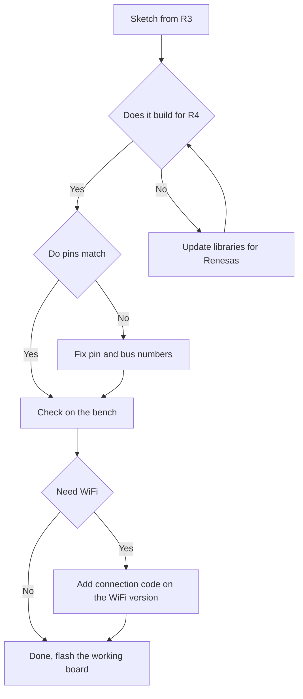

# Uno R4 - Renesas with WiFi

![[assets/img/arduino-uno-r4-scheme.png|600]]
*Fig. Modern Uno R4: familiar headers, new core and LED matrix.*

> [!tip] Purpose of the note
> To show the bridge between classic and modern: what is new in the Renesas chip, how versions differ and how to move sketches from R3 without pain.

## 1. Purpose

Uno R4 keeps the familiar format: headers, power jack and 5-volt logic stay.

Inside sits a 32-bit Renesas at 48 MHz: more memory, more peripherals, higher speed.

The WiFi version adds radio and a 12 by 8 LED matrix: indication and link with no shields.

This note teaches version choice, use of new blocks and moving old sketches.

Who knows R3 will master R4 in an evening: the language is the same, possibilities are wider.

## 2. R3 and R4 comparison

| Parameter | Uno R3 | Uno R4 Minima | Uno R4 WiFi |
| --- | --- | --- | --- |
| Core | AVR 8-bit, 16 MHz | Renesas 32-bit, 48 MHz | Renesas 32-bit, 48 MHz |
| Flash / SRAM | 32 KB / 2 KB | 256 KB / 32 KB | 256 KB / 32 KB |
| Pin logic | 5 V | 5 V | 5 V |
| USB | USB-B through a bridge | Native USB-C | Native USB-C |
| Radio | None | None | ESP32-S3 for WiFi and Bluetooth |
| Matrix | None | None | 12 by 8 LEDs |
| CAN | None | Controller present | No controller |
| DAC | None | One channel present | No channel |
| Typical task | Learning, simple nodes | Fast logic, CAN nodes | Cloud projects, indication |

5-volt compatibility is kept: old shields and sensors fit without converters.

Power became more modern: the USB-C connector is sturdier and gives more current.

Memory is eight times larger, so big link libraries fit easily.

## 3. Minima versus WiFi

| Question | Minima | WiFi |
| --- | --- | --- |
| Price | Lower | Higher because of radio and matrix |
| Radio | None | WiFi and Bluetooth through ESP32-S3 |
| 12 by 8 matrix | None | Present, driven by a library |
| CAN bus | Present, routed to the header | None |
| DAC | Present | None |
| For a standalone node | Yes, cheaper | Yes, if radio is needed |
| For a cloud project | No, no link | Yes, out of the box |

Minima is taken for fast logic, CAN networks and accurate analog outputs.

WiFi is taken for cloud, phone apps and live indication with no display.

Both versions flash the same way through USB-C, the difference is only in libraries.

```text
Вибір версії R4:

  треба радіо або матриця .... WiFi (ESP32-S3 на борту)
  треба CAN або ЦАП .......... Minima
  треба і те і те ............ WiFi плюс зовнішні модулі CAN і ЦАП
  грошей мало, задача проста . Minima
```

## 4. WiFi LED matrix

| Feature | Description | Practice |
| --- | --- | --- |
| Size | 12 columns by 8 rows | 96 dots for icons and digits |
| Control | Ready matrix library | Draw with frames, not dots by hand |
| Brightness | Programmable | Lower at night so it does not blind |
| Animation | Frame change on a timer | Heartbeat, arrows, signal level |
| Font | Built-in digits and letters | Text scrolls with no external display |

The matrix runs from the board, it asks for no separate supply.

Bright animations at maximum heat the regulator, so keep a middle level.

For large scoreboards the matrix is unfit: it is an indicator, not a display.

```text
Матриця 12 на 8 (приклад смайлика):

  . . X X . . . . X X . .
  . X . . X . . X . . X .
  . X . . X . . X . . X .
  . . X X . . . . X X . .
  . . . . . . . . . . . .
  . X . . . . . . . . X .
  . . X . . . . . . X . .
  . . . X X X X X X . . .
```

## 5. WiFi and cloud out of the box

| Block | What it gives | Where to start |
| --- | --- | --- |
| ESP32-S3 | WiFi and Bluetooth radio | Link examples from the environment |
| Antenna | Printed on the board | Do not hide the board in metal |
| Link library | Connections and requests | Network scan example first |
| Cloud variables | Sync with the dashboard | Panel and graphs with no own server |
| Security | Encryption out of the box | Do not write passwords into open code |

The first experiment scans networks: the board shows a list, so radio is alive.

The network password stays in a separate settings file, not scattered across examples.

A metal case muffles the signal, so the board is placed antenna-out.

## 6. Example: WiFi and matrix together

The sketch joins the network and shows status on the matrix: a cross while searching, a tick when linked.

```cpp
#include "Arduino_LED_Matrix.h"

ArduinoLEDMatrix matrix;

const uint8_t cross[8][12] = {
  {0,0,0,0,0,0,0,0,0,0,0,0},
  {0,1,0,0,0,0,0,0,0,0,1,0},
  {0,0,1,0,0,0,0,0,0,1,0,0},
  {0,0,0,1,0,0,0,0,1,0,0,0},
  {0,0,0,0,1,0,0,1,0,0,0,0},
  {0,0,0,0,0,1,1,0,0,0,0,0},
  {0,0,0,0,0,0,0,0,0,0,0,0},
  {0,0,0,0,0,0,0,0,0,0,0,0}
};

void setup() {
  matrix.begin();      // запуск матриці
  matrix.renderBitmap(cross, 8, 12); // показати хрестик пошуку
}

void loop() {
  // тут підключення до мережі, після успіху малюють галочку
}
```

A frame is described by a byte table: one lights, zero kills.

Complex pictures are generated with a frame editor, not written by hand.

After debugging the indication, connection code from the library example is added.

## 7. CAN on Minima

| Feature | Description | Practice |
| --- | --- | --- |
| Controller | Built into Renesas | No external controller needed |
| Transceiver | External, bought separately | Without a transceiver the bus is silent |
| Speed | Up to 1 Mbps | Working speed comes from the network description |
| Terminator | 120 Ohm at the ends | Without it frame errors |
| Library | Ready, with examples | Start by sending a counter |

CAN joins nodes with two wires over tens of meters.

Each node gets its own number, otherwise frames collide.

For cars and industrial networks CAN is more reliable than a serial port.

## 8. Mermaid: moving a sketch from R3



Most simple sketches build at once: the language is the same, pins are the same.

Libraries with direct AVR registers are updated first; they are the main cause of issues.

After building, behavior is checked on the bench, only then placed into the product.

## 9. Power supply and shield compatibility

| Question | Answer |
| --- | --- |
| Pin logic | 5 V, as on R3 |
| USB | USB-C, sturdier connector |
| Power jack | 6-24 V through a converter |
| Matrix current | Account for it with bright frames |
| R3 shields | Fit mechanically and electrically |
| Fast shields | Check libraries for the new frequency |

The jack range is wider than on R3, so supplies from 6 to 24 V fit.

Current through USB-C is larger; matrix and radio do not sag sensor power.

Old microsecond timing tricks are recalibrated, because the core frequency is three times higher.

## Common issues

| # | Issue | Why it is bad | How to do it right |
| --- | --- | --- | --- |
| 1 | Selected R3 in the environment for an R4 board | Code builds for the wrong chip | Select your R4 version in the board list |
| 2 | Old library with AVR registers | Build fails with errors | Update the library to a version with Renesas |
| 3 | WiFi password in an open example | The key reaches strangers | Keep the password in a separate settings file |
| 4 | Board in a metal case | Antenna is muffled, link drops | Bring the antenna outside or take plastic |
| 5 | Matrix brightness at maximum always | Heat and extra current | Keep a middle level, maximum for flashes |
| 6 | CAN without transceiver and terminator | Bus is silent, frames are lost | Add a transceiver and 120 Ohm resistors at the ends |

## Official sources

- [Uno R4 WiFi board on docs.arduino.cc](https://docs.arduino.cc/hardware/uno-r4-wifi/) - specs, matrix, radio and quick start.
- [Uno R4 comparison on arduino.cc](https://www.arduino.cc/en/Guide/UNO-R4) - Minima and WiFi versions, migration from R3 and examples.

## 7. Uno R4 revisions (Arduino SA, 2025-2026)

- **Uno R4 Minima**: revision R4.1 -> fixed regulator (5 V more stable under load); R4.2 -> added ESD protection on USB.
- **Uno R4 WiFi**: revision with ESP32-S3 module (not ESP32) - check the module firmware version with `WiFi.firmwareVersion()`.
- **Porting from R3**: code is compatible; but `analogWrite` on R4 = LEDC with a different frequency (higher than on AVR) - verify one way.

## See also

- [[Home.en]]
- [[EN/00-Start/03-Porivnyannya-plat.en|board comparison]]
- [[EN/00-Start/05-Vibir-seredovischa.en|environment choice]]
- [[EN/01-Hardware/01-AVR-Uno.en|classic AVR]]
- [[EN/01-Hardware/03-Due-Zero-ARM.en|ARM boards]]
- [[EN/09-Firmware/01-IDE-CLI.en|environment and CLI]]
