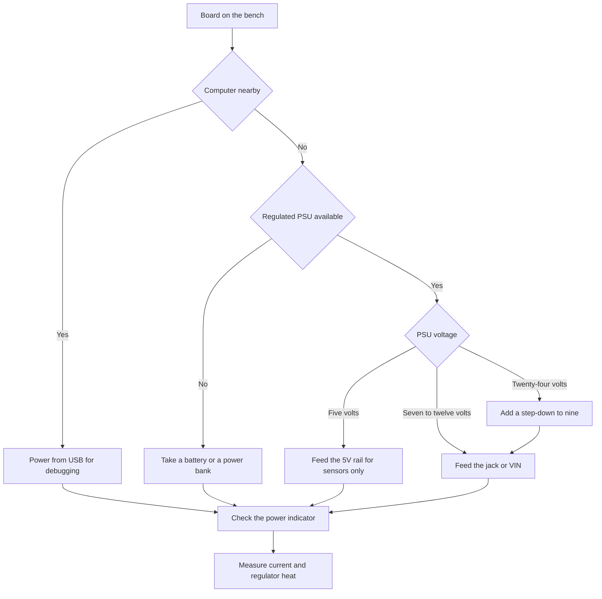

# Arduino Power Supply - USB, VIN and LDO

![[assets/img/arduino-vin-power-scheme.png|600]]
*Fig. Board power from USB and VIN through the protection diode and regulator with distribution to the rails.*

> [!tip] Purpose of the note
> Explain the three power paths of a classic board and teach how to pick a PSU without overheating the regulator and without brownouts under a servo.

## 1. Purpose

This note covers power for the classics on the example of boards with an ATmega chip: where the five volts for logic come from, where to apply external volts, and why the regulator gets hot.

The main idea is simple: the board has two power inputs and one step-down converter, and everything else is automatic selection and protection against mistakes.

After reading, the reader confidently tells the USB rail from the VIN rail, understands the limits of the three-volt output, and can power a servo without reboots.

The note helps both on the bench and inside a finished enclosure, where the PSU can no longer be swapped every day.

It connects to other topics directly: the board itself is described in [[EN/01-Hardware/01-AVR-Uno.en|classic AVR]], carrier choice is described in [[EN/00-Start/04-Dev-Boards.en|board overview]], and long battery life is described in [[EN/02-Power-Supply/02-Battery-Power.en|battery autonomy]].

## 2. Three power paths

A classic board can take energy three ways, but the logic always runs from clean five volts.

| Source | Where to apply | Voltage | Current | When to use |
| --- | --- | --- | --- | --- |
| USB from a computer | USB-B or USB-C socket | 5 V | Up to 500 mA | Development and flashing |
| Round jack | 2.1 jack, center-plus | 7-12 V | Depends on the PSU | Stationary operation |
| VIN pin | VIN and GND header | 7-12 V | Depends on the regulator | Power through a shield |
| 5V pin | Output only | Exactly 5 V | Up to 400 mA from the regulator | Powering sensors |
| 3V3 pin | Output only | 3.3 V | Up to 50 mA | Weak sensors |

The on-board automatic switch picks the higher source: if there is voltage on the jack, a switch disconnects USB, otherwise the board lives from the port.

The 5V pin is not an input for a nine-volt PSU, it is a logic-rail output for sensors and low-power modules.

The 3V3 pin is a weak tap for low-logic sensors, not for radio modules with pulsed consumption.

## 3. Round 2.1 jack and center-plus

The round socket on the board is a standard 2.1 mm jack with plus in the center and minus on the shell.

| Parameter | Norm | Explanation |
| --- | --- | --- |
| Pin diameter | 2.1 mm | The most common PSU plug |
| Polarity | Center-plus | Plus inside, minus outside |
| PSU voltage | 7-12 V | Headroom for the regulator |
| PSU current | 1 A and more | Headroom for servos and relays |
| Regulation | Regulated PSU | No jumps under load |
| Check | Multimeter before switching on | Polarity and no-load voltage |

A PSU labeled unregulated gives far more than nominal at no load, so it is not used for the board.

A center-minus plug from music gear does not fit here: the board is diode-protected, but it will not work.

A long thin cable from the PSU sags under load, so motors get thick wires and a short path.

```text
Джек 2.1 центр-плюс очима плати:

  штекер блока ---> [центр +] ---> діод ---> стабілізатор ---> шина 5 В
                     [корпус -] ---> земля плати ---> шина GND

  Перевірка перед вмиканням:
  1. Мультиметр у режим постійної напруги.
  2. Червоний щуп у центр, чорний на корпус.
  3. Має показати плюс 7-12 В, а не мінус.
  4. Під навантаженням напруга не падає нижче 7 В.
```

## 4. Why VIN means 7-12 V

The VIN pin connects to the jack through a diode, so the rules are the same: not five and not twenty-four.

| Input on VIN | What happens | Why |
| --- | --- | --- |
| 5 V | The board barely breathes | Too little headroom for the regulator |
| 7-9 V | Ideal | Low heat and stable 5 V |
| 12 V | Works but heats up | A large drop is burned as heat |
| 24 V | Overheat and risk | The regulator goes into protection or burns |
| AC voltage | Does not work | Only DC voltage is accepted |
| Swapped plus and minus | The diode saves the board | The board stays silent but does not burn |

Two volts of headroom above five are needed by the regulator itself: without it, it drops out of regulation and the rail drifts down.

The upper limit of twelve volts is a compromise between convenience and heat: the higher the input, the more heat per every hundred milliamps.

Twenty-four volts from industrial cabinets are never applied here: first step down with a separate converter to nine.

```text
Ланцюг VIN спрощено:

  VIN 7-12 В ---> діод захисту ---> LDO 5 В ---> шина 5V ---> логіка
       |                                              |
  GND блока ---> земля плати ------------------------> шина GND

  Заборонено:
  - подавати 5 В на VIN і чекати стабільності;
  - подавати 24 В без проміжного перетворювача;
  - живити плату через пін 5V від блока 9 В.
```

## 5. LDO AMS1117: heat and limits

The AMS1117 regulator is a linear converter: it turns excess volts into heat.

| Parameter | Value | Practical meaning |
| --- | --- | --- |
| Type | Linear LDO | Simple, quiet, but heats up |
| Output | 5 V | Feeds the logic and the 5V rail |
| Dropout | About 1 V | So the input must be at least 7 V |
| Current | 400-500 mA without a heatsink (800 mA - only with a heatsink and Vin ≤ 9 V) | On a bare board really 400-500 mA |
| Heat | Drop multiplied by current | 7 V of drop at 0.5 A is 3.5 W |
| Protection | Thermal and current | Shuts down on overheat |
| Cooling | Board copper pour | A pause and airflow lower the temperature |

Calculation example: 12 V in, 5 V out, 300 mA gives seven volts of drop and a bit more than two watts of heat.

The same current from a 7.5 V input gives less than a watt of heat, so a seven- or nine-volt PSU always runs cooler.

If a finger cannot hold the regulator body for more than three seconds, lower the input or move the load to a separate PSU.

```text
Тепло стабілізатора на пальцях:

  вхід 7.5 В - 5 В = 2.5 В х 0.3 А = 0.75 Вт (теплий)
  вхід 9 В - 5 В = 4 В х 0.3 А = 1.2 Вт (гарячий)
  вхід 12 В - 5 В = 7 В х 0.3 А = 2.1 Вт (пече)

  Висновок:
  - для логіки і датчиків вистачає 7-9 В;
  - для серво беруть окремий блок 5-6 В;
  - радіатор і обдув лише відтягують межу.
```

## 6. 5V rail and weak 3.3V output

The 5V rail distributes clean five volts from after the regulator, and the 3V3 output is a separate weak tap.

| Rail | Where it comes from | What to hang on it | What not to hang on it |
| --- | --- | --- | --- |
| 5V | After the LDO or USB | Sensors, buttons, LEDs | Motors and long strips |
| 3V3 | Small regulator | Low-current sensors | Radio with 200 mA pulses |
| VIN | Before the regulator | 7-12 V PSU | 5 V loads directly |
| GND | Board ground | Common ground of all PSUs | Split ground between PSUs |
| AREF | Measurement reference | Precise reference when needed | Powering sensors |

Radio modules with consumption peaks reboot the board from the weak three-volt output: give them a separate converter with capacitors.

Temperature, humidity and pressure sensors with milliamp currents live happily on the 5V rail over short wires.

Long LED strips are powered from both ends by a separate PSU, and the board gives only the control signal and ground.

## 7. PSU for servos and motors

Servos and motors are inductive loads with current surges, so they are never hung on the board regulator.

| Load | Idle current | Startup surge | Which PSU to take |
| --- | --- | --- | --- |
| Micro servo | 100-200 mA | Up to 600 mA | 5-6 V, 2 A for two servos |
| Standard servo | 300-500 mA | Up to 1.5 A | 5-6 V, 3 A and more |
| Gear motor | 200-400 mA | Up to 2 A | Driver with a separate power input |
| Relay | 70-90 mA per coil | Surge at switch-on | Separate PSU or 500 mA headroom |
| LED strip | 60 mA per segment | Sum of segments | PSU with a third of headroom |

Wiring rule: power runs from the PSU to the motor over thick wires, the signal runs from the board pin over a thin wire, grounds meet at one point.

A capacitor of hundreds of microfarads near the servo smooths the surge, and a diode across the motor kills the back EMF.

If the board reboots the moment the servo moves, it is always a supply sag, not a code bug.

```text
Правильна розводка з серво:

  блок 5-6 В (+) ---> серво (+), плата (5V НЕ зʼєднана!)
  блок 5-6 В (-) ---> серво (-), плата (GND) ---> спільна земля
  пін 9 ---------сигнал---------> серво (сигнал)

  Неправильно:
  - серво (+) від піна 5V плати;
  - різні землі у блока і плати;
  - тонкі довгі проводи сили.
```

## 8. Protection diode and polyfuse

The board has two silent guards: a diode on the VIN input and a self-recovering fuse on the USB line.

| Element | Where it sits | What it does | Limit |
| --- | --- | --- | --- |
| Diode on VIN | After the jack | Blocks minus on reversed polarity | Drops 0.7 V, heats up with current |
| Polyfuse | On the USB 5 V line | Cuts current on a short | Up to 500 mA, recovers by itself |
| Selector switch | Between USB and VIN | Takes the higher source | Dislikes simultaneous jumps |
| Capacitors | On LDO input and output | Kill ripple | Dry ones give hum and reboots |
| Zener | On some clones | Clips spikes | Does not replace a proper PSU |

The diode eats about 0.7 V, so nine volts on the jack become a bit over eight before the regulator.

The polyfuse needs a power-off pause after tripping: switching straight back on is pointless.

Shorting the header against a metal case is a classic: the board goes dark, the fuse cools down, the lesson sticks.

```text
Захист очима струму:

  гніздо ---> діод (мінус не проходить) ---> LDO ---> 5V
  USB -----> запобіжник 500 мА (при короткому росте опір) ---> 5V

  Після спрацювання:
  1. Відключити все живлення.
  2. Прибрати причину короткого.
  3. Зачекати хвилину.
  4. Увімкнути і перевірити тепло.
```

## 9. Measuring current with a multimeter

Without measurement, talk about a PSU is guessing, so current is measured in a break and voltage in parallel.

| Step | Action | How to do it |
| --- | --- | --- |
| 1 | No-load voltage | Probes on the PSU jack without the board |
| 2 | Voltage under load | Probes on VIN and GND while running |
| 3 | Idle current | Meter in series with the PSU plus |
| 4 | Current with servo | Move the servo and record the peak |
| 5 | Regulator heat | Finger or thermometer after 5 minutes |
| 6 | Ripple | Capacitor and short wires on sags |

A meter in current mode goes in series: break the PSU plus and stand in the break with the probes.

Start the range at ten amps, then switch to milliamps, so the meter fuse survives.

Only a meter with max-hold catches the motor startup peak; a plain display is too slow to show it.

```text
Вимір струму в розрив:

  блок (+) ---розрив--- [червоний щуп] [прилад] [чорний щуп] --- VIN плати
  блок (-) ------------------------------------------------------ GND плати

  Послідовність:
  1. Чорний щуп у гніздо COM.
  2. Червоний у гніздо 10 А.
  3. Режим постійного струму.
  4. Увімкнути схему і записати пік.
```

## 10. Supply monitoring sketch

The on-board meter of the board can measure voltage on an analog input through a divider of two resistors.

```cpp
// Контроль живлення: міряємо VIN через подільник 10к і 4.7к
// Подільник підключають між VIN і GND, середню точку на A0
// Калібрування: звірити з мультиметром і підправити коефіцієнт

const int PIN_DIV = A0;
const float R_TOP = 10000.0;   // верхнє плече до VIN
const float R_BOT = 4700.0;    // нижнє плече до землі
const float VREF = 5.0;        // опора вимірювання плати

void setup() {
  Serial.begin(9600);
  analogReference(DEFAULT);
  Serial.println("Monitor VIN start");
}

void loop() {
  int raw = analogRead(PIN_DIV);
  float vPin = (raw * VREF) / 1023.0;
  float vIn = vPin * (R_TOP + R_BOT) / R_BOT;
  Serial.print("RAW ");
  Serial.print(raw);
  Serial.print(" PIN ");
  Serial.print(vPin, 2);
  Serial.print(" VIN ");
  Serial.println(vIn, 2);
  if (vIn < 6.8) {
    Serial.println("WARN: low VIN, check supply");
  }
  if (vIn > 12.5) {
    Serial.println("WARN: high VIN, LDO overheat");
  }
  delay(1000);
}
```

The divider is calculated so the pin sees no more than five volts at maximum input.

Take one-percent resistors, otherwise the measurement error reaches tenths of a volt.

Bypass the divider midpoint with a hundred-nanofarad capacitor to remove noise from long wires.

## 11. Mermaid: source choice



The diagram reads top to bottom: first computer availability, then PSU quality, then the feed point.

The step-down branch is mandatory for industrial cabinets: twenty-four volts are never applied directly.

The five-volt branch is an exception for sensors, not a way to power the whole board through the 5V pin.

## 12. Smoke-free startup checklist

| Step | Check | Sign of good |
| --- | --- | --- |
| 1 | PSU polarity | Center-plus, plus on the display |
| 2 | PSU no-load voltage | 7-12 V without jumps |
| 3 | Common ground | One ground node for all PSUs |
| 4 | Servo separate | Power from its own PSU, signal from the pin |
| 5 | 3V3 output not overloaded | Only weak sensors |
| 6 | LDO heat after 5 minutes | Finger holds, no smell |
| 7 | Sag on motion | The board does not reboot |
| 8 | USB fuse intact | The port sees the board |

The first power-on runs without servos and motors: verify the board itself, then add power nodes one by one.

The second power-on runs with the load and a meter in series: record idle and peak.

The third power-on is already in the enclosure: verify heat after ten minutes of closed volume.

## Common issues

| # | Issue | Why it is bad | How to do it right |
| --- | --- | --- | --- |
| 1 | Applying 5 V to the VIN pin | Too little headroom for the LDO, the rail drifts | 5 V only on the 5V rail, 7-12 V on VIN |
| 2 | Applying 24 V to the jack directly | Overheat and protection trips | Put a step-down to 9 V before the board |
| 3 | Powering a servo from the board 5V rail | Current surges pull down the logic | Servo from a separate 5-6 V PSU with common ground |
| 4 | Hanging radio on the 3V3 output | 200 mA pulses crash the supply | Power radio from a separate converter with capacitors |
| 5 | Center-minus in the round jack | The board stays silent, time is lost | Verify center-plus with a meter before switching on |
| 6 | Measuring current in parallel | A short through the meter burns its fuse | Measure current only in series with the plus wire |
| 7 | Powering the board through the 5V pin from a 9 V PSU | Bypassing the regulator burns the logic | Apply 9 V to the jack or VIN |

## Official sources

- [Uno power on docs.arduino.cc](https://docs.arduino.cc/hardware/uno-rev3/) - power inputs, voltage and current limits of the classic board.
- [Power basics on arduino.cc](https://www.arduino.cc/en/Guide/ArduinoUno) - guide to connecting USB and an external PSU.
- [Converters and batteries on docs.arduino.cc](https://docs.arduino.cc/learn/electronics/power/) - overview of power sources and reverse-polarity protection.

## See also

- [[Home.en]]
- [[EN/01-Hardware/01-AVR-Uno.en|classic AVR]]
- [[EN/00-Start/04-Dev-Boards.en|board overview]]
- [[EN/02-Power-Supply/02-Battery-Power.en|battery autonomy]]
- [[07-Timers/02-Son-WDT|sleep and watchdog]]
