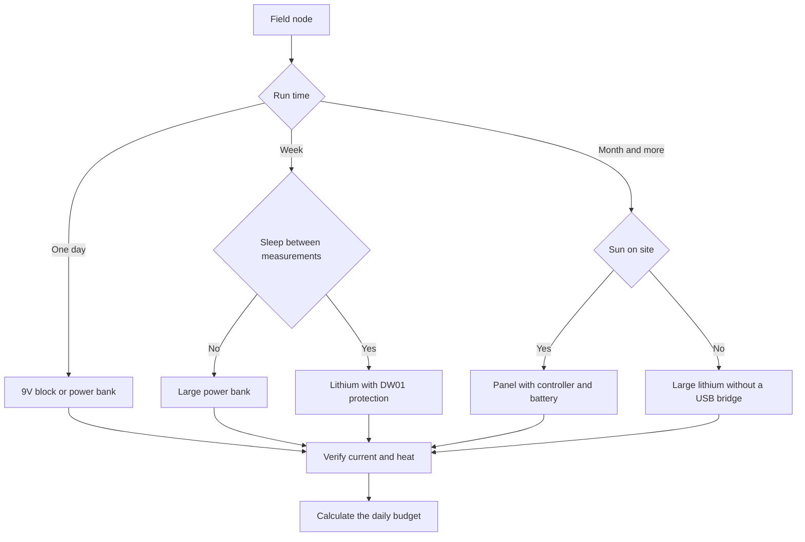

# Arduino Batteries - Node Autonomy

![[assets/img/arduino-battery-scheme.png|600]]
*Fig. Battery-powered autonomous node with a solar panel and sleep between measurements to save charge.*

> [!tip] Purpose of the note
> Show how long a node really lives from a 9V block and lithium, and teach how to budget a weather station with sleep between measurements.

## 1. Purpose

This note covers life without a wall socket: how to power a board in the field, in a greenhouse and on a balcony where there is no stable mains.

The main idea is simple: autonomy is not the cell capacity, it is the product of average current and sleep and wake time.

After reading, the reader can tell a 9V block for a day from a lithium pack for a month, understands DW01 protection, and can add a solar panel with headroom.

The link to mains power is direct: USB and VIN are described in [[EN/02-Power-Supply/01-VIN-Power-Supply.en|VIN power supply]], the board itself is described in [[EN/01-Hardware/01-AVR-Uno.en|classic AVR]], and sleep and supervision are described in [[07-Timers/02-Son-WDT|sleep and watchdog]].

## 2. 9V block: why it lives a day or two

A 9V block is a convenient nine-volt battery, but with small capacity and high internal resistance.

| Parameter | Value | Practical meaning |
| --- | --- | --- |
| Voltage | 9 V | Fits VIN and the jack |
| Capacity | 400-600 mAh | Too little for round-the-clock work |
| Board current | 40-50 mA idle | Without sleep lasts a night |
| Current with LEDs | 60-80 mA | Lives less than a day |
| Internal resistance | High | Sags on servo and radio |
| Price | High per unit of energy | Good only for experiments |
| When to take | An evening bench experiment | Quick check without a PSU |

The math is honest: fifty milliamps of average current times twenty-four hours gives 1200 mAh per day.

A 9V block with a real 500 mAh delivers less than half a day, because the regulator also heats the air with excess volts.

Add radio transmitting once a minute, and the node dies even earlier from sag on peaks.

```text
Крона на VIN очима струму:

  крона 9 В (+) ---> VIN ---> LDO 5 В ---> логіка 45 мА
  крона 9 В (-) ---> GND ----------------> земля

  Бюджет доби без сну:
  - спокій 45 мА х 24 год = 1080 мАг;
  - крона дає 500 мАг;
  - висновок: живе 10-12 годин.

  Висновок:
  - крона лише для дослідів;
  - для тижня потрібен літій і сон.
```

## 3. Li-ion and DW01 protection

A li-ion cell gives large capacity at low weight, but demands a protection board against over-discharge and overcharge.

| Element | What it does | What to look at |
| --- | --- | --- |
| 18650 cell | Stores 2500-3500 mAh | Capacity and the real maker |
| Protection board | Cuts overcharge and over-discharge | DW01 chip and switch assembly |
| Overcharge threshold | About 4.25 V | Higher is forbidden, degradation |
| Over-discharge threshold | About 2.5 V | Lower is forbidden, cell death |
| Protection current | 2-3 A | Enough for the board and radio |
| Charger module | Charges from USB | 0.5-1 A current, indication |
| Step-up converter | Makes 5 V for the board | Efficiency and noise near radio |

A pack without protection is a risk: deep discharge kills a cell in one season, and overcharge leads to heating.

Modules labeled unprotected are taken only together with a separate DW01 board: plus to plus, minus through the board.

A protection board does not balance cells against each other, so series packs are never assembled without balancing.

```text
Літій до плати через захист:

  комірка (+/-) ---> плата DW01 (B+ B-) ---> P+ P- ---> перетворювач 5 В ---> плата
                         |
  зарядний модуль ---> ті самі P+ P- (заряд через захист)

  Правила:
  1. Спочатку земля, потім плюс.
  2. Без захисту комірку не лишати.
  3. Заряд лише модулем для літію.
  4. Металевий корпус подалі від плати.
```

## 4. Power bank over USB

A power bank is convenient lithium with a ready five-volt converter and a USB socket.

| Parameter | Plus | Minus |
| --- | --- | --- |
| Voltage | Ready 5 V | No headroom for long wires |
| Capacity | 10000 mAh and more | Marketing numbers per 3.7 V cell |
| Current | 1-2 A | Auto-off at low current |
| Charging | Plain cable | Charges slowly |
| Indication | Level LEDs | Lies in the cold |
| Cold | Capacity drops | In winter keep in insulation |
| Auto-off | Saves charge | Kills a sleeping node |

The main power-bank trap is auto-off: the node falls asleep with microamps of current, the bank decides the load is gone, and switches off.

It is cured three ways: a bank without auto-off, a periodic load pulse, or a bare cell without a bank.

For a weather station transmitting once per ten minutes, a bank without auto-off lives a week, while a plain one can die overnight.

Carrier choice for the task is described in [[EN/00-Start/04-Dev-Boards.en|board overview]]: a compact board eats less and lives longer from the same bank.

```text
Павербанк до плати:

  павербанк USB 5 В ---> кабель USB ---> гніздо плати ---> шина 5V
         |
  автовимкнення при струмі менше 50 мА протягом 30 с

  Обхід:
  - банк з режимом слабкого струму;
  - імпульс світлодіодом раз на 20 с;
  - або комірка 18650 з перетворювачем без сну банка.
```

## 5. Sleep between measurements

Sleep is the main autonomy lever: the board sleeps 99 percent of the time and wakes only for a measurement.

| Mode | Current | What runs |
| --- | --- | --- |
| Awake | 40-50 mA | Core, sensors, radio |
| Measurement | 50-80 mA | Sensor and transmission |
| Sleep with watchdog | 5-10 uA without a USB bridge | Only the watchdog timer |
| Nano sleep with bridge | 1-5 mA | The USB bridge never sleeps |
| Deep sleep without LEDs | Tens of microamps | Desoldered indicators |
| Radio on air | Up to 120 mA | Short transmission peak |

A classic board with a USB bridge never gives microamps: the bridge eats milliamps even while the core sleeps.

So for months of autonomy take a board without a bridge, or move the bridge out of the node after debugging.

The detailed sleep and supervision map lives in [[07-Timers/02-Son-WDT|sleep and watchdog]]: watchdog periods and restart on hangs are there.

```cpp
// Сон між вимірами: прокинутись по сторожу, виміряти, заснути
// Для класики потрібна бібліотека сну, для чипа без USB-моста струм мінімальний
// Світлодіод живлення на платі для чесного виміру краще не живити

#include <avr/sleep.h>
#include <avr/wdt.h>

volatile bool woke = false;

void setup() {
  Serial.begin(9600);
  pinMode(13, OUTPUT);
  setupWatchdog();
}

void loop() {
  digitalWrite(13, HIGH);   // мітка бадьорості
  int t = analogRead(A0);   // умовний вимір датчика
  Serial.print("measure ");
  Serial.println(t);
  delay(50);                // дати дописати порт
  digitalWrite(13, LOW);
  goSleep();                // спати до сторожа
}

void setupWatchdog() {
  // Сторож на 8 секунд, лише переривання без скидання
  // Деталі періодів дивись у ноті про сон
}

void goSleep() {
  set_sleep_mode(SLEEP_MODE_PWR_DOWN);
  sleep_enable();
  sleep_mode();             // тут процесор спить
  sleep_disable();          // прокинулись по сторожу
}
```

The sketch above is a frame: the real watchdog is configured through registers, and the measurement is wrapped with sensor power through a pin.

The sensor is powered not permanently but only for the measurement time: a pin driven high powers it, then a measurement, then a pin driven low kills the sensor.

The radio wakes only for transmission: fall asleep, wake up, send a packet, fall asleep again.

## 6. Solar panel with headroom

A solar panel covers the daytime current and charges the battery for the night, but only with power headroom.

| Parameter | Norm for a node | Explanation |
| --- | --- | --- |
| Power | 5-10 W per 1 W node | Headroom for clouds and dust |
| Voltage | 6 V or 12 V | Through a charge controller |
| Controller | For lithium or lead | Not directly on the cell |
| Battery | For two gloomy days | Capacity with headroom |
| Orientation | South, latitude angle | No shade from the roof |
| Wires | Short and thick | Fewer charge losses |
| Diode | Against night discharge | Often already in the controller |

A panel is never placed directly on lithium without a controller: overcharge kills a cell in a few sunny days.

A lead battery forgives overcharge more, but is heavy and dislikes frost below zero.

Dust and leaves cut output in half, so the panel is washed and tilted so rain rinses dirt off.

```text
Сонце до вузла правильно:

  панель 6-12 В ---> контролер заряду ---> акумулятор ---> перетворювач 5 В ---> плата
                          |
  вночі діод не дає струму назад у панель

  Неправильно:
  - панель безпосередньо на VIN без акумулятора;
  - панель безпосередньо на літій без контролера;
  - тонкі проводи 5 метрів до панелі.
```

## 7. Weather station budget: example

A weather station measures temperature and humidity once per ten minutes and sends a packet over radio.

| Phase | Duration | Current | Charge per cycle |
| --- | --- | --- | --- |
| Wake-up | 0.2 s | 45 mA | 0.0025 mAh |
| Sensor measurement | 0.5 s | 55 mA | 0.0076 mAh |
| Transmission | 0.3 s | 110 mA | 0.0092 mAh |
| Sleep | 599 s | 0.02 mA | 0.0033 mAh |
| Per 10 min total | 600 s | 0.14 mA average | 0.0226 mAh |
| Per day | 144 cycles | 0.14 mA average | 3.25 mAh |
| Per month | 4320 cycles | Same average | About 100 mAh |

Without sleep the same station would eat 50 mA constantly, that is 1200 mAh per day and 36000 mAh per month.

With sleep a 3000 mAh cell theoretically lives thirty months, in practice with self-discharge and cold about a year.

A classic board with a USB bridge gives not 0.02 mA in sleep but 3 mA, so the budget grows to 75 mAh per day.

```text
Бюджет очима інженера:

  без сну:
  50 мА х 24 год = 1200 мАг на добу (крона на пів доби)

  зі сном на голому чипі:
  0.14 мА х 24 год = 3.4 мАг на добу (комірка на рік)

  зі сном на платі з мостом:
  3 мА х 24 год = 72 мАг на добу (комірка на місяць)

  Висновок:
  - міст USB зʼїдає виграш від сну;
  - для року беруть голий чип або плату без моста.
```

```cpp
// Метеостанція зі сном: живлення датчика через пін, передача раз на 10 хв
// Датчик живиться від D7, радіо будиться лише на передачу
// Період сну набирають циклами сторожа по 8 секунд

const int PIN_SENSOR_PWR = 7;
const int PIN_LED = 13;

void setup() {
  Serial.begin(9600);
  pinMode(PIN_SENSOR_PWR, OUTPUT);
  pinMode(PIN_LED, OUTPUT);
  digitalWrite(PIN_SENSOR_PWR, LOW);
}

void loop() {
  digitalWrite(PIN_LED, HIGH);
  digitalWrite(PIN_SENSOR_PWR, HIGH); // подати живлення на датчик
  delay(100);                         // дати датчику прокинутись
  int raw = analogRead(A1);           // вимір
  float volt = (raw * 5.0) / 1023.0;
  Serial.print("meteo raw ");
  Serial.print(raw);
  Serial.print(" volt ");
  Serial.println(volt, 2);
  // тут передача по радіо коротким пакетом
  digitalWrite(PIN_SENSOR_PWR, LOW);  // зняти живлення з датчика
  digitalWrite(PIN_LED, LOW);
  sleepTenMinutes();                  // 75 циклів сторожа по 8 с
}

void sleepTenMinutes() {
  // 75 разів заснути на 8 секунд через сторож
  // Реалізацію дивіться у ноті про сон
  delay(100); // заглушка для компіляції каркаса
}
```

Powering the sensor through a pin saves more than the core sleep itself: the sensor eats nothing in the pause.

Packets are kept short: address, two measurement bytes, checksum, no strings and formatting.

Logging to a memory card is enabled only for debugging: writes eat tens of milliamps.

## 8. Mermaid: autonomous power choice



The diagram reads by term: a day, a week, a month, then by sleep and sun availability.

The 9V-block branch is an experiment only: it never holds a week under any conditions.

The panel branch needs a battery for two gloomy days, otherwise the first cloud kills the node.

## 9. Cold, moisture and enclosure

| Factor | What it does | How to fight it |
| --- | --- | --- |
| Frost | Halves lithium capacity | Insulation and capacity headroom |
| Heat | Speeds up self-discharge | Shade for the case, no black color |
| Moisture | Oxidizes contacts | Sealed enclosure and silica gel |
| Condensate | Shorts the board in the morning | Vent valve facing down |
| Vibration | Loosens terminals | Soldering and wire fixing |
| Dust | Covers the panel | Regular washing and tilt angle |

Take an enclosure with a gasket, and mount the board on standoffs so water never stands under it.

Smear terminals with neutral grease, and cover bare contacts with heat shrink.

In frost hide the power bank together with the board in one insulated box, and take the panel outside.

## 10. Field checklist for a node

| Step | Check | Sign of good |
| --- | --- | --- |
| 1 | Daily budget calculated | Average current and capacity agree |
| 2 | Sleep really works | Meter shows microamps or small milliamps |
| 3 | Sensor dies in sleep | Powered through a pin, not permanently |
| 4 | Lithium protection in place | DW01 board between the cell and the load |
| 5 | Power bank stays on | Node lives a night without breaks |
| 6 | Panel charges in clouds | Charge current is not zero |
| 7 | Enclosure holds rain | Dry inside after watering |
| 8 | Two-day reserve | Battery not flat after a night |

The first test runs on the bench: log voltage and restarts for a day without going out.

The second test runs on a balcony: a week with rain and sun shows the real budget.

The third trip is already the field: with a spare cell and a way to pull logs without opening the case.

## Common issues

| # | Issue | Why it is bad | How to do it right |
| --- | --- | --- | --- |
| 1 | 9V block for a month of weather station | Capacity lasts a day or two | For a month take 3000 mAh lithium with sleep |
| 2 | Lithium without a protection board | Over-discharge kills the cell | Put a DW01 board between the cell and the circuit |
| 3 | Power bank with a sleeping node, unverified | Bank switches off and kills the node | Take a bank without auto-off or wake with a pulse |
| 4 | Sensor on permanent power | Eats milliamps all night | Power the sensor through a pin only for the measurement |
| 5 | Panel directly on lithium | Overcharge heats and degrades the cell | Put a charge controller between the panel and the battery |
| 6 | Board with a USB bridge for a year of autonomy | Bridge eats milliamps even in sleep | Take a bare chip or a bridgeless board for long sleep |
| 7 | Ignoring frost in the budget | Capacity halves, the node dies | Plan double headroom and box insulation |

## Official sources

- [Project power on docs.arduino.cc](https://docs.arduino.cc/learn/electronics/power/) - batteries, PSUs and connection safety.
- [Standalone nodes on arduino.cc](https://www.arduino.cc/en/Guide/ArduinoUno) - base board, consumption and external power operation.
- [Sleep and low consumption on docs.arduino.cc](https://docs.arduino.cc/hardware/uno-rev3/) - board characteristics and current limits for budgeting.

## See also

- [[Home.en]]
- [[EN/01-Hardware/01-AVR-Uno.en|classic AVR]]
- [[EN/00-Start/04-Dev-Boards.en|board overview]]
- [[EN/02-Power-Supply/01-VIN-Power-Supply.en|VIN power supply]]
- [[07-Timers/02-Son-WDT|sleep and watchdog]]
