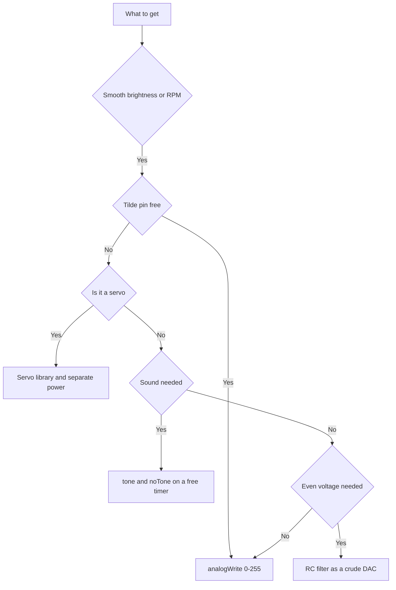

# Arduino PWM - analogWrite and Timers

![[assets/img/arduino-pwm-scheme.png|600]]
*Fig. PWM: duty cycle, timers, sound and a crude DAC on a filter.*

> [!tip] Purpose of the note
> Squeeze analog smoothness from digital pins: dim brightness, buzz a piezo, smooth voltage with a filter, and spin a servo with a library.

## 1. Purpose

The analogWrite function outputs not a true analog voltage but fast rectangular pulses of constant amplitude.

The average value of such a signal depends on the fraction of time the pin holds a high level.

An eye sees LED brightness change, an ear hears buzzer loudness change, and a motor feels RPM change.

This approach is called pulse-width modulation: the pulse width encodes the useful quantity.

This note covers the practice: allowed pins, the zero-to-maximum scale, frequencies, sound, filter and servo.

## 2. Duty cycle instead of analog

| analogWrite value | What is on the pin | What the eye sees |
| --- | --- | --- |
| 0 | Constant zero | LED off |
| 64 | Quarter period high | Faint glow |
| 127 | Half period high | Medium brightness |
| 191 | Three quarters period high | Bright glow |
| 255 | Constant one | Full brightness |

The scale has 256 steps: zero to 255 inclusive, that is eight bits of resolution.

Zero and maximum degenerate into constant levels without switching: the switch transistor does not heat then.

The scale middle gives half the supply voltage only on average: a scope still shows the same 5 V pulses.

Inertial loads like a lamp, a motor and a heater smooth the pulses by themselves.

```text
Шпаруватість для трьох значень (один період):

  analogWrite 64:   ###.............
  analogWrite 127:  #######.........
  analogWrite 191:  ##########......

  Висота імпульсів однакова — 5 В.
  Міняється лише ширина високої полиці.
```

The eye notices a small step at the bottom of the scale more, so a gamma table is used for smooth ramp-up.

A linear sweep gives a brightness jump at the start and a lazy tail at the end.

## 3. Tilde pins and timers

| Board | PWM pins | Timers behind them |
| --- | --- | --- |
| Uno and Nano | 3, 5, 6, 9, 10, 11 | Two 8-bit and one 16-bit |
| Mega | 2 to 13 inclusive | Several 8-bit and 16-bit |
| Leonardo | 3, 5, 6, 9, 10, 11, 13 | Different layout, see the board schematic |
| Uno R4 | All digital pins | Hardware timers of the new core |

A tilde near the number on the board silkscreen marks a pin able to output modulation.

An analogWrite call on a plain pin gives only a crude threshold: below half the scale goes dark, above it lights.

The modulation frequency depends on the timer: about 490 Hz on most pins and about 980 Hz on pins 5 and 6.

Timer zero serves the system time, so changing its prescaler breaks delays and the millisecond count.

```text
Відповідність таймерів і пінів на Uno:

  таймер 0 (піни 5 і 6 — 980 Гц)
  таймер 1 (16-біт, піни 9 і 10 — 490 Гц)
  таймер 2 (піни 3 і 11 — 490 Гц)

  Правило: чіпаєш таймер 0 — готуйся лагодити delay і millis.
```

A sixteen-bit timer gives more precise modulation and underlies servo libraries.

The 490 Hz frequency is inaudible as a tone, but a cheap choke in the supply circuit can quietly whistle.

## 4. Smooth LED fading

| Trick | Why | What it looks like |
| --- | --- | --- |
| Sweep up | Ramp from dark to maximum | Loop from zero to 255 with a step |
| Sweep down | Fade to dark | Loop back with the same step |
| Pause between steps | Visible effect speed | Delay about 10-20 ms |
| Gamma correction | Even perception by the eye | Table or power function |

An LED switches on through a 220 Ohm resistor: modulation does not cancel the 20 mA current limit.

Take a tilde pin for the experiment, otherwise there will be no smoothness at all.

Step 5 gives about fifty stairs: the eye sees a solid transition with no flicker.

```cpp
const int LED_PIN = 9;  // пін з тильдою, є ШІМ

void setup() {
  pinMode(LED_PIN, OUTPUT);
}

void loop() {
  for (int b = 0; b <= 255; b += 5) {
    analogWrite(LED_PIN, b);  // розпал
    delay(15);
  }
  for (int b = 255; b >= 0; b -= 5) {
    analogWrite(LED_PIN, b);  // згасання
    delay(15);
  }
}
```

The sketch runs brightness back and forth with no extra parts besides the LED with a resistor.

The delay between steps sets the pace: a shorter pause gives a livelier indicator breathing.

For a night indicator cap the top of the scale: values above 40 already blind in the dark.

## 5. Sound with tone and conflicts

| Function | What it does | Limit |
| --- | --- | --- |
| tone | Generates a square wave of set frequency | Mono, one pin at a time |
| noTone | Stops the sound | Call after the melody |
| analogWrite | Duty-cycle modulation | Not an audio frequency, only motor hum |

The tone function builds the audio frequency with a timer and conflicts with modulation on neighbor pins of the same timer.

A classic conflict symptom: after a tone call nearby PWM outputs go dark or twitch.

The separation rule is simple: hang the buzzer on a pin whose timer does not feed important modulation.

A piezo is connected through a resistor near 100 Ohm: loudness stays sufficient, and current stays in norm.

```cpp
const int BUZZER_PIN = 8;  // звичайний пін, без ШІМ

void setup() {
  pinMode(BUZZER_PIN, OUTPUT);
}

void loop() {
  tone(BUZZER_PIN, 880);  // нота ля першої октави
  delay(300);
  noTone(BUZZER_PIN);     // тиша між нотами
  delay(100);
  tone(BUZZER_PIN, 660);
  delay(300);
  noTone(BUZZER_PIN);
  delay(500);
}
```

A melody is handy to keep as an array of frequency-duration pairs and loop over it.

An 8 Ohm speaker is never placed without an amplifier: the resistance is too low for direct connection.

## 6. Crude DAC from a resistor and a capacitor

| Part | Value | Why |
| --- | --- | --- |
| Resistor | 4.7 kOhm | Limits the capacitor charge current |
| Capacitor | 10 uF | Smooths pulses into an even voltage |
| Load | High-impedance input | Measurement or current-free control |

The filter averages the pulses: the output settles at a voltage proportional to the analogWrite value.

The full scale gives a range from zero to the supply voltage with a step near 20 mV.

Ripple always remains: a larger capacitor kills it but slows the reaction to a code change.

```text
Грубий ЦАП з ШІМ і RC-ланки:

  пін ШІМ ---> [R 4,7 кОм]---+---> вихід (середня напруга)
                             |
                            [C 10 мкФ]
                             |
                            земля

  analogWrite 0   -> близько 0 В
  analogWrite 127 -> близько 2,5 В
  analogWrite 255 -> близько 5 В
```

Such an output suits reference voltages, brightness control through an amplifier, and slow experiments.

No current is drawn from the filter output: any load sags the voltage and distorts the scale.

For serious tasks place a ready digital-to-analog converter with an op-amp buffer.

## 7. Servo through a library

| Signal parameter | Value | Meaning |
| --- | --- | --- |
| Repeat period | 20 ms | Hobby servo control standard |
| Minimum pulse | 1 ms | Extreme left shaft position |
| Middle pulse | 1.5 ms | Shaft centered |
| Maximum pulse | 2 ms | Extreme right shaft position |
| Motor power | Separate 5-6 V PSU | The board cannot give such current |

The ready Servo library hides the timer kitchen: the user sets only the turn angle.

A servo is powered separately, and the grounds of the board and the PSU are joined: the signal wire carries only control.

Trying to power a servo from the board ends with voltage sag and controller restart.

```cpp
#include <Servo.h>

Servo drive;  // обʼєкт сервопривода

void setup() {
  drive.attach(9);  // сигнальний дріт на пін 9
}

void loop() {
  drive.write(0);    // крайнє положення
  delay(1000);
  drive.write(90);   // середина
  delay(1000);
  drive.write(180);  // інший край
  delay(1000);
}
```

The shaft angle repeats the set number with about one degree of precision.

After attach some modulation pins on this timer switch off: verify the circuit against the library documentation.

## Mermaid: what to pick for a task



## Common issues

| # | Issue | Why it is bad | How to do it right |
| --- | --- | --- | --- |
| 1 | analogWrite on a pin without a tilde | No smoothness, only a threshold at half scale | Take pins 3, 5, 6, 9, 10, 11 on the Uno |
| 2 | Expecting true analog on the output | A scope shows 5 V pulses, the circuit is surprised | For an even voltage add an RC filter |
| 3 | tone and PWM on one timer | Sound breaks neighbor-pin modulation | Spread sound and modulation over different timers |
| 4 | Changing the timer zero prescaler | delay, millis and system time break | Never touch timer zero or recalculate all time |
| 5 | Servo powered from the board | Current peak sags the supply, the board restarts | Separate 5-6 V PSU with common ground |
| 6 | LED on PWM without a resistor | Peak pulses burn the die just like DC current | The 220 Ohm resistor stays mandatory |

## Official sources

- [analogWrite on arduino.cc](https://www.arduino.cc/reference/en/language/functions/analog-io/analogwrite/) - 0-255 scale, allowed pins and timer notes.
- [Fading example on docs.arduino.cc](https://docs.arduino.cc/built-in-examples/analog/Fading/) - smooth LED brightness change through modulation.
- [tone on arduino.cc](https://www.arduino.cc/reference/en/language/functions/advanced-io/tone/) - sound generation and conflicts with modulation outputs.

## See also

- [[Home.en]]
- [[EN/01-Hardware/01-AVR-Uno.en|classic AVR]]
- [[EN/03-GPIO/01-Digital-Pins.en|digital pins]]
- [[EN/03-GPIO/03-Interrupts.en|board interrupts]]
