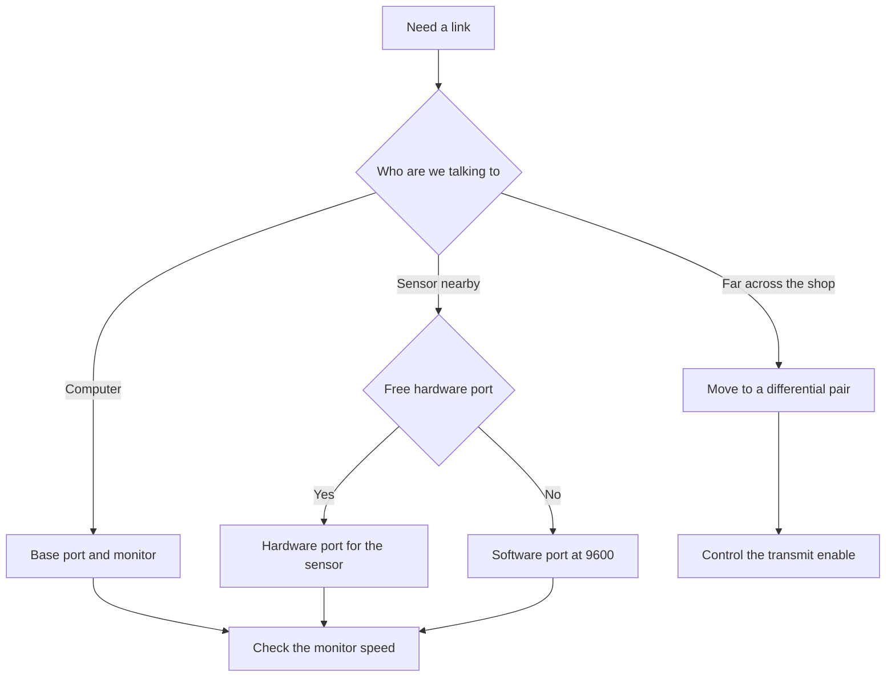

# UART on Arduino - Serial and the software port

![[assets/img/arduino-uart-scheme.png|600]]
*Fig. Receive and transmit lines, common ground, USB bridge and sensor connection.*

> [!tip] Purpose of this note
> Explains serial communication from zero to the USB-sensor bridge: how to open the port, pick the speed, stay clear of the flashing lines, and when to take the software port or move to a long line.

## 1. Purpose

The serial port is the main channel for the board talking to the computer and to simple modules.

It carries firmware, debug output, readings from sensors with a serial output, and control of actuator modules.

The base port on small boards is single and shared with the USB converter, so its limits matter.

The software port gives a second channel on ordinary digital pins, but runs slower and with limits.

Bigger boards have several hardware ports, and long lines use a move to a differential pair through a control output.

This note gathers it all: library functions, speeds, the flashing conflict, the software port, extra ports of large boards, and the way out to a long line.

The link with [[01-Hardware/01-AVR-Uno.en | classic AVR]] shows where pins zero and one physically sit.

The overview [[01-Hardware/02-Nano-Mega.en | compact and pins]] helps find the same lines on the small and large packages.

Level basics and pin modes are covered in [[03-GPIO/01-Digital-Pins.en | digital pins]].

## 2. What the base Serial port can do

The base port is opened once at startup, then bytes are read and written in the loop.

| Function | What it does | When to call |
| --- | --- | --- |
| Serial begin | Enables the port at the given speed | Once in the setup block |
| Serial available | Returns the byte count in the buffer | Before every read |
| Serial read | Takes one byte from the buffer | When the buffer is not empty |
| Serial peek | Looks at a byte without taking it | To inspect a packet header |
| Serial write | Writes raw bytes | For binary protocols |
| Serial print | Writes text and numbers | For human-readable messages |
| Serial println | Writes a line with a line ending | For lines in the port monitor |
| Serial flush | Waits for transmission to finish | Before sleep or a speed change |

The receive buffer is limited, so reads must be regular, with no long pauses in the main loop.

Sending text is handy for debugging, while a binary packet with a checksum suits a sensor better.

Both sides must share the speed, otherwise letters turn into garbage.

```text
Перехрещення ліній UART між двома пристроями:

  Плата А            Плата Б
  ------             ------
  TX  --------------> RX
  RX  <-------------- TX
  GND -------------- GND

  Правило перехрещення:
  передача одного йде на прийом іншого,
  земля завжди спільна,
  живлення не зєднувати без потреби.
```

The port on [[01-Hardware/01-AVR-Uno.en | classic AVR]] goes through the USB bridge, so the port monitor sees exactly it.

## 3. Speeds and baud rates

Speed is measured in baud, that is bits per second including start and stop bits.

| Speed | Purpose | Note |
| --- | --- | --- |
| 4800 | Slow weather sensors | Resistant to interference |
| 9600 | Classic for communication modules | Typical starting choice |
| 19200 | Compromise of speed and range | Good for a long wire |
| 38400 | Fast distance sensors | Needs a short wire |
| 57600 | Middle mode | Rarely pays off |
| 115200 | Port monitor and debugging | Standard for text output |

Start at 9600, and go up only when the data flow visibly lags.

The 16 MHz crystal gives a small error at standard speeds, so the link stays stable.

A very high speed on a long wire gives errors, because line capacitance smooths the edges.

After a speed change, restart the port monitor at the same speed.

The separate speed choice for the software port is always lower, because it is less precise.

## 4. Pins zero and one are busy with the USB bridge

On small boards the receive and transmit lines go to digital sockets zero and one.

The same lines run to the USB bridge chip, so the computer sees them as a virtual port.

| Situation | What happens | What to do |
| --- | --- | --- |
| Flashing over USB | The bridge drives the lines and reset | Free sockets zero and one |
| Port monitor is open | Board text goes to the computer | Do not connect a sensor to the same sockets |
| Sensor on pins zero and one | Two transmitters fight | Move the sensor to the software port |
| Long jumpers on the lines | Upload breaks | Remove jumpers for the flashing time |
| Sensor powered from the board | Extra current through the pin header | Check the current margin |

The rule is simple: while uploading firmware, take everything off pins zero and one.

After flashing, the wires can go back and work with the sensor.

For permanent sensor work, take other pins and the software port right away.

```text
Конфлікт лінії прошивки і датчика:

  Варіант поганий:
  USB-міст ---+--- TX --- датчик (обидва говорять)
              |
  RX ---------+--- датчик (обидва слухають)

  Варіант добрий на час прошивки:
  USB-міст --- TX/RX вільні, датчик знятий
  прошивка йде чисто, помилок нема

  Варіант добрий для роботи:
  USB-міст --- TX/RX до компютера
  датчик --- програмний порт на інших ніжках
```

## 5. Software port SoftwareSerial

The software port library receives and transmits on almost any digital pins.

It works by precise timing from the processor, so it eats time and holds high speeds worse.

| Parameter | Hardware port | Software port |
| --- | --- | --- |
| Timing precision | Crystal, high | Depends on load |
| Speed | Up to 115200 and above | Solid 9600, limit 38400 |
| Receive and transmit together | Yes | With limits |
| Port count | Depends on the chip | One active receiver |
| Interrupts | No interference | Disables other libraries for a byte time |
| Pins | Fixed zero and one | Any digital pins |

Pin limits depend on the board: on small boards not every pin receives on state change.

Any digital pin can transmit, while proven numbers from the library docs suit receiving.

Only one software port can listen at a time, the rest wait their turn.

That is enough for slow modules, while a fast stream needs a hardware port.

```cpp
#include <SoftwareSerial.h>

SoftwareSerial softPort(10, 11);

void setup() {
  Serial.begin(9600);
  softPort.begin(9600);
  Serial.println("Micт готовий");
}

void loop() {
  if (softPort.available()) {
    char c = (char)softPort.read();
    Serial.write(c);
  }
  if (Serial.available()) {
    char c = (char)Serial.read();
    softPort.write(c);
  }
}
```

The code above builds a simple bridge: everything from the sensor goes to the computer, everything from the computer goes to the sensor.

Speed 9600 is a deliberate choice, because the software port is most stable at it.

Pins ten and eleven are a proven pair for receive and transmit.

The greeting line tells that the board has restarted.

## 6. Extra ports on large boards

The large board has four hardware ports, so the sensor bridge needs no software library.

| Port | Pins on the large board | Purpose |
| --- | --- | --- |
| Serial | Zero and one through USB | Computer and debugging |
| Serial1 | Nineteen and eighteen | First sensor |
| Serial2 | Seventeen and sixteen | Second sensor |
| Serial3 | Fifteen and fourteen | Third sensor or communication module |

Each port has its own buffer, so all four run independently at full speed.

Each port is opened with its own begin call at the needed speed.

The bridge between computer and sensor is then written with the same two lines, but without the software library.

The large board suits gateways: one port listens to a sensor, another passes data on.

See the detailed pin map in [[01-Hardware/02-Nano-Mega.en | compact and pins]].

## 7. Going to a long RS485 line through a control output

The ordinary port works over a short range, while a shop floor or greenhouse takes a differential pair.

The converter module has receive and transmit inputs plus a transmit-enable control input.

| Signal | Where it goes | Meaning |
| --- | --- | --- |
| RO | To the board receive input | Data from the line |
| DI | To the board transmit output | Data into the line |
| DE | To a free digital pin | Transmit enable |
| RE | To ground or the same enable | Receive enable |
| A and B | Twisted pair into the line | Differential signal |

Before transmitting, raise the control pin; after the last byte wait for completion and lower it.

Receiving runs with the control pin lowered, when the module listens to the line.

Matching resistors go on the ends of a long line to remove reflections.

Module power comes from a local source, while grounds are joined or isolated per the module schematic.

```cpp
const int DE_PIN = 4;

void setup() {
  Serial.begin(9600);
  pinMode(DE_PIN, OUTPUT);
  digitalWrite(DE_PIN, LOW);
}

void sendPacket(const char *msg) {
  digitalWrite(DE_PIN, HIGH);
  delay(2);
  Serial.print(msg);
  Serial.flush();
  delay(2);
  digitalWrite(DE_PIN, LOW);
}

void loop() {
  sendPacket("TEMP?");
  delay(1000);
}
```

The two-millisecond pauses give the module time to switch direction.

The flush call waits until the last bit leaves the transmitter register.

Without such a wait the control pin drops early and the packet tail is lost.

## 8. Mermaid: path choice



The diagram reads top to bottom: first the peer, then a free port check, then the speed check.

A nearby sensor is fine with ordinary levels, while the shop floor takes a differential pair.

The software port always runs at a low speed to avoid catching errors.

## Common issues

| # | Issue | Why it is bad | How to do it right |
| --- | --- | --- | --- |
| 1 | Sensor hangs on pins zero and one during flashing | Bridge and sensor fight over the line | Take wires off zero and one for the upload time |
| 2 | Different speeds on board and monitor | Garbage instead of text | Set the same speed on both sides |
| 3 | Software port at 115200 | Processor lags, bytes break | Hold 9600, limit 38400 on a short wire |
| 4 | Two software ports listening together | Only one receiver is active | Listen in turn or take the large board |
| 5 | RS485 control pin drops before the last byte ends | Packet tail gets cut | Wait for flush plus a small pause before reset |
| 6 | No common ground between boards | Floating zero gives errors | Join grounds, power per the module schematic |

## Official sources

- [Serial on docs.arduino.cc](https://docs.arduino.cc/language-reference/en/functions/communication/serial/) - port functions, speeds, read and write examples.
- [SoftwareSerial on arduino.cc](https://www.arduino.cc/en/Reference/SoftwareSerial) - pin limits, speeds, bridge example between ports.

## See also

- [[Home.en]]
- [[01-Hardware/01-AVR-Uno.en | classic AVR]]
- [[01-Hardware/02-Nano-Mega.en | compact and pins]]
- [[03-GPIO/01-Digital-Pins.en | digital pins]]
- [[04-Interfaces/02-SPI.en | fast bus]]
- [[04-Interfaces/03-I2C-Wire.en | two-wire bus]]
